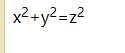

## 网页的基本标签HTML

### Web三要素


1. `HTML`是用于控制页面的结构的，如页面上面显示什么是由它决定的
2. `CSS`表现指的是页面上面的内容显示成什么样式就是由它决定的

网页是由标签与命令来构成的，现在来了解一下有哪些标签

> 所有能够在word里面实现的效果，网页当中都可以实现

### 标题标签

标题是由`h1`~`h6`所构成的标签

```html
<h1 align="center">标题党的标题</h1>
<h2 align="right">大型记录片《标哥的暑假班开班了》</h2>
<h3 align="left">三号标题</h3>
<h4>四号标题</h4>
<h5>5号标题</h5>
<h6>6号标题</h6>
```

> 标题是由h构成的 ，分别是1~6号标是，数字越大，字体越小，同时`align`用于设置标题的水平排列

### 文字标签

#### 段落标签

```html
<p align="center">这是第一个段落</p>
<p align="right">这是第二个段落</p>
```

> 1. 段落与段落上下会有间距
> 2. 段落是可以通过`align`来设置水平排列

#### 文字修饰

```html
还是那么的<b>帅气</b>
<hr>
这就是<u>我们</u>的老师，标哥哥呀
<hr>
还看到一个漂亮的小姐姐，它就是我们<i>桃子</i>老师
<hr>
瞧一瞧，看一看，原价<strike>998</strike>的衣服，现价只有9块8
```

> 在上面的代码里面，我们看到了很多文字修饰标签

* 加粗：`<b><strong>`
* 倾斜：`<i><em><cite>`
* 下划线：`<u><ins>`
* 删除线：`<strike><del>`

#### 字体标签

```html
<font color="red" size="7" face="华文行楷">
    9块8
</font>
```

> * font标签用于设置一些特殊格式的文字
> * `color`用于设置文字的颜色
> * `size`用于设置文字的大小，它的值是1~7
> * `face`用于设置文字的字体样式

#### 特殊文字

1. 版权标签`&copy;`
2. 商标`&reg;`
3. 空格`&nbsp;`
4. 度数`&deg;`
5. 小于`&lt;`
6. 大号`&gt;`

#### 上下角标

```html
我<sub>爱</sub>北京天安门，天安门上太阳<sup>升</sup>
x<sup>2</sup>+y<sup>2</sup>=z<sup>2</sup>
```




1. 上角标`sup`
2. 下角标`sub`

### 列表标签

> 引言：列表标签是一个父子标签
>
> **父子标签也叫严格型嵌套标签，指在的某个标签的内部只能够嵌套指定标签**


#### 无序列表

全称叫`unordered list`，简称`ul`

```html
<ul>
    <li>张三</li>
    <li>李四</li>
    <li>标哥哥</li>
</ul>
```


如果想改变前面的符号 ，我们可以通过`type`属性来决定

> 1. `type="disc"`，是默认值，它是一个实心圆
> 2. `type="square"`它会是一个正方形
> 3. `type="circle"`它会是一个圆形

#### 有序列表

全称叫`ordered list`，简称`ol`

```html
<ol type="I">
    <li>张三</li>
    <li>李四</li>
    <li>标哥哥</li>
    <li>陈文</li>
    <li>叶俊豪</li>
    <li>刘诗霞</li>
</ol>
```

如果想改变前面的序号的类型 ，我们可以使用`type`属性

> 1. `type="1"`数字
> 2. `type="A"`大写字母
> 3. `type="a"`小写字母
> 4. `type="I"`大写罗马文
> 5. `type="i"`小写罗马文

#### 自定义列表

```html
<!-- data list 数据列表
data list data 数据列表里面的数据
data list title 数据列表里面的标题
-->
<dl>
    <dt>男生</dt>
    <dd>陈文</dd>
    <dd>叶俊豪</dd>
    <dt>女生</dt>
    <dd>刘诗霞</dd>
    <dd>陈怡静</dd>
</dl>
```

**总结**：`ul/ol/dl`它们都是严格的父子标签，`ol/ul`下面只能嵌套`li`，`dl`只能嵌套`dd/dt` 

**案例**


```html
<ol>
    <li>
        第一组
        <ul type="square">
            <li>陈文</li>
            <li>叶俊豪</li>
        </ul>
    </li>
    <li>
        第二组
        <ul type="square">
            <li>陈文</li>
            <li>叶俊豪</li>
        </ul>
    </li>
    <li>
        第三组
        <ul type="square">
            <li>陈文</li>
            <li>叶俊豪</li>
        </ul>
    </li>
</ol>
```

> 上面的案例展示就是列表的嵌套关系，ul与ol的下面只能嵌套li，而`li`的下面才是可以嵌套任何东西

---------

### 图片标签

在网页里面，我们一般会插入图片，我们可以插入项目中的图片，也可以直接插入互联网上面的图片，如果是插入项目里面的图片，则要把图片放在项目下面

> 最好是在项目的根目录下面新建一个文件夹叫`img`来存放图片

```html

```

> 1. `src`用于设置图片地址,除了使用本地地址以外，还可以使用网络地址
> 2. `alt`后备属性，当`src`不能正确的显示图片的时候 就会显示alt里面的内容
> 3. `width`用于设置宽度
> 4. `height`用于设置高度
> 5. `border`用于设置边框
> 6. `vspace`用于设置垂直方向的间距
> 7. `hspace`用于设置水平方向的间距

----

### 表格标签【重点】

#### 表格的标签 

```html
<table border="1" width="500" cellspacing="0" cellpadding="0">
    <colgroup>
        <col />
        <col />
        <col bgcolor="red" />
        <col />
    </colgroup>
    <tr>
        <th>姓名</th>
        <th>性别</th>
        <th>爱好</th>
        <th>地址</th>
    </tr>
    <tr>
        <td bgcolor="deeppink">张三</td>
        <td>男</td>
        <td>看书</td>
        <td>湖北省</td>
    </tr>
    <tr>
        <td>张三1</td>
        <td>男</td>
        <td>看书</td>
        <td>湖北省</td>
    </tr>
    <tr>
        <td>张三2</td>
        <td>男</td>
        <td>看书</td>
        <td>湖北省</td>
    </tr>
    <tr bgcolor="lightseagreen">
        <td>张三3</td>
        <td>女</td>
        <td>看书</td>
        <td>湖北省</td>
    </tr>
</table>
```


> 1. `<table>`是用于创建表格的标签
> 2. `<tr>`代表表格的行
> 3. `<td>`代表表格的列
> 4. `border`设置表格的边框
> 5. `cellspacing`设置单元格与单元格的间距
> 6. `cellpadding`用于设置单元格与内容的间距
> 7. `width/height`用于设置表格或行或列的宽度及高 度
> 8. `align`用于设置水平排列`left/center/right`
> 9. `valign`用于设置垂直排列`top/middle/bottom`
> 10. `<colgroup>`列的组合
> 11. `<col />`某一列
> 12. `<thead><tbody><tfoot>`
> 13. `<caption>`用于设置表格的标题

#### 表格的合并


```html
<table border="1" width="500px" cellspacing="0px" cellpadding="0px">
    <tr>
        <th>姓名</th>
        <th>性别</th>
        <th>爱好</th>
    </tr>
    <tr>
        <td>陈文</td>
        <td rowspan="2">男</td>
        <td>看书</td>
    </tr>
    <tr>
        <td>叶俊豪</td>

        <td>睡觉</td>
    </tr>
    <tr>
        <td colspan="2">刘诗霞</td>

        <td>玩游戏</td>
    </tr>
</table>
```

> 1. `rowspan`行的合并
>
> 2. `colspan`列的合并

### 链接标签

```html
<a href="https://www.baidu.com" target="_self">百度一下，你就知道</a>
<a href="02.html">标哥的简历</a>
<a href="http://www.baidu.com" target="_blank">
    
</a>
```

> 1. `href`属性，用于设置链接的地址，可以是远程网络地址，也可以是本地地址
> 2. `target`属性，用于设置打开网页的方式 
>    * `_self`在当前页面打开网页【默认值】
>    * `_blank`在新的窗体打开网页
>    * `_parent`在父级打开网页
>    * `_top`在顶层打开网页
>    * `frameName`在某一个指定的`iframe`当中去打开

链接标签除了跳转到某一个链接地址，还可以跳转到某一个网页的某一个元素上面去，如下所示

```html
<h2>第一章节</h2>
<h2 id="xxx">第二个章节</h2>
<h2>第三个章节</h2>
<a href="https://www.baidu.com">我要跳了</a>
<!-- 它仅可以跳网络地址，还可以跳到指定的某一个元素那里去 -->
<a href="#xxx">我要去第二个章节</a>
```

> 在网页里面，我们一般使用`#`代表`id`，所以`#xxx`相当于`id="xxx"`

通过上面的方法，我们还可以在跳转页面的时候指定到某一个元素上面去

```html
<a href="04链接标签.html#xxx" target="_blank">我要去第四个页面的第二个章节</a>
```

### iframe标签

`iframe`全称可以理解为`insert frame`，嵌入框架网页，这个标签可以在一个网页当中嵌入另一个网页

```html
<iframe src="02.html" width="100%" height="500px" frameborder="0"></iframe>
```

> 1. `src`用于设置要嵌入的网页地址
> 2. `width/height`用于设置宽度与高度
> 3. `frameborder`用于设置边框

### iframe与a标签的结合

**第一种结合方式 **

```html
<a href="02.html" target="bbb">简历展示</a>
<a href="01.html" target="bbb">练习作业</a>
<iframe src="" name="bbb" width="100%" height="500px"></iframe>
```


在这一种结合方式里面，我们把`iframe`的`name`设置在了`a`标签的`target`属性上面，这样在链接标签点击以后打开网页的时候，它会在指定的`iframe`里面打开

**第二种结合方式**

这一种情况就是`iframe`的下面嵌套`iframe` 的时候

**01.html**

```html
<!DOCTYPE html>
<html>
	<head>
		<meta charset="utf-8">
		<title>第一个网页</title>
	</head>
	<body>
		<h1>这是第一个网页</h1>
		<iframe src="02.html" width="100%" height="700"></iframe>
	</body>
</html>
```

**02.html**

```html
<!DOCTYPE html>
<html>
	<head>
		<meta charset="utf-8">
		<title>第二个网页</title>
	</head>
	<body>
		<h2>第二个网页</h2>
		<a href="http://192.168.1.1" target="_self">百度一下，你就知道_self</a>
		<hr>
		<a href="http://192.168.1.1" target="_blank">网址2_blank</a>
		<hr>
		<a href="http://192.168.1.1" target="_parent">在父级打开</a>
		<hr>
		<iframe src="03.html" width="100%" height="400px"></iframe>
	</body>
</html>
```

**03.html**

```html
<!DOCTYPE html>
<html>
	<head>
		<meta charset="utf-8">
		<title>第三个网页</title>
	</head>
	<body>
		<h3>第三个网页</h3>
		<a href="http://192.168.1.1" target="_parent">在父级打开</a>
		<a href="http://192.168.1.1" target="_top">我想在外上面打开</a>
	</body>
</html>
```


第一个页面嵌套了第二个页面，第二个页面嵌套了第三个页面

> 1. `_parent`指的是在父级打开
> 2. `_top`直接跳到最顶层打开

### 其它标签

#### 进度条标签

```html
<progress min="0" max="100" value="90"></progress>
```

#### 计量器

```html
<!-- 计量器标签 -->
<!-- 假设我要形容一个学生的分数 -->
<meter min="0" max="100" value="90" low="60" high="80" optimum="100"></meter>
<!-- 假设我想形容一个电脑硬盘使用量 
optinum理想值
-->
<meter min="0" max="100" high="90" low="60" optimum="0" value="95"></meter>
```


#### 跑马灯

```html
<marquee direction="left" behavior="slide">
    <h2>套马的汗子你威武雄壮</h2>
</marquee>
```

> 1. `direction`用于设置方向,值有`left/right/up/down`
> 2. `behavior`用于设置滚动行为，值有`scroll`循环滚动，`slide`滚动一次,`alternate`交替运行
> 3. `scrollamount`每次滚动的量是多少，值越大，滚动越快
> 4. `scrolldelay`设置滚动的间隔时间，以毫秒为单位，值越大，滚动得越快

#### map标签

这个标签是可以根据图片来结合使用的，它可以把一张图片拆成不同的区域来点击链接效果

```html

<map id="map1" name="map1">
    <!-- rect全称 rectangle 矩形 
circle是一个圆
coords坐标
-->
    <area shape="circle" coords="250,250,50" href="http://192.168.1.1" target="_blank" />
    <area shape="polygon" coords="500,0,0,500,500,500,400,400" href="https://www.baidu.com" target="_blank" />
</map>
```

#### 属性面板集标签

```html
<fieldset>
    <legend>唐诗一首</legend>
    <p>长风破浪会有时</p>
    <p>直挂云帆济沧海</p>
</fieldset>
```


#### 换行标签

```html
我应在江湖悠悠
<br />   
饮一壶浊酒
```

一个`br`标标就相当于一个回车

#### 线条标签

```html
<hr width="50%" align="center" size="20" color="red" />
```

