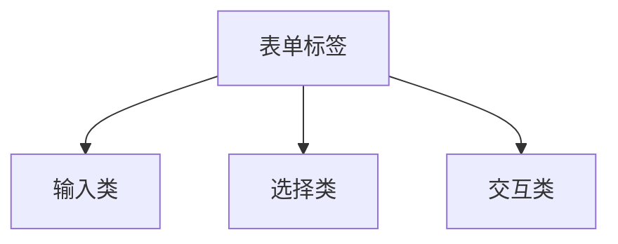
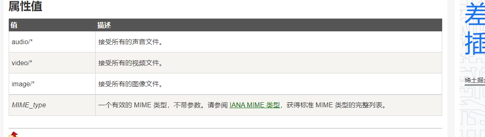

## 表单标签

表单标签是在页面上面提供用户“输入”，“选择”，“交互”三大类型的标签



> 所有的表单标签都应该放在`<form>`标签下面

### 文本输入框

```html
<input type="text" placeholder="请输入姓名" />
```

> 1. `type`用于指定输入框的类型 
> 2. `placeholder`用于指定提示文字

### 密码输入框 

```html
<input type="password" placeholder="请输入密码">
```

> 在密码输入框里面，用户看不见自己输入的内容

### 数字输入框 

```html
<input type="number" min="16" max="30" step="0.5">
```

> 1. `min`代表最小值
> 2. `max`代表最大值
> 3. `step`代表每次变化的量

### 颜色输入框 

```html
<input type="color">
```

### 日期输入框 

```html
<input type="date">
```

### 时间输入框 

```html
<input type="time">
```

### 日期时间输入框 

```html
<input type="datetime-local">
```

### 单选按钮

```html
<input type="radio" name="aaa">男
<input type="radio" name="aaa" checked>女
```

> 1. 如果想让单选变成一组，则它们必须具备相同的`name`值
> 2. 如果想让某一个被选中，默认加上`checked="checked"`,因为属性名与属性值相同，所以可以简写成`checked`，只保留属性名就可以了，这一种叫“单属性”

**扩展**

一般情况下，单选按钮`radio`都要与`label`标签结合在一起使用，效果如下

```html
<label>
    <input type="radio" name="sex">男
</label>
<label>
    <input type="radio" name="sex">女
</label>
```

> 在上面的情况里面，我们是直接把`input`的单选按钮放在`label`标签里面，这样就形成了一个整体，再去点击文字的时候，也相当于点击了单选按钮

还可以通过下面的方式去实现

```html
<input type="radio" name="sex" id="nan" >
<label for="nan">男</label>

<input type="radio" name="sex" id="nv">
<label for="nv">女</label>
```

在这一种方式里面，我们没有把`label`包裹`radio`，分开了，只需要在`radio`上面指定`id`，然后在`label`上面的`for`属性里面指定绑定的`id`就可以了

### 多选按钮

```html
<label>
    <input type="checkbox" name="hobby" checked>看书
</label>
<label>
    <input type="checkbox" name="hobby">睡觉
</label>
<label>
    <input type="checkbox" name="hobby" checked>玩游戏
</label>
```

### 文件选择框 

```html
<input type="file" multiple accept="image/png">
```

> 1. `multiple`用于指定多选
> 2. `accept`用于指定选择文件的类型



如果需要其它的类型 ，可以参考下面的网址

[www.iana.org/assignments/media-types/media-types.xhtml](http://www.iana.org/assignments/media-types/media-types.xhtml)

### 下拉选择框 

```html
<select  multiple size="7">
    <optgroup label="东北">
        <option>黑龙江省</option>
        <option>吉林省</option>
        <option>辽宁省</option>
    </optgroup>
    <optgroup label="华北">
        <option selected>河北省</option>
        <option>山东省</option>
        <option>山西省</option>
    </optgroup>
</select>
```

> 1. 下拉选择器就是为了解决`radio`和`checkbox`选项太多的问题
> 2. `<optgroup>`可以将选项进行分组
> 3. 默认选择某一个可以使用`selected`
> 4. 如果需要多选，可以使用`multiple`
> 5. 如果想一次性展示多个选项可以通过`size`去调整

### 滑块输入框

```html
<input type="range" min="0" max="100" step="50">
```

> 1. `min`代表最小值
> 2. `max`代表最大值
> 3. `step`每次更改的值的大小

### 文本域

```html
<textarea rows="5" cols="40"></textarea>
```

### 按钮

#### 提交按钮

提交按钮是一个交互式的按钮，它会将当前的表单提交到服务器

```html
<input type="submit">
<input type="submit" value="登录">
```

提交按钮默认的文字就是提交，我们还可以通过`value`来设置里面的文字内容

```html
<form>
    <p>
        账号：<input type="text" placeholder="请输入账号">
    </p>
    <p>
        密码：<input type="password" placeholder="请输入密码">
    </p>
    <p>
        <input type="submit">
    </p>
</form>
```

在上面的案例里面，如果我们点击了提交按钮以后，它会把当前的填写内容提交到服务器

#### 重置按钮

重置就是会将当前表单的值恢复成初始值

```html
<input type="reset">
<input type="reset" value="我要重来">
```

重置按钮默认的文本内容是“重置”，还可以通过`value`来设置里面文字 

#### 普通按钮

这一种按钮是只具备按钮的样式，但是不具备任何功能，这一种按钮就是一个普通按钮

```html
<input type="button" value="普通按钮">
```

> 你们目前使用得最多的就是这个按钮

我们一般在使用的时候不使用上面的方式(`input`)来创建按钮，而使用使用双标签来创建按钮

#### 双标签按钮

```html
 <button type="submit">
     <i>提交按钮</i>
</button>
<button type="reset">
    <font color="red">重置按钮</font>
</button>
<button type="button">
    <b>普通按钮</b>
</button>
```

双标签按钮的好处就是可以在里面嵌入自己所需要的东西

### 表单通用属性

1. `value`用于设置表单的值
2. `placeholder`占位符提示
3. `readonly`只读
4. `disabled`禁用
5. `maxlength`输入框的最大长度
6. `required`用于设置当前字段必填
7. `checked`用于单选或多选里面默认的选中
8. `selected`用于下拉选项框里面的默认选中
9. `multiple`用于`select`和`file`里面的多选