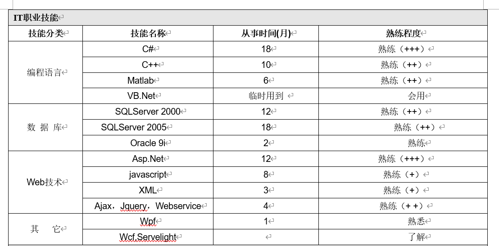

## CSS基础

之前就给同学们提过，Web三要素


1. `HTML`是网页的结构，网页有多少内容，显示什么内容都是由HTML来决定的
2. `CSS`是网页的表现形式，网上面的内容或元素表现什么样子是由它决定【我们通常说一个网页很丑，原则是因为CSS没有写好】
3. `JavaScript`是用户与页面之间的交互行为，行为会产生后果，这个后果就后面的*事件*【后面在研究】

### 什么是CSS

CSS的全称叫`cascading style sheet`,"层叠样式表"，它是一套完整的技术体系，它以一种前所未有的能力来设置网页上面的元素样式，目前已经发展到了第3个版本【所以经常会有一词叫HTML5+CSS3】

CSS是由一个组织`W3C`制定并发布的

### 为什么需要CSS

在以前其它并没有CSS，所以的一切都是由HTML来完成的，但是在我们使用HTML的时候 ，我们经常会发现有以下几个问题



我们之前在做这个作业的时候映到了一个问题

**问题**：我们发现所有的表格的单元格内容都要居中，这个时候我要对所有的`td`添加`align="center"`，这样<span style="color:red;font-weight:bold">代码的冗余量非常高</span>


在上面的家庭作业里面，我们又遇到了几个问题

1. 我们无法设置`fieldset`的宽度，我们也无法设置`input`表单的宽度
2. 代码的冗余量也过高
3. 我们发现`table`可以设置`width`而其它的元素又不能设置`width`，这种情况对我们记忆某一个属性会非常困难【它没有一个统一的东西让我去记忆】

上面的问题由来已久，所以W3C就专门针对这种情况推出了一个新的技术，这个技术叫`CSS`

### CSS的三个基本特征

#### 统一性

> 统一性是指用统一的属性来设置元素样式

CSS将之前HTML上面所有样式属性全部都废弃掉，转而使用了个`style`属性去代替【所有的HTML元素都有`style`】,并且使用属性的属性名来设置所有元素的统一的样式

```html
<fieldset style="width: 300px;">
    这是一个盒子
</fieldset>
<hr style="width: 300px;">
<table style="width: 300px;" border="1">
    <tr>
        <td>这也是一个表格</td>
    </tr>
</table>
```

#### 便捷性

CSS提供了丰富多样的**选择器**，能够让我们单个或批量的选取我们要设置样式的元素，来进行样式设置，可以极大的简化我们的代码量，减少代码的冗余量

```html
<style>
    p{
        color: red;
    }
</style>
```

上面的代码就是用于设置页面上面所有的`p`标签都为红色

#### 分离性

**第一种分离性的体现**

我们在书写样式的时候，我们之前在统一性里面讲到了，所有的元素上面都追加了一个`style`的属性，但是这样仍然无法解决一些特殊情况下的问题，所以CSS可以将`style`属性里面的内容分离到`<style>`标签当中去

```html
<p style="color: red;">这是第一个段落</p>
```

我们把style属性提出来

```html
<style>
    p{
        color: red;
    }
</style>
<p>这是第一个段落</p>
```

**第二种分离性的体现**

当不同的页面要使用不同的样式的时候，我们就要考虑到能否再次分离

**第一个页面**

```html
 <p>这是第一个段落</p>
```

**第二个页面**

```html
<p>这是第二个页面上面的段落</p>
```

如果将2个页面使用同一个样式

```css
p{
    color: red;
}
```

我们可以在项目下面新建一个`css`的文件夹，然后在这个文件夹的下面新建一个`a.css`的文件 ,把公共样式放入到这个`a.css`里面

现在结构代码就在HTML文件里面，样式代码 CSS就在`a.css`文件里面，它们就分开了，现在我们只需要将它们建立关系

```html
<link rel="stylesheet" type="text/css" href="css/a.css" />
```

或

```html
<style>
    @import url("css/a.css");
</style>
```

### CSS基础语法

1. 行内样式

   ```html
   <h2 style="color: red;background-color: blue;">孤勇者</h2>
   <标签 style="CSS属性名:CSS属性值;CSS属性名:CSS属性值;"></标签>
   ```

   行内样式情况使用比较少，它是直接把样式写在了`style`标签里面

   **优点**：简单

   **缺点**：不利于代码分离，会产生冗余量

2. 内部样式块

   ```html
   <style>
       p {
           color: deeppink;
       }
       选择器 {
          CSS属性名:CSS属性值;
          CSS属性名:CSS属性值;
       }
   </style>
   ```

   内部样式块就是把CSS的样式代码写在`<style>`标签里面，在大多数情况下，我们使用的都是内部的样式块

   **优点：**可以使用丰富多样的选择器来批量或单个选取元素以后设置样式

   **缺点**：不够直观，比行内样式写起来稍微的麻烦一点

3. 外部样式表

   当一个页面上面的样式代码过多，或多个页在要使用同样的样式的时候，我们就会把样式代码写在一个单独的`css`文件里面，如`a.css`，然后再通过标签或命令导入【在基础环节我们暂不考虑】

   ```html
   <link rel="stylesheet" type="text/css" href="css/a.css" />
   <style>
       @import url("css/a.css");
   </style>
   ```

4. CSS注释

   在CSS区域进行注释是如下格式 

   ```html
   <style>
   	/* 这才是CSS的注释 */
   </style>
   <!-- 这是HTML的注释 -->
   ```

### CSS选择器


CSS的选择器是CSS便捷性的一种体系，如果我们要设置页面上面元素的样式就必须先通过选择器选中元素

#### 标签选择器

在HTML里面我们已经学过很多个标签名，它是HTML的标签来进行选择器

```html
 <style>
     p{
         color: red;
     }
     h2{
         color: pink;
     }
</style>
<p>第一个段落</p>
<p>标哥哥的选择器</p>
<h2>刘诗霞</h2>
```

#### ID选择器

在网页的标签上面，我们可以对每个元素都指定一个编号，这个编号就是一个ID，<span style="color:red">ID不能重复</span>，在CSS里面，它使用`#`去表示

```html
<style>
    #aaa {
        color: red;
    }
</style>
<p>陈文</p>
<p id="aaa">叶俊豪</p>
```

#### class类选择器

class类选择器可以把它看成是一个微信群，类选择器使用`.`来表示

```html
<style>
    /* 将2个女生设置为红色 
    类选择器当成 微信群
    */
    /* 相当于创建了一个微信群，群名叫aaa */
    .aaa{
        color: red;
    }
    .bbb{
        font-size: 36px;
    }
</style>
<p class="bbb">陈文</p>
<p>叶俊豪</p>
<p class="aaa bbb">刘诗霞</p>
<p class="aaa">陈怡静</p>
```

> 1. `class`选择器相当于是一个微信群，一个class样式就是一个微信群
> 2. 下面的元素就相当于人，人可以加入多个微信群，一个微信群也可以加入多个人
>
> 正是因为有这个特点，所以类选择器会非常灵活，它也是我们平常开发不中使用得最多的一种选择器

上面的三个选择是CSS的是3个基本选择器

------

#### 子代选择器

子代选择器使用`>`来表示

```html
<style>
    /* 我只想fieldset内部的元素变成红色 */
    /* 我全都要 */
    fieldset>h2{
        color: red;
    }
</style>
<fieldset>
    <h2>张无忌</h2>
    <h2>赵敏</h2>
    <h2>周芷若</h2>
</fieldset>
<h2>张翠山</h2>
```

> 1. 子代选择器使用`>`来表示
> 2. 子代选择器`>`的左右两边可以是任意的基础选择器

```css
#aaa>.bbb{}
#aaa>label{}
#aaa>#bbb{}
.ccc>h2{}
```

同时，子代选择器可以不停的向下面选

```html
<style>
    /* 想把“张某人”设置为粉色 */
    fieldset>p>label{
        color: red;
    }
</style>
<fieldset>
    <h2 class="aaa">张无忌</h2>
    <h2>赵敏</h2>
    <h2>周芷若</h2>
    <label>小昭</label>
    <p>
        张无忌的儿子叫<label>张某人</label>
    </p>
</fieldset>
<h2 class="aaa">张翠山</h2>
```

#### 后代选择器

后代选择器使用空格来表示

```html
<style>
    fieldset a{
        color: red;
    }
</style>
<fieldset>
    <a href="#">百度一下</a>
    <p>
        有问题也可心找
        <a href="#">标哥的博客</a>
        <b>还可以<a href="#">谷哥一下</a> 
        </b>
    </p>
</fieldset>
<a href="#">优酷一下</a>
```

> 后代选择器与子代选择器有一个共同的特点，它们是可以由任何的基础选择器来组合

```css
#aaa .b{}
.c a{}
#ddd label{}
```

#### 分组选择器

分组选择器可以将多个基础类型的选择器进行分组，它使用`,`逗号来表示

```html
<style>
    /* 将h1和h2都设置为红色 */
    h1,h2{
        color:red;
    }
</style> 
<h1>爸爸的爸爸叫爷爷</h1>
<h2>妈妈的爸爸叫外公</h2>

<h1>妈妈的妈妈叫外婆</h1>
<h2>爸爸的妈妈叫奶奶</h2>
```

> 逗号选择器的左右可以是任意类型选择器，也可以叠加嵌套

```css
h1,h2{}
#a,#b{}
#a,.b{}
h1,#a{}
h1,#a,.b{}
```

#### 相邻兄弟选择器

相邻兄弟选择器是通过哥哥找弟弟，它使用`+`来表示

```html
<style>
    /* 请将紧挨着h2标签的后面一个p标签设置为红色 */
    h2+p{
        color: red;
    }
</style>
<p>标哥哥</p>
<h2>我应在江湖悠悠</h2>
<p>陈怡静</p>
<p>刘诗霞</p>
<h3>叶俊豪</h3>
<h2>饮一壶浊酒</h2>
<p>陈文</p>
```

> 1. 相邻兄弟选择器的左右也可以是任何基础类型的选择器
> 2. 相领选择器也可以叠加使用

**案例**

```html
<style>
    li+li{
        color: red;
    }
</style>
<ul>
     <li>第1项</li>
     <li>第2项</li>
     <li>第3项</li>
     <li>第4项</li>
     <li>第5项</li>
     <li>第6项</li>
     <li>第7项</li>
     <li>第8项</li>
     <li>第9项</li>
     <li>第10项</li>
</ul>
```


#### 普通兄弟选择器

普通兄弟与相邻兄弟是差不多的，它使用`~`来表示，我们通过下面的案例来了解对比 

```html
 <style>
     /* 请将h2标签后面的所有的p标签都设置为红色 */
     h2~p{
         color: red;
     }
</style>
<p>标哥哥</p>
<h2>我应在江湖悠悠</h2>
<p>陈怡静</p>
<p>刘诗霞</p>
<h3>叶俊豪</h3>
<h2>饮一壶浊酒</h2>
<p>陈文</p>
```

#### 属性选择器

属性选择器我们使用`[]`去表示

```html
 <style>
     /* 将所有colspan合并的格子变成红色 */
     [colspan]{
         color: red;
     }
     [rowspan]{
         background-color: deeppink;
     }
</style>
<table width="500px" border="1">
    <tr>
        <td colspan="2" >1</td>

        <td>3</td>
    </tr>
    <tr>
        <td rowspan="2">1</td>
        <td>2</td>
        <td>3</td>
    </tr>
    <tr>

        <td colspan="2">2</td>
    </tr>
    <tr>
        <td colspan="3">1</td>
    </tr>
</table>
```

**属性选择器的高级用法**

1. 属性选择器可以设置具体的值来过滤

   ```html
   <style>
   	/* 我想将www.softeem.com的网址设置为红色 */
       [href="http://www.softeem.com"]{
           color: red;
       }
   </style>
   <a href="http://www.softeem.com">软帝</a>
   <a href="http://www.softeem.xin">标哥</a>
   <a href="http://www.softeem.com">又是软帝</a>
   <a href="http://www.softeem.top">柴哥</a>
   ```

2. 属性值是以某一个具体的值**结尾**

   ```html
   <style>
   	/* 我希望将所有.jpg的图片高度设置为100px */
       [src$=".jpg"]{
           height: 100px;
       }
   </style>
   
   
   
   
   ```

3. 属性值以某一个具体的值**开头**

   ```html
   <style>
   	/* 我希望所有image目录下面的图片都设置为width:200px */
       [src^="image"]{
           width:200px;
       }
   </style>
   
   
   
   
   ```

4. 属性值里面**包含**了某一个具体的值

   ```html 
   <style>
   	/* 希望所有包含softeem的链接字体设置36px */
       [href*="softeem"]{
           font-size: 36px;
       }
   </style>
   <a href="http://www.softeem.com">软帝</a>
   <a href="http://www.softeem.xin">标哥</a>
   <a href="http://www.softeem.com">又是软帝</a>
   <a href="http://www.softeem.top">柴哥</a>
   <a href="http://www.baidu.com">百度</a>
   ```

#### 星号选择器

星号选择器代表任意选择器，可以选择所有的内容，它使用`*`表示

```html
<style>
    /* 希望将filedset里面所有的元素都设置为红色 */
    fieldset>*{
        color: red;
    }
</style>
<p>张三</p>
<fieldset>
    <h2>李四</h2>
    <h1>王五</h1>
    <a href="#">赵六</a>
</fieldset>
```

> **总结**：所有的选择器都有一个定论，只能是父级找子级（后代），哥哥找弟弟

### 选择器的组合

> 官网的说法叫选择器的并联
>
> 当某情况下，一个选择器不能完成我们的效果的时候，我们可以将多个选择器并联，以达到目的

```html
<style>
    /* 现在,我想将李四设置为红色 */
    /* h2{
    color: red;
    } */
    /* .a{
    color: red;
    } */
    h2.a{
        color: red;
    }
</style>
<h2 class="a">李四</h2>
<p class="a">张三</p>
<h2>王五</h2>
```

