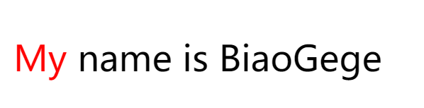
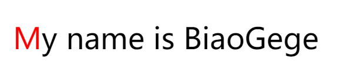

## 伪类及伪元素选择器

> 伪类与伪元素选择器它是一种特殊的选择器，后天有一个单独的来讲这个区别

伪类与伪元素选择器是用于形容一个元素的**特殊状态**或**特殊位置**，它们会以`:`或`::`来表示

### 伪类选择器

1. `:link`链接标签被访问之前的状态

2. `:visited`链接标签被访问之后的状态

3. `:hover`鼠标放上去以后的特殊

4. `:active`它指一个元素被鼠标点击并且没有松开的时候的特殊状态

   > 我们的链接标签`a`标签它的四个状态是有顺序的，不能随便写，它的顺序采用`lvha`来进行，可以理解成“由爱(love)生恨(hate)”

   这里还有一个细节给大家说一下，`:link`和`:visited`是链接标签独有的状态，而`:hover`和`:active`是所有元素都会有状态

5. `:first-child`第一个子元素

6. `:last-child`最后一个子元素

7. `:nth-child`用于选定指定的子元素

   `:nth-child(xn+y)`它内部有一个公式

   * 当`x=0`时，代表只选定第y个元素
   * 当`x=1`时，代表从第y项开始，一直选中到最后
   * 当`x=-1`时，代表从第y项开始，一直到最前面
   * 当`x>1`时，代表将子元素按x个分成一组，然后再取这个分组里面的第y个
   * 这里还可以使用特殊的单词，如`even`代表偶数，`odd`就是奇数

   所有以`child`结尾的选择器有一个共同的特点，**先确定子元素的位置，再确定子元素的类型**,这个选择多半适用于子元素相同的时候

8. `:nth-of-type(xn+y)`用于选中指定的子元素，**先确定元素的类型 ，再确定元素的位置**，这个选择器多半适用于子元素不相同的时候

9. `:not`排除某一种情况

10. `:read-only`代表表单素被只读的时候

11. `:disabled`代表的就是表单元素被禁用的时候

12. `:checked`单选框或复选框 被选中以后的特殊状态

13. `:target`目标元素的特殊状态

14. `:focus`当一个元素获得焦点的特殊状态

15. `:focus-within`某一个元素内部的元素获取焦点，反过来操作外边的元素状态

###  伪元素选择器

1. `::before/::after`在当前元素的内部的最前面或最后面追加内容，通过`content`属性去追加
   * 通过`::before/::after`追加的内容无法通过鼠标选中
   * 通过`content: url("img/man4.webp");`可以追加一个图片
   * 通过`content: attr(target);`来追加某一个元素内部的属性
2. `::first-line`一个段落的第一行文字
3. `::first-letter`段落里面的第一个文字
4. `::placeholder`用于设置输入框里面提示符占位信息
5. `:::selection`选中文字以后

## 伪类与伪元素的区别

之前已经跟同学样讲过了，伪类与伪元素其实就是元素的特殊状态或特殊的位置

其实我们可以这么去理解，它本质上面就**类选择器**和**元素选择器**，而元素就是标签，所以可以认为是类选择器和标签选择器

进而还可以这么理解

伪类：一个假的类选择器

伪元素：一个假的元素选择器

### 理解伪类选择器

伪类选择器就是<span style="color:red;font-weight:bold">原本可以通过类选择器来实现的，现在不需要这个类，转而使用一个看不见的类选择器，这个就叫伪类选择器</span>

现在我们有下面这个效果需要实现



```html
<p>
    <label>My</label>
    <label>name is BiaoGege</label>
</p>
```

这个时候我们肯定会想到`:first-child`

```css
/* 请将第一个元素My设置为红色，怎么办 */
p>label:first-child{
    color: red;
}
```

但是这个`:first-child`到底是伪类还是伪元素呢？【我们现在还不知道】

:question: 不知道的东西我们先不用

```html
<style>
	p>label.aaa{
        color: red;
    }
</style>
<p>
    <label class="aaa">My</label>
    <label>name is BiaoGege</label>
</p>
```

现在来进行对比：原来需要添加`class="aaa"`的现在我们可以不用不回了，我们可以直接使用`:first-child`来实现，也就是说`:first-child`所实现的功能其实就是`class`类选择器`.aaa`的功能 ，所以我们可以认为

`:first-child==.aaa`

> **总结**：原本需要通过类选择器去实现的效果，现在不需要了，转面使用了`:`这种选择器，那么，这个种选择器就叫伪类选择器

### 理解伪元素选择器

> 伪元素选择器就是伪标签选择器

现在我们通过下面的案例来了解伪元素



```html
<p>
    <label>My</label>
    <label>name is BiaoGege</label>
</p>
```

现在，我们可以通过下面的方式来完成

```html
 <p>
     <label><b>M</b>y</label>
     <label>name is BiaoGege</label>
</p>
```

我们首先在`M`的字母上面添加了一个`B`标签，将其包裹，然后再添加了CSS代码

```css
/* 将里面的第一个字母M变红，怎么办 */
/* 请不考虑使用伪类或伪元素，怎么办 */
p>label>b{
    color: red;
}
```

:question: 问题就在这里，我们能不能添加标签（元素），来实现这个效果，这个时候我们就要借用于`:first-letter`

```html
<style>
    /* 将里面的第一个字母M变红，怎么办 */
    /* 请不考虑使用伪类或伪元素，怎么办 */

    p::first-letter{
        color: red;
    }
</style>
<p>
    <label>My</label>
    <label>name is BiaoGege</label>
</p>
```

终上代码展示我们发现了一个特点 ，`::first-letter`相当于在第一个文字的前后添加了标签，但是这个标签你们看不到，所以`:first-letter`就是一个伪标签（伪元素）

> **总结**：原来需要添加一个标签才能实现的效果，现在不需要了，转而通过添加一个`::`就可以实现的，我们把这一类选择器叫伪元素选择器

### 伪类与伪元素的注意事项

1. 伪类选择器只要不冲突就可以叠加使用

   ```html
   <ul>
        <li>第1项</li>
        <li>第2项</li>
        <li>第3项</li>
   </ul>
   ```

   **下面的效果是可以的**

   ```css
   /* 只在第一个li上面hover的时候,我就变成红色 */
   ul>li:first-child:hover{
       color: red;
   }
   ```

   **下面的效果也可以**

   ```css
   /* ul在hover的时候将第一个li元素设置为红色  */
   ul:hover>li:first-child {
   	color: red;
   } 
   ```

   **下面的效果不可以**

   ```css
   ul>li:hover:first-child{
   	color: red;
   } 
   ```

2. 在一次选择里面，伪元素选择器不能叠加

3. 在一次选择里面，当伪类与伪元素同时存在的时候，伪元素只能放在最后

4. 一般情况下，伪类我们使用`:`来表示，伪元素我们使用`::`来表示。

   但是目前的浏览器都有兼容性了，所以有些选择器无论使用单冒号还是双冒号都可以了

