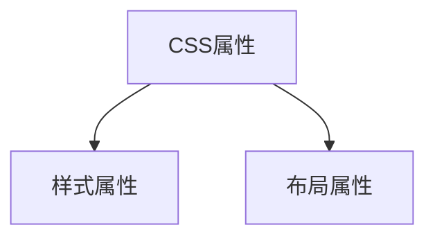
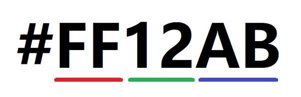

## 常见CSS样式（一）

之前讲CSS的基本特性的时候提到过，选择器是CSS最基本的，通过选择器我们可以快速的选择页面上面元素，但是选中元素以后最终我们还是要设置元素的样式，这些元素的样式是通过**统一**的CSS属性名来设置的，所以CSS的属性名是统一性的一种体现

现在我们就来学习一下常见的CSS属性名（常见CSS样式）

CSS的属性又分为2大类



### 宽度高度

1. `width/height`用于设置元素的宽度与高度
2. `max-width/max-height`用于设置盒的最大宽度与最大高度，盒子的真实高度/宽度不能大于这个值
3. `min-width/min-height`用于设置盒子的最小宽度与最小高度，盒子的真实高度/宽度不能小于这个值

### 颜色

1. `color`用于设置前景色

这个属性比较简单，关键就是后面的性

#### 关于颜色值

目前大多数浏览器能够使用的颜色有三种

1. 枚举色

   枚举色就可以叫得出名子的颜色 ，如`red/blue/yellow.....`,它可以直接使用英文单词来表示，这种颜色非常直观，缺点也很明显，不可以将所有的颜色都列举出来

2. 十六进制色

   上面的枚举色不能够将所有的颜色表示出来，所以我们需要使用数字来精确的表示，十六进制色就是使用十六进制的数值来表示颜色，它的格式是`#红色绿色蓝色`

   十六进制是从`0~9,A-F`

   

   `#`代表十六进制，前2个值代表红色的权重，中间2个值代表绿色的权重，最后2个值代表蓝色的权限，红绿蓝的三个颜色就可以构成世间所有的颜色，权重值越大，颜色值越深

   如红色可以使用`#FF0000`，蓝色`#0000FF`，白色`#FFFFFF`，黑色`#000000`，十六进制颜色不区分大小写

3. rgb三原色

   从上面的16进制里面我们了解到了，所有的颜色都通过 红、绿、蓝来组合而成的，我们可以使用红绿蓝的数值去表示，但上面的是16进制的表示，其实还可以使用10进制表示法，它从`0~255`

   `rgb(红色,绿色,蓝色)`

   如红色`rgb(255,0,0)`，绿色：`rgb(0,255,0)`，白色`rgb(255,255,255)`

### 背景

1. `background-color`背景颜色

2. `background-image`背景图片

3. `background-repeat`当背景图片小于盒子的时候，默认会现一个重复平铺行为，这个属性就是用于控制平铺行为了

   * `repeat-x`只在水平方向重复平铺
   * `repeat-y`只在垂直方向上面重复平铺
   * `repeat`在水平方向 与 垂直方向 上面同时重复平铺
   * `no-repeat`不重复平铺

4. `background-position`用于设置背景图的位置，它可以同时设置水平方向和垂直方向的位置

   ```CSS
   background-position:水平 垂直
   ```

   如果只写第一个值，第二值是`center`。同时在这里要注意，上中下的中在这里是`center`而不是`middle`

5. `background-size`用于设置背景图片的大小，它后面可以接1~2个值

   ```css
   background-size:100px 200px;   /*第一个值代表宽度，第二个值代表高度*/
   background-size: auto 100px;   /*高度设置为100，宽度则自动缩放*/
   
   background-size:100px;  /*如果只有一个值，则代表宽度，高度就会变成auto，根据图片自动缩放*/
   background-size:100px auto
   ```

   * `contain`这个属性值是让背景图片完全显示在盒子里面，这样可能会有一个方向空出来
   * `cover`这个属性值是让背景图片完全覆盖住盒子，这样可能会有一个方向的图片被裁剪掉显示不出来

6. `background`它是一个综合属性，后面既可以接颜色 ，也可以接图片，同时还可以设置上面的几个属性

   ```css
   background: red;
   background: pink url("img/01.jpg") no-repeat center center  / 100px 200px;
   ```

:books: **特殊应用点**：其实背景图片是可以设置多个的

```css
/* 图片排在越后面，越在底下 */
background-image: url("img/01.jpg"), url("img/02.png");
background-repeat: no-repeat,no-repeat;
background-size: 100px 200px,500px auto;
background-position: center center,left top;
```


### 文字与字体


### 边框


### 列表


### 表格


### 隐藏与显示


### 溢出处理


### 鼠标光标

