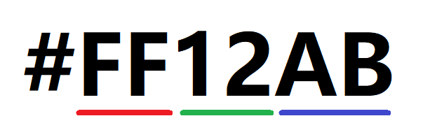

## 常见CSS样式（一）

之前讲CSS的基本特性的时候提到过，选择器是CSS最基本的，通过选择器我们可以快速的选择页面上面元素，但是选中元素以后最终我们还是要设置元素的样式，这些元素的样式是通过**统一**的CSS属性名来设置的，所以CSS的属性名是统一性的一种体现

现在我们就来学习一下常见的CSS属性名（常见CSS样式）

CSS的属性又分为2大类


### 宽度高度

1. `width/height`用于设置元素的宽度与高度
2. `max-width/max-height`用于设置盒的最大宽度与最大高度，盒子的真实高度/宽度不能大于这个值
3. `min-width/min-height`用于设置盒子的最小宽度与最小高度，盒子的真实高度/宽度不能小于这个值

### 颜色

1. `color`用于设置前景色

这个属性比较简单，关键就是后面的性

#### 关于颜色值

目前大多数浏览器能够使用的颜色有三种

1. 枚举色

   枚举色就可以叫得出名子的颜色 ，如`red/blue/yellow.....`,它可以直接使用英文单词来表示，这种颜色非常直观，缺点也很明显，不可以将所有的颜色都列举出来

2. 十六进制色

   上面的枚举色不能够将所有的颜色表示出来，所以我们需要使用数字来精确的表示，十六进制色就是使用十六进制的数值来表示颜色，它的格式是`#红色绿色蓝色`

   十六进制是从`0~9,A-F`

   

   `#`代表十六进制，前2个值代表红色的权重，中间2个值代表绿色的权重，最后2个值代表蓝色的权重，红绿蓝的三个颜色就可以构成世间所有的颜色，权重值越大，颜色值越深

   如红色可以使用`#FF0000`，蓝色`#0000FF`，白色`#FFFFFF`，黑色`#000000`，十六进制颜色不区分大小写

3. rgb三原色

   从上面的16进制里面我们了解到了，所有的颜色都通过 红、绿、蓝来组合而成的，我们可以使用红绿蓝的数值去表示，但上面的是16进制的表示，其实还可以使用10进制表示法，它从`0~255`

   `rgb(红色,绿色,蓝色)`

   如红色`rgb(255,0,0)`，绿色：`rgb(0,255,0)`，白色`rgb(255,255,255)`
   
4. `rgba`透明度

   这个值与上面的`rgb`非常像，只是在后面追加了一个`alpha`值，`alpha`值如果为0代表全透明，如果为1代表全不透明，如果介于0~1之间，则是半透明

   ```css
   background-color:rgba(255,0,0,0.5);   /*这个代表红色的半透明*/
   ```

   > 如果想把一个颜色设置为全透明，我们还可以使用一个特殊的枚举值`transparent`

### 背景

1. `background-color`背景颜色

2. `background-image`背景图片

3. `background-repeat`当背景图片小于盒子的时候，默认会现一个重复平铺行为，这个属性就是用于控制平铺行为了

   * `repeat-x`只在水平方向重复平铺
   * `repeat-y`只在垂直方向上面重复平铺
   * `repeat`在水平方向 与 垂直方向 上面同时重复平铺
   * `no-repeat`不重复平铺

4. `background-position`用于设置背景图的位置，它可以同时设置水平方向和垂直方向的位置

   ```CSS
   background-position:水平 垂直
   ```

   如果只写第一个值，第二值是`center`。同时在这里要注意，上中下的中在这里是`center`而不是`middle`

5. `background-size`用于设置背景图片的大小，它后面可以接1~2个值

   ```css
   background-size:100px 200px;   /*第一个值代表宽度，第二个值代表高度*/
   background-size: auto 100px;   /*高度设置为100，宽度则自动缩放*/
   
   background-size:100px;  /*如果只有一个值，则代表宽度，高度就会变成auto，根据图片自动缩放*/
   background-size:100px auto
   ```

   * `contain`这个属性值是让背景图片完全显示在盒子里面，这样可能会有一个方向空出来
   * `cover`这个属性值是让背景图片完全覆盖住盒子，这样可能会有一个方向的图片被裁剪掉显示不出来

6. `background`它是一个综合属性，后面既可以接颜色 ，也可以接图片，同时还可以设置上面的几个属性

   ```css
   background: red;
   background: pink url("img/01.jpg") no-repeat center center  / 100px 200px;
   ```

:books: **特殊应用点**：其实背景图片是可以设置多个的

```css
/* 图片排在越后面，越在底下 */
background-image: url("img/01.jpg"), url("img/02.png");
background-repeat: no-repeat,no-repeat;
background-size: 100px 200px,500px auto;
background-position: center center,left top;
```

### 字体与文字

1. `font-family`设置字体样式

   ```css
    font-family: "华文行楷";
   ```

   `font-family`只能设置电脑上面存在的字体，如果电脑上面没有字体，则会恢复网页的默认字体，针对这种情况，我们一般情况在设置字体的时候可以设置多个字体

   ```css
   font-family: "aaa","bbbb","microsoft yahei";
   ```

   当第一个字体不生效的时候 ，它会依次追加后面的字体，直到最后一个

2. `font-size`设置字体的大小

   ```css
   font-size:16px;
   font-size:12pt;
   ```

   上面两个字体的大小是一样的，`px`代表像素 ，`pt`代表字号，同时我们也得出网页的默认字体大小就是`16px`，同时以谷歌为核心的浏览器的网页的能够看得见的最小字体是`12px`【IE最小可以设置到1px】

   当面的`px`与`pt`只是我们在PC端常用的2个单们，还有其它的几个单位

   * `px`像素
   * `pt`字号
   * `em`一个父级元素【也是自己元素】的字体大小，em的全称是`element`元素
   * `rem`一个根元素字体的大小，它是一个响应式字体单位，它在`html`标签的`font-size`大小为标准
   * `vw/vh`响应式字体单位 ，全称叫`viewport width`和`viewport height`

3. `font-weight`用于设置字体的权重

   * `normal`字体体质正常
   * `bold`字体加粗
   * `bolder`字体还粗一点
   * `lighter`字体变细

   正常下完整的字体应该是有9个等级，分别是`100~900`,如果是完整字体，我们可以设置数字来表示字体的权重 ，`normal`对应的是400

   ```css
   font-weight:400;  /*正常字体*/
   font-weight:100;  /*字体变细*/
   font-weight:700;  /*字体加粗*/
   ```

4. `font-style`字体倾斜的样式

   * `italic`字体倾斜
   * `oblique`文字倾斜

   上面的两个方法都可以让页面上面的文字产生倾斜的效果，但是原理是不一样的，`italic`先到系统的字体库里面去看，看有没有倾斜，如果有倾斜，则使用字体的斜体；如果系统的字体库里面没有这个字体的斜体，它会直接让文字倾斜（也就是退而求其次，使用`oblique`来倾斜)

5. `@font-face`自定义字体

   ```css
   /* 自定义字体 */
   @font-face {
       /* 定义字体的名称 */
       font-family: "bgg";
       /* 说明字体在什么地方 */
       src: url("fonts/HKSN.ttf");
   }
   .aaa {
       font-family: "bgg";
   }
   ```

   

5. `text-align`文字水平排列，它有`left/center/right`的值

   在以前的时候我们如果要让文字两端对齐很麻烦,是通过`text-align:justify`来完成，但是这个效果实现起来很困难，所以后期推出了一个的属性叫`text-align-last:justify`

6. `text-decoration`文字的描述信息，它是一个简写的属性

   * `text-decoration-line`设置线条的位置
     * `underline` 下划线
     * `overline`上划线
     * `line-through`中划线（删除线）
     * `none`不要设置任何线条
   * `text-decoration-color`设置的线条的颜色
   * `text-decoration-style`设置线条的类型
     * `solid`实现
     * `dashed`虚线
     * `dotted`点线
     * `double`双线
     * `wavy`波浪线

   三个属性合起来就变成了上面的`text-decoration`一个属性

7. `text-transform`设置英文字母的大小写转换

   * `uppercase`大写字母
   * `lowercase`小写字母
   * `capitalize`单词的首字母

8. `text-shadow`设置文字的阴影，它有四个属性值

   ```css
   text-shadow:水平偏移 垂直偏移 阴影模糊 阴影颜色;
   text-shadow: 20px 30px 3px blue;
   ```

   > 在网页的坐标系里面，执行的是“左负右正，上负下正”的操作

9. `text-indent`首行缩进

   ```css
   text-indent:2em;
   ```

10. `letter-spacing`文字的间距，如果是中文没有问题，如果是英文等语言，它会把字母隔开

11. `word-spacing`单词与单词之间的间距

12. `line-height`文字的行高，行高指的就是一行文字的高度，行高越大，文字每一行的间距就会越大

    ```css
    line-height:32px;
    line-height:1.7;
    ```

    :tipping_hand_man: 如果文字只有一行，我们想让这个文字垂直居中，则可以将这个行高设置成与高度相同

13. 单行文字溢出省略

    ```css
    /* 让文字不换行 */
    white-space: nowrap;
    /* 溢出的部分隐藏 */
    overflow: hidden;
    /* 如果是文字溢出了,则添加省略号 */
    text-overflow: ellipsis;
    ```

    

14. 多行文字溢出省略、

    ```css
    display: -webkit-box;
    /* 盒子里面的内容垂直排列 */
    -webkit-box-orient: vertical;
    /* 在第2行的时候省略掉  */
    -webkit-line-clamp: 2;
    /* 溢出的部分隐藏 */
    overflow: hidden;
    ```

    

### 边框

#### 普通边框

1. `border`用于设置边框

2. `border-width`用于设置线条的宽度

3. `border-style`用于设置线条的类型

   * `solid`实线
   * `dashed`虚线
   * `dotted`点线
   * `double`双线
   * `groove`线槽

4. `border-color`线条的颜色，默认值为`currentcolor`当前的文本颜色

5. `border-*`,这个星号是方法，指的是`left/right/top/bottom`四个方法，可以通过它们分别来设置不同的方向

6. 我们还可以将3个值与4个方法结合起来

   

:closed_book: 小技巧：如果想在页面上面快速构建一个三角形，使用下面的方法

```css
.box{
    width: 0px;
    height: 0px;
    /* background-color: pink; */
    border: 30px solid transparent;
    border-right-color: red;
}
```

#### 圆角边框

1. `border-radius`圆角半径，它接收1~8个值

   如果是1个值代表四个角相同

   如果是2个值第1个值代表左上，第2个代表右上，剩下的参照对角

   如果是3个值第1个代表左上，第2个代表右上，第3个代表右下，第4个代表左下

   如果是4个值，则顺时针四个角

   ```css
   border-radius:50px;
   border-radius:50px 30px 100px 10px;
   ```

   

   这个`50px`指的是圆的半径，根据这个半径来设置圆角

2. `border-top-left-radius`左上角
3. `border-top-right-radius`右上角
4. `border-bottom-right-radius`右下角
5. `border-bottom-left-radius`左下角

**注意**：当圆角半径的横轴半径与纵轴半径不相同的时候，它就会是一人椭圆


```css
border-radius: 50px 0px 0px 0px ;  /*简写*/
border-radius: 50px 0px 0px 0px / 50px 0px 0px 0px;  /*完整写法*/
```

前面的4个值代表横轴半径 ，后面的3个值代表纵轴半径

```css
border-radius: 150px 0px 0px 0px / 50px 0px 0px 0px;
```


### 列表样式

在之前的时候，我们已讲过了`ul/ol`标签，它们是有序列表与无序列表，但是今天在讲完了CSS的列表样式以后，它们2个就没有任何区别了

1. `list-style-type`列表样式，它的常用的属性值有以下几个

   * `none`取消前面的符号

   * `disc`实心圆
   * `circle`空心圆
   * `square`实心矩形
   * `upper-alpha`大写英文字母
   * `lower-alpha`小写英文字母
   * `upper-roman`大写罗马文
   * `lower-roman`小写的罗马文
   * `decimal`数值
   * `decimal-leading-zero`数值 ，但是以0开始，如`01`
   * `cjk-heavenly-stem`采用天干记数，如`甲、乙、丙、丁、戊、己、庚、辛、壬、癸`
   * `cjk-earthly-branch`采用地支纪年，如`子、丑、寅、卯、辰、巳、午、未、申、酉、戌、亥`

2. `list-style-position`设置列表的符号是在li元素的内部还是外部

   * `outside`在li这个元素的外部【默认值】
   * `inside`在li元素的内部

3. `list-style-image`可以将列表项前面的符号换成我们的图片

4. `list-style`它是一个综合属性，它是三个属性的结合

### 表格

1. 表格添加边框

   ```css
   .t1,.t1 tr>td,.t1 tr>th{
       border: 1px solid black;
   }
   ```

   表格如果要添加边框，要对表格内部的元素格及本身都添加边框

2. 单元格之间的关系

   ```css
   border-collapse: separate;    /*使单元格保持分离状态*/
   border-collapse: collapse;    /*全单元格保持合并状态*/
   ```

3. 单元格与单元格之间的间距

   ```css
   border-spacing:10px;   /*单元格与单元格之间距离10px*/
   ```

> `valign`变成了`vertical`，原来的`cellspacing`变成了`border-spacing`

### 透明度设置

在这里千万不要弄混了，之前我们学过一个透明色`rgba`，今天学的是透明度是要整个元素都设置为透明


透明度的设置我们使用的是`opacity`来完成，它的值在0~1之间，1代表全不透明，0代表全透明

```css
/*W3C标准写法*/
opacity: 0.5;
/* 滤镜  IE的兼容性写法，在IE8及以下使用 */
filter: alpha(opacity=50) ;
```

### 隐藏与显示

1. 通过`display`的方式来显示与隐藏

   ```css
   display:none;   /*隐藏元素*/
   display:block;  /*显示元素*/
   ```

2. 通过`visibility`的方式来隐藏与显示

   ```css
   visibility: visible;   /*显示元素*/
   visibility: hidden;    /*隐藏元素*/
   ```

**区别**

1. `display:none`隐藏元素以后，元素就不再占用位置了，`visibility:hidden`隐藏元素以后，元素仍然占用之的位置
2. `display:none`具备株连性，外边的元素隐藏以后，内部的元素就不可能再显示。而`visibility:hidden`隐藏以后，内部的元素仍然可以通过`visibility:visbile`来显示

### 溢出处理

当元素内部的大小大于外部的大小的时候这个时候就会产生一个溢出的情况


在上面的图片里面我们可以看到，小盒子里面放了一个大图片，但是这个大图片放不小，就溢出了，现在需要处理

溢出处理使用`overflow`来完成，它有如下的几个属性值

1. `visible`溢出以后默认显示出来
2. `hidden`溢出隐藏
3. `scroll`滚动条处理
4. `auto`自动处理，如果溢出就添加`scroll`，如果不溢出则正常显示

在处理溢出的时候，我们还可以分开处理

```css
overflow-x: hidden;
overflow-y: scroll;
```

### 鼠标光标

鼠标的光标通过`cursor`来进行设置，它有如下的几个属性值

1. `default`默认值
2. `pointer`光标变成一个手的形状
3. `wait`光标变成等待状态（光标变成一个圈在那里旋转）
4. `help`会变成一个带问号的光标
5. `move`鼠标会变成一个移动的光标状态
6. `text`把光标变成输入框 的状态 
7. `*-resize`光标变成可调整大小的状态
8. 自定义光标`cursor: url("img/02.png"),default`

### 计数器

我们先抛一个问题

```html
<fieldset>
    <p>第一项</p>
    <p>第二项</p>
    <p>第三项</p>
    <p>第四项</p>
    <p>第五项</p>
</fieldset>
```

在上面的代码 时面，我们希望实现下面的几个点

1. 希望p标签像ul标签里面的列表项一样，在前面加上1,2,3,4,5这样的符号
2. fieldset下面的p有序号，但是序号是从10开始，10,11,12
3. fieldset下在面p序号是只有偶数如2,4,6,8,10

针对上面的特殊需求，我们的`ul`标签是无法实现的 ，这个时候就要使用高级用法**计数器**

在使用计数器之前一定要先弄清楚3个点

1. 你要对谁计数
2. 你要从什么数开始计数
3. 统计的数增量是多少

**请看下面的使用方法**

1. 你要对谁计数，那么就在这个元素的外层添加`counter-reset`属性
2. 你要对谁计数，那么就在这个元素上面添加`counter-increment`属性
3. 你要把统计的结果放在什么地方，那么就使用伪元素`::before/::after`来追加`counter()`属性

```css
/* 你要对谁计数，那么就在这个元素的外层添加`counter-reset`属性 */
fieldset {
    /* 重置一个计数器 ,也可以认为是定义一个计数器*/
    counter-reset: aaa 0;
}

/* 你要对谁计数，那么就在这个元素上面添加`counter-increment`属性 */
fieldset>p {
    counter-increment:aaa 1 ;
}
/* 你要把统计的结果放在什么地方，那么就使用伪元素`::before/::after`来追加`counter()`属性 */
fieldset>p::before{
    content: counter(aaa);
}
```


根据上面的案例，我们可以得到3个属性操作

1. `counter-reset:计数器名子 初始值`  初始化一个计数器，并初始化这个计数器值
2. `counter-increment:计数器名子 增量`在统计数量的时候，使用哪个计数器，并设置增量为多少
3. `counter(计数器)` 从计数器里面拿出当前计数的值

### 盒子阴影 

盒子阴影使用`box-shadow`它接收6个值（无数组）

```css
box-shadow: 水平偏移 垂直偏移 阴影模糊度 阴影扩散度 阴影颜色 是否内阴影;
box-shadow: 0px 0px 10px 10px red inset;
```

阴影还可以设置多组

```css
 box-shadow: 60px 0px 10px red,
            0px 60px 20px black,
            -60px 0px 5px blue;
```

### 滤镜

滤镜是CSS中的一种特殊展示效果，它使用`filter`做为属性名

1. `alpha(opacity=50)`设置透明度
2. `blur(30px)`高斯模糊
3. `hue-rotate(90deg)`色相饱和度反转
4. `grayscale(0.5)`灰度扩展


