## 盒子模型及元素类型

### 关于布局的概念 

之前就已给大家提过了，在CSS的属性里面，我们把CSS的属性分为了2大类的属性，分别是样式属性和布局属性。样式是进行一些细节的微调，而布局是整体的排列，从今天开始我们就要慢慢的接触到布局（layout）

在现行的布局标准里面，我们常把布局分为四大类，想完成布局的学习就必须先完成布局的属性和规范学习

1. 流式布局主要针对的是PC网页，它兼容强，缺点就是比较麻烦，有很多坑
2. 弹性布局主要针对的是移动端，它方便快捷，操作简单，依赖于弹性盒子与网格完成
3. 响应式布局是一种动态布局，页面的布局会根据不同的设备自动做出样式响应式，它界于PC，平板，移动端等多终端
4. 一个网页可以在不同设备，不同尺寸大小下面自动调整，自动适应，这种情况，我们叫自适应布局。自适应布局是需要借用于JS完成

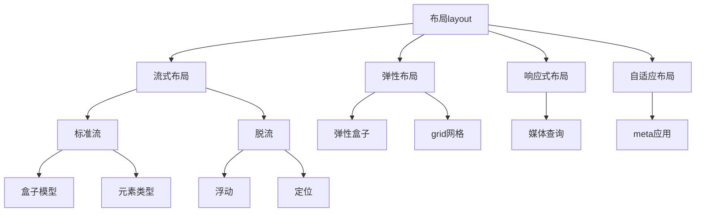

现在我们要从基础的流式布局开始，并且要从标准流开始，就应该学习它的技术

### 盒子模型

什么是盒子模型？

盒子模型是流式布局当中一套标准技术，它包含四层，如下图扭不

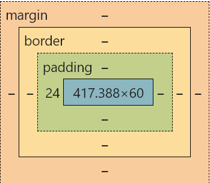

盒子模型由外向内分别是4层

1. `margin`外间距
2. `border`边框
3. `padding`内间距
4. `content`内容

我们在布局的时候，可以将页面上面的每一个元素都认为是一个盒子，然后它们通过一定的规则将这个盒子排列起来就构成了我们的网页

### margin外间距

margin指的是2个元素之间的外间距，它接收1~4个值

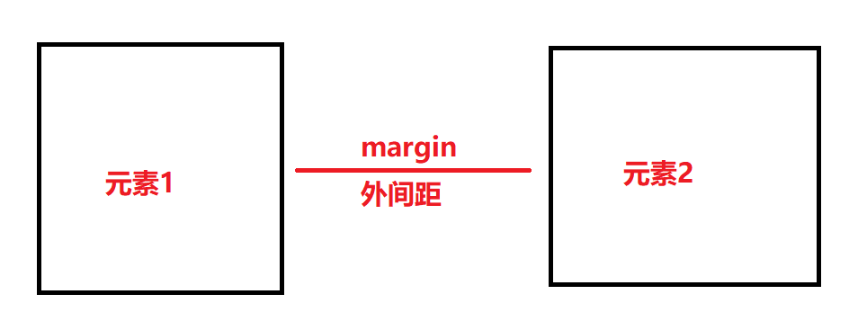

```css
.box {
    width: 200px;
    height: 200px;
    border: 2px solid black;
}
```

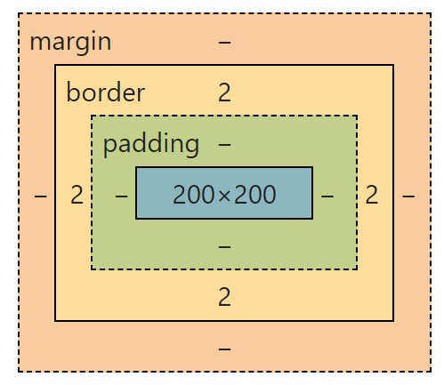

现在我们分别去设置`margin`的值，然后看一下它的盒子模型的表现形式

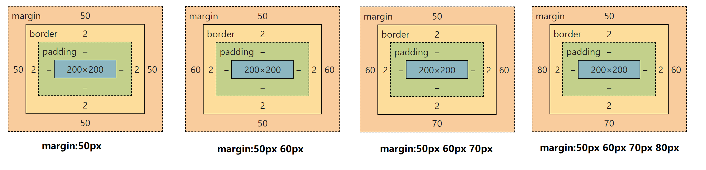

* `margin`的值设置是从上边开始的
* `margin`只设置1个值代表四个方向都相同
* `margin`设置2个值，第1个代表上边，第2个代表右边，剩下的参照对边
* `margin`设置3个值，第1个代表上边，第2个代表右边，第3个代表下边，剩下的参照对边
* `margin`设置4个值，从上边开始，依次顺时针一圈

`margin`的设置总体上来请参考下面这一张图就可以了，margin有值就赋值，没值的就参照下面的图来进行

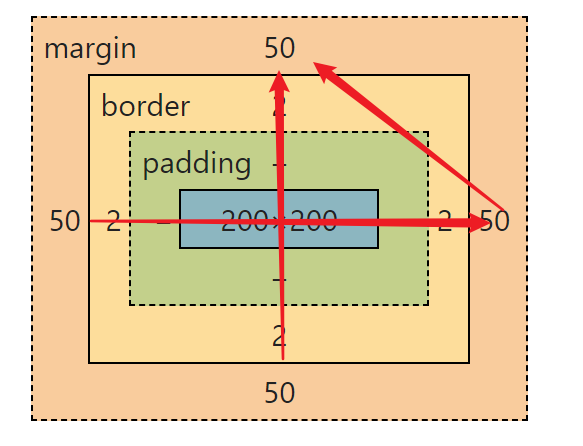


上边的`margin`属性是一个简写属性，本质上它是四个方向结合的，所以它可以拆开分开设置

* `margin-left`设置左边的外间距
* `margin-right`设置右边的外间距
* `margin-top`设置上边的外间距
* `margin-bottom`设置下边的外间距

#### 关于auto的情况

**第一步**：当我们在一个盒子上面设置`margin-left:auto`的时候，这个盒子会去最右边

```css
margin-left:auto;   /*盒子去了最右边*/
```

**第二步**：我在在这个盒子上面再去添加`margin-right:auto`,盒子就到正中间

```css
margin-left:auto;
margin-right:auto;
```

**第三步：**将上面的属性简写

```css
margin: 0px auto;
```

**第四步：**因为网页本身是没有高度，所以上下边距这个0可以设置成`auto`

```css
margin:auto auto;
```

**第五步**：再次简化代码

```css
margin:auto;
```

> **结论**：经过上在贩5个步骤的推断以后，我们得到了一个结果，如果想让一个块级元素左右居中，直接使用`margin:auto`就可以了

#### margin的穿透与折叠

**margin的穿透现象**

请看现象

```html
  <style>
      .box{
          width: 300px;
          height: 300px;
          background-color: deeppink;
      }
      .small-box{
          width: 100px;
          height: 100px;
          background-color: lightseagreen;
          margin-top: 150px;
      }
</style>
 <div class="box">
     <div class="small-box"></div>
</div>
```

代码 本意是在一个大盒子里面放一个小盒子，然后在小盒子的上面设置`margin-top`，这个时候却发生意外


这外时候我们可以看到，原本属于小盒子的`margin`穿过了外层的大盒子，体现在了大盒子的上面，这种现象就叫`margin`的穿透现象

**解决方法**

1. 在外层的大盒子上面添加一个`border-top`去解决，原因就是因为外边的盒子没有上边框，`margin`穿透出去了
2. 使用CSS Hack去解决，使用`BFC`去解决【BFC其实是一指一些特殊的属性】，如`overflow`可以解决

**margin的折叠现象**

请看下边的代码 

```html
<style>
    .box1{
        width: 200px;
        height: 100px;
        background-color: deeppink;
        margin-bottom: 20px;
    }
    .box2{
        width: 200px;
        height: 100px;
        background-color: lightseagreen;
        margin-top: 50px;
    }
</style>
<div class="box1">第一个盒子</div>
<div class="box2">第二个盒子</div>
```

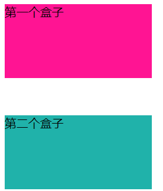

我们在上边的盒子上面添加了下间距`20px`，同时在下边的盒子上面添加了上间距`50px`，按照我们的理解，应该是70px,结果只有50px,这种现象的差异就是**margin的折叠现象**

**margin的折叠指的是上下两个元素的上下间距在同时设置的时候，以大的一个为主**

**解决方法**

1. 在上面两个元素中间给一个空元素，添加`BFC`的属性

   ```html
   <div class="box1">第一个盒子</div>
   <div style="overflow: auto;"></div>
   <div class="box2">第二个盒子</div>
   ```

2. 通过BFC去解决【TODO到后面的BFC章节再来讲】

> 无论是margin的穿透现象还是折叠现象，只存在于上下两个方法，左右不存在

-----

### padding内间距

内间距指的是盒子到内容的距离，它使用`padding`来表示，与`margin`的设置方法相同，也接收1~4值  ，同时也具备4个方向

1. `padding-left`
2. `padding-right`
3. `padding-top`
4. `padding-bottom`

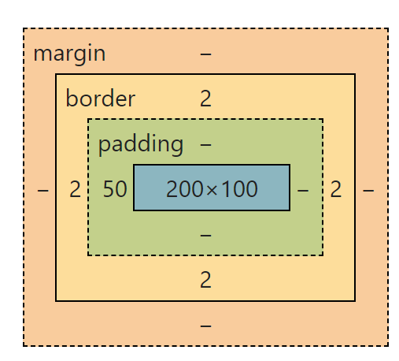

当我们在设置盒子的内间距的时候，我们发现一个特点，盒子会被撑大

```css
.box{
    width:200px;
    height:100px;
    border:2px solid black;
    padding-left:50px;
}
```

在上面的代码里面，盒子的宽度被撑大了`50px`

:question: **问题** :如何在设置完padding以后保证盒子模型的大小不变呢？

#### box-sizing属性

<span style="color:red;font-weight:bold;text-decoration:wavy blue underline">`box-sizing`这个属性用于表明盒子的`width/height`是设置在了内容content区域还是边框`border`区域</span>，`box-sizing`它有两个属性值

1. `content-box`代表当前CSS里面的`width/height`设置在了`content`内容区域【默认值就是这个】

   在这一种情况下，因为我们的`content`内容区域的大小固定了，所以当我们再去添加`padding`内间距的时候，整个盒子就会被撑大了

2. `border-box`代表当前的CSS里面`width/height`设置在了`border`边框上面

   在这一种情况下，`border`的大小就固定了，这个时候的`width=border+padding+content`

正同的盒子模型图就是box-sizing在不同情况下面的体现

|                   `box-sizing:content-box`                   |                   `box-sizing:border-box`                    |
| :----------------------------------------------------------: | :----------------------------------------------------------: |
| 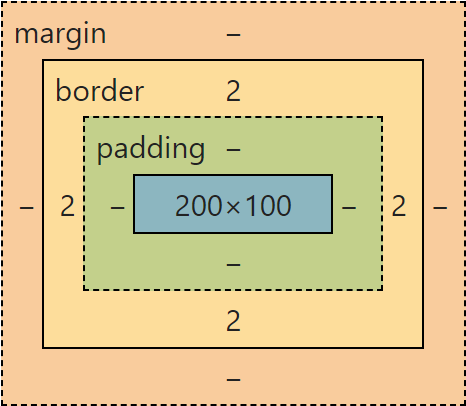 | 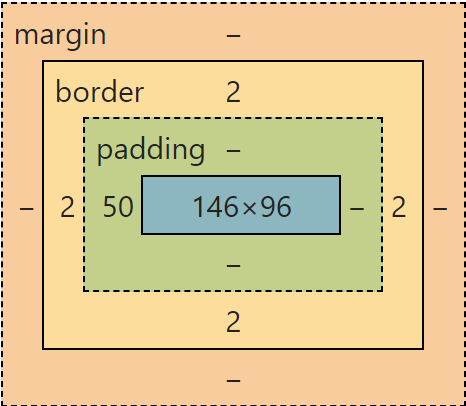 |

------

### 元素类型

首先请看下面的现象

```html
<style>
    .div1{
        background-color: deeppink;
        width: 300px;
    }
    .div2{
        background-color: aqua;
    }
    .label1{
        background-color: lightseagreen;
        width: 300px;
    }
</style>
<div class="div1">这是一个盒子</div>
<div class="div2">这是二个盒子</div>
<label class="label1">这也是一个元素</label>
<label class="label1">这也是一个元素</label>
```

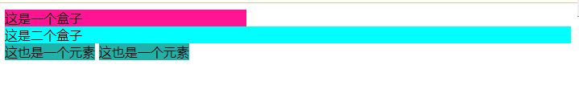

在上面的图片里面，它就是效果，通过这个效果，我们可以看到有几点不一样的

1. `div`元素与`label`它们的排列是不一样的，div是独自占用了一行，而`label`是可以排列在同一行的
2. `div`元素可以通过`width`来设置宽度，而`label`元素对`width`的设置好像没有效果
3. `div`元素默认的宽度好像是`100%`

要弄清楚上面的三种情况，我们就不得不去了解网页上面的**元素类型**。

在标准流布局里面，我们把网页上面的元素分为了三种类型 

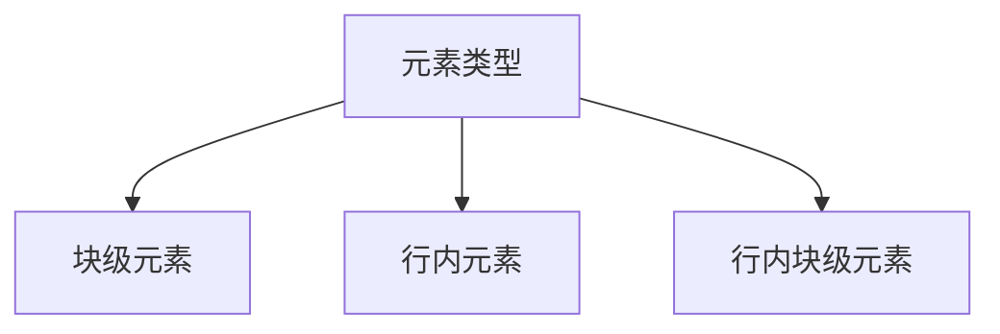

#### 块级元素

块级元素英文名叫`block`，它默认会具备一个`display:block`的属性，页面上面最常见的标签就是这种类型，如`div,table,ul,li,p,h1~h6`等这些都是块级元素

**块级元素的特征如下**

1. 块级元素默认的宽度是父级元素的`100%`，高度默认是`0`，可以通过内容来自动的撑开高度
2. 块级元素可以通过`width/height`来设置自身的宽度与高度
3. 块级元素独自占用一行
4. 块级元素的水平居中使用`margin:auto`
5. 块级元素遵守标准的盒子模型

> 在块级元素里面，有一个非常特殊的标签叫`div`标签，它是一个非常纯洁的标签，本身不具备任何样式，专门用于布局

####  行内元素

行内元素的英文名叫`inline`,它的表现形式是`display:inline`，页面上面经常看到的行内元素标签有`a,label,b,i,u,span`等，文字也算是行内元素

**行内元素的特征如下**

1. 行内元素的宽度与高度默认都是`0`,可以由内容来撑开
2. 行内元素不能通过`width/height`来设置自身的宽度与高度
3. 行内元素默认是排在同一行的
4. 行内元素如果在代码里面换行了，页面上面会呈现出一个空格位
5. 行内元素的水平居中是在其外层的**块级元素**或**行内块级**上面添加`text-align:center`
6. 行内元素不遵守标准的盒子模型规范，它只有`margin-left/margin-right`，没有`margin-top/margin-bottom`，它的`padding-left/padding-right`正常，`padding-top/padding-bottom`只能把自己撑大，不能撑开外层的元素

> 在行内元素里面，也有一个非常特殊的标签叫`span`标签，它是一个非常纯洁的标签，本身不具备任何样式，专门用于布局

#### 行内块级元素

行内块级元素是既具备块级元素的特点，又具备行内元素的特点，它有表现形式是`display:inline-block`,所有的表单元素都是行内块级元素

**行内块级元素的特征如下**

1. 行内块级元素的大小由自身的内容决定
2. 行内块级元素可以通过 `width/height`来设置自身的宽度与高度
3. 行内块级元素默认排在同一行
4. 行内块级元素如果在代码里面换行了，则会在页面上面产生一个空格位
5. 行内块级元素的水平居中是在其外层的**块级元素**或**行内块级**上面添加`text-align:center`
6. 行内块级元素遵守标准的盒子模型规范
7. 行内块级元素撑开外部盒子的高度的时候，底部默认会多出`3px`,目前的解决方案是在图片上面添加`vertical-align:middle`
8. 行内块级元素的垂直居中只用设置行高就可以了，而行内块及元素除了`line-height`，还要在自身添加一个`vertical-align:middle`

> `img`元素本身是行内元素，但是表现出来的是行内块级的特征

#### 元素类型的转换

页面上面的三种元素类型相互独立 ，互不影响 ，但是它们之间是可以相互转换的

1. 行内元素的表形现式是`display:inline`
2. 块级元素的表现形式是`display:block`
3. 行内块级元素的表现形式是`display:inline-block`

```html
<!DOCTYPE html>
<html>
	<head>
        <meta charset="utf-8">
        <title>元素类型转换</title>
        <style>

            .img1{
                /*转换成了块级元素*/
                display:block;	
                margin:auto;
            }
            .bbb{
                border:1px solid black;
                width:100px;
                height:100px;
                /*转换元素类型*/
                display:inline-block;
            }
        </style>
    </head>
    <body>

        <!-- 本身是行内元素，但是表现的特征是行内块级 -->

        
        <hr />
        <div class="bbb">标哥哥</div><div class="bbb">小帅哥</div>

    </body>
</html>
```

在上面的代码里面，我们就将元素的类型进行了转换，以达到我们所需要的效果

