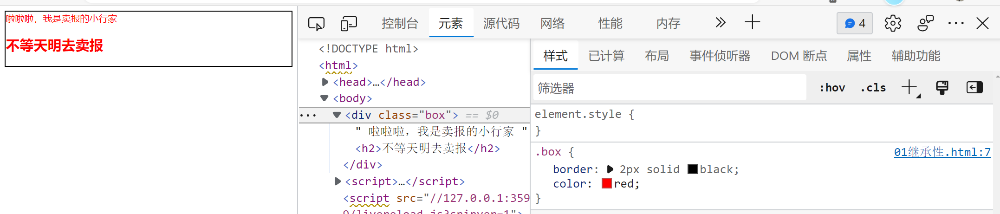

## CSS高级特性

之前的时候我们已经学过了CSS的3个基本点分别是选择器的便捷性，CSS属性的统一性，以及CSS与HTML代码的分离性，这三个特点已经解决了我们平常开发过程当中的很多样式问题，但是仍然有一些问题无法实现，这个时候就需要借助于我们CSS的高级特性

CSS的中文名称叫“层叠样式表”


### 继承性

> 继承性指的是内部元素默认继承外部元素的样式

怎么理解继承？王思聪和王健林是父子关系 ，王思聪就可以继承王健林的财产

通俗意义上面来说，父级里面有的东西，子级会默认继承下来

```html
<style>
    .box{
        border: 2px solid black;
        color: red;
    }
</style>
<div class="box">
    啦啦啦，我是卖报的小行家
    <h2>不等天明去卖报</h2>
</div>
```

在上面的代码里面，我们明明只是把`box`设置为了红色，为什么h2标签也会变成红色呢？



上面是`box`的样式，我们在浏览器里可以看到，它设置成了红色，现在我们再去看内部的`h2`标签


 通过上面的图片我们可以得到结果，因为`h2`标签继承了父级元素`box`的，所以它会有这个红色的文字样式，这个特点就是CSS里面的继承性

在上面图片里面，我们也可以看到一个特点，`color`这个属性是被继承下来了，而`border`没有被继承，这是因为<span style="color:red;text-decoration:underline wavy blue">能够默认被继承是样式属性，而布局属性是不能被继承的</span>

其它我们还可以通过一个特殊的CSS属性值来**主动的继承**

```css
h2{
    /* 我想让我的边框与父级元素的边框一模一样 */
    border: inherit;
}
```

### 层叠性

层叠性的本意是指CSS的样式应该是由多个部分共同组成的

```html
<style>
    .box{
        line-height: 50px;
    }
    .a1{
        display: inline-block;
        border: 2px solid black;
    }
</style>
<div class="box">
    <a href="#" style="padding: 0px 10px;" class="a1">百度一下</a>
</div>
```


我们现在想知道为什么`a`标签展示出来的效果是这样的？


上面图片我们可以看到，层叠性指的是元素终的表现形式是由`继承样式`+`自带的默认样式`+`内部样式块`+`行内样式`来共同决定的

**层叠性除了决定样式的最终表现形式外，它还可以让我们看到如果样式冲突了，它是怎么解决了**，请看下面的效果图


当样式出现冲突的时候，我们就可以看到，谁层叠在了上面，就听谁的

`行内样式>内部样式块>默认样式>继承样式`

### 优先级

优先级是为了解决在同一层里面出现样式冲突以后的问题，优先级一般是指选择器的优先级

#### 选择器相同的时候

```css
.box{
    color:red;
    border:1px solid black;
    color:yellow;     
}
```

在上面的代码里面，如果选择器相同的时候样式冲突了，我们可以找最后一次出现的样式就可以了，所以`yellow`会覆盖`red`

#### 选择器不相同的时候

在我们的开发当中，这种情况是最常见的，我们有很多个选择器，我们可以使用不同的方式来选择同一个元素，这个时候 如果出现了样式冲突，我们应该计算一权重值再来做比较

**选择器的权重值**

| 选择器                     | 权重值     |
| -------------------------- | ---------- |
| 星号选择器                 | 0，0，0，0 |
| 标签选择器，伪元素         | 0，0，0，1 |
| 类选择器，属性选择器，伪类 | 0，0，1，0 |
| ID选择器                   | 0，1，0，0 |
| style属性                  | 1，0，0，0 |
| `!important`               | 无穷大     |

```html
<!DOCTYPE html>
<html>
	<head>
		<meta charset="utf-8">
		<title>选择器的权重值计算</title>
		<style>
			/* 1 */
			p{
				color: red !important;
			}
			/* 1+1=2 */
			fieldset>p{
				color: blue;
			}
			/* 10 */
			.p1{
				color: yellow;
			}
			/* 1+10=11 */
			p.p1{
				color: pink;
			}
			/* 1+1+10=12 */
			fieldset>p.p1{
				color: green;
			}
			/* 10+10=20 */
			.f1>.p1{
				color: black;
			}
			/* 10+1+10=21 */
			.f1>p.p1{
				color: red;
			}
			/* 1+10+1+10=22 */
			fieldset.f1>p.p1{
				color: yellow;
			}
			/* 100 */
			#aaa{
				color: blue;
			}
			/* 1+100=101 */
			p#aaa{
				color: red;
			}
			/* 10+100=110 */
			.p1#aaa{
				color: green;
			}
		</style>
	</head>
	<body>
		<fieldset class="f1">
			<p class="p1" id="aaa" style="color: blue;">震惊，日本前首相安倍晋三突遭不幸福</p>
		</fieldset>
	</body>
</html>
```

上面的代码就是用来展示选择器的权重值的计算过程，但有一个根本原则不能违背

`style>ID>class>标签`这是一个总体原则，**官方的说法就是选择器权重不进位**

```html
<style>
    /* 10 */
    .div1{
        color: blue;
    }
    /* 11 选择器权重不进位 */
    div>div>div>div>div>div>div>div>div>div>div{
        color: red;
    }

</style>
<div>
    <div>
        <div>
            <div>
                <div>
                    <div>
                        <div>
                            <div>
                                <div>
                                    <div>
                                        <div class="div1">我是第11个</div>
                                    </div>
                                </div>
                            </div>
                        </div>
                    </div>
                </div>
            </div>
        </div>
    </div>
</div>
```

在上面的代码里面，我们可以看到最终显示的效果是`blue`，因为标签选择器无论怎么叠加，都不能大于`class`选择器，也就是值不能进位