## 浮动

浮动是属于脱流布局一种技术，它不属于标准流布局，脱流，顾名思义就是脱离了标准流。在标准流布局里面，我们可以解决平常70%的问题，但是仍然有些问题是无法实现的

1. 我们希望多个块级元素排在同一行
2. 我们希望多个盒子堆叠在一起，怎么办

像上面的2个问题，在标准流里面就无法解决，那么，我们脱流就可以解决上面的问题

### 浮动的现象

浮动使用`float`属性，它有`left/right`2个属性值，`left`的属性值是让元素向左横排，`right`的属性值是让元素向右横排

```html
<style>
    ul>li{
        list-style: none;
        border: 1px solid black;
    }
</style>
<ul>
    <li>第一项</li>
    <li>第二项</li>
    <li>第三项</li>
    <li>第四项</li>
</ul>
```

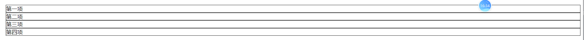

上面是4个`li`元素，默认是没有浮动的

**左浮动**

```css
ul>li{
    list-style: none;
    border: 1px solid black;
    /*左浮动*/
    float:left;
}
```


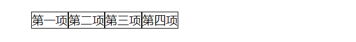

**右浮动**

```css
ul>li{
    list-style: none;
    border: 1px solid black;
    /*右浮动*/
    float:right;
}
```

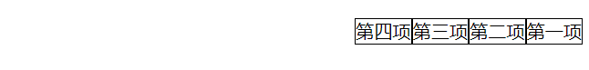

**浮动的现象**：浮动就是可以让元素以向左或向右进行水平的横向排列，同时如果一行放不下则会自动换行

----

### 浮动脱流以后存在的问题

```html
 <style>
     .box {
         outline: 2px solid red;
     }

     .div1 {
         width: 100px;
         height: 100px;
         background-color: lightseagreen;
     }
</style>
<div class="box">
    <div class="div1">盒子1</div>
</div>
```

上面是一个大盒子套了一个小盒子

**没有浮动的时候**

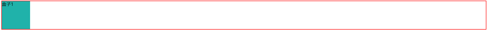

**对div1添加左浮动**

```css
.div1{
     width: 100px;
    height: 100px;
    background-color: lightseagreen;
    float:left;
}
```

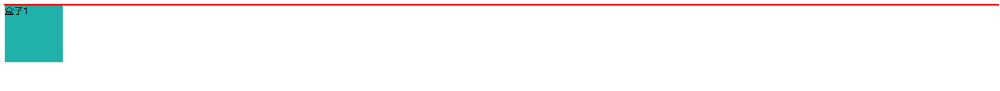

我们会看到，外边盒子的高度坍塌了，现在我们在后面添加一个盒子，再加上文字

```html
<style>
    .box {
        outline: 2px solid red;
    }
    .div1 {
        width: 100px;
        height: 100px;
        background-color: lightseagreen;
        float: left;
    }
    .div2{
        height: 150px;
        background-color: pink;
    }
</style>
<div class="box">
    <div class="div1">盒子1</div>
    <div class="div2">我是标哥哥</div>
</div>
```

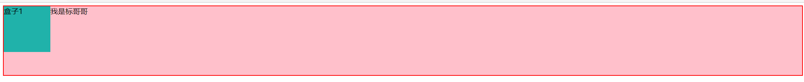

> **浮动的影响**
>
> 1. 浮动最大的问题就是不占用当前的**布局位置**，但是占用**内容位置**
> 2. 正是因为不占用布局的位置 ，所以会照成父级元素的高度坍塌

浮动好用是好用，但是会对后面的布局照成影响 ，所以，我们只要清除这个浮动的影响 ，那么，浮动对于我们布局来说还是相当有用的

### 清除浮动的影响 

浮动的影响主要是由于不占用位置以后，父级元素的高度坍塌所造成的，所以我们只要恢复父级元素的高度即可

```html
<!DOCTYPE html>
<html lang="zh">

<head>
    <meta charset="UTF-8">
    <meta http-equiv="X-UA-Compatible" content="IE=edge">
    <meta name="viewport" content="width=device-width, initial-scale=1.0">
    <title>浮动的问题</title>
    <style>
        .box {
            outline: 2px solid red;
        }
        .div1 {
            width: 100px;
            height: 100px;
            background-color: lightseagreen;
            float: left;
        }
        .div2{
            background-color: pink;
            height: 50px;
        }
    </style>
</head>

<body>
    <div class="box">
        <!-- 浮动，不占位置 -->
        <div class="div1">盒子1</div>
    </div>
    <div class="div2">我是标哥</div>
</body>

</html>
```

**第一种解决办法：在浮动元素的父级盒子的最后面，添加一个块级元素，然后再使用`clear`属性**

1. `clear:left`清除左浮动带来的影响 
2. `clear:right`清除右浮动带来的影响
3. `clear:both`同时清除左右浮动带来的影响

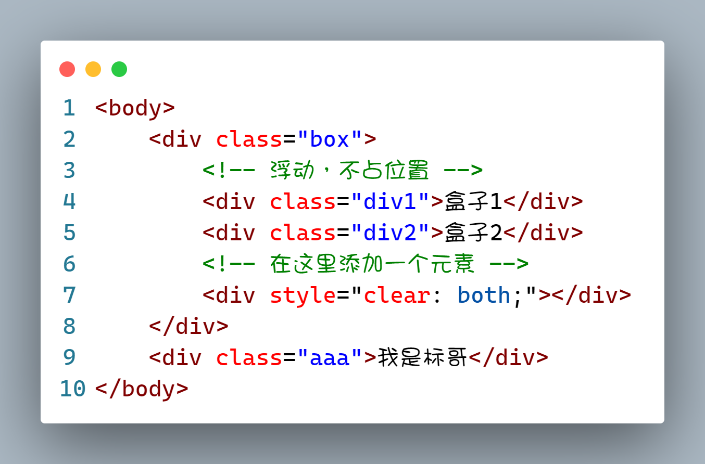

**第二种办法 ，在浮动元素的父级添加BFC属性**，目前我们学过的属性就有`overflow`

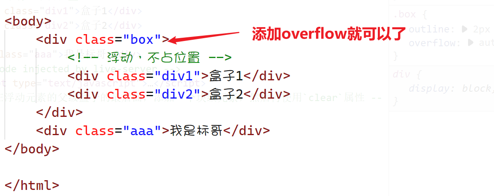

**第三种办法 ，利用伪元素::after来实现**

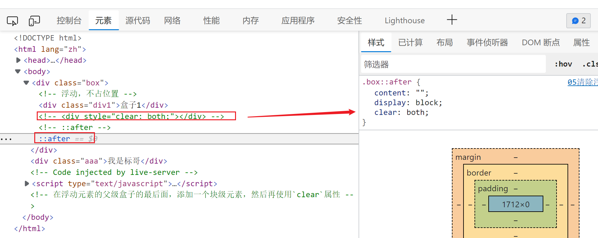

在上面的图片里面，我们可以看到，我们使用`::after`这样的伪元素是可以与第1种方法产生相同的效果

后期为了使用方便，我们一般都会这么定义

```css
.clearfix::after{
    content: "";
    display: block;
    clear: both;
}
```

> `clearfix`这个名子并不是固定的，它只是一个约定俗成的名子，大家以后的工作当中都是这么写的，还有就是很多第三方框架也是这么写的

----

### 脱流的影响 【浮动】

我们现在已经可以清除浮动所带来的影响了，那么我是否就可以放心大胆的使用`float`这个属性的呢？

<span style="color:red;text-decoration:double underline blue;font-weight:bold">浮动所带来的最大的问题就在于不占原来的位置 ，脱离了原来位置 ，这种现象我们叫"脱流"</span>

当一个元素脱流以后，我们就不能再使用标准流布局的规范来要求它了

1. 浮动脱流以后的元素不占用原来的位置 ，并且高于标准流的一个Z轴等级，会撑不开父级元素，照成父级元素的高度坍塌
2. 浮动脱流以后的元素无视元素类型，都会变成`diplay:block`块级元素
3. 浮动脱流以后的元素宽度会丢失，不再是默认的``100%`,而是布内容撑开，但是可以通过设置`width/height`来重新决定宽度与高度
4. 浮动脱流以后的元素不适用于之前的任何居中规范
5. 浮动以后的元素会形成BFC（简而言之，就是不会存在margin的穿透现象）

### 浮动以后的元素居中

```html
<!DOCTYPE html>
<html lang="zh">
<head>
    <meta charset="UTF-8">
    <meta http-equiv="X-UA-Compatible" content="IE=edge">
    <meta name="viewport" content="width=device-width, initial-scale=1.0">
    <title>浮动的元素居中</title>
    <style>
        .clearfix::after{
            content: "";
            display: block;
            clear: both;
        }
        .box{
            border: 5px solid black;
        }
        .box>div{
            width: 100px;
            height: 100px;
            float: left;
        }
        .div1{
           background-color: deeppink;
        }
        .div2{
            background-color: lightseagreen;
        }
        .div3{
            background-color: yellow;
        }
    </style>
</head>
<body>
    <div class="box clearfix">
        <div class="div1">第一个</div>
        <div class="div2">第二个</div>
        <div class="div3">第三个</div>
    </div>
</body>
</html>
```

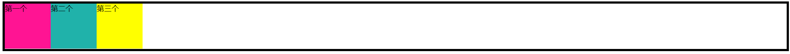

上面就是三个盒子浮动了，我们想元素居中，有什么办法呢？

**标准看特征，脱流看影响**，脱流以后的元素是不能直接居中的

**第一种方法：在浮动元素的父级变成`inline-block`，然后再到这个行内块级元素的外边设置`text-align:center`**

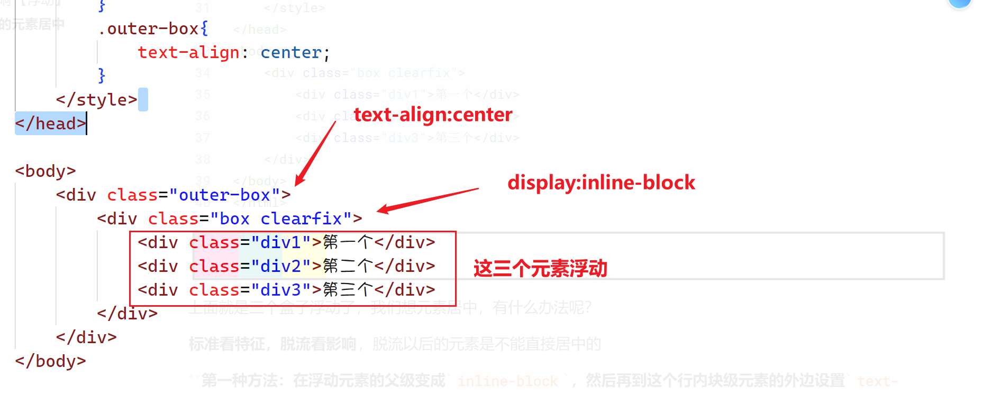

> 在上面的方法里面，最大的缺点就是太复杂了，我们要添加几个上元素，还要转换元素的类型，所以后面CSS3专门出了一个的方法

**第二种方法：直接使用CSS3的新方案`fit-content`**

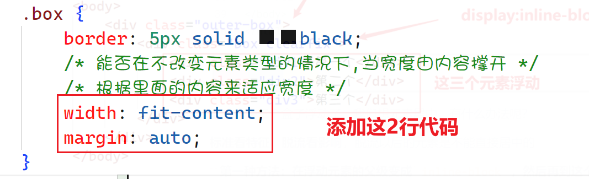

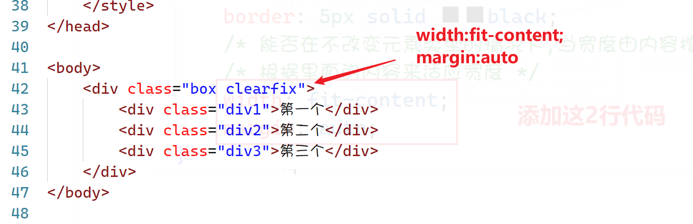