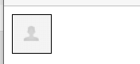
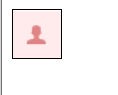

## 精灵图的使用

精灵图就是将很多个小图片集合在一张大图上面，然后通过 `background-image`及`background-position`来使用我们的小图标，这种图就叫精灵图。

精灵图也叫雪碧图`sprite`


上面一图片就是精灵图，我们可以看到，这个图片里面有很多样小图片

**优点**：如果这些图片都是一张一张的小图片，这样网页在加载的时候，它会从服务器里面单独的一张一张加载，会极大的消耗服务器的性能，如果使用了精灵图以后，就不会出现这种情况了，它只用加载一张图片就可以了

**缺点**：当这个图片一旦加载不出来，则会影响所有的图标，同时，如果精灵图的大小发生了变化，则也会影响所有的图标


```html
<style>
    .div1{
        border: 1px solid black;
        width: 38px;
        height: 38px;
        background-image: url("img/pwd-icons-new.png");
    }
</style>
<div class="div1"></div>
```

在上面的代码里面，我们已经可以看到，第一个图标已经出来了



如果我们现在需要更换图标，这个时候就只能去调整背景图片的位置

```css
background-position: 0px -95px;
```

当我们添加了上面的属性值以后，我们就可以看到背景图片的位置发生了变化，这样图片就显示成不一样的




精灵图主要是通过`background-position`来调整位置来实现的，所以有两个新的属性需要介绍给大不家

1. `background-position-x`单独调整X轴的位置
2. `background-position-y`单独调整Y轴的位置


