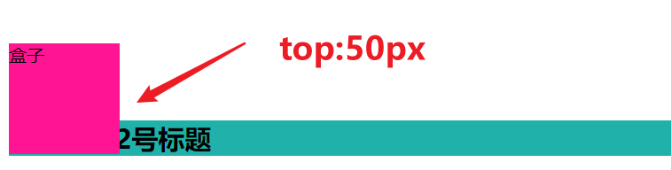
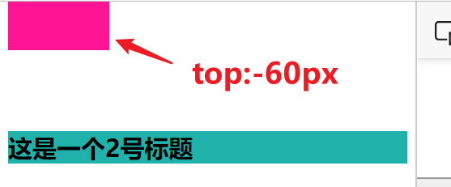
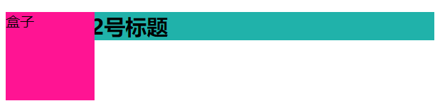
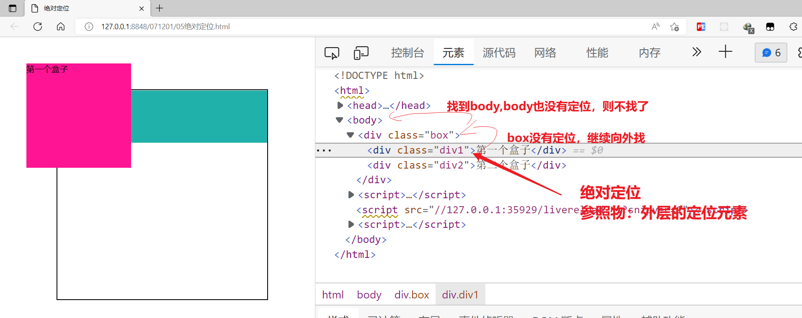
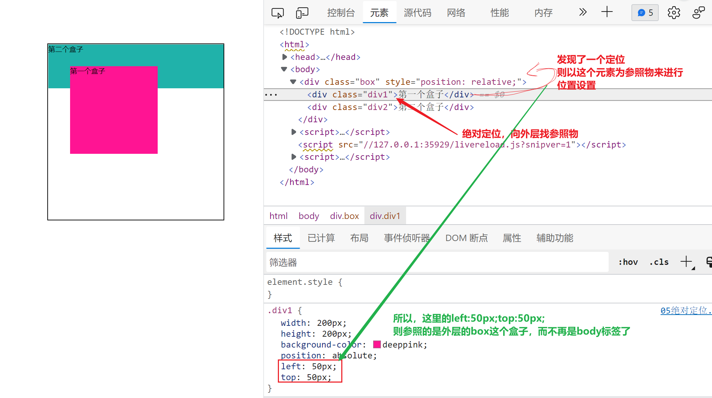

## 定位

定位是脱流布局的另一种体现形式，在之前我们学习过了浮动，它与浮动脱流还是有一点区别的，目前使用的定位方式有5个，它使用`position`做为属性值

<span style="color:red;font-weight:bold">一个元素一旦使用了定位以后，它就会多出如下的5个属性值</span>

1. `left`调整左边的位置
2. `right`调整的右边的位置
3. `top`调整上边的位置
4. `bottom`调整下边的位置
5. `z-index`调整Z轴的层级，默认情况下，定位以后的元素会高于标准流一个Z轴层级

### 相对定位

相对定位我们使用属性值`relative`

```css
position:relative;
```

**特点**

1. 相对定位的元素如果发生位置变化以后，不再用新的位置空间

   

   在上面的图片里面，我们可以看到，盒子设置`top:50px`下向偏移以后，下面的h2标签并没有被挤下来，也没有占用文字内容的空间

2. 相对定位的元素如果位置发生变化以后，原来的位置仍然要占用保留

   

   在上面的图片里在，我们可以看到盒子设置`top:-60px`以后上向移动，但是仍然占用了原来的位置 ，所以下在h2就不能顶上去

3. 相对定位的`left/right/top/bottom`来设置位置偏移以后，它是相对于**原来的位置再进行偏移**

在上面的效果里面，我们可以看到，一个元素经过相对定位调整位置以后，它仍然占用原来的位置，所以它没有脱流

### 绝对定位

绝对定位使用`absolute`

```css
position:absolute;
```

**特点**

1. 当一个元素绝对定位以后，它在这个位置上面立即脱流，不再占用原来的位置

   

2. 绝对定位它如果使用`left/right/top/bottom`来进行位置设置的时候，是需要找参照物的。**绝对定位的参照物是找外层的定位元素**

   ```css
   left:50px;
   top:50px;
   ```

   

   所以我们就会看到上图的情况，`div1`会向父级找定位元素，但是父级没有，就继续向外层找，一直找到`body`标签，如果还没有找到，则直接以`body`为参照物来定位

   如果我们现在在外层的元素上面添加`position:relative`以后，再来看

   

### 固定定位


### 静态定位


### 粘性定位


### 子绝父相

子绝父相的本意是指当一个元素使用了绝对定位以后，外层应该使用相对定位来约束这个绝对定位【相当于给一个参物】，如果没有这个参照物约束，那么这个元素就会一直找到`body`

子级元素使用绝对定位，外层元素使用相对定位，这一种特殊的关系我们叫子绝父相

**应用场景**：当个元素要以另一个元素为标准进行位置设置的时候，最好的办法就是子绝父相

**知识扩展**：子绝父相它只是一个最基本的概念，外层元素不一定非要是相对定位`relative`，可以是除了`static`静态定位以外的任何定位都可以

> **注意**：在CSS3里面`transform`也可以用来约束绝对定位


### 定位脱流的影响 

1. 定位脱流是在原来的位置直接脱流，并高于默认的文档流一个层级，会盖住标准流，但是可以通过`z-index`调整层级，可以通过`left/right/top/bottom`来调整位置

2. 定位脱流不占用原来的位置

3. 定位脱流无视元素类型 ，所有元素都会变成`display:block`

4. 定位脱流以后的元素会丢失宽度，默认由内容来撑开，但是可以通过`width/height`来调整宽高，<span style="color:red;font-size:22px;font-weight:bold">它还可以通过left/right来拉开宽度，也可以通过top/bottom拉开高度</span>

5. 定位脱流以后的元素会形成BFC（没有`margin`的穿透现象）

6. 定位脱流可以使用特殊的技术来居中【重点：引伸出了流的概念】

   ```css
   .box{
       position:absolute;
       left:0;
       right:0;
       top:0;
       bottom:0;
       /*上面的4个属性就是拉开了流*/
       margin:auto;
   }
   ```
   
   
   
   