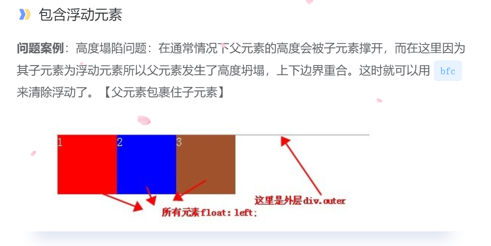
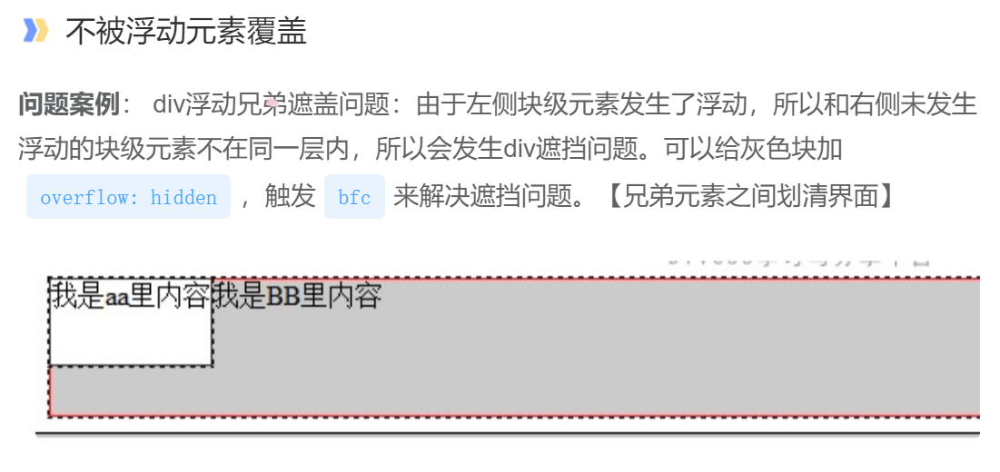

## BFC的概念

### 什么是BFC

BFC(block formatting context）：简单来说，BFC 就是一种属性，这种属性会影响着元素的位置以及与其兄弟元素之间的相互作用。

中文常译为块级格式化上下文。是 W3C中CSS2.1 规范中的一个概念，它决定了元素如何对其内容进行位置设置，以及与其他元素的关系和相互作用。

在进行`盒子模型`布局的时候，BFC提供了一个环境，<u>在这个环境中按照一定规则进行布局不会影响到其它环境中的布局</u>。比如浮动元素会形成BFC，浮动元素内部子元素的主要受该浮动元素影响，两个浮动元素之间是互不影响的。 也就是说，如果一个元素符合了成为BFC的条件，该元素内部元素的布局和定位就和外部元素互不影响(除非内部的盒子建立了新的 BFC)，是一个隔离了的独立容器。（在 CSS3 中，BFC 叫做 Flow Root）

1. BFC是一个封闭的环境，在这个环境中布局不会影响到外边的元素，也不会被外边的元素影响
2. BFC是一个封闭的环境，它不会影响兄弟环境

### 怎么形成BFC

形成BFC是有很多个CSS属性都可以完成了

1. `overflow`的属性值除了`visible`以外的，如`auto/scroll/hidden`都可以了

2. `float:left`或`float:right`

3. `position:fixed`或`position:absolute`

4. `display`的值为`inline-block`，`table-cell`，`table-caption`

5. 上面的四个部分的属性本意上面都不是为了形成BFC的，所以用起来的时候会有点怪怪的感觉

   在后面的CSS3里面，就专门推出一个形成BFC的属性值，叫`display:flow-root`，这个属性什么都不干 ，专门形成BFC，这个属性没有任何副作用

### BFC的作用

1. 解决父级元素包裹不了子级元素的问题

   **思考**：什么情况下，父级元素包裹不了子级元素

   * `margin`穿透现象，内部的`margin`穿透到外部去了，这个时候父级元素就没有包裹住子级元素
   * 浮动脱流以后，父级元素包裹不了子级元素，造成高度坍塌

   对于上面的`margin`的穿透现象及浮动脱流照成的高度坍塌现象，我们都可以使用BFC来解决

2. 兄弟元素划清界限

> 上面的图的情况就是浮动以后造成的父级元素高度坍塌，这个时候我们可以在父级元素上面添加`BFC`属性，来恢复父级元素的元素

> 在上图当中，我们可以看到，当元素浮动以后，兄弟元素之间就没有划清界面，我们可以在浮动元素的后面添加`BFC`来解决这个问题

**没有添加BFC的时候**

**添加完BFC以后**

当添加完BFC的属性以后，我们可以看到，两个元素就彻底的划清界面了
