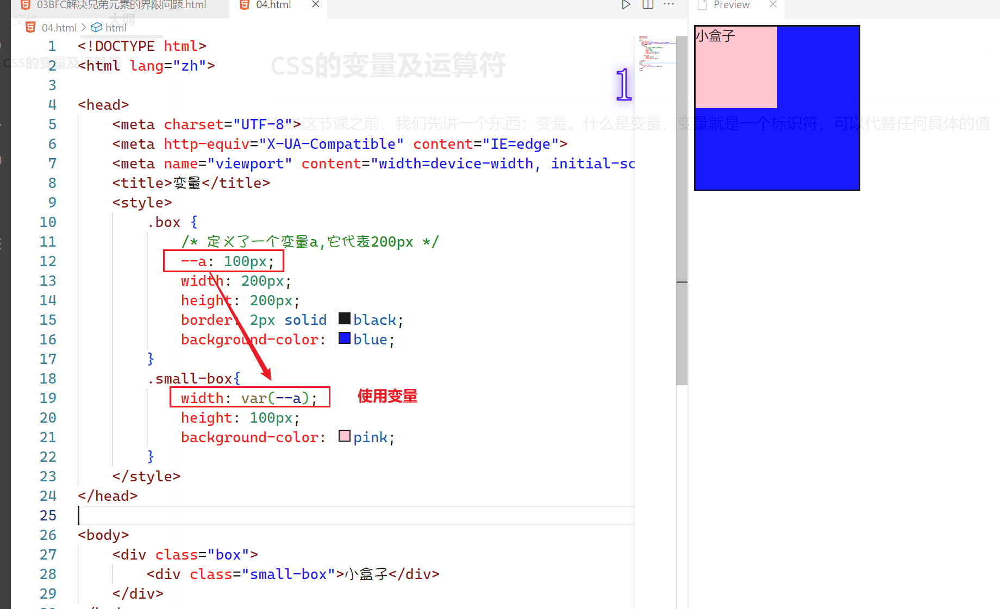
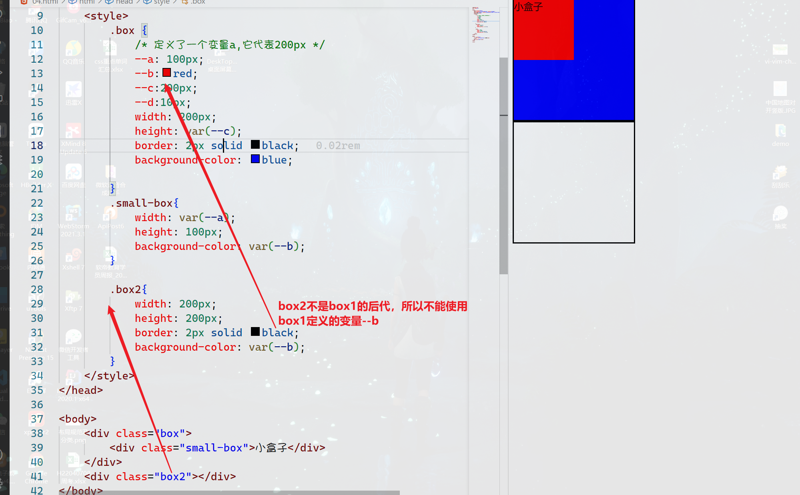

## CSS的变量及运算符

### CSS变量的使用

在讲这节课之前，我们先讲一个东西：变量。什么是变量，变量就是一个标识符，可以代替任何具体的值



在上面的代码里面，它就一个定义变量和使用变量的过程

1. 定义变量

   ```css
   --变量名:变量值;
   --a:100px;
   --b:red;
   ```

2. 使用变量

   ```css
   width:var(--a);  /*使用变量值--a*/
   background-color:var(--b);   /*使用变量值--b*/
   ```

```html
<style>
    .box {
        /* 定义了一个变量a,它代表200px */
        --a: 100px;
        --b:red;
         --c:200px;
        width: 200px;
        height: var(--c);
        border: 2px solid black;
        background-color: blue;
    }
    .small-box{
        width: var(--a);
        height: 100px;
        background-color: var(--b);
    }
</style>
<body>
    <div class="box">
        <div class="small-box">小盒子</div>
    </div>
</body>
```

在上面的代码里面，我们可以看到，自己定义的变量，**自己是可以使用的，同是我的后代元素也是可以使用的**，超过个范围别人就不能用了



**思考：如果定义一个全局的变量？**

```css
 html{
     --bgg:yellow;
     --xxx:green;
}
:root{
    --bgg:yellow;
     --xxx:green;
}
```

因为`html`是网页的根标签，所以我们可以在这里定义全局变量，同时`:root`的伪类就是`html`标签，我们也可以通过它来定义

### CSS运算符

在CSS里面，我们可以进行简单的运算

```css
width:calc(100px + 200px);
width:calc(100px - 50px);
width:calc(100px / 2);
width:calc(100px * 2 - 30px)
```

> 1. 符号的左右必须有一个空格
> 2. 它遵守的就是四则混合运算

```css
:root{
    --safeWidth:1400px;
}

.container {
    /*使用变量*/
    width: var(--safeWidth);
    outline: 5px solid black;
    margin: auto;
}
.right{
    outline: 2px solid red;
    float: right;
    /* width: 686px; */
    /*运算符，变量结合起来使用*/
    width: calc(var(--safeWidth) - 714px);
}
```

