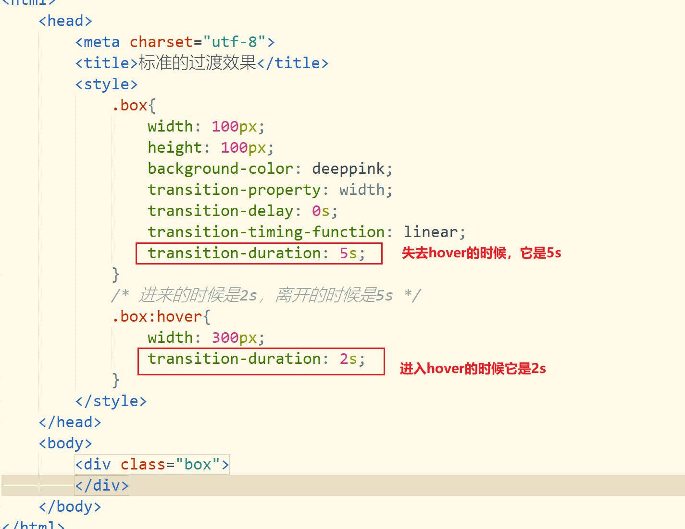

## CSS3过渡

CSS过渡指的是元素从一个状态到另一个状态的转变过程，过渡使用的是CSS当中的`transition`这个属性，这个属性本身很简单，但是它需结合起来使用


在上面的代码里面，我们可以看到，当鼠标放在元素上面以后，元素会由红色变成蓝色，当鼠标松开以后，元素会由蓝色转变成红色，这个转变是一瞬间就完成的，那么，我们如果在这个转里面添加一个过程，这过程就叫过渡

```sequence
title:过渡的过程
.box->hover:第一个过程
note over .box,hover:在中间添加一个过程
hover-->.box:第二个过程
```

### 过渡的属性

1. `transition-property`要执行过渡的属性
2. `transition-duration`要执行过渡的时间，它可以以`s`秒为单位，也可以以`ms`毫秒为单位】
3. `transition-timing-function`过渡的效果，也叫过渡的时间函数【默认值是`ease`】
   * `linear`匀速
   * `ease-in`先慢后快，`ease`单词是轻松的意思，`in`是开始的意思
   * `ease-out`先快后慢,`out`代表结束的意思
   * `ease-in-out`前后都很慢 ，中间很快
   * 我们还可以在浏览器里面手动的编辑我们需要的效果，如`cubic-bezier(0.74, -1.06, 0.35, 2.34)`
4. `transition-delay`过渡等待【默认值0s】

上面的四个上属性是可以合起来一起写的

```css
transition-property: width;
transition-duration: 1s;
transition-timing-function: linear;
transition-delay: 3s;
```

下面的4个属性值可以简写成下面的方式

```css
transition: width 1s linear 3s;
```

> `transition`后面的四个属性值是可以更改位置的，如`transition: 1s 3s linear  width ;`
>
> 但是一定要注意，在属性值里面有2个时间，第一个时间代表过渡持续的时间，第二个时间代表等待时间

### 多个属性的过渡

在上面学习属性的时候，我们已可以设置一个属性的过渡，如果有多个属性值发生变化以后也需要过渡，那怎么办呢？

```html
 <style>
     .box {
         width: 100px;
         height: 100px;
         background-color: deeppink;
         /*执行过渡*/
         transition-property: width,height;
         /*transition-duration: 2s,0.5s;*/
         transition-duration: 2s;
         transition-timing-function: linear,ease-in;
         transition-delay: 4s,0s;
     }

     .box:hover {
         width: 400px;
         height: 200px;
     }
</style>
<div class="box">
    盒子
</div>
```

在上面的属性里面，我们可以看到，如果多个属性需要过渡，我们也是可以的

同样多个属性的过渡也是可以简写成一个`transition`

```css
transition: width 2s linear 4s,height 0.5s;
```

### 全属性的过渡

当所有变化的属性都需要过渡的时候 ，我们可以使用`all`来代替

```css
transition-property: all;    /*这里就使用了all来代替所有变化的属性*/
transition-duration: 4s;
transition-timing-function: linear;
transition-delay: 2s;
```

综合成一个属性

```css
transition:all 4s linear 2s;
```

### 不对称的过渡效果

请看下面代码 

```html
<style>
    .box{
        width: 100px;
        height: 100px;
        background-color: deeppink;
        transition-property: width;
        transition-duration: 2s;
        transition-delay: 0s;
        transition-timing-function: linear;
    }
    .box:hover{
        width: 300px;
    }
</style>
<body>
    <div class="box">
    </div>
</body>
```

我们可以看到，当鼠标进入触发`hover`效果或鼠标离开失去`hover`效果，它的效果是一样的，但是我们现在希望改变一下

如：鼠标进去`hover`的时候过渡时长为`2s`，鼠标离开失去`hover`效果的时候，过渡时长为`5s`怎么处理呢



像上面这种情况，就称之为不对称的过渡，它的进入效果和离开效果是不一样的

### 不能过渡的属性

在CSS3的过渡里面，并不是所有的属性都可以过过渡

1. `float`
2. `display`
3. `visibility`
4. `overflow`
5. `position`
6. `z-index`
7. `font-family`
8. `text-align/text-align-last`
9. `cursor`

同时`auto`的属性值也是不可以实现过渡效果的

### 兼容性处理

过渡是一个CSS3的属性，它在旧版本的浏览器里面是需要注意它兼容性


对于低版本的浏览器，我们需要添加特定的前缀

1. 以谷歌为核心的浏览器，我们要添加`-webkit-`
2. 以IE为核心的浏览器则要添加`-ms-`
3. 火狐浏览器则是使用`-moz-`
4. 欧朋浏览器使用`-o-`

### 案例

1. 根据效果图完成如下效果

   |                            变化前                            |                            变化后                            |
   | :----------------------------------------------------------: | :----------------------------------------------------------: |
   |  |  |

   ```html
   <!DOCTYPE html>
   <html>
   	<head>
   		<meta charset="utf-8">
   		<title>过渡的案例</title>
   		<style>
   			.switch-button {
   				--h: 40px;
   				width: 80px;
   				height: var(--h);
   				display: block;
   				border-radius: calc(var(--h) / 2);
   			}
   			
   			.switch-button>input{
   				display: none;
   			}
   			.switch-inner-box {
   				width: 100%;
   				height: 100%;
   				background-color: #f5f5f5;
   				border-radius: inherit;
   				/* 过渡 */
   				transition: all 0.3s linear;
   			}
   			.switch-button>input:checked+.switch-inner-box {
   				background-color: #7dc9fd;
   			}
   			/* 小圆 */
   			.switch-button .circle {
   				width: var(--h);
   				height: var(--h);
   				background-color: #ffffff;
   				border-radius: 50%;
   				transition: inherit;
   				/* 把边框设置在小球上面 */
   				border: 5px solid #f5f5f5;
   				box-sizing: border-box;
   			}
   			.switch-button>input:checked+.switch-inner-box>.circle{
   				margin-left: 40px;
   				background-color: #bee3fd;
   				/* 在切换过来以后，把边框的颜色变掉 */
   				border: 5px solid #7ec9fd;
   			}
   		</style>
   	</head>
   	<body>
   		<!-- checkbox -->
   		<label class="switch-button">
   			<input type="checkbox">
   			<div class="switch-inner-box">
   				<div class="circle"></div>
   			</div>
   		</label>
   	</body>
   </html>
   <!-- 
   	总结：
   	1.checked的伪类实现状态的切换
   	2.使用了CSS的变量及CSS的计算
   	3.使用了inherit来主动继承外部的样式
   	4.使用了display来切换元素类型 
   	5.使用了过渡，让效果变得更加的简单
    -->
   ```

2. 要据效果图完成案例

   

   ```html
   <!DOCTYPE html>
   <html lang="zh">
   	<head>
   		<meta charset="UTF-8">
   		<title>选项卡案例</title>
   		<style>
   			.clearfix::after {
   				content: "";
   				display: block;
   				clear: both;
   			}
   			.box{
   				width: 600px;
   				/* 溢出隐藏 */
   				overflow: hidden;
   			}
   			.label-box {
   			}
   			.label-box>label {
   				display: block;
   				width: 130px;
   				height: 50px;
   				border: 2px solid black;
   				text-align: center;
   				line-height: 50px;
   				float: left;
   				margin-right: 20px;
   			}
   			.tab-list{
   				height: 400px;
   				width: calc(600px * 3);
   				/* 过渡 */
   				transition: all 0.5s linear;
   			}
   			.tab-item{
   				width: 600px;
   				height: 100%;
   				float: left;
   			}
   			.tab-item:nth-child(1){
   				background-color: red;
   			}
   			.tab-item:nth-child(2){
   				background-color: blue;
   			}
   			.tab-item:nth-child(3){
   				background-color: lightblue;
   			}
   			#a1:checked~.tab-list{
   				margin-left: 0;
   			}
   			#a2:checked~.tab-list{
   				margin-left: -600px;
   			}
   			#a3:checked~.tab-list{
   				margin-left: -1200px;
   			}
   			.box>input{
   				display: none;
   			}
   		</style>
   	</head>
   	<body>
   		<div class="box">
   			<!-- 三个label标签 -->
   			<div class="label-box clearfix">
   				<label for="a1">选项一</label>
   				<label for="a2">选项二</label>
   				<label for="a3">选项三</label>
   			</div>
   			<input type="radio" name="aaa" id="a1">
   			<input type="radio" name="aaa" id="a2">
   			<input type="radio" name="aaa" id="a3">
   			<div class="tab-list clearfix">
   				<div class="tab-item">第一个选项卡</div>
   				<div class="tab-item">第二个选项卡</div>
   				<div class="tab-item">第三个选项卡</div>
   			</div>
   		</div>
   	</body>
   </html>
   <!-- 
   	总结：
   	1. 目前的状态切换可以有checked,target,hover,active,
   	   这里我们使用是checked，并且是单选
   	2. 合理的布局，选择器只是能哥哥找弟弟 ，
   	   所以input标签是要在切换元素的前面
   	3.添加过渡效果
   	4.要适合的使用新知识，如calc
    -->
   ```

   