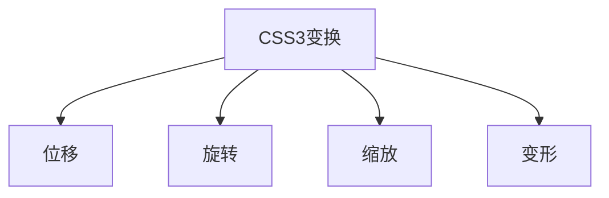
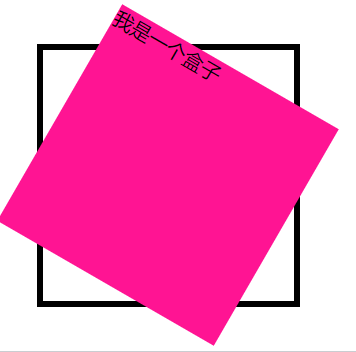
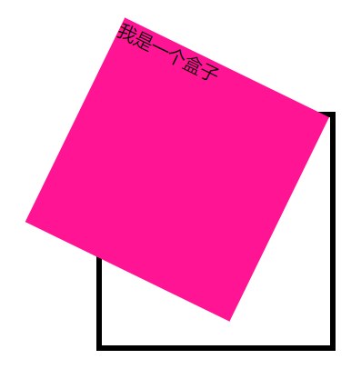
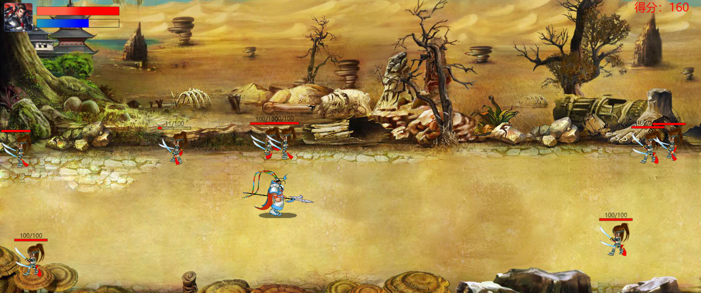
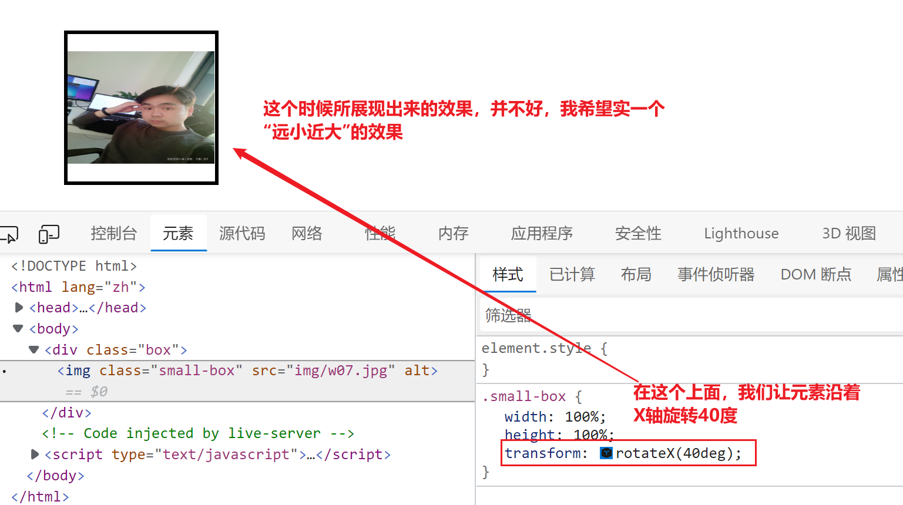
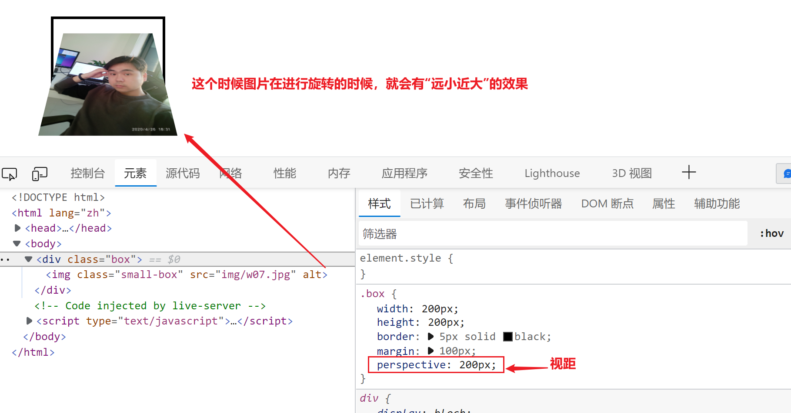

## CSS3变换

CSS3里面的变换指的是页面上面的元素发了生位置 ，角度，大小，形状的变化



它使用`transform`来做为属性名，主要就是上面四种情况下面的变化，同时也分为2D变换与3D变换

### 位移

位移指的是元素的X轴，Y轴或Z轴的位置发生了变化，它执行左负右正，上负下正的原来的位置在移动

1. `translateX(大小)`在水平方向发生位置移动
2. `translateY(大小)`在垂直方向发生位置移动
3. `translateZ(大小)`在Z轴方向上面移动【默认是不会有效果的，需要开启3D空间】
4. `translate(X轴大小,Y轴大小)`同时在X轴与Y轴方向移动，默认值是0
5. `translate3d(X轴,Y轴,Z轴)`,同时在三个轴上面移动，默认值是0【默认是没有效果的，需要开启3D空间】

`translate`的位置有移动有2个特点

1. 它与相对定位非常像，没有脱流，不占用新的位置，也不放弃旧的位置
2. 它位移的时候如果是以百分比位移的，则是以自身的百分比为参照来进行的【重要】

### 缩放

缩放指元素的大小像气球一样进行缩放，它也是有X轴，Y轴和Z轴的缩放

1. `scaleX(1)`在X轴发生缩放，默认值是1
2. `scaleY(1)`在Y轴发生缩放，默认值是1
3. `scaleZ(1)`在Z轴发生缩放，默认值是1【默认Z轴是没有效果的，需要开启3D空间】
4. `scale(X轴,Y轴)`同时在X轴与Y轴上面发生缩放，如果只有一个值，则第二个值与第一个值保持一致
5. `scale3d(X轴,Y轴,Z轴)`同时在3根轴上面进行缩放【默认Z轴是没有效果的，需要开启3D空间】

### 旋转

旋转指的是一个元素在X轴，Y轴或Z轴发生了角度的变化

1. `rotateX(0deg)`元素沿着X轴发生旋转
2. `rotateY(0deg)`元素沿着Y轴发生旋转
3. `rotateZ(0deg)`元素沿着Z轴发生旋转，顺时针为正数
4. `rotate(0deg)`元素沿着Z轴发生旋转
5. `rotate3d(X轴,Y轴,Z轴)`同时在3根轴上面旋转【没有开启3D的情况下是无效果】

:tipping_hand_man: **小技巧**：根据右手原则 ，右手握住轴的方向是正值

### 变形

1. `skewX(0deg)`在X轴发生倾斜
2. `skewY(-0deg)`在Y轴发生倾斜
3. `skew(X轴,Y轴)`同时在X轴与Y轴发生倾斜，默认值是0

------------

### 多个变换的结合

上面我们已经学过了4种变换情况，那么如果一个元素想进行多种变换，怎么办呢？

```css
transform:变换1 变换2 ...;
/* 元素，放大，再X轴移动100px,再Z轴旋转45deg */
transform: scale(1.5) translateX(100px) rotateZ(45deg);
```

**注意事项**

在进行旋转的时候 ，三根轴有可能会发生变化

```css
/* 这个元素在哪里 */
transform: rotateZ(90deg) translateX(200px);
```

在上面的代码里面，因为先进行了Z轴的旋转90deg,所以X轴的方向发生了变化，这个时候它是向下移动的

### 变换的其它属性

变换的使用的属性`transform`，它除了这个属性以后还有其它的属性

#### 设置变换的起点位置 

我们在进行变换的时候，默认都会有一个变换的起点位置，如下代码所示

```css
width: 100%;
height: 100%;
background-color: deeppink;
transform: rotateZ(30deg);
```



这个时候我们可以看到，Z轴旋转的时候，变换的默认的起点位置在中间，那么，我们能不能更改这个位置呢？

设置变换的起点我们需要通过`transform-origin`来完成，它后面跟1-2个属性值,默认值是`center`

```css
transform-origin: center center;
```

第一个属性值代表X轴的变换起点位置，第二个属性值代表Y轴的变换起点位置

当上面的代码里面，我们把旋转的起点位置设置在右上角以后

```css
transform-origin:right top;
```




根据上面的代码 ，我们可以看到，它的属性值可以是`left/right/top/bottom/center`来表示，还可以是具体的像素值来表示，如下所示

```css
transform-origin:0px 100px;
trasnform-origin:0px center;
transform-origin 100px top;
```

#### backface-visibility属性

这个属性是用于设置当元素如果发生变换以后，背对用户的时候是否可见，默认是可见的，它有2个属性值

1. `visible`背对用户时可见【默认值】
2. `hidden`背对用户时不可见

### 【重点】形成的3D变换的条件

针对3D的场景我们一定要弄清楚，有真3D和假3D的区别，如下图所示



在上面的图片里面，它看起来像个3D，其实是一个假3D，也叫平面3D


而在上面的场景里面，我们看到的就是真3D效果

#### 形成平面3D【视距，景深】

平面3D就是看起来有3D的效果，但是本身还是没有形成Z轴，在专业的说话里面叫视距，也景深

**视距**：人物的视角看某一个东西的距离叫视距，视距有一个特点，它是近的东西看起来大一些，远处的东西看起来小一些





> 形成平面3D效果的基本条件就是在变换元素的外层添加`perspective`