## CSS3渐变

渐变指的是元素的背景进行颜色渐变，它使用`background-image`。渐变的形式可以分为三种渐变

1. 线性渐变
2. 径向渐变
3. 圆锥渐变

### 线性渐变

线性渐变指元素沿着一个角度或方向发生颜色变化，线性渐变使用`linear-gradient`来完成，它的语法格式如下

```css
backbround-image:linear-gradient(to 方向,颜色1 [开始位置] [结束位置],颜色2 [开始位置] [结束位置]...);
```

#### 线性渐变的方向 

```css
 .box1{
     background-image: linear-gradient(to right,red,blue);
}
.box2{
    background-image: linear-gradient(to left,red,blue);
}
.box3{
    background-image: linear-gradient(to top,red,blue);
}
.box4{
    background-image: linear-gradient(to bottom,red,blue);
}
.box5{
    background-image: linear-gradient(to right top,red,blue);
}
```

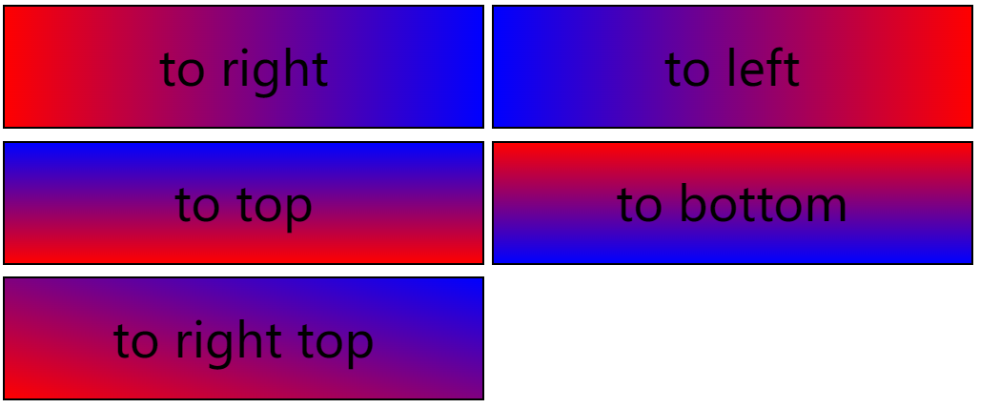

**总结**：在上面的代码里面，我们可以看到，它的方向是可以通过`left/right/top/bottom`来结合而成的

#### 线性渐变的角度

渐变除了通过方向来渐变以外，还可以通过角度来实现渐变

```css
.box1 {
    background-image: linear-gradient(90deg,red,blue);
}
.box2{
    background-image: linear-gradient(180deg,red,blue);
}
.box3{
    background-image: linear-gradient(270deg,red,blue);
}
.box4{
    background-image: linear-gradient(360deg,red,blue);
}
.box5{
    background-image: linear-gradient(45deg,red,blue);
}
```

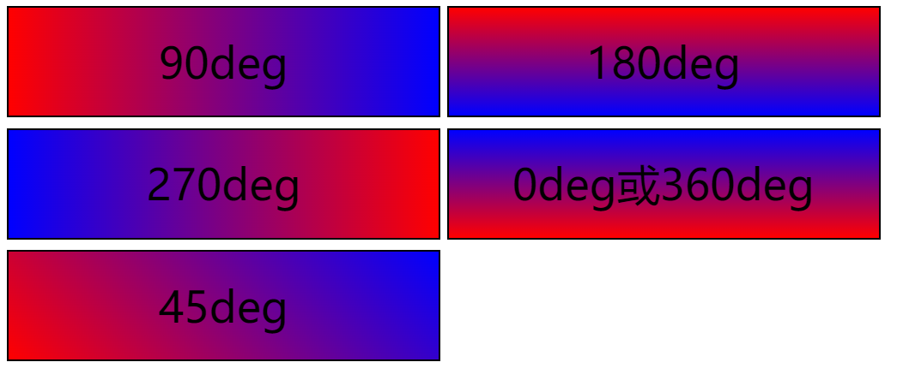

**总结**：正上方就是0度，然后顺时针绕一圈是360度。度角的渐变比方向的渐变更加灵活

> 注意事项：在线性渐变里面，有一种兼容性的写法是加`-webkit-`的写法
>
> ```css
> background-image: -webkit-linear-gradient(right,red,blue);
> ```
>
> 在兼容性写法里面，它的位置是开始位置，不是结束位置，并且没有`to`

#### 线性渐变的位置

```css
.box1{
    /*使用百分比做为开始与结束位置*/
    background:linear-gradient(to right,red 0 50% ,blue 50% 100%);
}
.box2{
    /*使用具体的像素值做为开始与结束位置*/
    background: linear-gradient(to right,red 0px 200px,blue 200px 400px);
}
.box3{
    /*第一个颜色开始值可以省略，省略以后是0*/
    background-image: linear-gradient(to right,red 200px,blue 200px);
    /*最后一个颜色结束值可以省略，省略以后就是100%*/
}
```

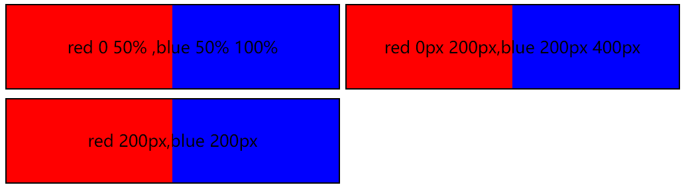

在上面的代码里面，我们分别对颜色值进行了开始与结束位置的设置，但面的设置有一个特点，后一个颜色的开始位置就是前面一个颜色结束，这样会造成2个颜色的变化非常明显

在进行颜色的位置设置的时候，**如果后面一个颜色的开始位置与前面一个颜色的结束位置之间还有空间，则这个空间就使用两种颜色进行渐变**

```css
.box1{
    background:linear-gradient(to right,red 0 200px ,blue 200px 400px);
}
.box2{
    background-image: linear-gradient(to right,red 0 200px,blue 300px 400px);
}
```

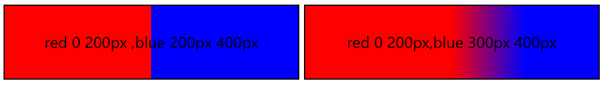

### 重复线性渐变

当在进行渐变色的设置的时候，如果一个渐变色不能铺满怎么元素，则剩下的部分将会用最后一个颜色进行填充

```css
.box1{
    /*盒子的总宽度是400px,但是我们只设置到了200px的位置*/
    background: linear-gradient(to right,red 0px 100px,blue 100px 200px);
}
```

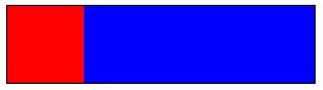

**现在请看下面的效果**

```css
.box1{
    background: linear-gradient(to right,red 0px 100px,blue 100px 200px);
}
.box2{
    background: repeating-linear-gradient(to right,red 0px 100px,blue 100px 200px);;
}
```

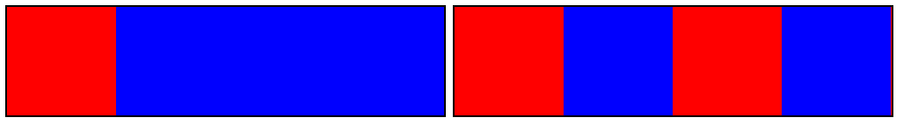

在第二个图里面，我们可以看到，当我们设置了`repeating-linear-gradient`以后，当渐变填充不满的时候，剩下的部分它会重复平铺进行

> **强调**：
>
> 因为渐变使用的是`background-image`，所以渐变应该算是一个背景图片，而背景图片应该是可以使用多次（多背景设置）

------

### 径向渐变

径向渐变指元素按照一定的半径发生变化，它使用`radial-gradient`来完成，它的语法格式如下

```css
background-image:radial-gradient([形状 at 横坐标 纵坐标],颜色1 [开始位置] [结束位置]...);
```

```css
.box1{
    background: radial-gradient(red,blue);
}
```

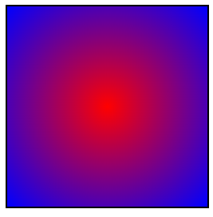

我们可以看到，颜色由内向外进行了渐变

#### 径向渐变的位置

径向渐变也是可以像线性渐变一样设置起始与结束位置的

```css
.box2{
    background:radial-gradient(red 0px 20px,blue 20px 100px);
}
.box3{
    background: radial-gradient(red 20px,blue 20px);
}
```

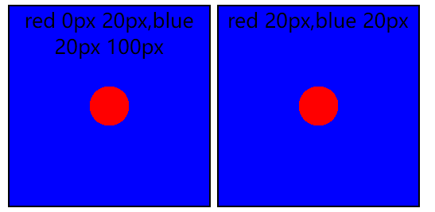

同时， 我们也知道，如果后一个颜色的开始位置与第一个颜色的结束位置相同，则颜色会变得非常清淅，如果后一个颜色开始位置与前一个颜色的结束位置存在空间，则会进行渐变。如下所示

```css
.box2{
    background:radial-gradient(red 0px 20px,blue 20px 100px);
}
.box3{
    background: radial-gradient(red 0px 20px,blue 50px 100px);
}
```

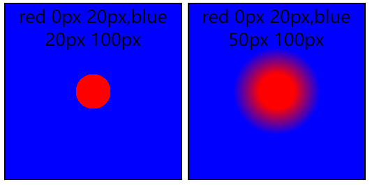

#### 径向渐变圆心位置

默认情况下，径向渐变都是从正中心开始的，它的圆心在正中心，我们其实是可以设置这个圆心的位置的，如下所示

```css
.box1 {
    background: radial-gradient(circle at 100px 100px,red,blue);
}
.box2{
    background: radial-gradient(circle at 50px 20px,red,blue);
}
```

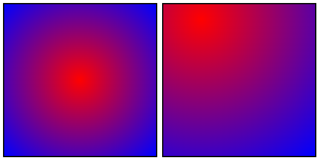

> 如果不设置圆心，则默认在正中间

#### 径向渐变的形状

```css
.box1 {
     background: radial-gradient(circle, red, blue);
}
.box2{
    background: radial-gradient(ellipse,red,blue);
}
```

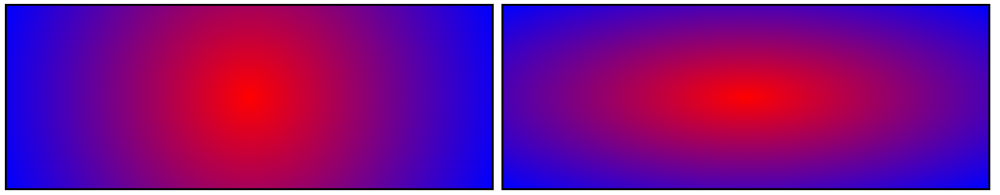

### 重复径向渐变

它与重复渐线渐变是一样的，当渐变颜色填充不满元素的时候，我们就需要使用这个东西

```css
.box1{
    background: radial-gradient(red 0px 15px,blue 15px 30px);
}
.box2{
    background-image: repeating-radial-gradient(red 0px 15px,blue 15px 30px);
}
```


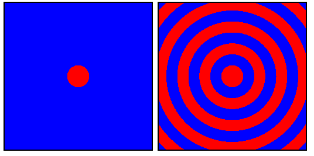

-----

### 圆锥渐变

圆锥渐变指的是颜色沿着一定的角度旋转去发生渐变，它使用`conic-gradient`，它的语法格式如下

```css
background:conic-gradient(颜色1 [开始位置] [结束位置],...);
```

> 这里的开始位置与结束位置的设置跟之前所讲过了线性渐变及径向渐变都是一样的，所以在这里就不再赘述

```css
.box1{
     background: conic-gradient(red,blue,yellow);
}
.box2{
    background: conic-gradient(red 0% 30%,blue 30% 60%,yellow 60% 100%);
}
.box3{
    background: conic-gradient(red 0deg 80deg,blue 80deg 170deg,yellow 170deg 360deg);
}
.box4{
    background: conic-gradient(red 0deg 120deg,blue 120deg 220deg,yellow 220deg 360deg);
    border-radius: 50%;
}
```

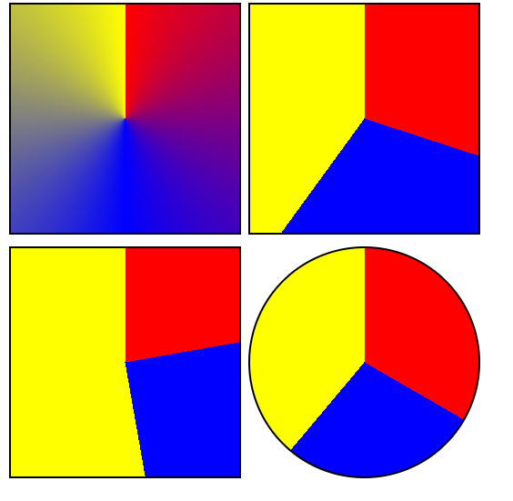

> 圆锥渐变它的起始位置与结束位置可以设置百分比，也可以设置角度

**小技巧**：如果在圆锥渐变里面，它的开始的颜色和最后一个结束的颜色相同，则会实现无缝渐变

```css
.box1{
     background: conic-gradient(red,blue,yellow);
}
.box2{
    background: conic-gradient(red,blue,yellow,red);
}
```

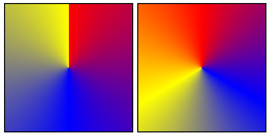

### 重复圆锥渐变

重复的圆锥渐变与之前的2个是一样的，属性是`repeating-conic-gradient`