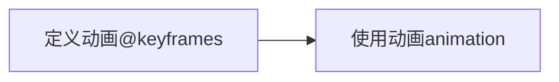

## CSS3动画

CSS3里面的动画与过渡非常相似，过渡有4个属性，而CSS3里面的动画有8个属性

CSS3里面的动画的学习是分2个阶段的



### CSS动画定义

定义CSS动画需要使用到CSS里面的命令`@keyframes`，它的语法格式如下

```css
@keyframes 动画名称{
    from{}
    to{}
}
```

> 上面的`from`代表动画的开始，`to`代表动画的结束

除了上面的`from/to`来定义开始与结束以外，我们还可以通过百分比的方式来进行

```css
@keyframes 动画名称{
    0%{}
    25%{}
    30%{}
    100%{}
}
```

> 在上面的定义方式里面，我们的`0%`相当于`from`，我们的`100%`相当于`to`，使用百分比定义的好处是可以在任意时刻定义状态，如`25%`,`30%`等

**注意**：并不是所有的动画都需要开始与结束的

```css
/*省略开始*/
@keyframes 动画名称{
    100%{}
}
/*省略结束*/
@keyframes 动画名称 {
    0%{}
    40%{}
}
/*即省略开始，也省略结束*/
@keyframes 动画名称{
    50%{}
    80%{}
}
```

### CSS动画的使用

当一个动画定义好了以后，其它的元素就可以调用这个动画。动画的调用主要是通过下面的8个属性来完成

1. `animation-name`动画的名称【必填】
2. `animation-duration`动画执行一次的时间【必填】
3. `animation-iteration-count`动画重复的次数【默认值是1】，如果希望动画一直重复执行，则可以通过设置`infinite`无穷大来实现
4. `animation-timing-function`动画执行的时间函数【默认值是`ease`】，如果希望动画匀速执行可以设置`linear`，这里面的属性值和`transition-timing-function`保持一致
5. `animation-delay`动画的等待时间【默认值为0】
6. `animation-direction`动画执行的方向，【默认值`normal`】
   * `normal`正常的
   * `reverse`逆向的
   * `alternate`正向与逆向交替运行
   * `alternate-reverse`逆向与正向交替运行
7. `animation-play-state`动画的播放状态
   * `running`运行状态【默认值】
   * `paused`暂停状态
8. `animation-fill-mode`动画在结束以后停留在什么状态
   * `backwards`回到开始状态
   * `forwards`停留在结束状态

上面的8个属性也可以结合成1个属性`animation`

```css
animation: 动画名称 动画时间 [次数] [时间函数] [等待时间] [方向] [播放状态] [结束状态];
```

上面的属性值是可以任意更改位置的，但是要注意，上面有珍个播放时间与等待时间，第一个时间是动画播放时间，第二个时间才是等待时间

### 多个动画的使用

之前在讲过渡的时候，我们一个元素可以执行多个属性的过渡，现在在动画里面，一个元素也可以同时使用多个动画，如下所示

```html
<!DOCTYPE html>
<html lang="zh">

<head>
    <meta charset="UTF-8">
    <meta http-equiv="X-UA-Compatible" content="IE=edge">
    <meta name="viewport" content="width=device-width, initial-scale=1.0">
    <title>多动画</title>
    <style>
        /* 第一个动画定义了小球的缩放 */
        @keyframes box-1 {
            0% {
                transform: scale(0.8);
            }

            50% {
                transform: scale(1.2);
            }

            100% {
                transform: scale(0.8);
            }
        }

        /* 第二个动画,定义小球的移动 */
        @keyframes box-2 {
            0% {
                margin-left: 0;
            }

            100% {
                margin-left: 500px;
            }
        }

        .box {
            width: 50px;
            height: 50px;
            background-color: deeppink;
            border-radius: 50%;
            /* 使用动画 */
            animation: box-1 1s infinite linear,
                       box-2 10s linear forwards;
        }
    </style>
</head>
<body>
    <div class="box"></div>
</body>
</html>
```

在上面的代码里面，我们可以看到定久了2个动画 ，同时这2个动画全部都使用在了`box`元素上面，这就说明一个元素是可以同时使用多组动画的

上面的属性值是连起来写的，也可以分开来写

```css
 animation-name: box-1,box-2;
animation-duration: 1s,10s;
animation-iteration-count: infinite,1;
animation-timing-function: linear;
animation-fill-mode: unset,forwards;
```

----

### CSS动画视觉差


### CSS帧动画

