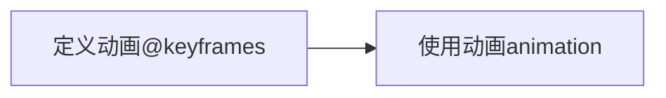
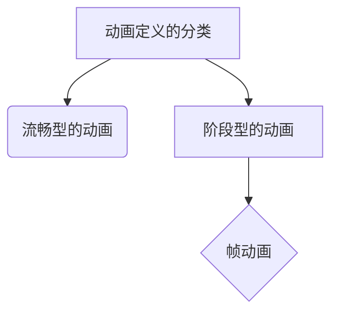
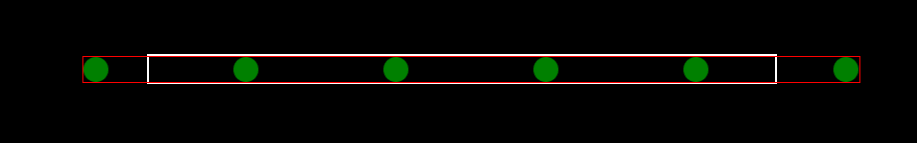
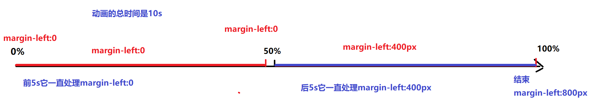
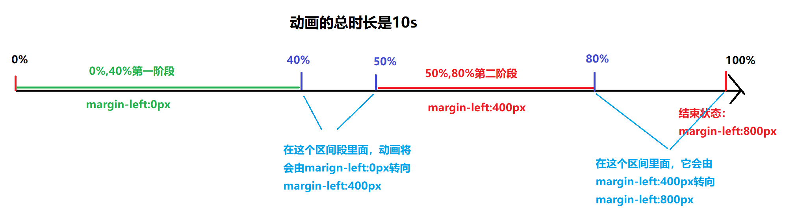
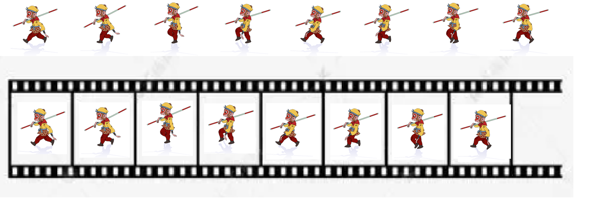

## CSS3动画

CSS3里面的动画与过渡非常相似，过渡有4个属性，而CSS3里面的动画有8个属性

CSS3里面的动画的学习是分2个阶段的



### CSS动画定义

动画从定义的结果或方式上面去划分可以分为下面几类




定义CSS动画需要使用到CSS里面的命令`@keyframes`，它的语法格式如下

```css
@keyframes 动画名称{
    from{}
    to{}
}
```

> 上面的`from`代表动画的开始，`to`代表动画的结束

除了上面的`from/to`来定义开始与结束以外，我们还可以通过百分比的方式来进行

```css
@keyframes 动画名称{
    0%{}
    25%{}
    30%{}
    100%{}
}
```

> 在上面的定义方式里面，我们的`0%`相当于`from`，我们的`100%`相当于`to`，使用百分比定义的好处是可以在任意时刻定义状态，如`25%`,`30%`等

**注意**：并不是所有的动画都需要开始与结束的

```css
/*省略开始*/
@keyframes 动画名称{
    100%{}
}
/*省略结束*/
@keyframes 动画名称 {
    0%{}
    40%{}
}
/*即省略开始，也省略结束*/
@keyframes 动画名称{
    50%{}
    80%{}
}
```

### CSS动画的使用

当一个动画定义好了以后，其它的元素就可以调用这个动画。动画的调用主要是通过下面的8个属性来完成

1. `animation-name`动画的名称【必填】
2. `animation-duration`动画执行一次的时间【必填】
3. `animation-iteration-count`动画重复的次数【默认值是1】，如果希望动画一直重复执行，则可以通过设置`infinite`无穷大来实现
4. `animation-timing-function`动画执行的时间函数【默认值是`ease`】，如果希望动画匀速执行可以设置`linear`，这里面的属性值和`transition-timing-function`保持一致
5. `animation-delay`动画的等待时间【默认值为0】
6. `animation-direction`动画执行的方向，【默认值`normal`】
   * `normal`正常的
   * `reverse`逆向的
   * `alternate`正向与逆向交替运行
   * `alternate-reverse`逆向与正向交替运行
7. `animation-play-state`动画的播放状态
   * `running`运行状态【默认值】
   * `paused`暂停状态
8. `animation-fill-mode`动画在结束以后停留在什么状态
   * `backwards`回到开始状态
   * `forwards`停留在结束状态

上面的8个属性也可以结合成1个属性`animation`

```css
animation: 动画名称 动画时间 [次数] [时间函数] [等待时间] [方向] [播放状态] [结束状态];
```

上面的属性值是可以任意更改位置的，但是要注意，上面有珍个播放时间与等待时间，第一个时间是动画播放时间，第二个时间才是等待时间

### 多个动画的使用

之前在讲过渡的时候，我们一个元素可以执行多个属性的过渡，现在在动画里面，一个元素也可以同时使用多个动画，如下所示

```html
<!DOCTYPE html>
<html lang="zh">

<head>
    <meta charset="UTF-8">
    <meta http-equiv="X-UA-Compatible" content="IE=edge">
    <meta name="viewport" content="width=device-width, initial-scale=1.0">
    <title>多动画</title>
    <style>
        /* 第一个动画定义了小球的缩放 */
        @keyframes box-1 {
            0% {
                transform: scale(0.8);
            }

            50% {
                transform: scale(1.2);
            }

            100% {
                transform: scale(0.8);
            }
        }

        /* 第二个动画,定义小球的移动 */
        @keyframes box-2 {
            0% {
                margin-left: 0;
            }

            100% {
                margin-left: 500px;
            }
        }

        .box {
            width: 50px;
            height: 50px;
            background-color: deeppink;
            border-radius: 50%;
            /* 使用动画 */
            animation: box-1 1s infinite linear,
                       box-2 10s linear forwards;
        }
    </style>
</head>
<body>
    <div class="box"></div>
</body>
</html>
```

在上面的代码里面，我们可以看到定久了2个动画 ，同时这2个动画全部都使用在了`box`元素上面，这就说明一个元素是可以同时使用多组动画的

上面的属性值是连起来写的，也可以分开来写

```css
 animation-name: box-1,box-2;
animation-duration: 1s,10s;
animation-iteration-count: infinite,1;
animation-timing-function: linear;
animation-fill-mode: unset,forwards;
```

----

### CSS动画视觉差

视觉差这个词叫视觉欺骗，它是通过一个种特殊的技术来让人产生一种视觉错误解



在上面的图片里面，它就是一个视觉欺骗，给我们的感觉就是后面的豆子是无穷无尽的

```html
<!DOCTYPE html>
<html lang="zh">

<head>
    <meta charset="UTF-8">
    <meta http-equiv="X-UA-Compatible" content="IE=edge">
    <meta name="viewport" content="width=device-width, initial-scale=1.0">
    <title>动画的视觉差</title>
    <style>
        * {
            margin: 0;
            padding: 0;
            list-style-type: none;
        }

        body {
            background-color: #000000;
        }

        .outer-box {
            border: 5px solid #ff0000;
            width: calc(30px * 4 + 100px * 3);
            margin: 150px;
            overflow: hidden;
            
        }
        /* 动画的定位 */
        @keyframes bean-ani {
            0% {
                margin-left: 0;
            }
            100% {
                margin-left: -130px;
            }
        }
        .bean-list {
            border: 2px solid #ffffff;
            /* BFC */
            display: flow-root;
            width: calc(30px * 5 + 100px * 4);
            animation: bean-ani 3s linear infinite; 
        }
        .bean-list>li {
            width: 30px;
            height: 30px;
            background-color: #ffffff;
            border-radius: 50%;
            float: left;
        }
        .bean-list>li+li {
            margin-left: 100px;
        }
    </style>
</head>
<body>
    <div class="outer-box">
        <ul class="bean-list">
            <li></li>
            <li></li>
            <li></li>
            <li></li>
            <li></li>
        </ul>
    </div>
</body>
</html>
```

### 阶段型动画

阶段型动画并不是一种新的动画，它只是一种特殊的动画的定义方式 

```html
<!DOCTYPE html>
<html lang="zh">

<head>
    <meta charset="UTF-8">
    <meta http-equiv="X-UA-Compatible" content="IE=edge">
    <meta name="viewport" content="width=device-width, initial-scale=1.0">
    <title>阶段型动画</title>
    <style>
        .div1 {
            width: 100px;
            height: 100px;
            background-color: deeppink;
            animation: ani1 10s linear forwards; 
        }

        @keyframes ani1 {
            0% {
                margin-left: 0;
            }
            49.9%{
                margin-left: 0;
            }
            50%{
                margin-left: 400px;
            }
            99.9%{
                margin-left: 400px;
            }
            100%{
                margin-left: 800px;
            }
        }
    </style>
</head>

<body>
    <div class="div1"></div>
</body>

</html>
```

在上面的动画定义方式里面，我们就可以把它认为是一种阶段型的动画




上面的动画定义方式可以直接简写成如下的定义方式

```css
@keyframes ani1 {
    0%,49.9% {
        margin-left: 0;
    }
    50%,99.9%{
        margin-left: 400px;
    }
    100%{
        margin-left: 800px;
    }
}
```

阶段型动画的定义在不同的阶段里面，我们也可以执行相应的过渡

```css
@keyframes ani1 {
    0%,40% {
        margin-left: 0;
    }
    50%,80%{
        margin-left: 400px;
    }
    100%{
        margin-left: 800px;
    }
}
```




上面的代码就是复用阶段型动画及视觉差来实现的一个循环的滚动的轮播图

```html
<!DOCTYPE html>
<html lang="zh">
<head>
    <meta charset="UTF-8">
    <meta http-equiv="X-UA-Compatible" content="IE=edge">
    <meta name="viewport" content="width=device-width, initial-scale=1.0">
    <title>阶段型动画</title>
    <style>
        .outer-box {
            border: 5px solid red;
            width: 639px;
            overflow: hidden;
        }

        .img-box {
            height: 426px;
            width: calc(639px * 5);
            /* BFC */
            display: flow-root;
            animation: ani1 10s linear infinite;
        }
        .img-box>img {
            float: left;
        }
        @keyframes ani1{
            0%,20%{
                transform: translateX(0);
            }
            25.1%,45%{
                transform: translateX(calc(639px * -1));
            }
            50.1%,70%{
                transform: translateX(calc(639px * -2));
            }
            75.1%,95%{
                transform: translateX(calc(639px * -3));
            }
            100%{
                transform: translateX(calc(639px * -4));
            }
        }
    </style>
</head>
<body>
    <div class="outer-box">
        <div class="img-box">
            
            
            
            
            
        </div>
    </div>
</body>
</html>
```

----

### CSS帧动画

我们把特殊的阶段型动画叫帧动画


上面的图叫精灵图，我们可以把图片上面的每一个小图片放在一个类似于胶片的格子里面，如下所示



里面的每一个小图片，我们就可以认为是每一帧，而一帧也可以看是每一个阶段

```html
<!DOCTYPE html>
<html lang="zh">
<head>
    <meta charset="UTF-8">
    <meta http-equiv="X-UA-Compatible" content="IE=edge">
    <meta name="viewport" content="width=device-width, initial-scale=1.0">
    <title>帧动画</title>
    <style>
        .monkey-sun{
            width: 200px;
            height: 180px;
            border: 2px solid black;
            background-image: url("img/1.png");
            animation: monkey-sun-ani 1s linear infinite;
        }
        
        @keyframes monkey-sun-ani{
            0%,12.5%{
                background-position-x: calc(200px * 0);
            }
            12.6%,25%{
                background-position-x: calc(200px * -1);
            }
            25.1%,37.5%{
                background-position-x: calc(200px * -2);
            }
            37.6%,50%{
                background-position-x: calc(200px * -3);
            }
            50.1%,62.5%{
                background-position-x: calc(200px * -4);
            }
            62.6%,75%{
                background-position-x: calc(200px * -5);
            }
            75.1%,87.5%{
                background-position-x: calc(200px * -6);
            }
            87.6%,100%{
                background-position-x: calc(200px * -7);
            }
        }
    </style>
</head>
<body>
    <div class="monkey-sun">
        
    </div>
</body>
</html>
```

在上面的代码里面，我们使用的特殊的阶段型动画来完面上面的操作，让人物行走起来了

从上面的代码当中我们可以得到一个点，只要阶段型的动画分配合理，我们可以实现这一种一帧一帧播放的效果，但是问题就在于如果精灵图过多或者阶段过多，动画的定义就会变得非常复杂，<u>所以CSS3里面推出专门用于帧动画的属性值</u>

```html
<!DOCTYPE html>
<html lang="zh">
<head>
    <meta charset="UTF-8">
    <meta http-equiv="X-UA-Compatible" content="IE=edge">
    <meta name="viewport" content="width=device-width, initial-scale=1.0">
    <title>真正的帧动画</title>
    <style>
        .box{
            width: 200px;
            height: 180px;
            border: 1px solid black;
            background-image: url("img/1.png");
            animation: box-ani 1s steps(8) infinite;
            
        }
        @keyframes box-ani{
            0%{
                background-position-x: 0;
            }
            100%{
                background-position-x: -1600px;
            }
        }
    </style>
</head>
<body>
    <div class="box"></div>
</body>
</html>
```

在上面的代码里面，我们使用了`steps(8)`来将动画自动的切换成了8帧运行
