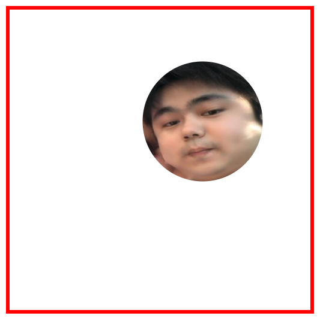

## 多列布局

多列布局是一种特殊的布局形式，它是CSS3里面新增的几个属性，使用起来非常简单

1. `column-count`用于设置列的数量
2. `column-gap`列与列之间的间距
3. `column-rule-style`列与列之间线条的类型【它的类型与边框线条的类型相同】
4. `column-rule-color`列与列之间线条的颜色
5. `column-rule-width`列与列之间线条的宽度
6. `column-rule`是上面3个属性的结合，相当于边框的3个属性
7. `column-span`让某一个元素横跨多少列，它只有`1/all`两个属性值
8. `column-width`每一列的最佳列宽度，它会自动帮我们生成列数


多列形成的照片瀑布流

## 裁剪样式

裁剪指的是像剪刀一样去把一个元素的四周的四角进行裁剪，它的CSS属性是`clip-path`

### 矩形裁剪 

矩形裁剪使用的是`inset`,它的**语法格式**如下

```css
clip-path:inset(上边 右边 下边 左边);
/*还可以在裁剪的时候设置圆角*/
clip-path:inset(上边 右边 下边 左边 round 圆角);
```

### 圆形裁剪

圆形裁剪使用的是`circle`,它的**语法格式**如下

```css
clip-path:circle(半径 at 圆心横坐标 圆心纵坐标);
```


对于上面的效果，我们现在已经可以通过三种方式来实现了

```css
/*第一种：圆形裁剪*/
clip-path: circle(200px at 200px 200px); 
/*第二种：圆角边框*/
border-radius: 50%;
/*第三种：矩形裁剪使用round*/
clip-path: inset(0 0 0 0 round 200px);
```

虽然说我们已经有很多种方式去显示一个圆，但是如果想实现下面的效果，则只能使用圆形裁剪



```css
clip-path: circle(80px at 257px 149px);
```

### 椭圆裁剪

椭圆裁剪使用的是`ellipse`，它的**语法格式**如下

```css
clip-path:ellipse(横轴半径 纵轴半径 at 横坐标 纵坐标);
clip-path: ellipse(70px 100px at 110px 124px);
/*当横轴半径 与 纵轴半径相同时，它又会变成一个圆*/
clip-path: ellipse(100px 100px at 100px 100px);
```


### 多边形裁剪

多边形裁剪使用的是`polygon`，它的**语法格式**如下

```css
clip-path:polygon(x1 y1,x2 y2...);
clip-path: polygon(100px 0,0 300px,300px 300px,200px 0);
```

> 这里要注意，它的点与点之前是用逗号隔开的

### 裁剪的注意事项

1. 裁剪并不会改变元素自身的大小，只是显示效果变了
2. 裁剪是从盒子模型的`border`开始的
3. 使用裁剪属性以后不会有`outline`的效果，也不会有外阴影的效果

## CSS补充点

### img内容的显示方式

在img图片手动的去调整大小以后，图片的宽高比可能就会失效，这个时候图片就会变形，我们可以通过`object-fit`来调整图片的内容的显示方式

1.  ` object-fit:cover`覆盖
2. `object-fit:contain`包含
3. `object-fit:fill`填充【默认值，它会拉伸图片填充设定的宽度与高度】


上面的图片就分别是`cover,contain,fill`的情况

还有一个属性是`object-position`用于调整图片内容的位置

### 元素的宽高比

在设置元素的时候，我们经常要对元素的宽度与高度做比例处理，这个时候可以使用`aspect-ratio`来完成‘

```css
 .div2{
     background-color: blue;
     /* 无论宽度怎么变,高度必须是宽度的2倍,怎么办 */
     /* 外观比例,也叫宽高比 */
     aspect-ratio: 1/2;
     height: 200px;
}
```

### link与@import的区别

```html
<link rel="stylesheet" href="css/a.css" type="text/css">
<style>
    @import url("css/b.css");
</style>
```

我们如果要引入CSS的样式，我们既可以使用`link`标签也可以使用`@import`的命令

**区别1**：`link`是标签，它是在HTML里面用的，它不仅可以连接一个CSS文件 ，还可以链接其它的东西，如图标；而`@import`它是一个CSS的命令，它只能在CSS里面使用，并且只能导入CSS的文件

```css
 <link rel="shortcut icon" href="./aaa.png">
```

**区别2**：`@import`是CSS的命令，所以可以从一个CSS文件里面导入另一个CSS文件

```css
/*a.css文件*/
@import url("b.css");
@import url("c.css");

/*后面再继续写CSS代码*/
```

> 在没有学习`webpack`或其它的类似的构建工具之前，请先不要使用

**区别3**：它们的加载顺序是有区别的

```html
<link rel="stylesheet" href="css/a.css">
<style>
    @import url("css/b.css");
</style>
```

通过`link`连接的CSS是在页面加载的时候会同时加载样式，而`@import`命令导入的CSS是在页面完整加载完成以后才开始进行的，如果网速不好会造成页面空白或闪烁

### href与src的区别

`href`与`src`都是HTML标签里面的属性，也都是用于链接地址的，但是它的区别非常大

1. `href`的意思是去什么什么地方
2. `src`的意思是把什么什么东西拿过来【加载过来，后期在JS里面就会有一个加载事件onload】

```html
<a href="https://www.baidu.com/img/pc_27928619fedf2633952764032537980f.gif">图片</a>
<hr>

```


通过上面的现象，我们可以看到，`a`标签的`href`是去了某一个地方，而`img`标签的`src`则是把这个图片拿过来【加载过来】

```html
<!-- 这里会有一个链接，跳去标哥博客 -->
<a href="http://www.softeem.xin:8090">标哥博客</a>
<hr>
<!-- 把标哥博客拿过来 嵌入在我的网页里面 -->
<iframe src="http://www.softeem.xin:8090" style="width: 100%;height: 500px;"></iframe>
```

> 因为link标签使用的是`href`属性，所以在通过`link`都会导入CSS文件的时候，要注意CSS文件里面的路由，因为`href`是以被连接的那个文件的路径为主

