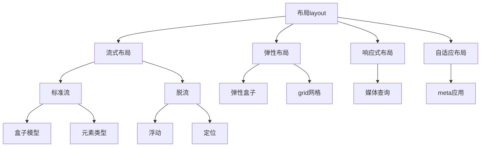
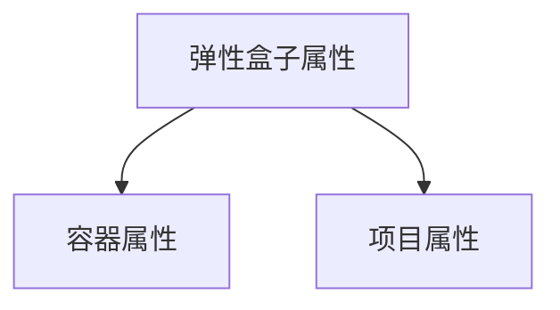
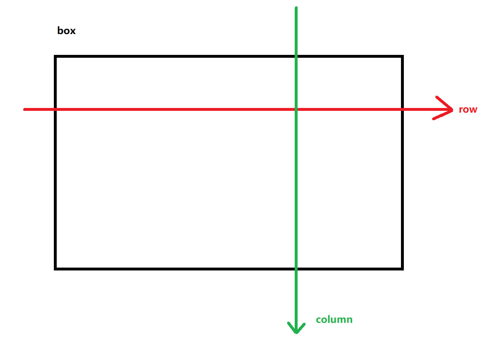
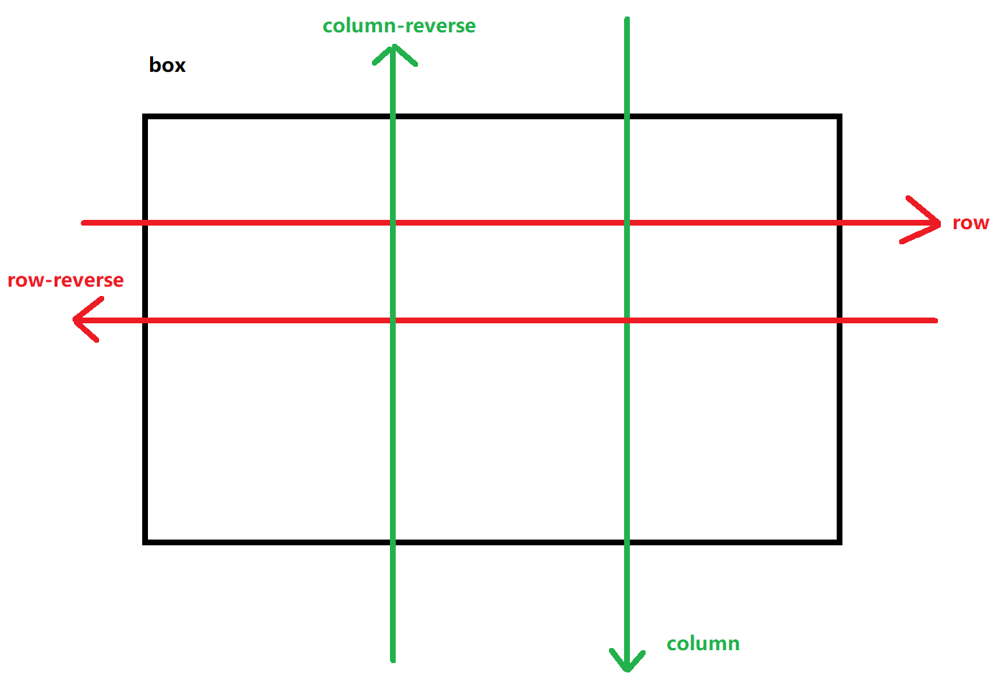
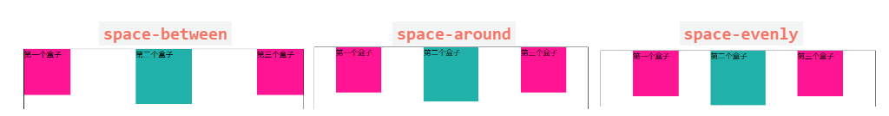
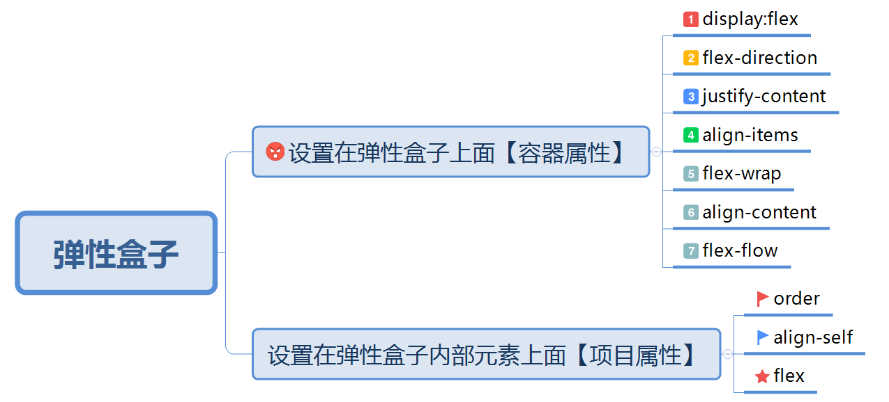
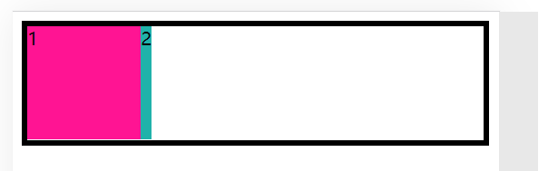
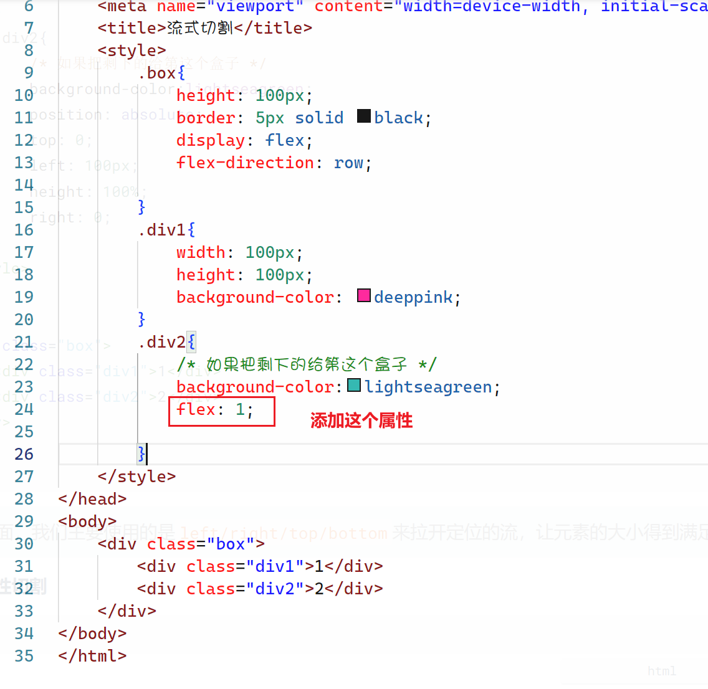
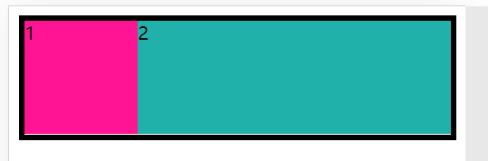

## 弹性盒子与弹性布局



之前我们在学习布局的时候已经学习了流式布局标准，流式布局主要是针对于PC端传统网页来进行布局的，它的兼容性非常之高，所以也是一种很普遍的布局方式 ，但是传统的流式布局对于初学者来说会非常麻烦，并且也不适用于目前比较流行的移动端布局，所以后期W3C推出一种新的布局标准叫弹性布局

弹性布局是一系列的技术集合，最主要的就是指弹性盒子及grid网格

### 弹性盒子

弹性盒子是实现弹性布局主要技术，来是由一整套CSS的属性来完成的，它的属性分为2大类



1. `display:flex`将一个元素变成弹性盒子，当一个元素变成弹性盒子以后，它的内部就会多出2根轴，分别是水平方向的轴叫`row`和垂直方向的轴叫`column`,并且在默认情况下会有一根轴叫主轴，默认的主轴是`row`

   

   从上面的图形里面我们可以看到`row`这个方向是主轴，弹性盒子里面的元素默认会沿着主轴排列，所以默认情况下，弹性盒子里面的元素会从左向右水平排列

2. `flex-direction`调整弹性的方向，也就是调整主轴的方向

   * `row`主轴水平方向【默认值】
   * `row-reverse`主轴水平反转
   * `column`主轴为竖着方向
   * `column-reverse`主轴竖着反转

   

   当一旦确定了主轴以后，另一个一根轴就叫副轴

3. `justify-content`设置元素在主轴上面的排列

   * `flex-start`在弹性开始的位置【默认值】
   * `flex-end`在弹性结束的位置
   * `center`居中
   * `space-between`使用空间隔开
   * `space-around`空间环绕
   * `space-evenly`空间均匀分配

   

4. `align-items`设置元素在副轴上面的排列

   * `flex-start`在弹性开始的位置
   * `flex-end`在弹性结束的位置
   * `center`居中
   * `baseline`基线对齐
   * `stretch`如果在副轴上面没有设置大小，则会拉伸【默认值】

5. `flex-wrap`用于设置是否可以在主轴方向换行

   默认情况下，弹性盒子的主轴是不允许换行的，这个时候就当内部元素的总大小大于盒子的大小的时候就会出现压缩，我们可以通过设置这个属性让盒子换行

   * `nowrap`不换行【默认值】
   * `wrap`换行
   * `wrap-reverse`换行以后再将副轴翻转

6. `align-content`在副轴上面调整主轴的位置【多主轴的设置】,它的属性值与`justify-content`保持一致

   * `flex-start`在弹性开始的位置【默认值】
   * `flex-end`在弹性结束的位置
   * `center`居中
   * `space-between`使用空间隔开
   * `space-around`空间环绕
   * `space-evenly`空间均匀分配

7. `flex-flow`这个属性就是`flex-direction`及`flex-wrap`这两个属性的结合

   ```css
   flex-direction: row;
   flex-wrap: wrap; 
   /*上面2行代码效果等同于下面的代码*/
   flex-flow: row wrap;
   ```

8. `order`用于设置弹性盒子内部元素在主轴的排列顺序，order的值越大，越靠近弹性结束的地方；order的值越小，越靠近弹性开始的地方

9. `align-self`单独设置某一个项目在副轴的排列，它与`align-items`的属性值保持一致

10. `flex`当前元素在弹性盒子容器里面占剩下空间的百分比




### 弹性盒子的特征

当一个元素变成弹性盒子以后，它及内部的元素会有哪些变化呢？

**对当前容器的影响**

1. 弹性盒子会形成BFC
2. 弹性盒子**默认**情况下主轴设置`overflow`是无效的，因为它会压缩内部元素的大小

**对容器内部元素的影响**

1. 主轴收缩，副轴拉伸（通俗的理解就是宽度丢失），但是仍然可以通过`width/height`去重新设置宽度与高度

2. 弹性盒子内部的元素全部都是`block`类型（无视元素类型）

3. 弹性盒子内部的元素是不允许使用`float`的，用了也没有效果

4. 弹性盒子内部的元素是可以使用`position`的，也可以通过`left/right/top/bottom`来设置位置

   当弹性布局与定位布局结合的时候，默认是听弹性布局的【因为定位是在当前位置直接脱流，不主动调整位置】，如果定位的元素使用了`left/right/top/bottom`则以定位为标准

5. 弹性盒子内部的元素可以通过`flex`属性来调整大小


----

### 弹性切割与流式切割

在之前讲解流式布局的时候，我们可以通过定位来对页面上面的元素空间进行切割，如三栏式布局等，现在我们来复习一下



现在上面的要求，盒子的总宽度是不固定的，左边的盒子1的宽度是`100px`，如何将剩下的空间给盒子2

**第一种思路 ：流式切割**

```html
<!DOCTYPE html>
<html lang="zh">
<head>
    <meta charset="UTF-8">
    <meta http-equiv="X-UA-Compatible" content="IE=edge">
    <meta name="viewport" content="width=device-width, initial-scale=1.0">
    <title>流式切割</title>
    <style>
        .box{
            height: 100px;
            border: 5px solid black;
            position: relative;
        }
        .div1{
            width: 100px;
            height: 100px;
            background-color: deeppink;
        }
        .div2{
            /* 如果把剩下的给第这个盒子 */
            background-color:lightseagreen;
            position: absolute;
            top: 0;
            left: 100px;
            height: 100%;
            right: 0;
        }
    </style>
</head>
<body>
    <div class="box">
        <div class="div1">1</div>
        <div class="div2">2</div>
    </div>
</body>
</html>
```

> 在定位切割里面，我们主要使用的是`left/right/top/bottom`来拉开定位的流，让元素的大小得到满足

**第二种思路：弹性切割**

```html
<!DOCTYPE html>
<html lang="zh">
<head>
    <meta charset="UTF-8">
    <meta http-equiv="X-UA-Compatible" content="IE=edge">
    <meta name="viewport" content="width=device-width, initial-scale=1.0">
    <title>流式切割</title>
    <style>
        .box{
            height: 100px;
            border: 5px solid black;
            display: flex;
            flex-direction: row;
           
        }
        .div1{
            width: 100px;
            height: 100px;
            background-color: deeppink;
        }
        .div2{
            /* 如果把剩下的给第这个盒子 */
            background-color:lightseagreen;
            flex: 1;
           
        }
    </style>
</head>
<body>
    <div class="box">
        <div class="div1">1</div>
        <div class="div2">2</div>
    </div>
</body>
</html>
```





## 扩展：如何形成全屏的盒子

形成全屏的盒子有多种方法，同时也要注意这个技术非常重要

**第一种方法：通过固定定位实现**

这一种方法是流式布局当中很常见的一种方法

```html
<!DOCTYPE html>
<html lang="zh">
<head>
    <meta charset="UTF-8">
    <meta http-equiv="X-UA-Compatible" content="IE=edge">
    <meta name="viewport" content="width=device-width, initial-scale=1.0">
    <title>全屏盒子设置</title>
    <style>
        #app{
            width: 100%;
            height: 100%;
            background-color: pink;
            /* 以浏览器为标准定位 */
            position: fixed;
            left: 0;
            top: 0;
        }
    </style>
</head>
<body>
    <div id="app"></div>
</body>
</html>
```

**第二种方法：通过设置html,body来实现**

```html
<!DOCTYPE html>
<html lang="zh">
<head>
    <meta charset="UTF-8">
    <meta http-equiv="X-UA-Compatible" content="IE=edge">
    <meta name="viewport" content="width=device-width, initial-scale=1.0">
    <title>全屏盒子设置</title>
    <style>
        *{
            margin: 0;
            padding: 0;
            list-style-type: none;
        }
        html,body{
            width: 100%;
            height: 100%;
        }
        #app{
            width: 100%;
            height: 100%;
            background-color: pink;
        }
    </style>
</head>
<body>
    <div id="app"></div>
</body>
</html>
```

**第三种：使用非标准模式【知道就可以了，不要用】**

在非标准模式下面，网页的高度默认会变成100%，触发非标准模式只用删除网页的声明头，如HTML5的网页里面就删除下面的代码

```css
<!DOCTYPE html>
```

**第四种：使用vw/vh来进行设置**

`vw`全称是`viewprot width`

`viewport`的全称是视口，就是用来显示的窗口或看得见的窗口，在目前做移动端的网页或响应式的网布，我们都需要设置一个`viewport`

```html
<meta name="viewport" content="width=device-width,initial-scale=1,user-scalable=no,minimum-scale=1,maximum-scale=1" />
```

* `width=device-width`代表当前视口的宽度与设备的宽度相同
* `initial-scale`代表初始缩放
* `user-scalable=no`代表不允许用户缩放
* `minimum-scale`最小缩放比例
* `maximum-scale=1`最大缩放比例

通过上面的设置以后，我们的`viewport`的宽度就与设备的宽度相同的

```html
<!DOCTYPE html>
<html>
<head>
    <meta charset="UTF-8">
    <title>全屏盒子</title>
    <meta name="viewport" content="width=device-width, initial-scale=1.0">
    <style>
        *{
            margin: 0;
            padding: 0;
        }
        #app{
            background-color: red;
            /* 100vw代表的就是视口viewport 的 width的100% */
            width: 100vw;
            /* 100vh代表的就是视口viewport 的 height的100% */
            height: 100vh;
        }
    </style>
</head>
<body>
   <div id="app"></div>
</body>
</html>
```

