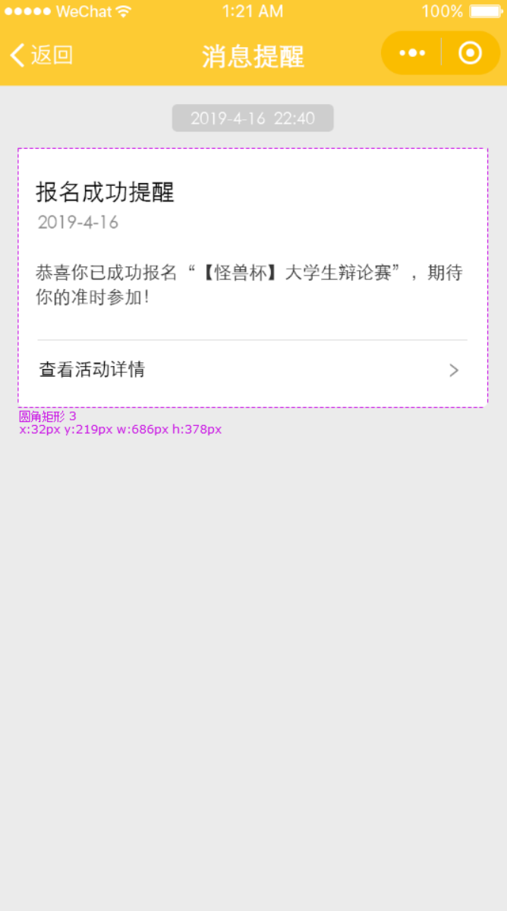
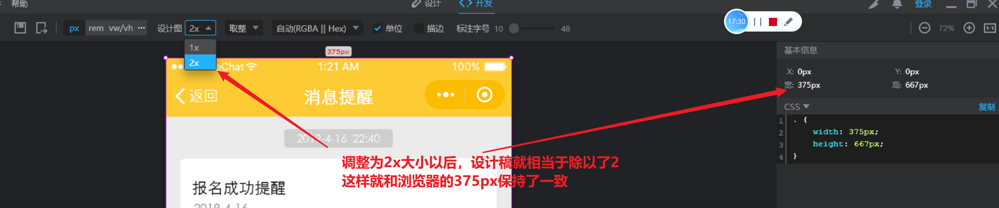
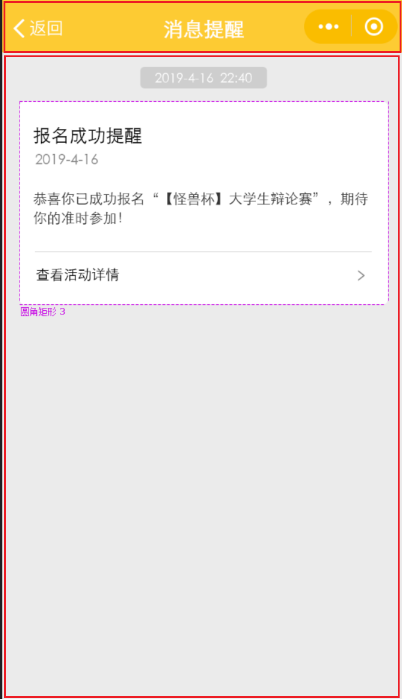

## 移动端布局规范

### 调整设计稿



对于像上面这种标准的移动端APP页面，它有几个特点

1. 它的设计稿的宽度与高度应该是
   * `375px * 667px`
   * `750px * 1334px`

2. 浏览器的`iphone 6/7/8`的大小中`375px * 667px`，如果设计稿不上面的大小，后期我们就要手动的去计算设计稿的比例

3. 如果设计稿是375px的宽度，则可以在pxcook直接使用

4. 如果设计稿的大小是750px，则需要在`pxcook`里面手动的调整为`2x`大小

   

### 移动端布局之前的准备工作

1. 准备图标与切图文件

2. 添加视口`viewport`

   ```html
   <meta name="viewport" content="width=device-width, initial-scale=1.0">
   ```

3. APP开发如无特殊规定，应该设置全屏盒子

   

   在这个设计稿里面，只有设计为全屏以后，我才能进行上下部分的切割

```html
<!DOCTYPE html>
<html lang="zh">
<head>
    <meta charset="UTF-8">
    <meta http-equiv="X-UA-Compatible" content="IE=edge">
    <meta name="viewport" content="width=device-width, initial-scale=1.0">
    <title>消息提醒</title>
    <link rel="stylesheet" href="css/flex-box.css">
    <style>
        *{
            margin: 0;
            padding: 0;
            list-style-type: none;
        }
        #app{
            width: 100vw;
            height: 100vh;
        }
    </style>
</head>
<body>
    <div id="app"></div>
</body>
</html>
```

### 开发中的注意事项

1. 标准的APP界面上面应该分为标题部分与内部部分，标题部分应该是固定不变的，内容部分是可以根据内容的多少进行滚动

   所以第一件事情就是切割页面

   ```html
   <div id="app" class="flex-col">
       <div class="title-bar">标题</div>
       <div class="content-box flex-1">内容</div>
   </div>
   ```

   上面是结构

   ```css
   #app{
       width: 100vw;
       height: 100vh;
   }
   .title-bar{
       background-color: red;
       height: 46px;
   }
   .content-box{
       background-color: pink;
   }
   ```

2. 设置整个项目的主题色

   ```css
   :root{
       --primaryColor:#ffc81f;
   }
   ```

3. 移动端的容器不应该是设置固定的`px`宽度，默认应该就是整个设备的宽度，但也不要设置`width:100%`