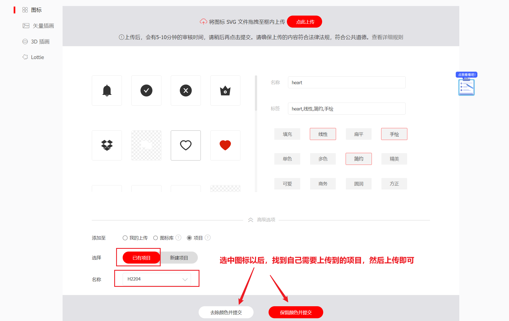

## Web前端的图标技术

在开发网页的时候我们可能需要使用很多个小图标，图标的技术经过发展以后有了很大的变化。以前的PC端我们可以使用`精灵图`来完成网页图标的使用

### **第一代图标**

第一代图标使用图片来完成


第一代图标的使用非常简单，直接使用img就可以了

```html

```

但是使用图片做为图标就会有问题

```css
.img1{
    width: 200px;
    height: 200px;
}
```

如果我们去改变图片的大小，这样就会失真


这一种图标的优点就是使用简单，缺点也很明显，不能够放大，一旦放大就失真，它还有一个缺点就是如果图标过多，就会到服务器加载多次

### **第二代图标的使用**

第二代图标使用的是精灵图或纯粹的图片来完成，如`.jpg/.png/gif`等图标


```html
<div class="box"></div>
<style>
    .box{
        width: 38px;
        height: 38px;
        border: 1px solid black;
        background-image: url("img/pwd-icons-new.png");
    }
</style>
```

上面的图标在使用的时候很麻烦 ，它将多个图标放在了一起，需要通过背景图的形式来定位图片。但也有优点，它只需要加载一次就可以了

> 第二代图标相较于第一代图标它就是把所有的小图片都集中在了一起，然后再进行相应的加载，这个会减少加载次数，但是并不会解决图标放大失真的问题

### **第三代图标：矢量图标**

矢量图有一个特点，就是无论你怎么放大，也不会失真，矢量图标一般以`svg`结尾

现在我们用矢量图标来完成一次操作

```html
<style>
    .img1{
        width: 400px;
        height: 400px;
    }
</style>

```

我们将图片放大到了`400px`的大小，这个时候 图标因为是矢量图格式 ，所以没有变模糊，也没有失真


> **问题**：
>
> 1. 如果有多个图标，仍然要加载多个img，非常麻烦
> 2. 矢量图标不好更改颜色

### **第四代：将矢量图标变成iconfont**

所有的图标都可以像字体一样去使用和设置，这就是第4代图标`iconfont`

[https://www.iconfont.cn-阿里巴巴矢量图标库](https://www.iconfont.cn/)

**第一步：注册登录**

这一个网站是专门为各们同学提供矢量图标的网站，我们需要先注册一下


注册完毕以后就要登录进来了

**第二步：点击我的项目**


**第三步：新建项目**


**第四步：挑选图标**


输入需要搜索的图标以后，点击搜索，这个时候就会出现很多与之相关的图标，然后选中你自己需要的图标


选中自己所需要图标，“添加入库”


把所有需要的图标添加入库完毕以后，点击上图中的位置


**第五步：添加选中的图标到项目当中**


------

截止上面的操作，我们所有的图标的准备工作已经完成，现在就开始使用了

### iconfont图标的使用

 iconfont图标的使用有3种方式 

1. `unicode`使用方法
2. `fontclass`使用方法
3. `symbol`使用方法【基于JS使用的，后期再讲】

无论是使用哪一种方式，都要先把字体下载下来


下载以后解压 ，会有如上图所示的文件 ，将整个文件夹复制到项目的根目录

**第一步：将iconfont.css文件连接到网页当中**

```html
<link rel="stylesheet" href="iconfont/iconfont.css">
```

**第二步：unicode方式使用**

```html
<style>
    .span1{
        font-size: 560px;
        color: red;
    }
</style>
<span class="iconfont span1">&#xe662;</span>
```

> 因为iconfont本质上面是把图标变成了字体，所以我们可以像字体一样去设置它的大小和颜色 


**优点**：unicode的模型使用图标，它的兼容性高，也是矢量图标，使用方便

**缺点**：它只能设置纯色的图标

**第三步：fontclass方式的使用**

```html
<style>
	.span2{
        font-size: 260px;
        color: deeppink;
    }
</style>
<span class="iconfont icon-longxia span2"></span>
```


> 这种方式使用的图标也是矢量图标，它通过`class`的方式来实现
>
> **优点**：
>
> 1. 相较于`unicode`的方式来说，它更直观一些，可以直接通过`class`的名称来快速定位图标
> 2. 它也是矢量图，放大不会失真
> 3. 它也是通过字体的方式来设置图标，所以可以通过`font-size`及`color`来设置大小及颜色
>
> **缺点**：
>
> 1. 它只能设置纯色的图标
> 2. 内部是通过伪元素`::before`来实现的，所以对于低版本的浏览器不支持`::before`就不能使用

### 本地图标上传到iconfont

在进行界面开发的时候，如果UI设计师没有为我们准备图标，我们可能需要从网上查找，但是如果UI设计师已经帮我准备好了图标，我们就可以直接使用。只是在使用之前需要将这些图标转换成`iconfont`





上传审核通过以后，所以的图标就都会显示出来，这个时候，只需要按照第4个操作过程，下载下来以后，使用就可以了

