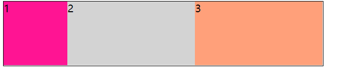
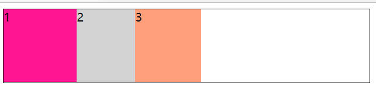
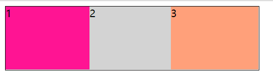
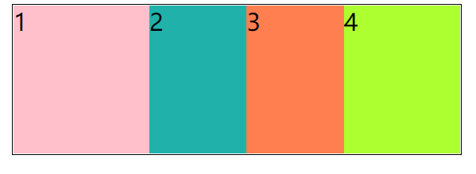
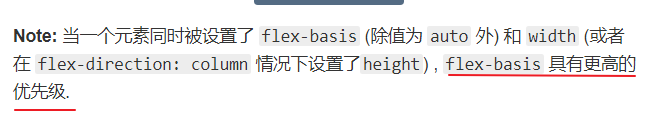

## 弹性盒子伸缩值计算

```html
<!DOCTYPE html>
<html lang="zh">
<head>
    <meta charset="UTF-8">
    <meta http-equiv="X-UA-Compatible" content="IE=edge">
    <meta name="viewport" content="width=device-width, initial-scale=1.0">
    <title>弹性盒子</title>
    <style>
        .box{
            width: 500px;
            height: 100px;
            border: 1px solid black;
            display: flex;
            flex-direction: row;

        }
        .div1{
            width: 100px;
            height: 100px;
            background-color: deeppink;
        }
        .div2{
            background-color: lightgray;
            flex: 1;
        }
        .div3{
            background-color: lightsalmon;
            flex: 1;
        }
    </style>
</head>
<body>
    <div class="box">
        <div class="div1">1</div>
        <div class="div2">2</div>
        <div class="div3">3</div>
    </div>
</body>
</html>
```



在上面的代码里面，我们使用了`flex:1`来扩展后面的2个盒子，那么这2个盒子的宽度各是多少呢？

首先我们要知道一点，`flex`属性是三个属性值的缩写

[CSS](https://developer.mozilla.org/zh-CN/css)属性 **`flex`** 规定了弹性元素如何伸长或缩短以适应flex容器中的可用空间。这是一个[简写属性](4125fa4984fa88dcf9aa148b7958e2a0.html)，用来设置 [`flex-grow`](6c8ed12450451a5b4fa7f2bd006a222b.html), [`flex-shrink`](9092f2fe72b10b9a38ba5f6446672bdc.html) 与 [`flex-basis`](cf64bfaa992434951e888f7c694d89a1.html)。

1. `flex-grow`代表弹性的扩展比例
2. `flex-shrink`代表弹性的收缩比例
3. `flex-basis`代表弹性盒子的基准值

### 弹性盒子扩张值计算

当一个容器大于弹性盒子内部元素的大小总和的时候，我们可以使用`flex-grow`来让内部的元素自动扩张，以填满剩下的空间



```css
.box{
    width: 500px;
    height: 100px;
    border: 1px solid black;
    display: flex;
    flex-direction: row;
}
.div1{
    width: 100px;
    height: 100px;
    background-color: deeppink;
}
.div2{
    background-color: lightgray;
    width: 80px;
}
.div3{
    background-color: lightsalmon;
    width: 90px;
}
```

在上面的代码里面，盒子总的宽度是`500px`，内部三个盒子总宽度加起来`100+80+70=250`,所以总的宽度应该是小于`500px`

接下来，我想让`div2`与`div3`自动填充剩下的空间，则`div2`与`div3`怎么设置，设置以后宽度各是多少呢

```css
.div1{
    width: 100px;
    height: 100px;
    background-color: deeppink;
    /*扩张*/
    flex-grow: 1;
}
.div2{
    background-color: lightgray;
    width: 80px;
    /*扩张*/
    flex-grow: 2;
}
.div3{
    background-color: lightsalmon;
    width: 90px;
    /*扩张*/
    flex-grow: 3;
}
```

现在我们在后面的2个元素上面分别添加了`flex-grow`来扩展，则后面的2个元素的宽度具体值是多少呢？

**计算公式**，在这里我们先计算`div1`

1. 第一步：计算剩下的空间是多少

   `500 - 100 - 80 - 90 = 230`

2. 计算总的份数

   `1 + 2 + 3 = 6`

3. 计算自己扩张的值

   `1 / 6 * 230 = 38.333`

4. 总的宽度

   `100 + 38.333 = 138.333`

最终经过计算以后，我们得出结果就是`138.333`



### 弹性盒子收缩值的计算

```html
<!DOCTYPE html>
<html lang="en">
<head>
	<meta charset="UTF-8">
	<meta name="viewport" content="width=device-width, initial-scale=1.0">
	<title>弹性盒子收缩值的计算</title>
	<style>
		.box{
			width: 300px;
			height: 100px;
			border: 1px solid black;
			display: flex;
		}
		.div1{
			width: 140px;
			background-color: pink;
		}
		.div2{
			width: 100px;
			background-color: lightseagreen;
		}
		.div3{
			width: 100px;
			background-color: coral;
		}
		.div4{
			width: 120px;
			background-color: greenyellow;
		}
	</style>
</head>
<body>
	<div class="box">
		<div class="div1">1</div>
		<div class="div2">2</div>
		<div class="div3">3</div>
		<div class="div4">4</div>
	</div>
</body>
</html>
```



现在在一个盒子里面放了4个盒子，每个盒子的宽度都不一样，最终照的结果是盒子总的宽度大于外边的盒子的宽度，这个时候就会出现一个压缩情况，那么每个盒子真实的大小是多少呢？

**计算公式**，在这里我们先计算`div1`

1. 第一步:计算自己差多少

   `300 - 140 - 100 - 100 - 120 = -160`

2. 计算总的份数

   `1*140 + 1*100 + 1*100 + 2*120 = 580`

3. 计算自己的收缩比例

   `140*1 / 580 = 0.2413`

4. 计算自己收缩的值

   `160 * 0.2413 = 38.620`

5. 计算自己剩下多少

   `140 - 38.620 = 101.379`

### 关于`flex-basis`的问题

`flex-basis`是元素的主轴大小基准值,在一个弹性盒子的的内部，如果设置了`flex-basis`以后，则在计算压缩比例的时候要用不用这个`flex-basis`而不是使用`width/height`所设置的值

```css
width: 140px;
background-color: pink;
flex-shrink: 2;
flex-basis: 150px;
```

在上面的计算过程里面，应该使用`flex-basis`来计算

```css
/*如果有了弹性的基准值 ,则使用基准值来计算*/
/*
第一步:计算差多少 
    400 - 150 - 100 - 100 - 120 = -70
    第二步:计算总的份数 
    150*2 + 100*1 + 100*1 + 120*2 = 740
    第三步:计算自己的收缩比例 
    150*2 / 740 = 0.4054
    第四步:计算自己收缩的值 
    0.4054 * 70 = 28.3783
    第五步:计算自己剩下多少
    150 - 28.3783 = 121.6216
*/
```



**总结**

```css
flex:1;
flex: 1 1 auto;
flex:扩张 收缩 基准;
```

> 基准值如果是`auto`则代表与宽度，高度相同