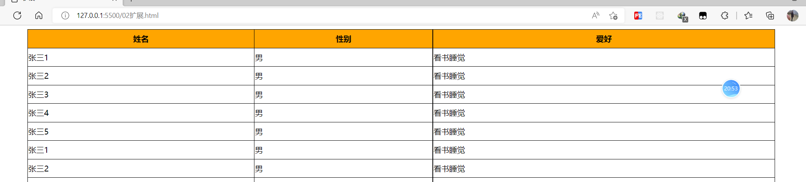

## 响应式布局中的媒体查询

### 什么是响应式布局

响应式布局指的是页面的样式或布局会随着设备的大小，类型及状态的改变而主动的做出改变

**场景一**：一个页面在手机端的竖屏状态下是一个样式，在横屏状态下又是一个状态

**场景二**：一个页面在手机端，平板，PC端所展现出来的样式或不一样，这也算是响应式

现在我们先通过一个简短的案例来完成一下

**需求**：我们现在需要一个盒子，在`0px~767px`这个范围之前表现出背景为红色，然后大于`767px`则背景变成蓝色

```html
<!DOCTYPE html>
<html lang="zh">
<head>
    <meta charset="UTF-8">
    <meta http-equiv="X-UA-Compatible" content="IE=edge">
    <meta name="viewport" content="width=device-width, initial-scale=1.0">
    <title>响应式入门</title>
    <style>
        .box{
            width: 200px;
            height: 200px;
            border: 2px solid black;
            background-color: blue;
        }
    </style>
</head>
<body>
    <div class="box"></div>
</body>
</html>
```

上面的代码只能保证当前的盒子变成蓝色，如果让盒子在小于767以后改变，这个时候就要使用响应式

### 媒体查询

**响应式的核心是一个叫媒体查询的东西**，媒体查询是CSS的一个命令`@media`,通过这个媒体查询，我们可以可以设备的多媒体状态

```css
@media [only/not] 设备类型 [and 附加条件]{
    /*CSS代码*/
}
```

常用媒体查询

```css
@media print {
    /*打印设备*/
}
@media screen {
    /*屏幕显示*/
}
@media all {
    /*所有多媒体设备*/
}
```

**现在我们来试一下第一种**：查询到网页在打印设备上面的时候



现在有上面的一个网页，网页上面有一个`table1`,我们希望在打印这个网页时候，表格里面所有的文字都居中对齐 ，怎么办呢

```css
.table1 {
    text-align:center;
}
```

上面的代码是有效果的，而这个效果的体现形式应该是在打印设备上面，所以代码如下

```css
/* 媒体查询打印设备，仅仅只是在打印设备上面生效 */
@media only print {
    .table1 {
        text-align: center;
    }
}
```

**第二种：查询屏幕多媒体设备**

针对上一个章节抛出来的那个疑问 <u>我们现在需要一个盒子，在`0px~767px`这个范围之前表现出背景为红色，然后大于`767px`则背景变成蓝色</u>

```css
/* 0~767px 变成红色 */
@media only screen and (min-width:0px) and (max-width:767px) {
    .box{
        background-color: red;
    }
}
```

> 1. `min-width`代表最小宽度
> 2. `max-width`代表最大宽度

一个设备的最小宽度就是0，所以上面的代码可以简写成如下

```css
 @media only screen and (max-width:768px) {
     .box {
         background-color: red;
     }
}
```

我们现在在做一次扩展

:question: 假设，我们现在希望在`300px~767px`之间变成红色，其它的时候变成蓝色，怎么办呢

```css
@media only screen and (min-width:300px) and (max-width:767px) {
    .box {
        background-color: red;
    }
}
```

同时，我们还可以将屏幕进行连续的划分

```css
 /* 
0~767px 红色
768px ~ 991px 蓝色
991px ~ 1200px deeppink分色
1200px以上为gray灰色
*/
@media only screen and (max-width:768px) {
    .box {
        background-color: red;
    }
}
@media only screen and (min-width:768px) and (max-width:991px){
    .box{
        background-color: blue;
    }
}
@media only screen and (min-width:991px) and (max-width:1201px){
    .box{
        background-color: deeppink;
    }
}
@media only screen and (min-width:1201px) {
    .box{
        background-color: gray;
    }
}
```

现在我们来完成另一个案例，通过4张图片来完成图片的响应式切换

```html
<!DOCTYPE html>
<html lang="zh">
<head>
    <meta charset="UTF-8">
    <meta http-equiv="X-UA-Compatible" content="IE=edge">
    <meta name="viewport" content="width=device-width, initial-scale=1.0">
    <title>图片响应式</title>
    <style>
        .box{
            border: 2px solid black;
            display: flex;
            /* 弹性换行 */
            flex-wrap: wrap;
        }
        @media only screen and (max-width:768px){
            /* 一排显示1张 */
            .box>img{
                width: 100%;
            }
        }
        @media only screen and (min-width:768px) and (max-width:991px){
            /* 一排显示2张 */
            .box>img{
                width: 50%;
            }
        }
        @media only screen and (min-width:991px){
            /* 一排显示4张 */
            .box>img{
                width: 25%;
            }
        }
        
        /* 
            0~767px  一排显示1张图片
            768px ~ 991px 一排显示2张图片
            991px 以上  一排显示4张图片
        */
    </style>
</head>
<body>
    <div class="box">
        
        
        
        
    </div>
</body>
</html>
```

在上面的代码里面，我们可以根据不同的代码需求，来实现图片每次显示的数量

### 屏幕尺寸的划分

在上面做屏幕的响应式的时候我们发现了一个点，我们总是对屏幕进行了几个尺寸的划分 ，屏幕尺寸的划分也有一个规范，现在大多数的UI框架所使用的都是`bootstrap`的屏幕划分规范

`bootstrap`框架把屏幕划分成了4个等级

| 尺寸范围       | 说明   |
| -------------- | ------ |
| `0~767px`      | 手机   |
| `768px~991px`  | 平板   |
| `992px~1200px` | PC     |
| `1201px及以上` | 大型PC |

### 媒体查询使用注意事项

在使用媒体查询的语法的时候，有一些注意事项需要注意

1. 严格遵守媒体查询的语法，单词与单词之间一定要加上空格

2. 媒体查询的代码应该在CSS代码的最后面加载

   ```css
    @media only screen and (max-width:768px) {
        .box{
            background-color: red;
        }
   }
   .box{
       width: 100px;
       height: 100px;
       border: 2px solid black;
       background-color: blue;
   }
   ```

   > 上面的写法就是错的

3. 媒体查询代码里面选择器的权限只能大于或等于外边的普通样式代码，否则就覆盖不了

   ```css
    #div1{
        width: 100px;
        height: 100px;
        border: 2px solid black;
        background-color: blue;
   }
   @media only screen and (max-width:768px) {
       .box{
           background-color: red;
       }
   }
   ```

### 扩展

#### 设备的横竖状态改变

在手机端里面，因为手机端是具备重力感应的，我们经常会把书手机横着或竖着，对于手机横着或竖着，也是可以通过媒体查询来获取信息的

```css
@media only screen and (orientation:portrait){
    /* 竖向的 */
    .box{
        background-color: red;
    }
}
@media only screen and (orientation:landscape){
    /* 横向的 */
    .box{
        background-color: blue;
    }
}
```

#### 使用link来链接响应式CSS

```html
<link rel="stylesheet" href="css/01.css" media="screen and (max-width:768px)">
<link rel="stylesheet" href="css/02.css" media="screen and (min-width:768px)">
```

