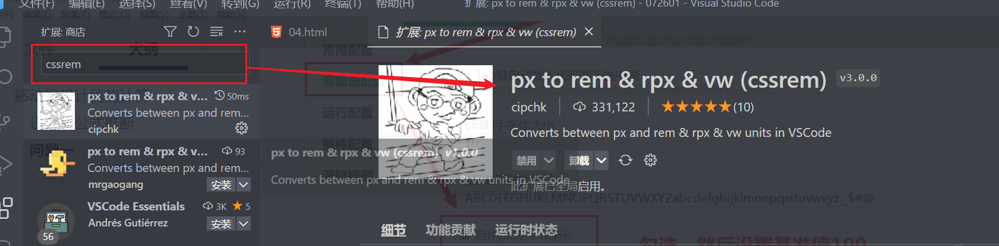

## 移动端设计稿的计算

在之前我们在进行开发的时候，我们总是使用了`750`或`375`的设计稿，这一种标准的设计 ，在这种设计稿的模式下面，我们可以使用`pxcook`来直接计算


如果设计稿是750px的设计稿，我们可以直接使用这个`pxcook`这个工具来除以2


但是对于这种不是`750`或`375`的设计稿，我们应该怎么办呢？

现在我们来推一下公式


以上是1080的设计稿，我们现在想看一下`853`在`375px`的浏览器设备上面应该显示为多少？


### 设计稿公式推断

根据上面推断过程，我们得到了一个点，如果想得到真实在浏览器当中的大小，应该是使用`设计稿上面量出来的大小* 浏览器的宽度 / 设计稿的宽度`

```css
f(a) = a * 浏览器的宽度 / 设计稿的宽度
```

> a代表的就是在设计稿上面量出来的真实大小

现在我们深度使用我们的公式去书写，就会得到下面的代码

```html
<!DOCTYPE html>
<html lang="zh">
<head>
    <meta charset="UTF-8">
    <meta http-equiv="X-UA-Compatible" content="IE=edge">
    <meta name="viewport" content="width=device-width, initial-scale=1.0">
    <title>移动端设计稿的计算</title>
    <link rel="stylesheet" href="css/flex-box.css">
    <style>
        *{
            margin: 0;
            padding: 0;
            list-style-type: none;
        }
        #app{
            width: 100vw;
            height: 100vh;
        }
        :root{
            --primaryColor:#ffc81f;
        }
        .tab-bar{
            background-color: var(--primaryColor);
            height: calc(92px * 375 / 750);
        }
        .head-pic{
            width: calc(100px * 375 / 750);
            height: calc(100px * 375 / 750);
        }
    </style>
</head>
<body>
    <div id="app" class="flex-col">
        <div class="tab-bar">下</div>
        <div class="content-box flex-1">
            <div class="user-box">
                
            </div>
        </div>
    </div>
</body>
</html>
```

我们发现在设计元素大小的时候非常不方便，最重要的就是下面的部分的代码

```css
height: calc(92px * 375 / 750);
```

在这样的代码里面，我们又发现 只需要将设计稿上面得到的大小 乘以 一个比例

**思考**：有没有什么快速的方案去相乘呢？

能不能有这么一个方法，我只写一个`92`代表的就是`92px * (375 / 750)`

**思路**： 在之前的时候，我们学过一个单位叫`rem`,`rem`的全称指`html`元素也就是`root element`,它代表`html`标签的`font-size`的大小，默认的`rem`大小是`16px`

```css
1rem = 1 * 16px 
```

**突破**：如果我要是把`html`标签的`font-size`改成了`0.5px`

```css
html{
    font-size:0.5px;
}
1rem = 1 * 0.5px;
92rem = 92 * 0.5px;
```

**结论**

```css
 *{
     margin: 0;
     padding: 0;
     list-style-type: none;
}
#app{
    width: 100vw;
    height: 100vh;
}
/* html rem */
:root{
    --primaryColor:#ffc81f;
    font-size: calc(375px / 750);
}
.tab-bar{
    background-color: var(--primaryColor);
    height: 92rem;
}
.head-pic{
    width: 100rem;
    height: 100rem;
}
```

我们使用了`rem` 这种单位，这种单位快速的帮我们计算了一个结果值

-----

### 问题一

经过上面的使用，我们已经掌握了设计计算的基本规律，但是仍然有些细节需要注意

```css
.login-box{
	width: 853rem;
    height: 557rem;
    background-color: pink;
    margin: 612rem auto 0;
}
```

我们在使用`rem`，我们发现这个值非常大，这是因为我们在计算rem的时候我们给了一个公式

```css
当前设备宽度 / 设计稿宽度
```

在计算的时候有可能会出现除不尽，为了提高精度，我们一般会乘以一个经较大的基准值

```css
f(a) = a * 当前设备宽度 / 设计稿宽度 * 基准值
```

这个基准值可以随便给

**如**当前设计稿为1080，设备宽度不375px,则rem的计算应该是这样的

```css
:root{
    font-size:calc(375px / 1080 * 100)
}
```

这个时候我们给的基准值就是100，但是这个100必不是固定的，每个公司或每个项目团队给的值都不一样的

==问题==：我们在设计稿上面不能够快速的知道最后的结果是多少


<span style="color:red;font-weight:bold">解决方法一：直接使用pxcook提供的功能</span>


<span style="color:red;font-weight:bold">解决方法二：使用HbuilderX开发工具里面的转换</span>


这个时候在使用的时候会自动帮我们把输入的`px`转换成所需要用到的`rem`

<span style="color:red;font-weight:bold">解决方法三：使用VSCode开发工具里面的插件转换</span>



安装完成插件以后，我们要设置基准值


设置完了以后，一定要重新启动`VSCode`


在使用的时候它也会多一个选项，帮我们转换成`rem`

### 问题二

我们现在改变了`rem`默认的大小

```css
:root{
    font-size: calc(375px / 1080 * 100);   /*34.72px*/
}
```

这个时候网页的默认字体就变了，不再是原来的16px。所以我们现在要恢复网页的默认字体大小

```css
body{
    font-size: 16px;
}
```

### 问题三

我们之前在推断公式的时候，我们把设备的宽度固定成了`375px`，但是在实际的使用场景下面，我们设备的大小是不固定的

```css
:root {
    font-size: calc(375px / 750 * 100);
}
```

在上面的代码里面，我们是假设所有的手机都是`375px`

**思考**：为什么写`375px`？

因为`iphone 6/7/8`这三个设备的宽度就是`375px`

**思路**：有什么东西还可以代表设备的宽度？

```html
<meta name="viewport" content="width=device-width, initial-scale=1.0">
```

我们之前在写代码的时候，总是会添加视口，其中`width=device-width`代表视口的宽度与设备的宽度相等了

**突破**：视口是`viewport`，它会有一个单位叫`vw`，而`100vw`代表的就是视口的宽度，也就是设备的宽度

**结论**：通过上面的推断与分析，我们的公式可以列举如下

```css
:root{
    font-size:calc(100vw / 750 * 100);
}
```

### 问题四


我们用`rem`写了一个网页，但是这个网页如果是在Pc浏览器上面打开了，会出现很大的问题，如何控制呢

**解决方案**：使用`@media`媒体查询