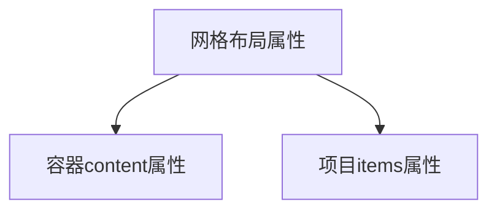
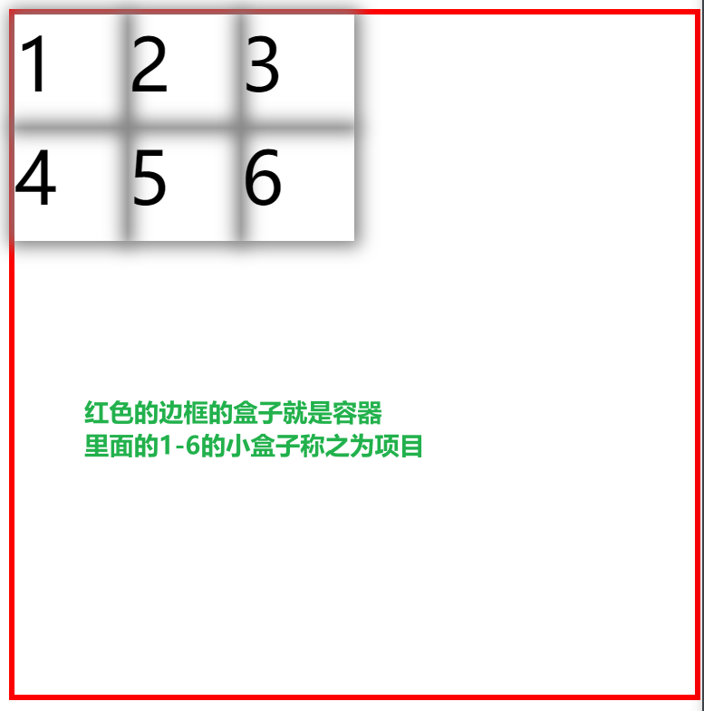
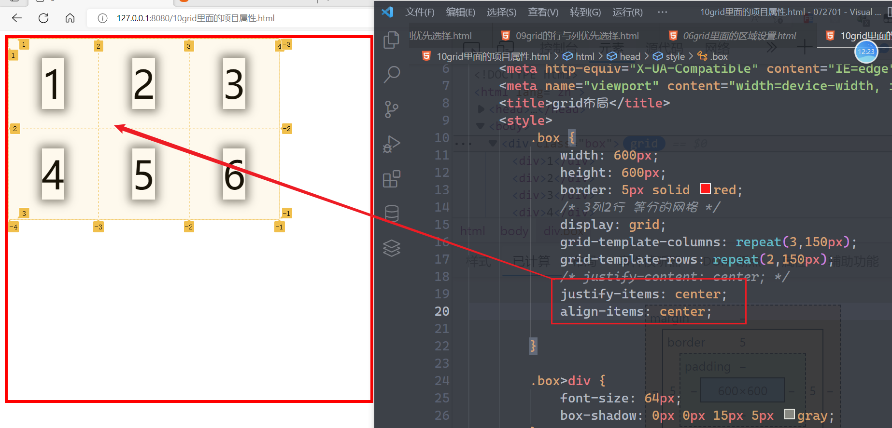
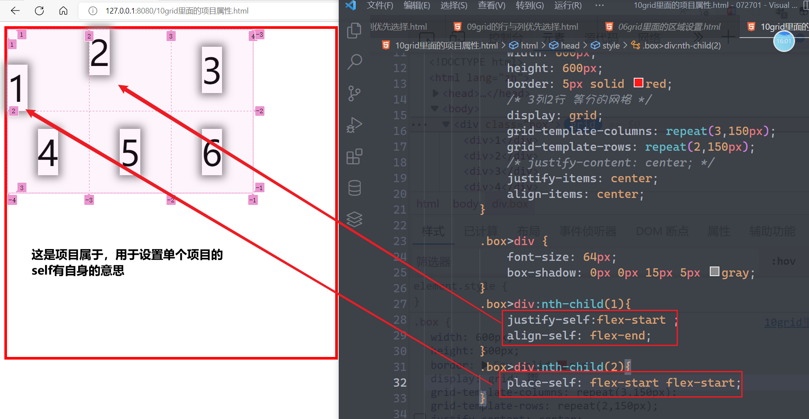
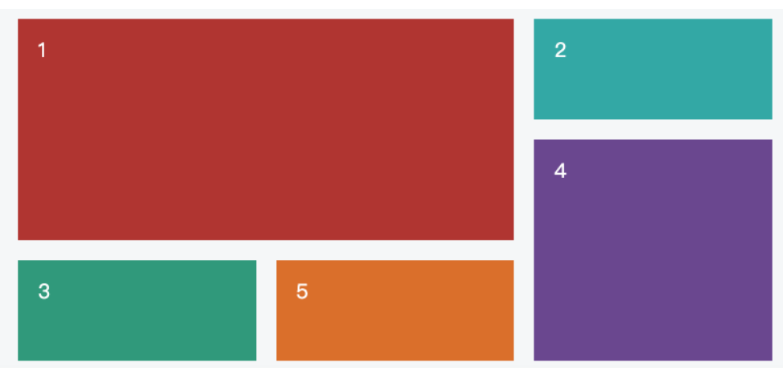
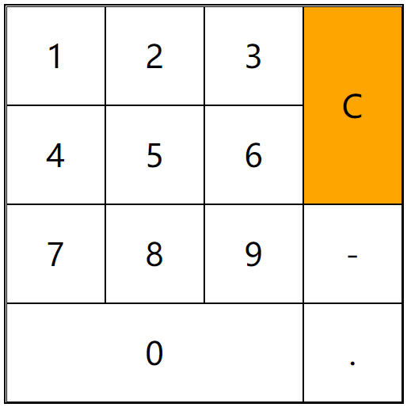
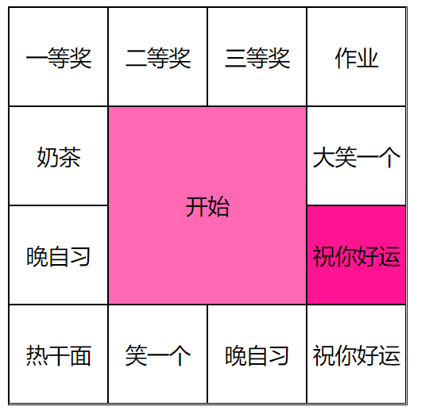

## CSS中的grid布局

grid布局是一种新兴的布局方式，它是在弹性盒子的布局上面去实现二维布局方式（存在行与列的关系）

网格布局里面是有行`row`与列`column`的概念的，并且网格布局的属性也分为2大类





### 容器属性

容器就是用于放东西的盒子，容器属性指的就是这个盒子上面的属性

1. `display:grid`将容器变成网格

2. `grid-template-columns`定义列的模板

   ```css
   grid-template-columns: 100px 200px 300px ;  /*定义固定的列宽*/
   grid-template-columns: 100px auto 100px;   /*auto可以自动设置大小*/
   grid-template-columns: 33.3% 33.3% 33.4%;   /*也可以设置百分比*/
   grid-template-columns: 1fr 1fr 1fr;  /*fr是片段、份 的意思*/
   grid-template-columns: 100px 100px minmax(100px,200px);  /*minmax(设置最小值和最大值区间)*/
   grid-template-columns: repeat(3,100px);
   grid-template-columns: repeat(auto-fill,200px); /*根据某一个大小自动去填充*/;
   ```

3. `grid-template-rows`定义行的模板，它的定义方式与列的定义方式是一样的

4. `grid-row-gap`网格中行与行的间距

5. `grid-column-gap`网格中列与列的间距

6. `grid-gap`单元格的间距 ，是上面2个属性的简写，第一个代表行间距，第二个默认不写与第一个值相同，写了就代表列间距

7. `justify-content`让项目在容器里面左右居中，属性值与弹性盒子一致

8. `align-content`让项目在容器里面上下居中，属性值与弹性盒子一致

9. `place-content`是`align-content` 与`justify-content`的简写

   ```css
   place-content: center flex-end;
   /*相当于*/
   align-content:center;
   justify-content:flex-end;
   ```

10. `grid-template-areas`对网格中每个区域定义一个名子

    ```css
    grid-template-areas: 'a b c' 
                         'd e f';
    ```

    定义了一个名子以后，后期可以快速的让一个项目元素去指定的网格中

11. `grid-auto-rows`设置自动添加的行的高度

12. `grid-auto-columns`设置自动添加的列的宽度

13. `grid-auto-flow`设置网格中的元素是先从行开始还是先从列开始

    * `row`先从行开始
    * `column`先从列开始
    * `row dense`从行开始，稠密的排列【只有有位置，我就插入进去】
    * `column dense`从列开始，稠密的排列【只有有位置，我就插入进去】

14. `justify-items`设置在容器上面，让容器里面的每一个项目都在小格子里面左右居中

15. `align-items`设置在容器上面，让容器里面的每一个项目都在小格子里面上下居中

    

### 项目属性

网格当中的每一个元素都称之为项目，当容器把自己拆分成多个网格以后

1. `justify-self`用于设置项目自身的左右位置

2. `align-self`用于设置项目自身的上下位置

3. `place-self`用于同时设置项目的左右，上下位置

   

4. `grid-column-start`某一个项目元素列开始的**线条位置**

5. `grid-column-end`某一个项目元素列结束的**线条位置**

6. `grid-column`同时设置结束与开始的**线条位置**

   ```css
   grid-column: 1 / 3;
   /*span有合并和跨度的意思*/
   grid-column: 1 / span 2;
   ```

7. ` grid-row-start`某一个项止元素行开始的**线条位置**

8. `grid-row-end`某一个项目元素行结束的**线条位置**

9. `grid-row`同时设置结束与开始的**线条位置**

   ```css
   grid-row: 1 / 3;
   /*这与上面的列是一样的，跨2个*/
   grid-row: 1 / span 2;
   ```

10. ` grid-area`让一个项目元素去指定的区域


### 注意

弹性盒子里面具备的特殊在网格元素里面同样具备

### 案例

1. 实现下面布局

   

2. 实现下面布局

   

3. 实现下面布局

   点击开始以后，转盘开始抽奖

   

4. 实现下图的布局

   