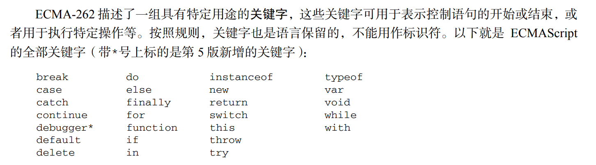
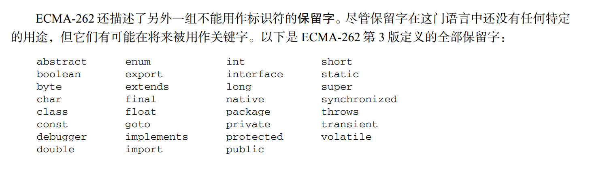
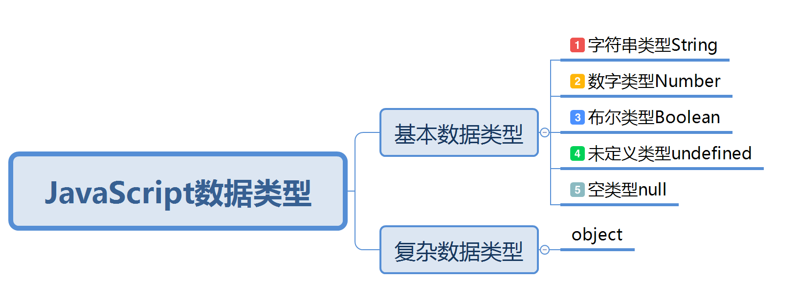
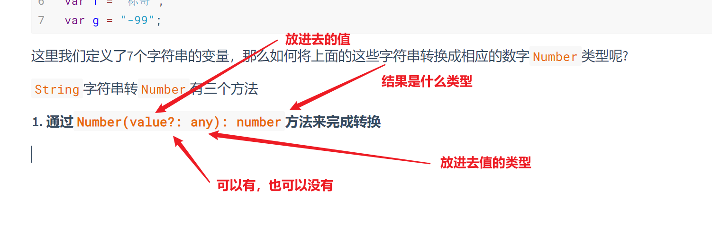

## ECMAScript基础

JS分为三部分，其中`ECMAScript`规定了这门语言的语法基础，数据类型 ，流程控制，运行符，类型转换，函数，面向对象等一系列的基础知识，它是入门点

### ECMAScript的语法基础规则

```html
<!DOCTYPE html>
<html lang="zh">
<head>
    <meta charset="UTF-8">
    <meta http-equiv="X-UA-Compatible" content="IE=edge">
    <meta name="viewport" content="width=device-width, initial-scale=1.0">
    <title>基础规则</title>
    <STYLE>
        INPUT{
            BACKGROUND-COLOR:RED;
        }
    </STYLE>
</head>
<body>
    <input type="text">
    <INPUT TYPE="TEXT" />
</body>
<script>
    alert("陈怡静,刘诗霞,芦伊菲");
    // ALERT("陈怡静,刘诗霞,芦伊菲");   这里不行
</script>
</html>
```

1. `JS`代码的基础单位是行，一行代码结束以后要以分号结尾【如果省略了这个分号也是可以的，但是不推荐】
2. `JS`是一门严格区分大小写的语言，它与之前的`HTML、CSS`不一样
3. `JS`编程里面，所有的符号都是英文状态下面的符号

--------

### 变量标识符

变量其实就是一个可以变化内容或值的一个符号，在之前的CSS里面，我们已经接触过了变量的概念

```css
:root{
    --primaryColor:red;
}
.box{
    color:var(--primaryColor);
}
```

通过上面的过程 ，我们可以大概知道变量是，它定义的过程和使用的过程是什么样式

在JS里面也是一样的，在JS当中定义变量有一个特殊的**关键字**`var`来实现的

> `var`的全称叫`variable`，英文单词就是变量的意思

```javascript
var a;
```

 上面的代码就是定义了变量`a`。这行代码的意思就是告诉浏览器，我`var`后面跟着的这个`a`它是一个变量,但是这个变量没有赋值 ，没有赋值的变量叫**未初始化的变量**

```javascript
var a = 18;
//我们可以在定义变量的时候，直接给这一个变量赋一个初始的值，这个赋值始值的过程叫 变量初始化
```

上面的代码其实也可以分2部去写

```javascript
var a;  //定义变量
a = 18; //赋值
```

:tipping_hand_man: 通过上面的代码我们已经知道 关键字`var`就是用来定义变量的，但是这里有2个细节需要同学样注意

1. 在`JS`里面，定义所有的变量都使用同一个关键字`var`，这一点与其它的语言不一样

   ```javascript
   var a  = 18;
   var b = "标哥哥";
   var c = 19.9;
   var d = true;
   ```

   JS它是一门**弱类型**的语言【弱类型就是在定义变量的时候，不去强调变量的类型 ，同时变量的类型也是可以后期进行相互转换的】

   ```java
   //下面是java的代码
   int a = 18;
   String name = "标哥哥";
   char sex ='男';
   float money = 11.2f;
   ```

2. 变量的命名一定要规范

   * 所有的变量名应该遵守见名知意
   * 所有的变量命名应该是驼峰命名法，驼峰命名法就是第一个单词首字母小写，后面单词的首字母大写
   * 所有的变量命名应该避开关键字与保留字
   * 变量只能是字母，下划线或`$`开头

   ```javascript
   //定义年龄使用age  见名知意
   var age = 18;
   //定义姓名使用username  见名知意
   var userName = "标哥";
   // 学生信息列表的变量
   var studentInfoList;
   
   // var var;    错误的变量命名  使用了关键字做变量名
   // var for;    错误的变量命名  使用了关键字做变量名
   
   //var 1age;    错误的变量命名  使用了数字开头
   // var user-name;   错误的变量命名  使用了特殊字符做变量名
   // var #age;    错误的变量命名  使用了特殊字符做变量名
   
   var $age = 20;
   var user_age = 20;
   var _age = 20;
   ```

### 关键字

关键字是编译系统里面为了实现一个或多个功能所特定命名的一个关键词



### 保留字

保留字也是关键字，它在当前的版本中没有使用，但是可能会有后面的版本里面去使用



现在我们已经知道变量的定义是使用关键字`var`了，那么们就来通过这个关键来带出新的知识点

```javascript
var teacherName = "标哥";
var age = 18; 
var height = 180.5;
var money = null;
```

我们可以看到变量后面跟着的这些些是不一样的，要弄清楚上面的问题，我们就需要学习`ECMAScript`当中的数据类型

### JavaScript数据类型 

在JavaScript里面根据不同的场景需求，我们要使用一些特殊的数据来去描述 ，如数字，如逻辑判断的真或假，如小数等，这些都称之为数据类型



在JS的数据类型里面，我们把数据类型分为2个大类

1. 基本数据类型 

   基本数据类型描述数据的根本类型，在JS里面一定分为很多小的类

2. 复杂数据类型【引用类型】

#### 字符串类型String

字符串是所有编程语言当中最常见的数据类型 ，同时在JS里面也是最安全的数据类型 ，所有的数据类型都可以转换成这种类型，它也非常好识别（所有使用引号包裹的都是字符串）

```javascript
var a = "标哥哥";
var b = "hello";
var c = "100";
```

上面变量赋的值全都被引号包裹了，但是要注意，符号全都是英文的

```javascript
var d = “标哥哥”;
```

上面的代码就是错误 的，它使用了中语文的符号，编程语言里面所有的符号应该都是英文的

在字符串类型里面所有被引号包裹 的就是字符串，没有单引号与双引号的区别，**只要是成双成对的出现就可以了**

```javascript
var sex = '男';					//正确
var stuName = '黄相立';		   //正确
var girlFriend = '赵金麦";        //这是不对的，因为引号不是成对的出现的
```

现在请同学样来判断一下，下面是不是字符串

```javascript
var a = 18;						//数字
var b = "18";					//字符串
var c = '18';					//字符中
var d = c;						//相当于 var d = '18',它也是字符串
var e = 'c';					
//第一个a没有打引号，所以不是字符串
//最后的d是接收了c的值，而c的值是'18',所以变量d最后的值也是‘18’
```

#### 数字类型Number

数字类型是JavaScript当中用于表述数字的，最简单的数字类型就是平时使用的10进制数据类型（后面我们还会讲到8进制，16进制及2进制）

> 后面会讲到2进制及进制转换，所以这里只写10进制
>
> 同时JS里面的数字类型与其它的语言不一样，它不区分小数，整数，长整型 ，短整型 ，单精度，双精度等，所有的数字全称之为`Number`类型

```javascript
var money = 0;					//整数
var money1 = 25;				//数字
var money2 = 35.5;				//小数
var money3 = -100;				//负数
var a = "999";					//只要加了引号，就是字符串类型 
```

现在再列举一下16进制的情况【了解】,所以的16进制的数字都是以`0x`开头的16进制方式来赋值

```javascript
var a = 255;                //十进制
var b = 0xff;               //0x一定是16进制  后面的ff代表提16进制的值 
```

16进制的值一旦赋值结束以后，系统会自动的转换成10进制的值

所有的十进制数字都是由0~9构成的，但是仍然有一些特殊的数字要记住

#### 关于数字类型NaN

`NaN`是一个非常特殊的数字类型 ，全称叫`not a number`,这个值代表本来经过运算以后应该得到一个数字的，结果又得不到数字出现了意外，就会显示这个值

```javascript
var a = 100;
var b = "标哥";
a - b;  //这个时候的结果就是NaN
//减法操作以后按结果应该是一个数字，结果我又得不到数字，出现了意外，这个时候就会得到NaN
```

#### 布尔类型Boolean

布尔类型是绝大多编程语言里面都具备的数据类型，这个类型 下面只有2个值，分别是`true`和`false`，用于在编程过程当当中判断条件真或假

```javascript
var isTeacher = true;
var isGirl = false;
var x = 1;
var y = 2;
var z = (x < y);   //这条件是成立的，所以它的结果是一个true
```

请同学们分析一下下面的数据类型是什么

```javascript
var a = "true";
var b = false;
var c = 'false';
```

> 变量a被引号包含，所以它是字符串，变量b是`false`所以是Boolean类型，变量c被单引号包裹 ，也是字符串

#### 未定义类型undefined

未定义类型是`JavaScript`当中独有的一种特殊类型 ，它指的是一个变量定义了以后没有初始化或在初始化的时候给了一个`undefined`的值

```javascript
var a = true;       //boolean
var b = 123;        //number
var c = "hello";    //string
```

上面的3个变量都有数据类型 ，原因是因为它们都有值，但是如果一个变量定义了以后没有值，会是什么类型 

```javascript
 var d ;   //这个时候就只定义了变量，而没有初始化，它就是一个未定义的类型 undefined
```

还有一种情况也可以是未定义类型 ，就是直接赋一个`undefined`的值

```javascript
var e = "赵今麦";      //string类型 
e = undefined;        //undefined类型
```

所以`undefined`代表没有的意思

#### 空类型Null

null与我们上面所学习的`undefined`非常相似，它也代表没有，但是2个类型有本质性的区别

```javascript
var a ; 			//不赋值它就是undefiend类型
var b = null;       //空类型
```

> b变量null相当于一个房子，这个房子它是一个空房子,a是undefiend，它代表空，它连房子都没有

**场景一对话**：undefined的情况对象

```
杨标：“颜一鸣，来，我今天晚上给一个大大的礼物给你”
颜一鸣听了以后非常高兴，跑跑跳跳就回到座位
李心悦上线了
问：“嘿，小伙子，刚刚标哥叫你过去干什么”
颜一鸣神神秘秘的说道：”标哥说晚上给一个礼物我“
李心悦就问：”啥礼物，多少钱？“
颜一鸣听后说道：”我也不知道，标哥说晚上给我“
```

**场景二对话**：`null`的情况的对话

```
杨标：“颜一鸣，来，小伙子，这里有个盒子，盒子里面装的是你今天晚上的惊喜礼物”
抱着这个盒子，颜一鸣欢乐的走向啊自己的位置
李心悦又上线了
“哟，不错啊，又有东西过来了，你和标哥啥关系，怎么老有礼物给你，快看看，到底是个啥？”
颜一鸣很好奇的就打开了这个盒子，然后发现，这个盒子是这空的
颜一鸣大失所望 ，然后就开始慢慢问候标哥了
```

上面的2个场景对话就充分的说明 了`null`与`undefined`的场景 ，而给颜一鸣的盒子就相当于是内存当中的空间，`null`是会在内存里面占据一个空间，只是这个空间里面没有放任何东西，而`undefined`在内存里面是没有空间的

### 数据类型检测 

JavaScript有5种基本数据类型，如果一个变量赋了值以后就有了初始的数据类型，那么这个数据类型是否会发生变化

```javascript
var a = "hello";
a = "你好";
```

上面的代码里面，我们定义了一个变量，同时对这个变量进行了初始化，它的初始数据类型是`String`字符串类型，后面把`a`重新赋值为“你好”的时候它还是字符串类型

```javascript
var a = "hello";    //字符串
a = 100;            //这里不会报错，现在赋值数字了，它就是number字符串类型 
```

从上面的代码上面我们可以看到，`JavaScript`的数据类型是可以发生改变的，这一种现象我们叫`弱类型机制`

> 在`JS`当中变量是没有固定的数据类型的，它的数据类型是由后面的值来决定的，我们赋什么类型值，它就是什么数据类型

这一种现象与其它的编程语言是不一样的，`java`与`c`等都是强类型机制 ，一旦确定了变量的数据类型 ，就不可能更改

```java
int a;
double b;
float c;
String d;
boolean f;
```

正是因为JS的数据类型在更改，所以如果我们想确定一个变量的数据类型 ，可以通过**数据类型检测**来完成

<span style="color:red;font-size:22px">在JS里面，基本数据类型的检测使用的是关键字`typeof`</span>

```javascript
var a = 1;
var b= "你好";
var c = false;
var d = undefined;
var e = null;
// 现在一下一个检测
typeof a; // 'number'类型
typeof b; // 'string'类型
typeof c; // 'boolean'类型
typeof d; // 'undefined'类型
typeof e; // 'object'类型
```

在前面的4个数据检测的时候，得到的结果与我们预期的结果是一致的，只有`null`在检测的时候得到的结果是`object`对象类型

基本数据类型检测以后得到的结果有以下几种情况

1. `number`数字类型
2. `string`字符串类型
3. `boolean`布尔类型
4. `undefined`未定义类型
5. `object`对象类型，这个结果比较特殊，我们的`null`检测出来会是这个类型【单独对待】

数据类型检测的语法

```javascript
typeof 变量名;
```

除了上面的方式以外，还可以使用下面的方式也行

```javascript
typeof(变量名);
```

上面2种写法它的结果是一样的，只是写法不一样而已

> 顺带着说一句
>
> ```javascript
> typeof NaN;  //'number'类型
> 
> var a = 123;
> typeof typeof a;
> 
> //分析过程
> //typeof(typeof(a));   //'string'
> // typeof a   //'number'
> 
> //typeof 'number'   //结果'string'
> ```

### 数据类型转换

JavaScript里面有5种基本数据类型 ，这5种基本数据类型之间是可以发生相互的转换的

#### 字符串转十进制数值

```javascript
var a = "999";
var b = "9a9";
var c = "99.99";
var d = "a99";
var e = "99.99.88";
var f = "标哥";
var g = "-99";
```

这里我们定义了7个字符串的变量，那么如何将上面的这些字符串转换成相应的数字`Number`类型呢?

`String`字符串转`Number`有三个方法

1. **通过`Number(value?: any): number`方法来完成转换**

   > 通过这种方式的转换，只能实现合法的数字字符串转换

   ```javascript
   var a1 = Number(a);      //得到结果999,它是一个number
   var b1 = Number(b);       //得到结果NaN，转换失败，它也是一个number类型
   var c1 = Number(c);       //得到结果99.99 它是一个number类型
   var d1 = Number(d);       //得到结果NaN
   var e1 = Number(e);       //得到结果NaN
   var f1 = Number(f);       //NaN
   var g1 = Number(g);       //得到结果-99  它是一个number类型
   ```

   同时我们再看下面的几种情况

   ```javascript
   var h = "0001";
   var h1 = Number(h);   //1
   
   var aa = "0x0001";
   var aa1 = Number(aa);     //1
   ```

   `Number`方法的转换本质上面就是直接去掉了字符串的引号，然后再看它是否是一个合法的数字

   <span style="color:red;font-size:36px;line-height:1.9">后期所有的隐式类型转换全都默认使用这个方法进行转换</span>

2. **使用`parseInt(value: string, radix?: number): number`进行转换**

   这个方法只能将字符串转换成整数

   ```javascript
   var a1 = parseInt(a);   //999
   var b1 = parseInt(b);   //9 尝试进行转换，成功就保留，失败了就不要了
   var c1 = parseInt(c);   //99
   var d1 = parseInt(d);   //NaN
   var e1 = parseInt(e);   //99
   var f1 = parseInt(f);   //NaN
   var g1 = parseInt(g);   //-99
   ```

   `parseInt`的转换是逐个转换，成功就保留，失败就停止，如果一开始就失败了则返回`NaN`。同时要注意，它的结果成功以后也只会是一个整数

3. **使用`parseFloat(value:string):number`进行转换**

   这个结果与上面的结果非常相似，只是会保留小数点以后的内容

   ```javascript
   var a1 = parseFloat(a);   //999
   var b1 = parseFloat(b);   //9
   var c1 = parseFloat(c);   //99.99
   var d1 = parseFloat(d);   //NaN
   var e1 = parseFloat(e);   //99.99
   var f1 = parseFloat(f);   //NaN
   var g1 = parseFloat(g);   //-99
   
   //特殊情况
   var x = parseFloat("99.0");   //99
   var y = parseFloat(".9");     //0.9
   ```

#### 布尔类型转数字

这里指的是布尔类型转10进制数字

布尔类型如果想转`number`类型 ，只能通过`Number(value?: any): number`来进行

```javascript
var a = true;
var b = false;

//如何将上面的2个值转换成Number类型

var a1 = Number(a); //结果1
var b1 = Number(b); //结果0
```

:question: 思考：为什么这里不使用`parseInt/parseFlaot`去转换

#### null与undefined转换为数值

```javascript
var a = null;
var b = undefined;
// 想转数字，到底什么方法？
// Number(value?: any): number
// parseInt(value: string, radix?: number): number
// parseFloat(value:string):number
```

通过分析以后，我们得到应该是要通过`Number`去转换

```javascript
var a1 = Number(null);		  //0
var b1 = Number(undefined);   //NaN
```


### 语法格式

