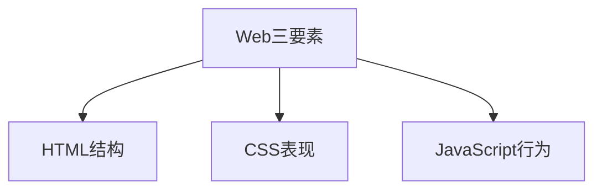
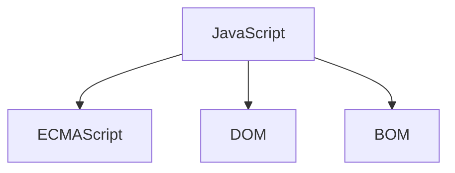
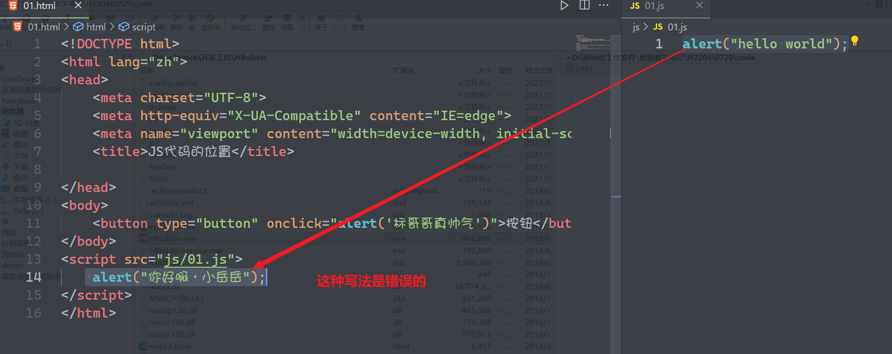
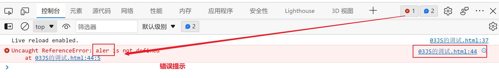
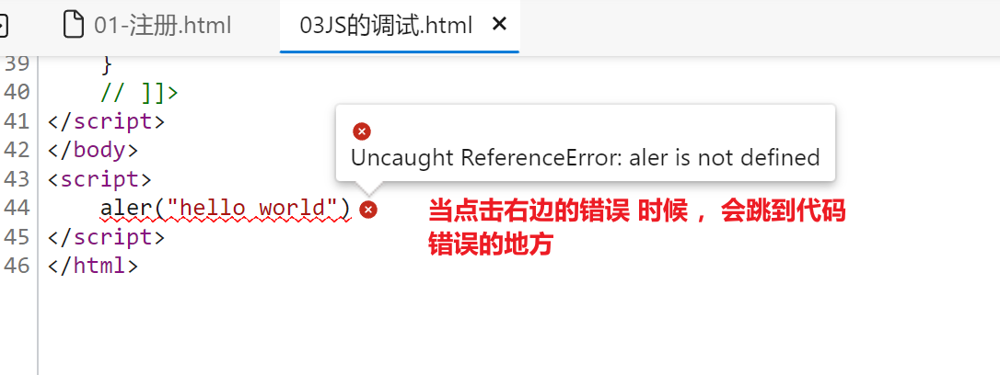

## JavaScript概述

首先回顾一个点，Web三要素



1. 一个页面显示什么是由HTML决定的
2. 一个页面上面的元素怎么显示，显示成什么样式是表现形式决定 （由CSS样式决定）
3. 一个页在上面具备什么功能则是由JS决定

-------

### JavaScript到底是什么？

> 当看到这个单词的时候 ，很多同学可能就会联想到另一个单词`Java`,它与我们的`JavaScript`是一个完全不同的语言，本身不存在任何包含或隶属关系，它是一门独立的弱类型的脚本语言

JavaScript语言是经过了多年了的展，期间经过了几次脚本语言的更新换代，才体现出了JavaScript的特点

在网页当中，脚本的语言的发展经过了几个阶段，我们现在了解一下

1. `asp+VBScript`这是微软推出一第一套网页开发者的技术，本来的目的是为了更好的开发网页，但是这套脚本语言又可以同时运行在window的电脑上面，这样就非常不安全，如果某一个网站存在安全漏洞，则有可能会被注入VBS病毒，这样就会极大的提高病毒的传播面

   同时这套技术对IE浏览器的支持度非常高，而IE被慢慢淘汰以后，这个套技术也被淘汰了

2. `J#+JScript`这是微软推出的第二套网页开发技术 ，用于弥补之前`VBS`下面的bug及不足，`J#`因为侵权`Java`所以停止了，`JScript`因为侵权`ECMAScript`所以被停止了

3. `NetScape`基于`Java`的特性及语言特点，并且在遵守`ECMAScript`的规范下面推出了`JavaScript`脚本语言，这就是目前我们所使用的`JS`语言

JavaScript是一门特殊的语言，它里面一共有3大部分



1. `ECMAScript`简称ES，目前我们主要学习的版本是`ES5/ES6`,`ECMAScript`规定当前语言里面的语法，关键字，流程控制 ，运行符，面向对象，数据类型等
2. `DOM`全称是`document object model`文档对象模型，JS毕竟是一门脚本语言，它需要运行在网页里面，所以它主要的任何就是操作网页，`DOM`这个技术点就是将JS与网页结合 ，能够让JS更快更高效的操作网现，实现网页的交互效果
3. `BOM`全称`browser object model`浏览器对象模型，这一种技术就是让JS去操作浏览器，通过这种技术我们可以让JS去调用设备的硬件信息，如实现缓存，调用蓝牙，GPS，网格状态，摄像头及麦克风等信息

------

### JavaScript 运行在什么地方

JavaScript做为一种脚本语言，它不可能独立运行(`nodejs`除外)，它依附于网页的存在，它的代码可以写在三个地方

**行内的写法**

```html
<button type="button" onclick="alert('标哥哥真帅气')">按钮</button>
```

这一种写法相当于`CSS`里面的行内样式的写法，把`JS`代码写在某一个属性的后面

**内部代码块**

```html
<script>
     alert("吃了没，世界");
</script>
```

这一种写法与`CSS`里面的内部样式块很相似，它必须写在一对`script`的标签里面

这里要注意，正常情况下，`script`标签应该写在`body`标签结束的位置 ，而不是写在`head`标签里面

**写在单独的JS文件里面**

```html
<script src="js/01.js"></script>
```

**注意事项**



如果一个`script`标签引入外部的JS文件，则不能在这个标签的内部去写代码

### JavaScript的注释

```html
<!DOCTYPE html>
<html lang="zh">
<head>
    <meta charset="UTF-8">
    <meta http-equiv="X-UA-Compatible" content="IE=edge">
    <meta name="viewport" content="width=device-width, initial-scale=1.0">
    <title>JS的注释</title>
    <style>
        /* 这是CSS的注释 */
    </style>
</head>
<body>
    <!-- 这是HTML的注释 -->
    
</body>
<script>
    // 单行注释

    /*
        这是代码块的注释
        可以注释多行代码
    */
</script>
</html>
```

在一个页面里面，不同的地方要使用不同的注释方式 ，千万不要搞错了

### JavaScript的调试方法

之前在讲HTML与CSS的时候 ，如果代码写错了，页面上面最多是没有效果的，但是如果是JS代码，则要注意，代码出现错误以后是会在浏览器的控制台表现出来的



它会在**控制台**告诉我们错误在什么地方



