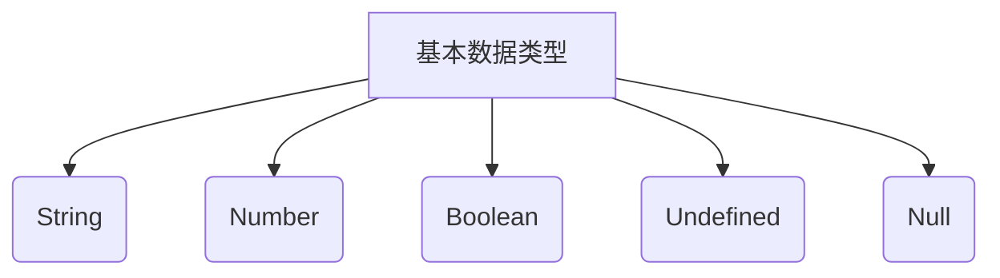
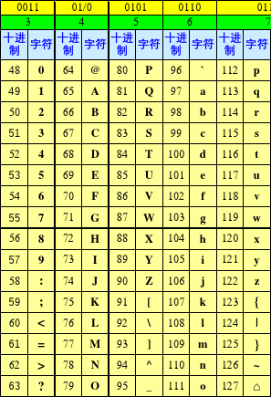
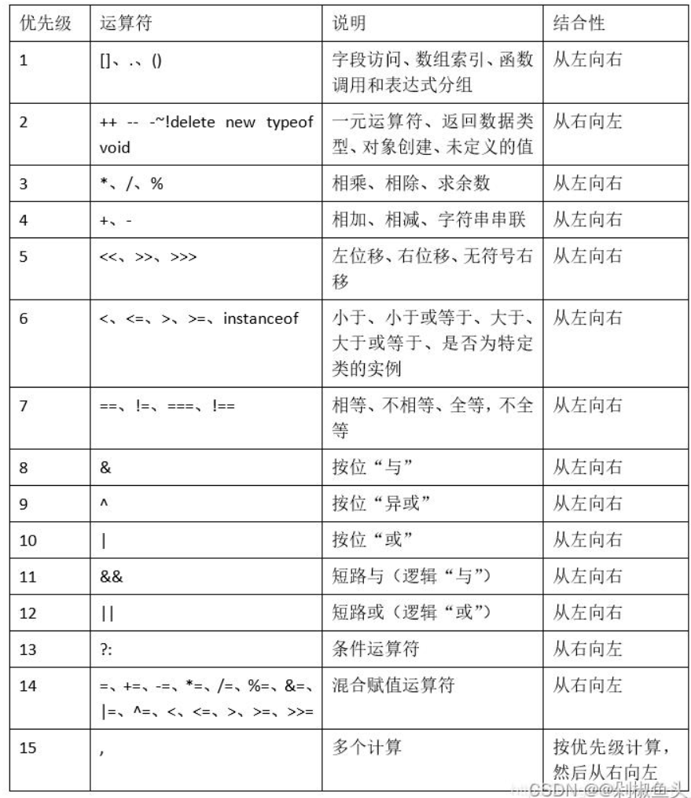

## JavaScript的运算符

JavaScript里面的运算符是一个承上启下的知识点，它对接后面的语句流程控制，承接上面数据类型转换

> JavaScript中有很多运算符，请不要将这些运算符与其它编程语言相比较，如`C/C++/Java`等，它们这些语言都是强类型语言，而我们是弱类型语言（弱类型语言会存在隐式类型转换）

### 一元操作符

#### 一元自加自减操作符


#### 一元递增递减操作符


### 加法操作符


### 减法操作符


### 乘法操作符


### 除法操作符


### 取余操作符

-----

### 布尔操作符[逻辑操作符]

在一门编程语言中，布尔操作符的重要性堪比相等操作符。如果没有测试两个值关系的能力，那么诸如 if...else 和循环之类的语句就不会有用武之地了。布尔操作符一共有 3 个：非（NOT）、与（AND） 和或（OR）。

> 布尔操作符无非就是真或假的运算过程，所以在这里要首先就弄清楚 ，在JS的数据里面，有哪6个明确的`false`值？
>
> 这6个值`0,"",false,null,undefined,NaN`

#### 逻辑非操作符

逻辑非操作符使用的是`!`来表示，它执行的是**非真即假，非假即真**的操作，它的结果一定是一个布尔类型

```javascript
var a = true;
var b = !a;             //false
var c = !(100<101);     //false;
```

如果仅仅只看上面的代码，我们会发现，非运算符是非常简单的，但是要注意JavaScript是一门弱类型语言，所有的类型都可以进行逻辑非的运算（这一点和其它的强类型语言是不一样的），所以它们还可以这样号

```javascript
console.log(!true);            //false
console.log(!123);             //false
console.log(!undefined);       //true
console.log(!0);               //true
console.log(!null);            //true
console.log(!NaN);             //true
console.log(!"");              //true
console.log(!"biaogege");      //false 
console.log(!!"bgg");          //true
```

**操作原则**

1. 它的结果一定是布尔类型
2. 非真即假 ，非假即真
3. 对于不是布尔类型的值的，先通过`Boolean`做隐式类型再换，再取非
4. 一定要注意6个明确的`false`条件

#### 逻辑与操作符

逻辑与操作符执行的是`&&`这个符号进行操作，它执行**一假即假**的原则，它的结果<span style="color:red">不一定</span>是布尔类型

现在我们先通过简单的案例来学习一下

```javascript
var a = true && true;                   //true         
var b = true && false;                  //false
var c = false && false;                 //false
var d = false && true;                  //false
var e = true && false && true;          //false
```

在上面的代码里面，一假即假的操作是非常好判断的。但是也要注意，还是因为JS是一门弱类型语言，在执行逻辑与的操作的时候，不一定全都是布尔值在进行操作，还可以是其它的任何类型 ，请看下面代码 

```javascript
console.log(true && false);                         //false
console.log(true && 123);                           //123
console.log(false && 123);                          //false
console.log(true && "");                            //""
console.log(true && "" && 123);                     //""
console.log(NaN && false);                          //NaN
console.log(NaN && null);                           //NaN
console.log(null && "abc");                         //null
console.log(123 && "abc");                          //"abc"
console.log(0 && 123);                              //0
```

**操作原则**

1. 它的结果不一定是`Boolean`类型
2. "一假即假"的操作
3. 对于不是布尔类型的要拿`Boolean`去测试一下
4. 对于6个明确的`false`的条件要条件
5. 短路原则：当一个表达式已经能够得到结果，就不会再向后面运算

#### 逻辑或操作符

逻辑或操作符使用`||`来表示，它执行**一真即真**的操作，它的结果不一定是布尔类型

还是一样的，先通过几个简单的案例来看一下

```javascript
var a = true || false;                                  //true
var b = false || false;                                 //false
var c = false || true;                                  //true
var d = true || true;                                   //true
var e = true || false || true;                          //true
var f = false || true || false;                         //true
```

同理，这个操作与上面的操作也是相类似的，它也是可以与其它数据类型进行操作的。请看下面代码 

```javascript
console.log(true || 123 || false);                       //true
console.log(false || 123 || false);                      //123
console.log(666 || true || "hello");                     //666
console.log(NaN || false || null);                       //null
console.log(null || "标哥哥");                            //"标哥哥"
console.log(false || NaN);                               //NaN
```

**操作原则**

1. 它的结果不一定是`Boolean`类型
2. "一真即真"的操作
3. 对于不是布尔类型的要拿`Boolean`去测试一下
4. 对于6个明确的`false`的条件要条件
5. 短路原则：当一个表达式已经能够得到结果，就不会再向后面运算

逻辑非，与，非这三个符都逻辑为布尔操作符，我们在工作当中也经常会将这三个操作符结合在一起使用，这个时候怎么办呢：

:question: **小练习**：根据之前所学习的知识以及操作原则，请计算下面的操作结果

```javascript
console.log(true || "" && NaN);                         //true
console.log(666 || !"" || false);                       //6666
console.log(666 && NaN || null);                        //null
console.log("标哥哥" || 123 && NaN);                     //"标哥哥"
console.log(null || 666 && undefined);                  //undefined
console.log(!null || 123 && undefined);                 //true
```

**总的操作原则**

1. 或：一真即真；与：一假即假，非：非真即假，非假即真
2. 先非，再与，最后或
3. 非布尔类的型的要用`Boolean`去测试或转换
4. 弄清楚6个明确的`false`条件
5. 短路原则

-----

### 相等操作符

在`JavaScript`里面，我们如果想判断两个内容是否相等，我们需要使用`==`来表示

> JavaScript里面的相等操作符与其它强类型语言里面的相等操作符不一样，因为JS是一门弱类型的语言，有时候在判断的时候，它在符号左右会发生隐式的类型转换

```javascript
console.log(1 == 2);                                    //false
console.log(1 == 1);                                    //true
console.log(1 == true);                                 //true 第4条原则               
console.log(0 == false);                                //true 第4条原则
console.log("0" == false);                              //true 先适用于第4条原则，再适用于第3条
console.log("10" == 10);                                //true 第3条原则
console.log("" == 0);                                   //true 第3条原则
console.log(NaN == 0);                                  //false 第2条原则
console.log(NaN == NaN);                                //false 第2条原则
console.log(null == undefined);                         //true 第1条原则
console.log("" == null);                                //false 第1条原则或第5条原则
console.log(0 == undefined);                            //false 第1条原则或第5条原则
```

**操作原则**

1. `null`与`undefiend`相等，也可以与自身相等，除此之外，不与任何值相等
2. `NaN`不参于比较，只要比较就是`false`
3. 如果一个是字符串，另一个操作数是数值，则将字符串转成数值
4. 如果是布尔类型 ，则通过`Number`去转换成数字
5. 在比较之前，`null`与`undefined`不参于类型转换
6. 相等操作符的结果一定是布尔类型

### 全等操作符

全等操作符也叫严格相等操作符，它使用`===`来表示，它是弱类型语言里面独有的，因为在上面的相等操作符里面，我们如果直接判断相等，它会做隐匿类型转换，这样做并不严格，有些时候我， 们希望要判断它的数据类型和值都要相等， 这个时候我们就使用严格相等

> 全等操作符一定是符号两边的数据类型和数据的值都相同，结果才为`true`，否则一律为`false`



```javascript
console.log(1 === 2);                             //false      
console.log(1 === 1);                             //true         
console.log(1 === true);                          //false
console.log(0 === false);                         //false      
console.log("0" === false);                       //false    	
console.log("10" === 10);                         //false     
console.log("" === 0);                            //false      
console.log(NaN === 0);                           //false     
console.log(NaN === NaN);                         //false     
console.log(null === undefined);                  //false     
console.log("" === null);                         //false     
console.log(0 === undefined);                     //false 
```

**操作原则**

1. 符号两边数据类型要相同
2. 符号两边数据的值相同
3. `NaN`不参于比较，只要比较就是`false`
4. 结果一定是布尔类型

### 不相等操作符

不相等操作主要就是`!=`与`!==`，它其实就是把相等操作符或全等操作的结果取反就可以了

```javascript
console.log(1 != 1);            //false
console.log(1 !== "1");         //true
console.log(1 != "1");          //false
console.log(null != undefined);   //false;
console.log(NaN != NaN);         //true 
```

### 关系操作符

小于（<）、大于（>）、小于等于（<=）和大于等于（>=）这几个关系操作符用于对两个值进行比 较，比较的规则与我们在数学课上所学的一样。这几个操作符都返回一个布尔值，

```javascript
var result1 = 5 > 3; 			//true
var result2 = 5 < 3; 			//false
```

上面的关系操作符的结果都是准备的，但是要注意一点，JavaScript是一个弱类型的语言，它有可能会发生隐式数据类型转换，所以我们符号左右两边的数可能并不是同一个数据类型 ，这怎么办呢？

```javascript
console.log("1" < 2);               //true   第2条原则
console.log("1" < "2");             //true   第4条原则
console.log("11" < 2);              //false  第2条原则
console.log("11" < "2");            //true   第4条原则
console.log(true < 2);              //true   第3条原则
console.log(true < "2");            //true   先适用第3条，再适用第2条
console.log("aa" < "b");            //true   第4条原则
console.log("aa" < "ab");           //true   第4条原则
console.log("A" < "a");             //true   第4条原则
console.log(null < 1);              //true   第6条原则
console.log(NaN <= 0);              //false  第7条原则
console.log(undefined < 1);         //false  先适用第6条，再适用于7条
console.log("我" > "你");            //true   第5条原则
console.log("0x12" <= 12);           //false  第2条原则，注意前面是16进制 
console.log("0x12"<="12");           //true   第4条原则
```

**操作原则**

1. 如果2个数是数值，则直接比较大小
2. 如果有1个是数值，另一个不是数值，则将另一个数通过`Number`转换一下
3. 如果有一个操作数是布尔值，则先通过`Number`去转换
4. 如果2个操作数都是非中文的字符串，则比较`ascii`码
5. 如果有中文字符串，则比较`unicode`编码【目前这一块，你们没有学，要到后面讲面向对象才会讲到】
6. 对于非数字类型的，则通过`Number`隐式类型转换一下
7. `NaN`不参于比较，只要比较就是`false`



### 条件操作符

条件操作符也叫三目运算符，它是根据一个条件来进行赋，在有些编程语言里面也叫三元表达式。条件操作符的基本语法格式如下

```javascript
var a = 条件是否成立?条件成立的值:条件不成立的值;
```

现在先看几个简单的例子

```javascript
var a = true ? "标哥哥" : "帅哥哥";				//标哥哥
var b = false ? "帅气" : "多金";			     //多金
var c = 1 > 2 ? "颜一鸣" : "小鸣";				//小鸣
```

按照条件操作符的要求，前面的条件一定要是`Boolean`值才行，但是因为JS是一门弱类型的语言，它的前面不一定会得到布尔类型的值，这个时候我们就要将这个条件使用`Boolean`去测试一下，再去进行后面的操作

```javascript
var a = 666 ? "你好" : "我好";                      //你好
var b = null ? "hello" : "world";                  //world
var c = 1 > NaN ? "你好" : null;                    //null  
var d = c ? "你好" : "大家好";                       //大家好
```

条件表达式在它是根据一个条件来进行赋值，在平常开发当中它的应用非常广泛，如下

```javascript
var a = 3;
var b = 4;
var max;
//请使用条件表达式，来将a与b当中较大的一个值赋值给max
max = a > b ? a : b;
```

上面的条件表达式，可以将较大的一个值赋值给`max`，我们现在再将上面的案例升级一下

```javascript
var a = 3;
var b = 4;
var c = 5;
var max;
//请使用条件表达式，将a,b,c三个当中最大的一个值给max;
```

**第一种写法**

```javascript
//第一步：先计算a,b当中比较大的一个值
var temp = a > b ? a : b;  
//这个时候的temp就是a和b当中大的那个值
//第二步：再将temp与c相比较
var max = temp > c ? temp : c;
```

现在再将上面的2行代码转换成1行代码

```javascript
var max = (a > b ? a : b) > c ? (a > b ? a : b) : c;
```

**第二种写法**

```javascript
// var max = a > b ? (成立以后a,c比较) : (不成立b,c比较);
var max = a > b ? (a>c?a:c) : (b>c?b:c);
```

> 条件操作符的本质就是根据一个条件去执行某些事件【后期会带出流程控制】

----

### 赋值运算符

赋值运算符使用的是`=`来表示，这个在之前讲变量的时候已经讲过了。赋值运算符是**将符号右边的值赋值给符号左边**

```javascript
var a = 123;   //将右边的123赋值给左边的变量q
```

赋值运算符是一个非常简单的操作符，只有一个注意事项就是符号的左边必须是一个定值（在赋值的一瞬间是一个定值）

<span style="color:red">赋值运算符是一个特殊的运算符，它是从右向左再进行操作，所以在操作的一瞬间，它左边的值是不允许发生变化的</span>

```javascript
var a = 10;
var b = 20;
a = b;			//赋值的时候a是一个固定的值，没有发生变化，所以它不会报错，赋值完成以后它就是20
a++ = b;		//错误的，b赋值给了a,a说我不要你的值，我自己在变化，这个时候左边的值就没有固定
+a = b;			//错误的，原因仍然是左边的值不是定值
a = b++;		
```

赋值运算符主要是以下的几种

```javascript
var a = 10;
a = a + 20;
//上面的写法还可以简写成下面的形式
a += 20;
var b = 5;
b -= 3;       //b = b-3;

var c = 10;
c += c;
```

上面的这种操作叫**复合赋值运算符**，根据上面的情况，我们可以依次类推

* 乘/赋值(*=)
* 除/赋值(/=)
* 加/赋值(+=)
* 减/赋值(-=)
* 模/赋值(%=)

### 逗号操作

逗号运算符是一个最最最基础的运算符，它代表一条语句没有完，或一个关键字的作用没有完，**逗号代表一个操作没有结束**

请看下面代码

```javascript
// var a ;
// var b;
// var c;
var a, b, c;
```

同理，我们还可以继续向下面看

```javascript
// var a = 10;
// var b = 20;
// var c = 30;
var a = 10, b = 20, c = 30;
```

----

### 操作符的优先级

现在我们已经学习了很多运算符，如果运算符结合在一起了，就会有优先级的问题，具体的优先级请看下面

1. `.()[]`
2. 一元操作符`++,--`
3. 算术运算符[先乘除，后加减]
4. 关系操作符`>,<,>=,<=,==,!=`
5. 逻辑操作符[先非，再与，最后或]
6. 三目运算符
7. 赋值运算符

```javascript
var num = 10;
var x = 5 == num/2 && (2+2*num).toString()=="22";
console.log(x);
```

上面的代码，我们来通过运算符的优先级来计算一下

```javascript
//var x = 5 == num/2&&(2+2*10).toString()=="22";
//var x = 5 == num/2&&(2+20).toString()=="22";
//var x = 5 == num/2&&(22).toString()=="22";
//var x = 5 == num/2&&"22"=="22";
//var x = 5 == 10/2&&true;
//var x = 5 == 5&&true;
//var x = true&&true;
var x = true;
```





### 小练习

1. 计算下面的结果

   ```javascript
   var a = 10;
   ++a;  //11
   var b = ++a+2;
   console.log(b);   //14
   
   
   var c = 10;
   c++;   //10
   	   //11
   var d = c+++2;   //11+2 = 13
   console.log(d);  //d=13   c = 12
   
   
   var e = 10;
   var f = e++ + ++e;    //10 + 12 = 22
   console.log(f);
   ```

   
