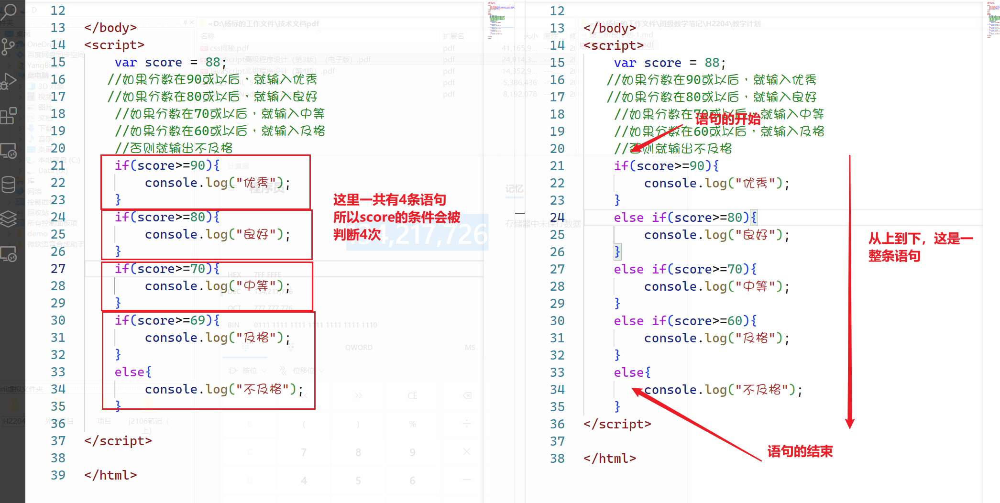

## JavaScript语句

语句是构成编程系统当中的最小单位，它是用于完成某些特定的逻辑功能，也是为了完成代码的流程控制的，所以语句也叫流程控制

语句大体上来说可以分为以下几类

1. 分支语句
2. 循环语句
3. 选择语句

所有的语句都应该是由一个或多个关键字来完成的

### if...else


`if...else`是我们的语句当中的分支语句，它用于做条件判断 ，来控制代码的执行流程，它的语法格式如下

```javascript
if(条件1){
    //符合条件1的时候
}
else if(条件2){
    //后面还有好多条件....
}
else{
    //不满足条件的时候
}
```

如下所示

```javascript
var a = 10;
var b = 20;
// 如果a>b则输出"你好",否则就输出“你不好”
// console.log()
if (a > b) {
    console.log("你好");
}
else{
    console.log("你不好");
}
```

上面的代码是一个非常简单的流程控制，我们只有一个条件。但是这里仍然有几个注意事项给大家说一下

```javascript
var a = 10;
var b = 20;
if(a>b)
    console.log("你好");
else
    console.log("你不好");
```

> 当代码体只有一行的时候，我们可以省略花括号【不建议这么支操作，很容易形成岐义，也很容易出错】

**请看下面的要求及代码**

```javascript
var score = 88;
//如果分数在90或以后，就输入优秀
//如果分数在80或以后，就输入良好
//如果分数在70或以后，就输入中等
//如果分数在60或以后，就输入及格
//否则就输出不及格
```

**第一种情况下的代码**

```javascript
if(score>=90){
    console.log("优秀");
}
if(score>=80){
    console.log("良好");
}
if(score>=70){
    console.log("中等");
}
if(score>=69){
    console.log("及格");
}
else{
    console.log("不及格");
}
```

> 上面的代码写法是有问题的，它有所有的if都是一个**并行条件**，它会把所有的`if`条件都测一遍，只要是符合要求了，就执行了。
>
> 最终打印的结果就是“良了，中等，及格”

**第二种情况下的代码**

```javascript
if(score>=90){
    console.log("优秀");
}
else if(score>=80){
    console.log("良好");
}
else if(score>=70){
    console.log("中等");
}
else if(score>=60){
    console.log("及格");
}
else{
    console.log("不及格");
}
```

> 上面的代码最终打印输出“良好”，它所有的条件都是串行的条件，它要符合了一个要求，就会中断语句，提前结果



现在我们分别用2张图来说明这个情况

**多个if的情况**


**if...else的情况**


在`if`与`else ...if`里面，一共定要弄清楚它们的区别点是什么

if是对条件进行判断的的时候成立的时候执行的语句，那么如果`if`的条件的值不是一个`boolean`类型怎么办，如下所示

```javascript
var a = 123;
var b = 0;

if(a){
    console.log("你好");
}
else{
    console.log("世界");
}

if(b){
    console.log("hello");
}
else {
    console.log("world");
}
```


> 一定要弄清楚之前给大家讲过了JS里面6个明确的false条件

### for循环语句

for 语句也是一种 ，它会循环的执行代码体里面的代码，它的语法格式如下

```javascript
for(初始值;循环前测试条件;自变量){
    //代码体
}
```

现在我们先从生活当中的最基本的例子来讲起，请看以下场景 

**场景一**：标哥有钱了，办了一个砖厂，颜一鸣同学在标哥这里在搬砖，今天标哥交给颜一鸣的任务就是要搬10块砖。因为颜一鸣的个子比较小，所以一次只能搬动1块砖。那么请用代码来说明一下颜一鸣搬砖的过程

针对上面的地场景，我们要弄清楚几个问题

1. 颜一鸣从第1块开始搬砖
2. 颜一鸣要搬10块
3. 颜一鸣每次搬1块

首先，我们就使用搬砖的思维方式来考虑这个问题

```javascript
for (var count = 1; count <= 10; count++) {
     console.log("颜一鸣从在搬" + count + "块砖");
}
```

**场景二**：颜一鸣经过多年的搬砖生活以后，肌肉变得发达了，现在可以一次搬2块砖了，标哥很欣慰，看到了颜一鸣的成长，今天又给颜一鸣派了一个新的任务，让颜一鸣还是砖10块砖，颜一鸣听后非常高兴说道：“小意思啦，我现在是大力士了，可以一次搬2块，来，看我的表演”

现在请根据上面的场景，来使用编程思维解决

1. 颜一鸣从第1块开始搬砖
2. 颜一鸣要搬10块
3. 颜一鸣每次搬2块

```javascript
for (var count=1; count<=10; count+=2) {
    //代码体
    console.log("颜一鸣从在搬" + count + "块砖");
}
```

**场景三**：功夫不负有心人，颜一鸣经过了这么长时间在标哥这里的打拼，小有资本，它偷偷的搬了4块砖藏起来了。今天看到标哥，格外的神气一些，标哥不舒服了。说道：“来，小伙子，给你个光荣而又艰巨的任务，今天要搬20块砖，随便你怎么搬”。颜一鸣听后，无所谓的道：“没事，可以的，我可以一次搬2块砖”，同时颜一鸣心底还乐道：“嘿嘿，我之前还有4块砖藏着，可以直接使用，这样我就可以从第5块直接开始了”

现在请根据上面的场景来使用编程的思维解决

1. 颜一鸣从第5块开始
2. 颜一鸣要搬20块
3. 颜一鸣每次搬2块

```javascript
for(var count = 5;count<=20;count+=2){
    console.log("颜一鸣从在搬"+count+"块砖");
}
```

> 在上面的3个场景里面，我们可以看到，for循环里面的三个条件我们是可以根据实际的场景去做出相应的改变的，这个三个条件代表的是什么意思，同学样一定要知道

### 循环的本质

for循环的本质其实就是指for循环代码的执行过程是什么样式，我们现在通过断点调试的方式来进行

```javascript
debugger;
for (var i = 1; i <= 10; i++) {
    console.log(i);
}
```

当我们在代码里面添加了`debugger`这个关键字以后，代码在运行的时候，就会在这个地方暂停下来


通过上面的图，我们可以知道，循环的本质就是在不停的去执行三个地方的代码

1. 判断循环条件是否成立
2. 执行代码体
3. 自变量要变化

循环的本质，我们已经知道了，现在我们弄清楚一个点，这三个条件是否都是必须的

**第一种情况，如果没有初始变量，怎么办**

```javascript
var count = 1;      //循环的初始变量是可以写在外边的
for (; count <= 10; count++) {
    console.log(count);
}
```

**第二种情况，省略循环的判断条件**

```javascript
for(var count=1;;count++){
    console.log(count);
}
//省略了循环的结束判断条件，那么这个循环就会一直进行，它就是一个死循环
```

**第三种情况，省略自变量**

```javascript
for(var count=1;count<=10;){    //省略了自变量，它也会变成一个死循环
    console.log(count);
}
```

综上所这述，for里面的三个东西，是都可以省略了

```javascript
for(;;){
    console.log("hello world");
}
```

上面的语法是没有错的，但是它是一个死循环

**小练习**

1. 请打印1~100之间的偶数

   ```javascript
   /**
        * 开始条件：2
        * 结束条件：100
        * 自变量：2
   */
   for (var i = 2; i <= 100; i = i + 2) {
       console.log(i);
   }
   ```

   还有一种写法

   ```javascript
   /**
        * 开始条件：1
        * 结束条件：100
        * 自变量：1
   */
   for (var i = 1; i <= 100; i++) {
       // 下面打印这句话，不是必须的，它有条件执行
       // 条件成立我就执行，条件不成立，我就不执行
       if (i % 2 === 0) {
           console.log(i);
       }
   
   }
   ```

2. 计算1+2+3+....+10的总和

   ```javascript
   /**
        * 初始值：1
        * 结束值：10
        * 自变量：1
   */
   var sum = 0;
   for (var i = 1; i <= 10; i++) {
       sum = sum + i;
   }
   console.log(sum);
   // 第一次循环 sum  = 0 + 1;
   // 第二次循环 sum  = 0 + 1 + 2;
   // 第三次循环 sum = 0 + 1 + 2 + 3;
   // 第十次循环 sum = 0 + 1+ ......+10
   ```

------

### while循环语句

while循环语句与for循环的语句的本质是一样的，都是一样**前测试循环语句**，它的语法格式如下

```javascript
while(循环条件){
    //代码体
}
```

while是当循环条件成立的时候会一直执行的代码 ，这个和我们之前所学习的for循环是一样的。我们之前在讲for循环的时候讲到过循环的三个条件 

1. 初始值
2. 循环条件
3. 自变量

```javascript
for(var i=1;i<=10;i++){
    console.log(i);
}
```

上面的`for`循环可以写成下面的样式

```javascript
//之前我们都讲过，循环里面的三个部分，是可以拆分来写的
var i=1;
for(;i<=10;){
    console.log(i);
    i++;
}
```

现在我们就将上面的`for`转写成`while`循环

```javascript
var i=1;
while(i<=10){
    console.log(i);
    i++;
}
```

-------

### break与continue

在上面的章节讲循环的时候，我们提到了循环的次数是由3个条件共同决定的，但是在某些特定的条件下面，它会提前结束循环

正常情况下，我们的循环代码当条件不成立以后会自动退出循环，但是在JS里面，仍然有2个关键字会让循环中途退出，这2个关键字就是`break`与`continue`

* `break`有中断循环地的意思，提前结束循环，后面的循环不再进行了【半途而废】
* `continue`的意思就是跳过本次循环，继续执行下一次循环【浪子回头】

**场景一**：假设颜一鸣给标哥搬10块砖，但是颜一鸣在搬到第5块砖的时候就接到他爸爸的电话，说：“儿啊，你爸我中了彩票，5000万，你要做富二代了”，颜一鸣听了这个话以后，非常兴奋，直接把手上的砖一丢，说：“去TMD，我也是富二代了”

面对上面的场景，我们怎么办呢？

```javascript
/*
	初始值：1
	结束值：10
	自变量：1
*/
for(var count=1;count<=10;count++){
    //现在颜一鸣要他爸电话
    if(count==5){
        break;
		//因为是break,所以提前结束了循环，后面的次数也不再进行了
    }
    console.log("颜一鸣正在搬"+count+"块砖");
}
```

**场景二**：颜一鸣拿着他爸爸给了5000，怀揣着梦想去了一个心仪已久的城市---东莞，结果被骗了，身心疲惫的回到了标哥的身边继续搬砖，突然之间它觉得，在这个炎炎夏日里，还是只有标哥里的心是最温暖的，只有标哥对自己好！下定决心的颜一鸣决定要在标哥这里好好奋斗，做一个最强的搬砖人。标哥给颜一鸣派发了又一次的任务，**搬10块砖，从第1块开始，因为天气太热，所以就1次只搬一次**，这个时候正当颜一鸣开心的搬砖的时候，在耳边双听到了标哥的声音：”一鸣 ，你爸电话“

颜一鸣听到标哥的声音以后，身体一震，**把手上的砖一丢**，带着期望的眼神走向了办公室去接听电话，颤抖的声音说道：”爸呀，你又买彩票了？“

只见电话那头许久未曾出声，接着，一个声音慢悠悠的说道："儿啊，你爸我失业了，给爸打点钱"

标哥在旁边看了许久，也不知道电话那头具体说了些什么，只见颜一鸣听完电话以后，神低落的走出了办公室 ，嘴里还喃喃的说道：“其它那些砖也不那么烫手了，我要继续搬砖，争取今天搬到100块，拿到今天的饭钱，这样我就可以请我的女神吃饭了”

针对上面的场景 ，我们又应该怎么样使用编程的思维去解决呢？

```javascript
for (var count = 1; count <= 10; count++) {
    // 当搬到第5块砖的时候 ，颜一鸣接电话去了
    if(count==5){
        //接电话
        continue;
    }
    console.log("颜一鸣正在搬" + count + "块砖");
}
```

### 嵌套的循环

循环也是可以嵌套的，如多个for循环是可以嵌套在一起的

```javascript
for(var a=1;a<=10;a++){
    for(var b = 1;b<=10;b++){
        //代码体
    }
}
```

在上面的代码里面，我们可以看到，循环是可以进行嵌套的，嵌套的循环也可以有多层的嵌套关系，只要循环的语法是正确的，并且不要形成死循环就好

现在请根据下面的图片打印九九乘法表，这里会使用到2层的嵌套循环


```javascript
 for (var row = 1; row <= 9; row++) {
     var str = "";
     for (var col = 1; col <= row; col++) {
         str += col + "*" + row + "=" + col * row + "\t";
     }
     console.log(str);
 }
```


-----

### 练习

1. 一张纸的厚度是0.0001米，将纸对折，对折多少次厚度超过珠峰高度8848米。

   ```javascript
   /**
        * 实始值:厚度0.0001米
        * 终止值:厚度8848米
        * 自变量：在原来的上面x2
   */
   var count = 0;   //次数
   for (var height = 0.0001; height <= 8848; height *= 2) {
       count++;      //每次对折以后，次数都要加1
   }
   console.log(count);
   ```

   上面的代码其实我更愿意以下面的方式来完成

   ```javascript
   var count = 0;  
   var height = 0.0001; 
   for (; height <= 8848;) {
       count++;   
       height *= 2;  
   }
   console.log(count);
   ```

   在上面的场景 里面，我们可以把`for`换成`while`，这样更好理解一些

   ```javascript
   var height = 0.0001;
   var count = 1;
   
   while(height<=8848){
       height *= 2;
       count++;
   }
   console.log(count);
   ```

2. 有一篮球从5米高处自由落下，每次弹起的高度是上一次的1/3，当篮球弹起的高度小于0.1米以后 就不再弹起了，请问，这个篮球会弹起多少次？

   ```javascript
   // 结束条件：小于0.1
   // 初始值：5m
   var height = 5;
   var count = 0;
   // 一直弹，直到小于0.1
   while (height >= 0.1) {
       height = height / 3;
       count++;
   }
   console.log(count);
   ```

3. 打印出所有的水仙花数(提示：水仙花数的范围在111~999之间) 水仙花是指一个三位数，它的每个位上的数字的3次幂之和等于它本身（例如：1<sup>3</sup> + 5<sup>3</sup>  + 3<sup>3</sup>  =153）

   **第一种解法**

   ```javascript
   for (var num = 111; num <= 999; num++) {
       // 百位
       var a = ~~(num / 100);
       // 十位
       var b = ~~(num % 100 / 10);
       // 个位
       var c = num % 10;
       if (num === a * a * a + b * b * b + c * c * c) {
           console.log(num);
       }
   }
   ```

   **第二种解法**

   ```javascript
   // 假设百位是a,十位是b,个位是c
   for (var a = 1; a <= 9; a++) {
       for (var b = 0; b <= 9; b++) {
           for (var c = 0; c <= 9; c++) {
               // a:1,b:5,c:3   
               /*
               if (a * a * a + b * b * b + c * c * c === a * 100 + b * 10 + c) {
                   console.log(a * 100 + b * 10 + c);
               }
               */
               if (a * a * a + b * b * b + c * c * c === +("" + a + b + c)) {
                   console.log(a * 100 + b * 10 + c);
               }
           }
       }
   }
   ```

4. 有一个台阶，如果一次跨2个，则最后剩下1阶，如果一次跨3个，则最后剩下2阶，如果一次跨5 个，则最后剩下4阶，如果一次跨6个，则最后剩下5阶，如果一次跨7个，则刚刚好跨完，请问这 个台阶最少为多少阶?

   ```javascript
    // 我要一个一个的去找这个数，直到找到符合要求的为止
   var num = 1;
   while (true) {
       if (num % 2 === 1 && num % 3 === 2 && num % 5 === 4 && num % 6 === 5 && num % 7 === 0) {
           console.log(num);
           break;
       }
       num++;
   }
   ```

5. 羽毛球拍15元，球3元，水2元。200元每种至少一个，有多少可能？

   ```javascript
   // 球拍是a，球是b，水是c
   // 全部买球拍 200/15            1
   // 全部买球 200/3               1
   // 全部买水 200/2               1
   for (var a = 1; a <= 200 / 15; a++) {
       for (var b = 1; b <= 200 / 3; b++) {
           for (var c = 1; c <= 200 / 2; c++) {
               if (a * 15 + b * 3 + c * 2 === 200) {
                   console.log(a, b, c);
               }
           }
       }
   }
   ```

6. 百马百担问题，有100匹马，驮100担货，大马驮3担，中马驮2担，2匹小马驮1担，求大、中、小 各多少匹？

7. 打印出100以内的素数。

8. 括号里面只能放加或减，如果要使等式成立，括号里面应该放什么运算符

   ```javascript
   12（）34（）56（）78（）9 = 59
   ```

9. 题目：日本某地发生了一起谋杀案，警察通过排查确定杀人凶手为4个嫌疑犯的一个，以下为四个嫌疑犯的供词 

   A说：不是我 

   B说：是C 

   C说：是D 

   D说：C在胡说 

   已知三个人说了真话，一个人说了假话，请编程找出凶手

10. 5位运动员参加了10米台跳水比赛，有人让他们预测比赛结果

    A选手说：B第二，我第三。

    B选手说：我第二，E第四。

    C选手说：我第一，D第二。

    D选手说：C最后，我第三。

    E选手说：我第四，A第一。

    比赛结束以后，每位选手都说对了一半，请编程确定比赛的名次

11. 有一对幼兔，幼兔1个月后长成小兔，小兔1个月后长成成兔并生下一对幼兔，问8个月后有多少对兔子，幼 兔、小兔、成兔对数分别是多少

12. 猴子吃桃问题：猴子第一天摘下若干个桃子，当即吃了一半，还不过瘾，又多吃了一个，第二天早上又将剩下的桃子吃掉一半，又多吃了一个。以后每天早上都吃了前一天剩下的一半零一个。到第10 天早上想再吃时，见只剩下一个桃子了。求第一天共摘了多少？（提示：采用逆向思维的方向 ， 从后向前推算）