## 二进制运算符

> 二进制运算符做为选讲内容

二进制运算符也叫位运算符，它按数值的位来进行运算，在`ECMAScript`的系统里面，<u>**所有的数据都是用64位存储 ，32位运算**</u>，如果进行二进制的位运算，需要先将原来的数值转换成2进制操作

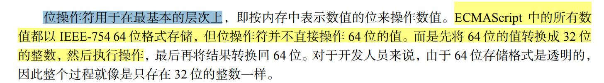


### 按位非（NOT）

按位非操作符由一个波浪线（~）表示，执行按位非的结果就是返回数值的反码。按位非是 ECMAScript 操作符中少数几个与二进制计算有关的操作符之一。

```javascript
var num1 = 25;
var num2 = ~num1;    
```

现在来看它的计算过程

**第一步：先将这个数转2进制**

```javascript
num1.toString(2);    //11001
```

**第二步：补码**

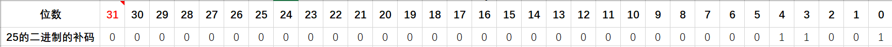

**第三步：取反**

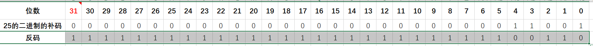

取反以后，我们发现它的最高位31位是一个数字`1`,这就说明这个数是一个负数，<span style="color:red">负数的二进制是需要进行转码的</span>

**第三步：将负数的二进制转码**

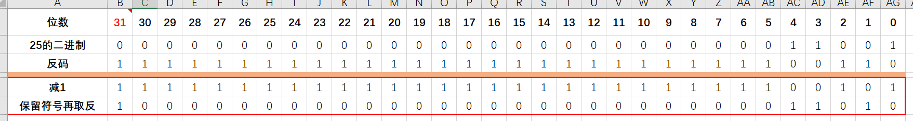

将负数的二进制转码以后，得到的结果是`11010`,但是它的符号位是`1`说明它是一个负数

```javascript
parseInt("11010",2);     //26
//因为符号位是负数，所以最终的结果是-26
```

通过上面计算，其实我们发现二进制的取反过程它就是将原来的数乘以`-1`再减去1就可以

### 按位与（AND）

按位与操作符使用的符号是`&`

```javascript
var result = 18 & 3;   
```

这个操作过程也很简单

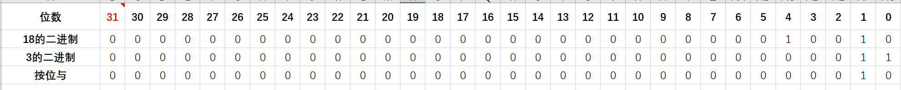

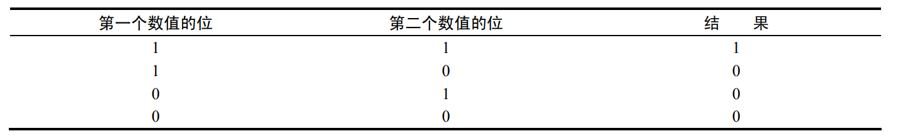

### 按位或（OR）

按位或操作符由一个竖线符号（|）表示，同样也有两个操作数。按位或操作遵循下面这个真值表


```javascript
var result = 23 | 71;
```

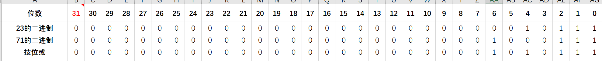

得到结果87

**小练习**

```javascript
var result1 = ~-17;     				//16

var result2 = -16 & 8;					//0

var result3 = -22 & -18;			    //-22

var result4 = -4 | 5;

var result5 = -5 | -6;
```

上面的练习里面有负数，对于负数的二进制要以补码的形式去完成

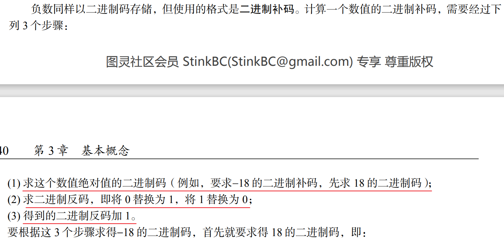

### 按位异或（XOR）

按位异或操作符由一个插入符号（^）表示，也有两个操作数。以下是按位异或的真值表。

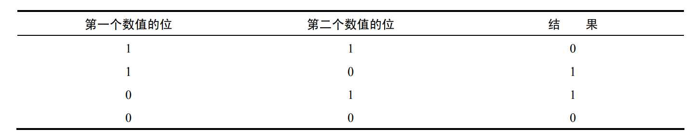

```javascript
var result = 25 ^ 3;         //26
```

### 左移

按位左移运算符使用`<<`来表示

```javascript
var a = 2;
var b = a<<5;				//64
```

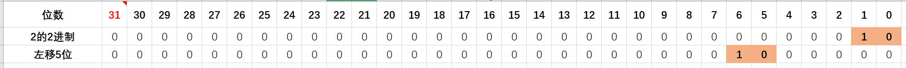

###  有符号的右移

有符号的右移操作符由两个大于号（>>）表示，这个操作符会将数值向右移动，**但保留符号位**（即 正负号标记）。有符号的右移操作与左移操作恰好相反

```javascript
var a = 64;
var b = a>>5;
```

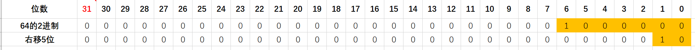

### 无符号右移

无符号右移操作符由 3 个大于号（>>>）表示，这个操作符会将数值的所有 32 位都向右移动。对正数来说，无符号右移的结果与有符号右移相同，但对于负数来说，这个结果是会有影响的，因为负数的最高位是`1`

```javascript
var a = -64;
var b = a>>>5;		//134,217,726
```

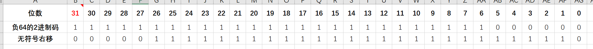

### 注意事项

1. 所有二进制的操作符都不对小数进行操作，后期我们可以复用这个特点来快速的将一个数值取整

   ```javascript
   var a = 3.14;
   var b = ~~a;  //3;
   ```

2. 左移与右移运算符不得超过原有的计算机位数，如果超过了，将返回一个毫无意义的数