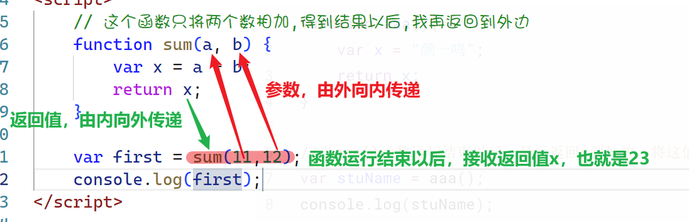

## 函数

函数对于编程语言来说是一个核心的概念，通过函数我们可以封装*任意多条语句*，<u>在任何地方任何时候</u>**调用执行**

1. 任意多条语句
2. 任意地方任何时候
3. 调用执行

在ECMAScript里面，函数是通过关键字来定义`function`

> 在学习函数之前，有些概念要先跟大家理清一下
>
> 函数也叫方法，在面向过程的编程语言里面它叫函数 ，在面向对象的编程语言里面，它叫方法。在JS当中你可以认为函数与方法就是一个东西

在学习这个章节之前，我们先要弄清楚一个问题，为什么需要函数 ，如果没有函数会有什么问题？

```javascript
console.log("--------------------------------");
console.log("颜一鸣说他是我们班最帅的男孩子...");
console.log("--------------------------------");


// 再次打印一次

console.log("--------------------------------");
console.log("颜一鸣说他是我们班最帅的男孩子...");
console.log("--------------------------------");
```

如果上面的代码我们要不停的打印，或不固定的时间和地址点去打印，这样每次在使用之前我们都要去书写那三行代码，这个会很麻烦

> 同学们就想一下，有没有什么办法将这三条语句组合起来，就像我们之前在讲CSS的时候，如果多个页面有相同的样式，我们可以把样式写在公共的文件里面，然后通过`link`标签引入就可以了
>
> JS也可以使用类似的原理，我们把公共的代码封装起来，要的时候直接调用就可以了

### 函数的定义

目前来说函数的定义方式是多种多样的，我们只学习ECMAScript中的标准定义方式，其它的定义方式我们到后面再学习

函数的定义使用的是关键字`function`，它的语法格式如下

**第一种定义方式**

```javascript
function 函数名(参数...?){
    //函数的代码体
}
```

```javascript
// 封装了我们的第一个函数
function sayHello() {
    console.log("--------------------------------");
    console.log("颜一鸣说他是我们班最帅的男孩子...");
    console.log("--------------------------------");
}
```

**第二种定义方式**

> 函数的定义其实与变量的定义是一样的，它也可以通过变量赋值的方式来完成

```javascript
var 函数名 = function(参数...?){
    //函数代码码
}
```

这一种定义方式其实就是将一个函数赋值给了一个变量

上面的代码我们可以同时使用下面的方式来完成

```javascript
// 第二种定义方式
var sayHello = function(){
    console.log("--------------------------------");
    console.log("颜一鸣说他是我们班最帅的男孩子...");
    console.log("--------------------------------");
}
```

:tiger:**警告**：<u>两种定义方式最终得到的效果是一样的，唯一的区别就在于它们的调用方式，同学样在本阶段（没有进入ES6之前）先只使用第一种方式来定义</u>

**两种函数定义的区别**

```javascript
aaa();						//在定义之前调用不会报错
function aaa(){
    console.log("我是函数aaa");
}

bbb();						//通过var定义的函数在定义之前调用就会报错
var bbb = function(){
    console.log("我是函数bbb");
}
```

> 通过`function`关键字定义的函数是可以在任何地方调用执行的，但是通过`var`定义的函数只能在定义之后再调用执行（原因：后面会讲到一个东西叫执行上下文Execute Context）

### 函数的调用执行

一个函数封装完成以后，它不是自已执行，它只会调用以后才执行（所以函数也叫调用执行）

函数的调用执行方式非常简单，只需要通过`函数名()`就可以了

```javascript
//这里是函数的封装
function sayHello() {
    console.log("--------------------------------");
    console.log("颜一鸣说他是我们班最帅的男孩子...");
    console.log("--------------------------------");
}

// 函数名+()来调用执行
// 上面的函数名是sayHello,我们调用就可以通过下面的方式来进行
sayHello()
```

### 函数的检测

函数也可以看成是一个变量，变量就会有数据类型 ，如果想检测一个变量是否是函数，我们可以通过关键字`typeof`来完成

```javascript
var aaa = function(){

}

function bbb(){

}
console.log(typeof aaa);            //"function"
console.log(typeof bbb);            //"function"
```

-----

### 函数作用域【重点】

之前我们在讲解变量的时候，我们只是讲解了变量的定义，并没有讲解作用域的概念，如下所示

```javascript
{
    var a = 123;
}

console.log(a);
```

在上面的代码当中会正常的打印输出`123`。这是因为在JS里面，普通的花括号是形成不了作用域，形成不了作用域，那么我们就把这些变量全都叫做**全局变量**

```javascript
if(true){
    var a = 123;
}
console.log(a);   //123
```

:flags: **总结一**：在ECMAScript里面， 普通的花括号，如`if,else,while,for,do`等一系列的，都形成不了作用域，所以这些作用里面的变量全都是全局变量

只有通过函数的花括号里面定义变量才是**局部变量**

```javascript
function bgg(){
    var b = 456;      //这里定义的b是局部变量，只能在bgg这个函数里面使用
}

console.log(b);   //报错
```

:flags: **总结二**：函数体的花括号会形成作用域


### 函数的参数

函数的参数是一种特殊范围的变量，它可以实现函数外部的赋值，同时函数的内部也可以使用

请看下面的场景 

```javascript
 function sayHello() {
     console.log("-----------------------------");
     console.log("颜一鸣说他是我们班最帅的男孩子...");
     console.log("-----------------------------");
 }
sayHello();

function sayHello2(){
    console.log("-----------------------------");
    console.log("洪延军说他是我们班最帅的男孩子...");
    console.log("-----------------------------");
}
sayHello2();
/**
     * 在上面的代码里,我们可以很明显的感觉到一点,代码的冗余量太高了
     * 同时我们发现了一个点,.代码里面,只有姓名不一样,其它的都一样
     * 我们有没有什么办法去解决呢
*/
```

**尝试第一次改造：<span style="color:red">失败</span>**

```javascript
function sayHello() {
    var stuName = "颜一鸣";
    console.log("-----------------------------");
    console.log(stuName+"说他是我们班最帅的男孩子...");
    console.log("-----------------------------");
}
sayHello();


// 洪延军 他要说话了
// 他必须将里面的stuName的值换成"洪延军"
// 但是stuName定义在函数体里面,它是一个局部变量,访问不了
// 最终失败
sayHello();
```

**尝试第二次改造：<span style="color:red">失败</span>**

```javascript
    // 全局变量
var stuName = "";
function sayHello() {
    console.log("-----------------------------");
    console.log(stuName+"说他是我们班最帅的男孩子...");
    console.log("-----------------------------");
}

//颜一鸣 
stuName="颜一鸣";
sayHello();

//洪延军
stuName="洪延军";
sayHello();

/*
	在每次调用函数之前都要进行变量赋值
	stuName是全局变量，风险很大，后期容易被其它人覆盖
	如果用户在调用sayHello的方法之前忘记变量赋值也会出现问题
*/
```

上面的第二次改造没有错误 ，但是不完美

**尝试第三次改造：<span style="color:green">成功</span>**

```javascript
function sayHello(stuName) {
    // 这个时候的stuName就是一个特殊范围的变量
    // 这种特殊的变量叫参数
    // 参数是可以实现外部赋值,内部使用了
    console.log("-----------------------------");
    console.log(stuName+"说他是我们班最帅的男孩子...");
    console.log("-----------------------------");
}

//调用函数
sayHello("颜一鸣");

sayHello("洪延军");
```

在第三次改造里面，我们就带出了函数的一个重要概念：参数

**参数的应用点**：什么情况下会使用参数？

 当我们在封装函数的时候，如果发现某些值需要通过外部来设定的时候，我们就会使用参数

**参数的注意事项**：参数里面的值会随着函数体代码运行结束而自动销毁

```javascript
function aaa(userName){
    console.log("-----------");
    console.log(userName);
    console.log("-----------");
}

aaa("陈韩家");		//当代码运行结束以后，参数就销毁了
aaa();			  //这一次我们没有传值 ，userName上一次的值被销毁，这一次没有值，它就是undefined
```

### 形参与实参

**形参**：形式参数，指函数在定义的时候花括号里面的参数【说得通俗一点就是变量名】

**实参**：实际参数，指调用函数的时候的括号里面的值（它是一个具体的值，可以认为就是变量的值）

> 通俗来说，形参就是变量名，实参就是变量的值

```javascript
function sayHello(stuName,age) {
    console.log("大家好,我叫" + stuName+",我今年年龄"+age);
}
sayHello("颜一鸣",18);
```

> 上面的`stuName`与`age`代表的就是形参（具体的变量名）,下面的"颜一鸣、18"就是实参（变量值）
>
> 一定一定要注意，**实参的值传给形参**,相当于变量的值赋值给了变量

同时还请看一下下面的代码

```javascript
function sayHello(stuName,age) {
    console.log("大家好,我叫" + stuName+",我今年年龄"+age);
}

sayHello("颜一鸣",18);   //var stuName = "颜一鸣" ;var age = 18;

sayHello("李心悦");      //var stuName= "李心悦";var age;

// 请思考下面的代码是否报错
sayHello("陈怡静", 19, "活泼开朗");
//var stuName = "陈怡静";var age = 19;"活泼开朗"
```

在上面的代码里面，我们可以看到，函数里面的参数是可以不一一对应的。在第二次调用`sayHello`的时候，我们的实参只有1个，而形参有2个，第三次调用的时候，我们有3个实参，这样也不会报错

**实参与形参总结**

1. 实参向形参赋值
2. 实参与形参的个数不需要一一对应

<span style="color:red">上面第2点与其它编程语言是完全不同的，其它的编程里面言里同，形参与实参必须相一一对应</span>


### 函数的重载

**重载**：多个函数的名子相同，但是它们的==参数的类型或参数个数不相同==，这种现象我们就叫函数的重载，英文名叫`overload`

其它的强类型的编程语言面，如C、C++，C#，JAVA等都有这种概念，**但是JS里面没有重载**

**下面是JAVA的代码**

```java
public class Test {
    //第一个方法
    public void sayHello(String stuName,int age){
        System.out.println("大家好，我叫"+stuName+",我的年龄是"+age);
    }

    //第二个方法
    public void sayHello(){
        System.out.println("我在给你打招呼啊...");
    }

    //第三个方法
    public void sayHello(String stuName){
        System.out.println("我是女生 ，我叫"+stuName+",但是我就不告诉你的我年龄");
    }
    
    public static void main(String[] args) {
        Test t = new Test();
        t.sayHello();
        t.sayHello("李心悦");
        t.sayHello("颜一鸣",18);
    }
}
```

在上面的代码里面，我们发现有三个函数都叫`sayHello`，只是它们的参数的个数不相同，像这种现象，我们就叫重载

<span style="color:red;font-size:32px;font-weight:bold;text-decoration:underline blue dashed">JavaScript是不具备重载的特性的</span>

```javascript
// 第一个
function sayHello() {
    console.log("我在给你打招呼啊...");
}
// 第二个
function sayHello(stuName) {
    console.log("我是女生 ，我叫" + stuName + ",但是我就不告诉你的我年龄");
}
// 第三个
function sayHello(stuName,age){
    console.log("大家好，我叫"+stuName+",我的年龄是"+age);
}
```

在上面的JS代码里面，我们可以看到定义了3个同名函数，只是参数的个数不一样，这么做是不对的，JS没有重载的特性，所以最后一次出现的函数会将上面的函数全部覆盖掉，只会保留最后一次出现的

问题就在于：为什么JS没有重载的概念

**原因一**：之前已经讲过了，函数的形参与实参是不需要一一对应的，所以根据参数的个数来区分来函数是不行的（不能通过参数的个数来区分）

**原因二**：JS是弱类型语句，所有的变量都是通过`var`定义的，在没有赋值之前是不存在数据类型的说法的，所以也不能通过参数的类型去区分

<span style="color:red;font-size:22px;font-weight:bold;text-decoration:underline blue wavy;line-height:1.9">正是因为没有重载的特性，所以函数名在定义的时候千万不能重复，否则就会是后面的函数覆盖前面的的函数</span>

--------

### 函数的返回值

返回值与参数其实是一个相对的过程

* 参数：函数外边的值赋值给函数里面使用
* 返回值：函数里面的值拿到外边来使用

函数的返回值是通过`return`关键字来实现的，每一个函数都可以设置返回值

```javascript
function aaa(){
    var x = "颜一鸣";
    return x;
}

//当aaa()函数运行结束以后，最后返回x到外边，将这值在外边赋值给了变量stuName
var stuName = aaa();
console.log(stuName);
```

> 什么场景下面会使用返回值？
>
> 当一个函数运行结束以后，我们希望还要把某个值重新给外边去使用，这个时候就可以使用`return`将这个值返回到外边



### 函数的本质【重点】

今天我们讲了函数的定义，函数的参数，函数的返回值，那么试想一下我们在什么地方会需要函数？

要弄清楚这个问题，我们先从系统当中的函数讲起。在JS里面，有很多内容的函数

1. `Number()`转换成数值类型
2. `Boolean()`转换成布尔类型
3. `String()`转字符串类型
4. `parseInt()`转整数
5. `parseFloat()`转小数

试想一下，你们在什么场景下面会使用到上面的函数？

①函数的本质就是为了完成某一个功能而将多个代码组合在一起

```javascript
/**
     * 编写一个函数sum
     * 参数有2个
     * 作用：将2个参数相加，将结果返回到外边
*/
function sum(a, b) {
    var c = a + b;
    return c;
}

var x = sum(11,12);
console.log(x);
```

在上面的代码里面，我们可以看到以下几

1. 定义了一个函数，取名为`sum`
2. 传递了2个参数`a,b`
3. 在函数的内部将两个参数相加，得到了结果`c`
4. 返回了结果`c`

<span style="color:red;font-size:30px">②本质：</span>函数其实就是为了实现某些功能而存在的，所以我们把函数也叫方法，既然是方法那么就可以拿过来使用，例如上面的方法`sum`就是诸两个数求和

了解了本质点可以让我们明白后期在什么场景下面会需要使用到函数

----

### 递归函数

递归函数其实就是一个普通函数，只是它的调用方式比较我特殊，这个函数在内部又调用了自己 ，这种函数就是递归函数（套娃）

> 一般情况下，递归会与循环会结合的很密切

请看下边的案例：要求实现1~10之间每个数的打印

这个问题如果我们使用循环去解决会非常快

```javascript
for (var i = 1; i <= 10; i++) {
    console.log(i);
}
```

现在我们来分析一下这个代码，来列表一下这个循环的三个条件

1. 初始条件：`i=1`
2. 结束条件：`i<=10`
3. 自变量：`i++`

我们再来看一下这个循环的本质

1. 判断循环条件是否成立`i<=10`
2. 执行循环体的代码`console.log(i)`
3. 自变量的变化`i++`

我们如果也能够让这三部分的代码循环执行，这样也是可以了


现在请看好，我们就用函数去完成

```javascript
var i = 1;

// 完成一个功能，打印1~10
function abc() {
    console.log(i);   //代码体
    i++;              //自变量变化
    if (i <= 10) {
        //console.log(i);   //代码体
        //i++;              //自变量变化
        abc();
    }
}
abc();
```

**要求**：请同学们使用递归完成1+2+3+....+10的和

> 提示：如果不是很熟练的使用递归的，可以先用for循环写一遍以后再改写

```javascript
var sum = 0;
var i = 1;
function abc() {
    sum += i;
    i++;
    if (i <= 10) {
        abc();       //在这里形成了递归
    }
}
abc();
console.log(sum);
```

----

### 带参数与返回值的递归函数【难点】

现有一个斐波拉契数列，排列是这样的1,1,2,3,5,8,13,21,34.....，求这个数列的第9项是多少？

**第一种思维方式：使用循环语句去完成**

```javascript
var a1 = 1;         //前一个数
var a2 = 1;         //前二个数
var result;         //当前项的结果
for (var x = 1; x <= 9; x++) {
    if (x == 1 || x == 2) {
        result = 1;
    }
    else{
        result = a1 + a2;
        a1 = a2;
        a2 = result;
    }
}
console.log(result);
```

**第二种思维方式：使用递归去完成**

这个题目如果使用递归去完成，那将会变得非常简单

```javascript
function abc(x) {
    //这里的x是参数，代表第几项
    if (x == 1 || x == 2) {
        return 1;
    }
    else{
        // 如果不是第1项或第2项
        // 前2项相加
        var c = abc(x-1) + abc(x-2);
        return c;
    }
}

var result = abc(9);
console.log(result);
```

### 注意事项

1. 函数里面是否还可以再定义函数?【可以】

   ```javascript
   function sayHello(){
       console.log("大家好，我是标哥哥");
   
       function abc(){
           console.log("我是abc函数");
       }
       // abc();   这里是不会有问题
   }
   
   sayHello();
   abc();      //调用不到，因为在sayHello函数内部定义的，有作用域，只能在内部调用
   ```

2. 关于函数的返回值`return`

   函数不是因为结束的时候才return,是因为有了`return`才会结束，所有的函数都会有一个`return`

   当一个函数的内部一旦碰到了`return`它就会结束

   ```javascript
   function abc(){
       console.log("111111111111")
       return "标哥哥";					//函数运行到这里就结束了
       console.log("22222222222");
   }
   
   var x= abc();
   ```

   为什么说函数内部都会有一个return

   ```javascript
   function abc() {
       console.log("11111");
       return;
   }
   
   function def() {
       console.log("22222");
       // 这里没有return  你有一个看不见的return
   }
   
   var x = abc();          //undefined
   var y = def();          //undefined
   ```

### 练习

1. 5个人坐在一起， 问第五个人多少岁？他说比第4个人大2岁。 问第4个人岁数，他说比第3个人大2岁。 问第3个人，又说比第2人大两岁。 问第2个人，说比第一个人大两岁。 最后问第1个人，他说是10岁。 请问第五个人多大？

   **第一种解决：使用for循环解决**

   **第二种解法：使用递归去完成**

2. 编写函数,输入两个正整数参数m和n，（返回）求其最大公约数和最小公倍数。

   ```javascript
   /*
   	我给你2个参数，你返回我一个结果
   
   */
   //最小公倍数，我给你2个数，你还我1个最小公倍数
   function gbs(m,n){
       
       return ;
   }
   
   //最大公约数，我给你2个数，你还我1个最大公约数
   function gys(m,n){
       
       return ;
   }
   ```

   > 提示一下：可以先网上查询一下什么是最小公倍数以及最小公倍数的求取方法