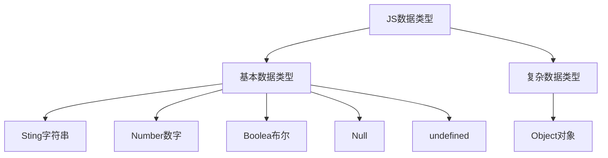
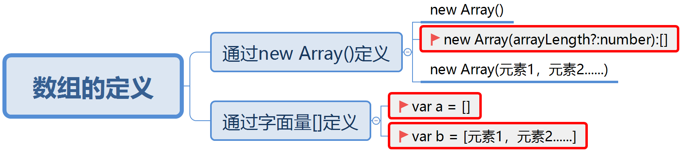
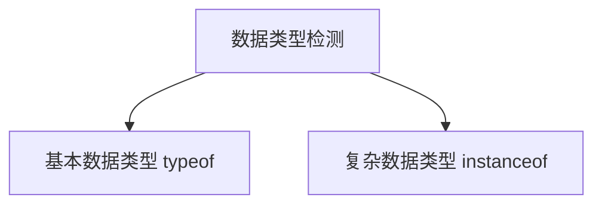
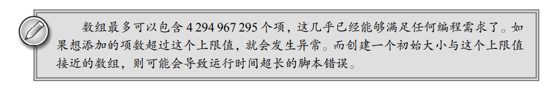

## JavaScript数组

数组在大多数的编程语言里面都是会有的一个东西，在不语言对数组的定义都是不同的，数组不是一个基本数据类型，我在前面讲解JavaScript数据类型的讲过



数组是我们学到第一个复杂数据类型，也是我所学习的第一个内置对象


### 数组的概念

JavaScript与其他的编程语言相对比，数组的概念是完全不一样的

* JavaScript里面的数组：一系列数据的集合
* 其他编程语言的数组：一系列**相同数据类型**的**固定长度**的数据集合

> 在上面的概念中，我们发现JS的数组没有限定数据的类型，也没有限定数组的长度


### 数组的定义

数组的定义也叫数组的创建，他有很多种定义方式

#### 通过`new Array()`的方式来创建

**第一种方式：**直接通过`new Array()` 的方式来创建数组

```javascript
var arr = new Array();   
// 定义了一个数组，当前这个数组里面什么也没有，这数组的长度为0
```

> 在上面的代码里面我们第一次使用到了`new`关键字，这个关键字在后期面向对象里面会具体讲解

**第二种方式：**创建数组的时候直接定义数组的长度`new Array(arrayLength?:number):[]`

我们看上面的语法可以知道，在定义数组的时候可以直接确定数组的长度

```javascript
var arr = new Array(10);   // 定义了一个数组,且当前的数组长度为10
```

**第三种方式：**直接静态初始化，直接给多个元素的值

```javascript
var arr = new Array("a", "b", "c", "d");
var arr2 = new Array("10", 10, true, null, undefined, NaN);   // 定义了一个数组
```

这个时候我们发现，不管在数组内存入的数据是相同类型还是不同类型，这里都不会报错，这也应证了前面JavaScript数组的定于——一系列数据的集合

但是在定义数组的时候我们传入参数的时候要注意一些特殊情况

**注意事项**

我们看下面的代码

```javascript
var a = new Array("2")      // "2"代表元素，因为他是一个字符串类型   
var b = new Array(2)        //  2 代表数组的长度，因为他是一个数字类型

var c = new Array(-1)		// -1 是数字类型他表数组的长度，但是他是一个负数而数组的长度不能为一个负值这里就会报错
var d = new Array(3.5)      // 在这里3.5也是一个number类型因此会被系统识别为数组的长度但是3.5是一个小数他也不是一个合法的数组长度

var e = new Array(-1,-2)	// -1,-2就都是数组的元素，相当于静态初始化
```

通过上面的代码，我们发现在定义数组的时候，如果只传一个参数并且是负数或者小数的时候，就会报错。一般情况下，这种定义方式很少使用。

**思考：**如何定义一个数组，该数组只有一个元素，并且是一个正整数，我们该怎么办？


#### 通过`[]`字面量来定义

在上面的定义方式里面，我们可以看到，使用`new Array()`的方式来定义数组得到的结果就是一个`[]`。所以我们现在就是用这个`[]`来定义数组，这种定义方式也叫**字面量定义法**

```javascript
var a = new Array()    	//定义了一个空数组
var b = []				//定义了一个空数组
var c = [1,2,3,4,5]		//静态初始化
var d = [2]				//静态初始化
```

通过这种方式我们可以直接在`[]`里面给初始化数组，并且也不会像第一种定义方式那样受到参数的限制，这种定义方式才是我们经常使用的，但是这种方式也有一个缺点，他不能初始化数组的长度

**注意事项：**

看下面代码

```javascript
var a = [1,2,3,4,5]			// 这个数组的长度是多少？		5
var b = [1,,2,3,4,5]		// 这个数组的长度又是多少？   	6
```

通过上面的代码我们可以知道，在JS里面的数组并不一定需要数据一一相连




### 数组的检测

在之前学习数据类型检测的时候，我们学习了`typeof`这个关键字，他可以用来检测数据类型，那么他是否也能用来检测数组呢？

```javascript
var arr = [1, 2, 3]
console.log(typeof arr);   // "object"
```

看到当使用`typeof`关键字来检测数组的时候，得到的结果是`object`。这样是不行的，因为`object`是对象，在JS里面所有的东西其实可以看成是一个对象

``` javascript
var day = new Date();    // 得到日期
console.log(typeof day);   // "object"

var str = new String("Hello");    // 得到字符串
console.log(typeof str);   // "object"
```

在上面的代码里面我们看到使用`typeof`去检测的时候得到的结果都是`object`，这并不是一个准确的结果，这个时候我们应该怎么办？

> **注意：**`typeof`关键字只适用于基本数据类型的检测，对于复杂数据类型使用`typeof`去检测时他给我们的全都是`object`，为保证数据监测的准确性我们就需要使用另外一个关键字`instanceof`完成




#### 通过`instanceof`关键字来完成检测

数组都是通过`new Array()`这一种方式来完成的，所以每个数组都应该是`Array`对象的实例

```javascript
var arr = [1, 2, 3, 4, 5]   //这里相当于 new Array(1, 2, 3, 4, 5)
    console.log(arr instanceof Array);   // true

    var arr2 = new Array(1, 2, 3, 4, 5)
    console.log(arr2 instanceof Array);		// true
```

所以只要通过`instanceof Array`得到的结果为`true`，那么它就是一个数组

通过上面的代码，我们也可以反推出下面的代码

```javascript
var a = new Array();
var b = new Date();
```

针对上面的a，b这两个变量我们对他们去进行数据类型检测

```javascript
var a = new Array();
var b = new Date();

console.log(a instanceof Array);    // true
console.log(a instanceof Date);     // false
console.log(b instanceof Array);    // false
console.log(b instanceof Date);     // true
```

#### 通过`Array.isArray()`来检测

`Array.isArray()`这个方法是数组对象里面专门用于检测数组的方法，如果结果为`true`则说明它是一个数组，否则就不是

```javascript
var a = new Array();
var b = [1, 23, 4];
console.log(Array.isArray(a));  // true
console.log(Array.isArray(b));	// true
var c = new Date()
console.log(Array.isArray(c));	// false
```


### 数组的取值与赋值

数组是一系列数据的集合，我们如果吧数据放到数组内部后，怎么去取值与赋值呢？

数组的取值与赋值是通过数组下标（索引）来完成的，索引从0 开始，通过`数组名[索引]`这种方式来完成取值与赋值的过程。

数组里面的只也叫数组的元素。

```javascript
var arr = [1, 2, 3, 4, 5]

/**
 * 在数组里面元素的取值与赋值都是通过下标来完成的
 * 注意： 数组的下标是从0开始的
*/


var num = arr[2]    // 在这里我通过数组下标拿到了数组中的第三个元素

arr[2] = 10 // 这里我们就完成了赋值的过程将10赋值给数组的第三个元素


var aaa = arr[10]
/*
 undefined 即使在取值的过程中我们超过了数组的长度在JavaScript也不会报错
 这里与其他强类型语言是不同的
*/

arr[20] = "a" 
/* 这里也不会报错 J数组没有固定长度，
    如果赋值的时候超过了原来的长度则会改变原数组的长度
    JS数组也没有类型限制
*/
```

### JS数组与其他语言数组的区别

1. JS数组的数据类型可以不用保持一致，而其他强类型语言必须是一样的
2. JS数组里面的下标是可以越界访问的【越界的值为undefined】，但是其他类型语言会报错
3. JS数组长度是有出现的最大下标所决定的，而其他编程语言由长度来决定最大下标



### 数组的遍历

遍历就是指将数组中的每一个元素都拿出来走一遍

```javascript
var arr = [0,1,2,3,4,5,6,7,8,9]
```

如果现在我们希望将上面的数组每一个元素都拿出来，打印一边，怎么办？

我们可以通过索引去拿到每一个元素，现在我们知道数组初始索引为0，结束索引为9

```javascript
var arr = [0, 1, 2, 3, 4, 5, 6, 7, 8, 9]
for (var i = 0; i <= 9; i++) {
    console.log(arr[i]);
}
```

通过上的代码我们就完成了一个数组的遍历，但是这种写法有一个隐患，我们怎么知道数组的结束索引就是`9`呢？

在前面讲过，JS数组的长度是不固定的，所以这个地方的长度10是会发生变化的，这个时候我们就应该用一个变化的值去替代我们的9

在数组里面有一个东西叫做`length`，他是数组对象的属性，用于描述当前数组的长度。所以上面的代码我们就可以改写成下面的样子

```javascript
for (var i = 0; i < arr.length; i++) {
    // i 代表每个元素的索引
    console.log(arr[i]);
}
```

