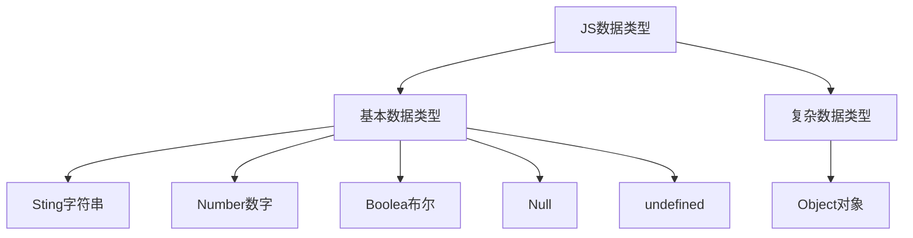
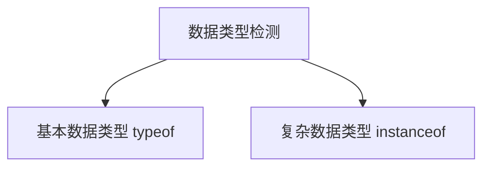
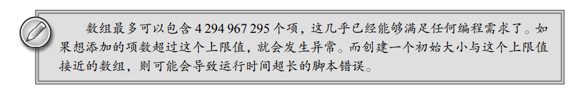
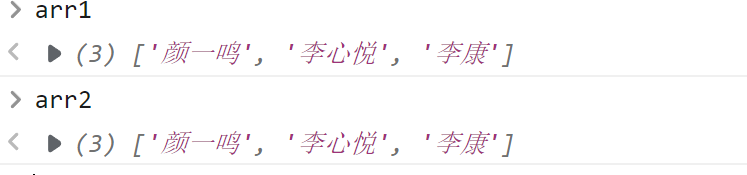
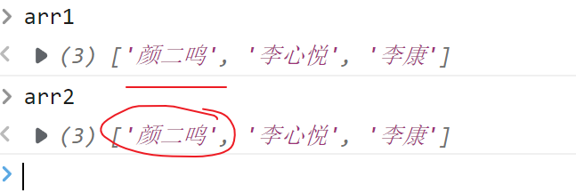
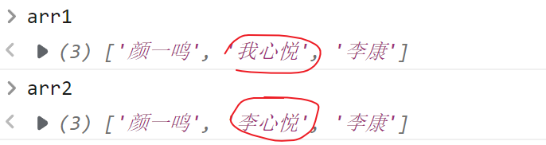

[Toc]

## JavaScript数组

数组在大多数的编程语言里面都是会有的一个东西，在不语言对数组的定义都是不同的，数组不是一个基本数据类型，我在前面讲解JavaScript数据类型的讲过



数组是我们学到第一个复杂数据类型，也是我所学习的第一个内置对象

### 数组的概念

JavaScript与其他的编程语言相对比，数组的概念是完全不一样的

* JavaScript里面的数组：一系列数据的集合
* 其他编程语言的数组：一系列**相同数据类型**的**固定长度**的数据集合

> 在上面的概念中，我们发现JS的数组没有限定数据的类型，也没有限定数组的长度

### 数组的定义

数组的定义也叫数组的创建，他有很多种定义方式

#### 通过`new Array()`的方式来创建

**第一种方式：**直接通过`new Array()` 的方式来创建数组

```javascript
var arr = new Array();   
// 定义了一个数组，当前这个数组里面什么也没有，这数组的长度为0
```

> 在上面的代码里面我们第一次使用到了`new`关键字，这个关键字在后期面向对象里面会具体讲解

**第二种方式：**创建数组的时候直接定义数组的长度`new Array(arrayLength?:number):[]`

我们看上面的语法可以知道，在定义数组的时候可以直接确定数组的长度

```javascript
var arr = new Array(10);   // 定义了一个数组,且当前的数组长度为10
```

**第三种方式：**直接静态初始化，直接给多个元素的值

```javascript
var arr = new Array("a", "b", "c", "d");
var arr2 = new Array("10", 10, true, null, undefined, NaN);   // 定义了一个数组
```

这个时候我们发现，不管在数组内存入的数据是相同类型还是不同类型，这里都不会报错，这也应证了前面JavaScript数组的定于——一系列数据的集合

但是在定义数组的时候我们传入参数的时候要注意一些特殊情况

**注意事项**

我们看下面的代码

```javascript
var a = new Array("2")      // "2"代表元素，因为他是一个字符串类型   
var b = new Array(2)        //  2 代表数组的长度，因为他是一个数字类型

var c = new Array(-1)		// -1 是数字类型他表数组的长度，但是他是一个负数而数组的长度不能为一个负值这里就会报错
var d = new Array(3.5)      // 在这里3.5也是一个number类型因此会被系统识别为数组的长度但是3.5是一个小数他也不是一个合法的数组长度

var e = new Array(-1,-2)	// -1,-2就都是数组的元素，相当于静态初始化
```

通过上面的代码，我们发现在定义数组的时候，如果只传一个参数并且是负数或者小数的时候，就会报错。一般情况下，这种定义方式很少使用。

**思考：**如何定义一个数组，该数组只有一个元素，并且是一个正整数，我们该怎么办？

#### 通过`[]`字面量来定义

在上面的定义方式里面，我们可以看到，使用`new Array()`的方式来定义数组得到的结果就是一个`[]`。所以我们现在就是用这个`[]`来定义数组，这种定义方式也叫**字面量定义法**

```javascript
var a = new Array()    	//定义了一个空数组
var b = []				//定义了一个空数组
var c = [1,2,3,4,5]		//静态初始化
var d = [2]				//静态初始化
```

通过这种方式我们可以直接在`[]`里面给初始化数组，并且也不会像第一种定义方式那样受到参数的限制，这种定义方式才是我们经常使用的，但是这种方式也有一个缺点，他不能初始化数组的长度

**注意事项：**

看下面代码

```javascript
var a = [1,2,3,4,5]			// 这个数组的长度是多少？		5
var b = [1,,2,3,4,5]		// 这个数组的长度又是多少？   	6
```

通过上面的代码我们可以知道，在JS里面的数组并不一定需要数据一一相连


### 数组的检测

在之前学习数据类型检测的时候，我们学习了`typeof`这个关键字，他可以用来检测数据类型，那么他是否也能用来检测数组呢？

```javascript
var arr = [1, 2, 3]
console.log(typeof arr);   // "object"
```

看到当使用`typeof`关键字来检测数组的时候，得到的结果是`object`。这样是不行的，因为`object`是对象，在JS里面所有的东西其实可以看成是一个对象

``` javascript
var day = new Date();    // 得到日期
console.log(typeof day);   // "object"

var str = new String("Hello");    // 得到字符串
console.log(typeof str);   // "object"
```

在上面的代码里面我们看到使用`typeof`去检测的时候得到的结果都是`object`，这并不是一个准确的结果，这个时候我们应该怎么办？

> **注意：**`typeof`关键字只适用于基本数据类型的检测，对于复杂数据类型使用`typeof`去检测时他给我们的全都是`object`，为保证数据监测的准确性我们就需要使用另外一个关键字`instanceof`完成




#### 通过`instanceof`关键字来完成检测

数组都是通过`new Array()`这一种方式来完成的，所以每个数组都应该是`Array`对象的实例

```javascript
var arr = [1, 2, 3, 4, 5]   //这里相当于 new Array(1, 2, 3, 4, 5)
    console.log(arr instanceof Array);   // true

    var arr2 = new Array(1, 2, 3, 4, 5)
    console.log(arr2 instanceof Array);		// true
```

所以只要通过`instanceof Array`得到的结果为`true`，那么它就是一个数组

通过上面的代码，我们也可以反推出下面的代码

```javascript
var a = new Array();
var b = new Date();
```

针对上面的a，b这两个变量我们对他们去进行数据类型检测

```javascript
var a = new Array();
var b = new Date();

console.log(a instanceof Array);    // true
console.log(a instanceof Date);     // false
console.log(b instanceof Array);    // false
console.log(b instanceof Date);     // true
```

#### 通过`Array.isArray()`来检测

`Array.isArray()`这个方法是数组对象里面专门用于检测数组的方法，如果结果为`true`则说明它是一个数组，否则就不是

```javascript
var a = new Array();
var b = [1, 23, 4];
console.log(Array.isArray(a));  // true
console.log(Array.isArray(b));	// true
var c = new Date()
console.log(Array.isArray(c));	// false
```

### 数组的取值与赋值

数组是一系列数据的集合，我们如果吧数据放到数组内部后，怎么去取值与赋值呢？

数组的取值与赋值是通过数组下标（索引）来完成的，索引从0 开始，通过`数组名[索引]`这种方式来完成取值与赋值的过程。

数组里面的只也叫数组的元素。

```javascript
var arr = [1, 2, 3, 4, 5]

/**
 * 在数组里面元素的取值与赋值都是通过下标来完成的
 * 注意： 数组的下标是从0开始的
*/


var num = arr[2]    // 在这里我通过数组下标拿到了数组中的第三个元素

arr[2] = 10 // 这里我们就完成了赋值的过程将10赋值给数组的第三个元素


var aaa = arr[10]
/*
 undefined 即使在取值的过程中我们超过了数组的长度在JavaScript也不会报错
 这里与其他强类型语言是不同的
*/

arr[20] = "a" 
/* 这里也不会报错 J数组没有固定长度，
    如果赋值的时候超过了原来的长度则会改变原数组的长度
    JS数组也没有类型限制
*/
```

### JS数组与其他语言数组的区别

1. JS数组的数据类型可以不用保持一致，而其他强类型语言必须是一样的
2. JS数组里面的下标是可以越界访问的【越界的值为undefined】，但是其他类型语言会报错
3. JS数组长度是有出现的最大下标所决定的，而其他编程语言由长度来决定最大下标



### 数组的遍历

遍历就是指将数组中的每一个元素都拿出来走一遍

```javascript
var arr = [0,1,2,3,4,5,6,7,8,9]
```

如果现在我们希望将上面的数组每一个元素都拿出来，打印一边，怎么办？

我们可以通过索引去拿到每一个元素，现在我们知道数组初始索引为0，结束索引为9

```javascript
var arr = [0, 1, 2, 3, 4, 5, 6, 7, 8, 9]
for (var i = 0; i <= 9; i++) {
    console.log(arr[i]);
}
```

通过上的代码我们就完成了一个数组的遍历，但是这种写法有一个隐患，我们怎么知道数组的结束索引就是`9`呢？

在前面讲过，JS数组的长度是不固定的，所以这个地方的长度10是会发生变化的，这个时候我们就应该用一个变化的值去替代我们的9

在数组里面有一个东西叫做`length`，他是数组对象的属性，用于描述当前数组的长度。所以上面的代码我们就可以改写成下面的样子

```javascript
for (var i = 0; i < arr.length; i++) {
    // i 代表每个元素的索引
    console.log(arr[i]);
}
```

### 数组的常用属性及方法

> 属性：用于描述对象事物的特征的我们叫属性
>
> 方法：在面向对象里面，方法也叫函数。所以方法可以理解为我们之前所学习的函数
>
> 属性是用于描述的，方法是用于使用的，学习数组里面的方法与属性可以让我们更加清楚的了解数组的特征，并使用数组

1. `length`属性，该属性用于获取或设置数组的找度

   ```javascript
   var arr1 = ["张三", "李四"];
   console.log(arr1.length);
   arr1.length = 10;           //重新设置数组的长度
   ```

2. `push(...item):number`方法，该方法是向数组的最后面追加新的元素，并返回当前数组的长度

   ```javascript
   var arr1 = ["张三", "李四"];
   //在数组的最后面追加了“王五”，并返回数组的长度3赋值给x
   var x = arr1.push("王五");       // 这里的x就是3
   
   //它还可以同时添加多个元素
   var y = arr1.push("赵六", "田七");
   //这个时候arr1就向数组后面同时添加了2个元素， 返回了新数组的长度为5
   ```

3. `pop()`方法，从数组的最后面移出一个元素，并返回这个移出的元素

   ```javascript
   var arr1 = ["张三", "李四", "王五"];
   //称除数组的最后一个元素，并返回了这个移出的元素
   var x = arr1.pop();				//x的值就是王五，arr1就变成了["张三", "李四"]
   ```

4. `unshift(...item):number`从数组的最前面追加新元素，并返回数组的新的长度

   这一个方法与`push`方法是相对的

   ```javascript
   var arr1 = ["张三", "李四", "王五"];
   arr1.unshift("赵六");			//["赵六""张三", "李四", "王五"]
   
   //同样，它也可以追加多个
   arr1.unshift("a","b");
   //["a","b","赵六""张三", "李四", "王五"]
   ```

5. `shift()`方法，移除数组最前面的元素，并返回这个移除的元素

   ```javascript
    var arr1 = ["张三", "李四", "王五"];
   var x = arr1.shift();
   //数组会变成["李四","王五"],x的值为“张三”
   ```

> 在上面的4个方法里面，同学们要注意它是可以在数组的最前面和最后面新增或移除元素的，它会涉及到后期我们讲解数据结构里面的相关操作【队列与栈的操作】

6. `concat()`方法，将多个数组拼接成一个新的数组，返回这个新的数组的，原数组不变

   ```javascript
   var arr1 = ["a", "b", "c"];
   var arr2 = ["张三", "李四"];
   var arr3 = ["王五", "赵六"];
   
   //将arr1与arr2接在一起，形成result1
   var result1 = arr1.concat(arr2);    
   //['a', 'b', 'c', '张三', '李四']
   
   //将arr1,arr2,arr3接在一起，形成result2
   var result2 = arr1.concat(arr2, arr3);
   //['a', 'b', 'c', '张三', '李四', '王五', '赵六']
   ```

   如果要将多个数组拼接，还可以使用下面的方法来进行

   ```javascript
   var arr1 = ["a", "b", "c"];
   var arr2 = ["张三", "李四"];
   var arr3 = ["王五", "赵六"];
   
   //将arr1,arr2,arr3接在一起，形成result3  还有没有其它的方法？
   
   var result1 = arr1.concat(arr2);		//['a', 'b', 'c', '张三', '李四']
   //现在我们只用将上面的结果再接上arr3就可以了
   var result2 = result1.concat(arr3);		//['a', 'b', 'c', '张三', '李四', '王五', '赵六']
   ```

   **现在再将上面的代码做精简**

   ```javascript
   var result2 = arr1.concat(arr2).concat(arr3);
   //相当于我们之前所学过的arr1.concat(arr2,arr3);
   ```

   :question: **小问题**：请同学们看下面的代码

   ```javascript
    var arr1 = ["颜一鸣", "李心悦", "李康"];
   // 现在的arr1与arr2是相同的
   // 相当于把这个数组复制一遍
   var arr2 = arr1;
   ```

   这个时候，上面的代码`arr1`与`arr2`是一样的元素，相当于复制了一份数组，但是这种复制方式，我们叫**浅拷贝**，它们之间是会存在问题的

   

   ```javascript
   arr1[0] = "颜二鸣";
   console.log(arr2[0]);       //颜二鸣
   ```

   当我们去更改数组里面的某一个元素的时候，我们就会发现另一个数组也发生了改变，这样就是相互影响（浅拷贝就会相互影响，这点在后期的面向对象里面给大家讲解）

   

   如果我们想得到1个互不影响的但是又相同元素的数组，怎么办呢？

   ```javascript
   var arr1 = ["颜一鸣", "李心悦", "李康"];
   // 新数组与原数组属于2个不同的数组
   var arr2 = arr1.concat();
   //现在再去改变里面的某个元素
   arr1[1] = "我心悦";
   console.log(arr2[1]);           //李心悦
   ```

   **如果想得到2个互不影响的数组，我们可以通过`concat`去实现**

   

7. `slice(start?:number,end?:number):Array`截取数组中的某些元素，形成一个新的数组，原数组不变

   它会从`start`的位置开始截取，一直到`end`的前一个结束【开始位置不能在结束位置的后面】

   ```javascript
   var arr1 = ["a", "b", "c", "d", "e", "f", "g"];
   // slice从开始位置开始，到结束的前一个
   
   // ["b","c","d","e"];
   var arr2 = arr1.slice(1,5);
   
   //省略了end结束，则默认会在到最后
   var arr3 = arr1.slice(2);
   //['c', 'd', 'e', 'f', 'g']
   
   //这里省略了开始与结束，这样会从第1个开始，截取到最后一个
   //相当于把原来的数组复制了一份
   var arr4 = arr1.slice();
   ```

   现在请看几种特殊场景

   ```javascript
   var arr1 = ["a", "b", "c", "d", "e", "f", "g"];
   
   var arr2 = arr1.slice(3,1);   //开始位置不能在结束位置后面 []
   
   var arr3 = arr1.slice(1,-1);   //从第1个开始，到倒数第1个
   //['b', 'c', 'd', 'e', 'f']
   
   var arr4 = arr1.slice(-4,-1);
   //['d', 'e', 'f']
   
   //如果不是数字，则进行隐式类型转换
   var arr5 = arr1.slice(1,"4");
   //['b', 'c', 'd']
   
   //转换以后得到NaN，错误 ，返回空数组[]
   var arr6 = arr1.slice(0,"a");
   ```

   > 最后在多说一点，`slice` 也可以实现数组的复制

8. `reverse():Array`方法，将原数组里面的元素进行反转，形成一个新的数组，原数组也会改变

   ```javascript
    var arr1 =["a","b","c","d"];
   // arr2就是arr1反转以后的数组
   var arr2 = arr1.reverse();			//['d', 'c', 'b', 'a']
   
   arr1===arr2;		//true  它们是一样的东西，原数组也变了
   ```

9. `toString():string`方法，该方法会将数组里面的元素使用逗号隔开以后，然后形成字符串

```javascript
var arr1 = ["颜一鸣", "李心悦", "李康"];
var str = arr1.toString();
//'颜一鸣,李心悦,李康'
```

10. `join(separator?:string):string`使用指定的字符串将数组的元素隔开，然后形成字符串

    > `join`方法其实就是`toString()`方法的高级版

    ```javascript
    var arr1 = ["颜一鸣", "李心悦", "李康"];
    var str1 = arr1.join("#");      //'颜一鸣#李心悦#李康'
    var str2 = arr1.join("~");      //'颜一鸣~李心悦~李康'
    var str3 = arr1.join();         // '颜一鸣,李心悦,李康'
    //如果没有指定分隔字符，则相当于toString(),默认会使用逗号隔开
    ```

11. `splice(start:number,deleteCount?:number,...items?):Array`方法

    从指定的位置开始，删除指定个数的元素，并放入新的数组元素，删除的元素会形成一个数组

    > `start`代表开始删除的位置
    >
    > `deleteCount`代表要删除的元素的个数

    **第一种场景 ，只删除，不新增**，这一种场景就可以实现在数组的某个位置去删除元素

    ```javascript
     // 只删除，不新增
    var arr = ["颜一鸣","李心悦","李康","贺锐","左小龙"];
    var result1 = arr.splice(1,2);   
    //arr的结果： ['颜一鸣', '贺锐', '左小龙']
    //result1就是删除的元素，会形成一个新的数组['李心悦', '李康']
    ```

    **第二种场景 ，只新增，不删除**，这一种场景就可以实现数组的某个新增去插入元素

    ```javascript
    var arr = ["颜一鸣","李心悦","李康","贺锐","左小龙"];
    var result2 = arr.splice(3,0,"桃子");
    // arr最终的结果  ：['颜一鸣', '李心悦', '李康', '桃子', '贺锐', '左小龙']
    // 因为没有删除的元素，所以result2就是[]空数组
    ```

    同时还请同学们注意一下，在新增的时候可以同时新增多个

    ```javascript
    arr.splice(3,0,"桃子","花花");
    // arr的结果 ['颜一鸣', '李心悦', '李康', '桃子', '花花', '贺锐', '左小龙']
    ```

    **第三种场景：既删除，也新增**，这种操作相当于替换

    ```javascript
    var arr = ["颜一鸣","李心悦","李康","贺锐","左小龙"];
    var result3 = arr.splice(1,1,"母牛");   
    //arr的结果 ['颜一鸣', '母牛', '李康', '贺锐', '左小龙']
    // 替换出来的result3 结果 ['李心悦']
    ```

    **特殊场景，特殊对待**

    ```javascript
    var arr = ["a", "b", "c", "d", "e", "f", "g"];
    
    // var arr1 = arr.splice(1);   //["a"];
    
    // var arr2 = arr.splice(-2);   // ['a', 'b', 'c', 'd', 'e']
    
    // var arr3 = arr.splice(1,-1);  //无效 不删除任何元素
    
    // var arr4 = arr.splice(1,"a");  //无效 不删除任何元素
    
    var arr5 = arr.splice(1,"2");    //['a', 'd', 'e', 'f', 'g']
    ```

12. `indexOf()`在当前数组中查询某个元素的索引值，如果找到这个元素就返回这个元素的索引，找不到就返回`-1`

    它的语法格式如下

    ```typescript
    indexOf(searchElement:string|boolean|number,fromIndex:number?):number;
    ```

    我们现在就来试一下这个方法

    ```javascript
    var arr = ["颜一鸣", "李心悦", "李康", "贺锐", "左小龙"];
    // 查询李康的位置
    var index = arr.indexOf("李康");            //2
    var index2 = arr.indexOf("桃子");           //找不到就返回-1
    ```

    **特殊情况一**：在查找的时候，如果出现了相同的元素，则我们就要返回第一次查询的索引结果

    ```javascript
    var arr = ["颜一鸣", "李心悦", "李康", "贺锐", "李心悦","左小龙"];
    var index1 =  arr.indexOf("李心悦");   //1 只返回第一次查询的结果
    ```

    **特殊情况二**：查询的时候它做的是强判断`===`全等判断操作？

    ```javascript
    var arr = ["标哥", true, 1, 2, 3, 4, "5", 6, 7];
    var index1 = arr.indexOf(5);            //-1
    ```

    **特殊情况三**：查询的时候不是从索引0的位置开始的

    ```javascript
    var arr = ["a", "b", "a", "c", "b", 100, "true", false];
    var index1 = arr.indexOf("b");      //1
    
    var index2 = arr.indexOf("b",2);    //4
    //它会去找"b"，便是找到索引如果小于fromIndex则忽略，再继续找
    ```

    后期这个方法的使用面会非常广，我们可以通过这个方法来判断某个元素是否在这个数组里面

13. `lastIndexOf(searchElement:boolean|string|number,fromIndex?:number):number`查找某一个元素最后一次出现的位置

    这里的`fromIndex`标哥更希望你们理解成`endIndex`

    ```javascript
    var arr = ["a", "b", "a", "c", "b", "a", 100, "true", false];
    var index1 = arr.lastIndexOf("a");           //5
    
    var index2 = arr.lastIndexOf("a", 4);        //
    ```

在上面的知识点里面，我们看到了12个方法

### 课堂练习

1.  现有一数组，求数组中和奇数的和

   ```javascript
   var arr = [11, 23, 56, 78, 90, 45, 22, 31, 66];
   var sum = 0;
   for (var i = 0; i < arr.length; i++) {
       if (arr[i] % 2 != 0) {
           sum += arr[i];
       }
   }
   console.log(sum);
   ```

   这个练习主要使用的就是如何对数组里面的元素取值和赋值，然后使用`length`属性来获取数组的长度，最后遍历数组

2. 还是上面这个数组，请求出数组当中最大的一个值

   ```javascript
   var arr = [11, 23, 56, 78, 90, 45, 22, 31, 66];
   /**
        * 假设型思维 
        * 假设第1个数是最大的数，然后剩下的每一个都根它比较
        * 比武招亲的思维
   */
   var max = arr[0];           //假设第0个元素是最大值
   //剩下的所有的人都要和站在台上的人比较，这个舞台就是max
   for (var i = 1; i < arr.length; i++) {
       if (max < arr[i]) {
           max = arr[i];
       }
   }
   ```

3. 还是上面的数组，请删除上面数组里面奇数值的项，保留偶数

   ```javascript
   var arr = [11, 23, 56, 78, 90, 45, 22, 31, 66];
   //[56,78,90,22,66]
   for (var i = arr.length - 1; i >= 0; i--) {
       if (arr[i] % 2 != 0) {
           arr.splice(i, 1);
       }
   }
   ```

   这个题目本身难度并不是很大，关键点在于要注意数组操作里面的沙漏效应（也叫队列效果）。一般情况下，在删除数组元素的时候，我们要使用倒序遍历

4. 现给定一个数组，元素如下

   ```javascript
   var arr = [11, 23, 56, 78, 90, 45, 22, 31, 66];
   ```

   请编写代码，找出原数组当中最大的这个值，把这个值放到一个新数组里面去，然后再到原来的数组当中删除这个元素，依次执行上面的的叫什么，这样直到原数组的长度为0，这样新数组就会是一个从大到小排列的数组

   ```javascript
   var arr = [11, 23, 56, 78, 90, 45, 22, 31, 66];
   var newArr = [];   //新数组
   
   //编写一个方法，用于求数组当中的最大值
   //我给你一个数组，你还我这个数组中最大的值
   function getMax(arr1) {
       //在操作之前，要先检测一下，你是否是数组
       if (Array.isArray(arr1)) {
           var max = arr1[0];
           for (var i = 1; i < arr1.length; i++) {
               if (max < arr1[i]) {
                   max = arr1[i];
               }
           }
           return max;
       }
       else {
           return NaN;
       }
   }
   
   while (arr.length > 0) {
       //第一步：求原数组最大值
       var max = getMax(arr);
       //第二步：将这个值放到新数组中
       newArr.push(max);
       //第三步：在原数组中去删除
       var index = arr.indexOf(max);
       arr.splice(index, 1);
   }
   console.log(newArr);
   ```

### 课后练习

1. 现有一数组，元素如下【数组去重】

   ```javascript
   var arr = [1,2,7,4,2,4,"a","a","b","f","a","c","f"];
   ```

   请将上面数组当中相同的项去掉除，这个时候的数组里面应该只包含以下几项

   ```javascript
   var newArr = [1,2,7,4,"a","b","f","c"];
   ```

2. 现有以下两个数组，找出两个数组当中相同的元素，放在一个新数组里面

   ```javascript
   var arr1 = [1,2,7,4,3,"a","d","g"];
   var arr2 = [7,3,"d","g","h",3,7];
   ```

3. 现有一个数组，里面有几个重复的元素，找出出现次数最多的元素，并列出每个元素出现复多少次

   ```javascript
   var arr= ["a","b","c","a","a","b","d","e","f","c","g","d","e","g","a","c","a"
   ,"h","a"];
   ```

4. 颜一鸣现在有1头母牛，母牛在长成4岁的时候生一头小母牛（3岁长成4岁的时候立即生一头小母牛），以后每年都生一头小母牛，每头母牛在10岁的时候就会死亡（由9岁长到10岁的时候就生一头小母牛，然后这头老母牛立即死亡）请问在20年以后颜一鸣一共有多少头母牛？
