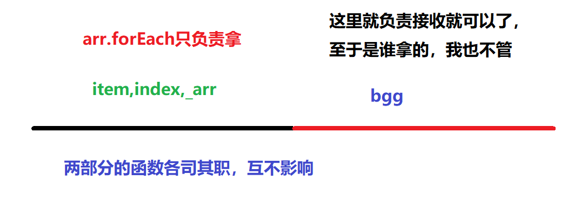

## 数组的高级方法

在之前学习数组的时候，我们已经学习了数组的12个方法

1. `push()`向数组的后面追加新元素
2. `pop()`从数组的后面移除一个元素
3. `unshift()`从数组的前面追加新元素
4. `shift()`从数组的前面移除元素
5. `concat()`将多个数拼接，形成新数组
6. `slice()`提取数组中的元素形成新数组
7. `toString()`将元素用逗号隔开变成字符串
8. `join()`使用指定的字符隔开变成字符串
9. `splice()`替换元素
10. `indexOf()`查找元素的 索引
11. `lastIndexOf()`查找元素最后一次出现的索引
12. `reverse()`将数组里面的元素返回

-----

### 迭代方法

迭代方法也叫遍历方法，迭代是把集合里面的元素依次的一个一个的拿出来

ECMAScript 5 为数组定义了 5 个迭代方法。每个方法都接收两个参数：**要在每一项上运行的函数<span style="text-decoration:line-through red double">和 （可选的）运行该函数的作用域对象——影响 this 的值</span>。**传入这些方法中的函数会接收三个参数：数 组项的值、该项在数组中的位置和数组对象本身。

如果要学习迭代的方法，我们就先回顾一下之前我们是怎么遍历数组的

**最原始的方式**

```javascript
var arr = ["a", "b", "c", "d", "e"];
// 我们采用最原始的方式来完成迭代
for (var i = 0; i < arr.length; i++) {
    console.log(i, arr[i]);
}
```

#### forEach方法

数组提供了很多个迭代的方法，其中`forEach`就是最基本的迭代方法，它会将数组里面的元素依次一个一个的拿出来，但是它只负责拿，拿出来以后给谁它不管



```javascript
var arr = ["a", "b", "c", "d", "e"];
// forEach就是其中的一种迭代方法
// 迭代就是把集合里面的值依次的一个一个的拿出来
arr.forEach(bgg);

//函数会接收三个参数：数组项的值、该项在数组中的位置和数组对象本身
function bgg(item,index,_arr){
    console.log(item,index);
}
```

上面的代码就是`forEach`最典型的迭代方法的使用，同样，我们还可以把上面的函数写成匿名回调的形式

```javascript
var arr = ["a", "b", "c", "d", "e"];
// forEach就是其中的一种迭代方法
arr.forEach(function (item, index, _arr) {
    console.log(item, index);
});
```

#### map方法

> 它也是数组里面的一个遍历方法，它与`forEach`很相似，但是这个方法可以接收回调函数的返回值，它会将回调函数的返回值组成一个新的数组

```javascript
var arr = [11, 12, 13, 14, 15];
// 希望将上面的数组中的每一个元素都乘以2,然后放到一个新的数组里面去
var newArr = [];
/*
    for (var i = 0; i < arr.length; i++) {
        // console.log(arr[i]*2);
        newArr.push(arr[i] * 2);
    }
    */
arr.forEach(function(item,index,_arr){
    newArr.push(item*2);
});
console.log(newArr);
```

上面的2种方式都可以实现这种需求，但是我们的`map`会更好一些

```javascript
var arr = [11, 12, 13, 14, 15];
var newArr = arr.map(function (item, index, _arr) {
    var x = item * 2;
    return x;
})
```

**区别**：`map`方法与`forEach`方法是非常相似的，只是`map`可以将回调函数里面的返回值再构成一个新的数组

#### filter方法

> `filter`英文单词有过滤的意思，它会根据指定的条件在原数组当中过滤符合要求的元素（为true就会保留），再将这些符合要求的元素放在一个新数组里面，最后将这个数组返回

```javascript
var arr = [1, 5, 7, 9, 2, 4, 6, 34, 21];
// 请将arr里在的偶数提取出来 ,放在一个新的数组里面
var newArr = [];
arr.forEach(function (item, index, _arr) {
    if (item % 2 == 0) {
        newArr.push(item);
    }
});
```

在上面的代码里面，我们将原数组中的偶数拿出来 ，放在了新的数组`newArr`里面，判断这个数是否是偶数，我们使用了`item%2==0`这个条件
```javascript
var arr = [1, 5, 7, 9, 2, 4, 6, 34, 21]; 
var newArr = arr.filter(function (item, index, _arr) {
    // 我要偶数
    return item % 2 == 0;
    // filter返回的是一个条件,它会根据这个条件自动判断
    // 如果成立就保留这个元素,如果不成立就不保留
});
```

#### some方法

> 这个方法相当于一真即真的操作，对数组中的每一项运行给定函数，如果该函数对任一项返回 true，则返回 true

```javascript
var arr = [1, 3, 5, 9, 7, 4, 11];
// 请问,上面的arr当中有偶数吗?
//假设法,我假设上面没有偶数
// flag为false代表没有偶数,false为true代表有偶数
var flag = false;
for (var i = 0; i < arr.length; i++) {
    if (arr[i] % 2 == 0) {
        flag = true;
        break;
    }
}
console.log(flag?"有偶数":"没偶数");
```

这是我们以前的写法，现在我们要使用`some`的方式去完成

```javascript
var arr = [1, 3, 5, 9, 7, 4, 11];
// 请问,上面的arr当中有偶数吗?
var flag = arr.some(function (item, index, _arr) {
    return item % 2 == 0;
});
// false||false||false||false||false||true||false
console.log(flag);
//上面的代码里面，它是将所有的结果执行或运算，最终的结果就是true
```

#### every方法

> 这个方法与`some`的方法是相对的，它执行的是一假即假的原则，它执行逻辑与的操作

```javascript
var arr = [1, 3, 5, 9, 7, 4, 11];
//在上在面数组里，每个元素都是奇数吗？
var flag = true;
// 先假设都是奇数
for (var i = 0; i < arr.length; i++) {
    if (arr[i] % 2 == 0) {
        flag = false;
        break;
    }
}
console.log(flag);
```

上面的代码我们仍然使用了假设法去完成，现在在数组里面， 我们使用 `every`去完成

```javascript
var arr = [1, 3, 5, 9, 7, 4, 11];
//  问上面的数组中的元素是否全都是奇数
var flag = arr.every(function (item, index, _arr) {
    return item % 2 == 1;
});
//true&&true&&true&&true&&true&&false&&true;
console.log(flag);
//every要对所有的结果做逻辑与判断，一假即假 
```


#### 注意事项


### 归并方法

### 排序方法


### 课堂练习 

1. 使用`filter`来过滤符合要求的元素

   ```javascript
   var arr = [1, "a", "2", 123, true, NaN, false, ""];
   //请找出arr里在的number类型,放在一个新的数组里面
   
   var newArr = arr.filter(function (item, index, _arr) {
       return typeof item == "number";
   })
   ```

2. 使用`filter`来过滤符合要要求的元素

   ```javascript
   var arr = [5.1, 2, "3.14", true, "", NaN, null, "1", 9];
   // 请找出arr当中的整数,放在新数组newArr里面
   var newArr = arr.filter(function (item, index, _arr) {
       return item % 1 === 0 && typeof item === "number";
   });
   ```

   第二种解法

   ```javascript
   var newArr = arr.filter(function (item, index, _arr) {
       // return parseInt(item) === item;
       return ~~item === item;
   });
   ```

   

### 课后练习

1. 编写一个方法，输入一个年份，判断这个年份是平年还是润年

   ```javascript
   function isLeapYear(year){
       
       //代码体
       
       //返回值，润年返回true,平年就返回false
   }
   ```

2. 编写一个方法，输入某年某月某日 ，返回这这一天是这一年的第几天

   ```javascript
   function getDate(year,month,day){
       
       //代码体
       
       //返回值,返回天数
   }
   ```

3. 两个乒乓球队进行比赛，各出三人。甲队为a,b,c三人，乙队为x,y,z三人。以抽签决定比赛名单。有 人向队员打听比赛的名单。a说他不和x比，c说他不和x,z比，请编程序找出三队赛手的名单。

   