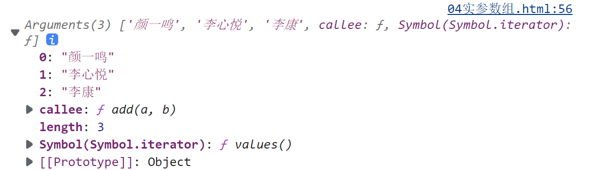
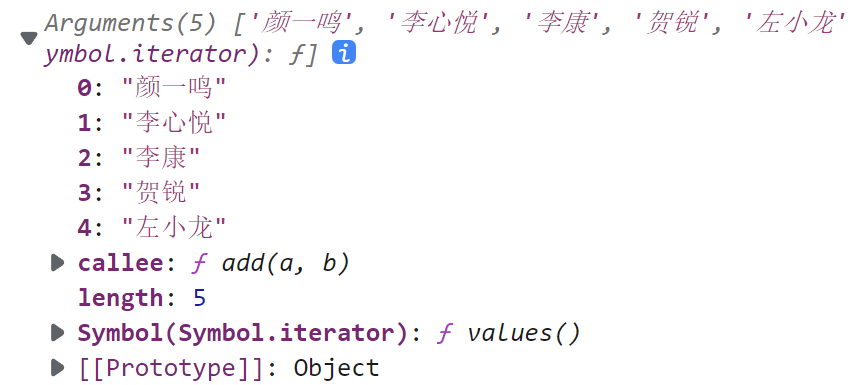
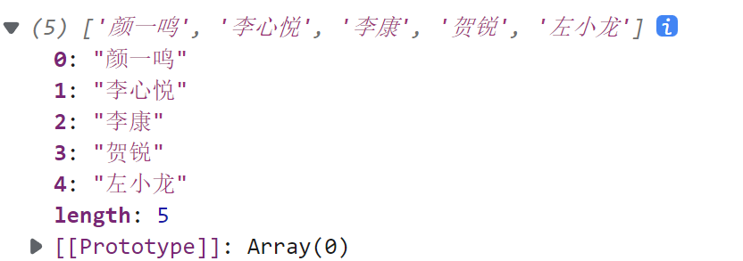
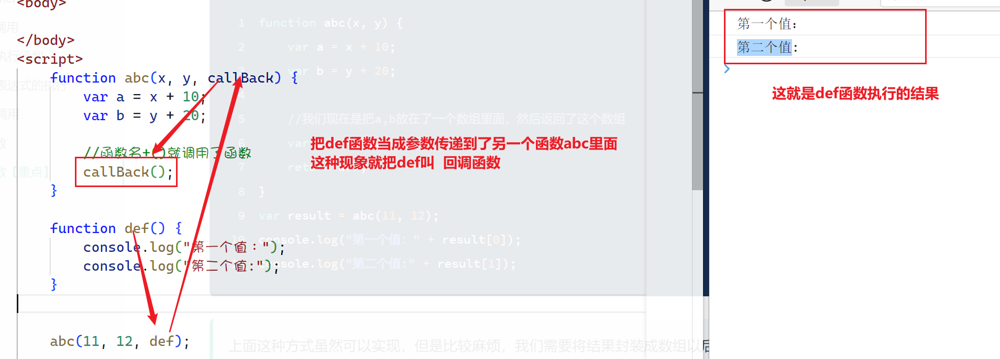
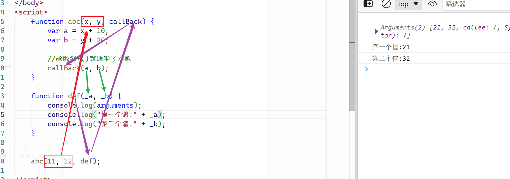
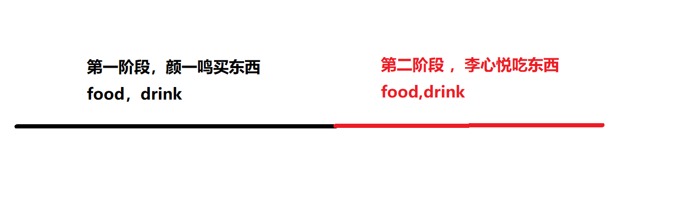
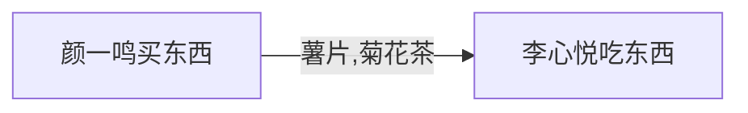
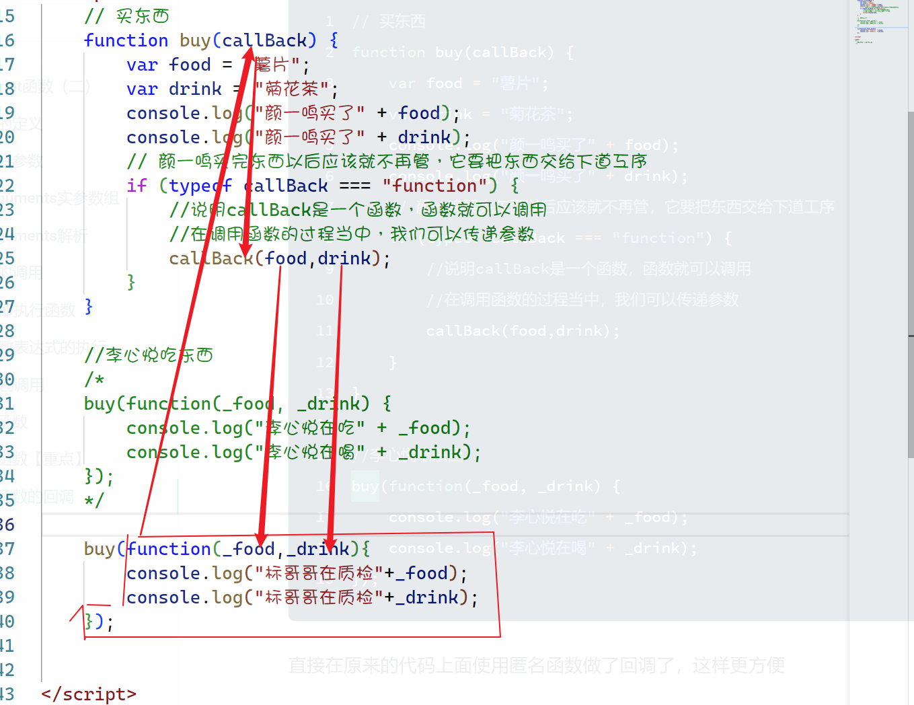

## JavaScript函数（二）

之前已经讲过了函数的基础，并且也在数组里面运行了函数，函数在面向对象的语言里面叫方法，它是为了完成某一引起功能封装的一个集体

### 函数的定义

之前已经学过了函数的定义，现在我们再来补充一下

**第一种定义方式**：通过`function`的关键字来进行定义

```javascript
function sayHello(){
    console.log("大家好");
}
```

**第二种定义方式**：这一种方式叫函数表达式

```javascript
var sayHello = function(){
    console.log("我是标哥哥");
}
```

**第三种定义方式**：通过`Function`来定义，这一种完全不建议使用，了解就行了

```javascript
var abc = new Function("abc");
```

> 从技术角度讲，这是一个函数表达式。但是，我们不推荐读者使用这种方法定义函数，因为这种语 法会导致解析两次代码（第一次是解析常规 ECMAScript 代码，第二次是解析传入构造函数中的字符串）， 从而影响性能。不过，这种语法对于理解“函数是对象，函数名是指针”的概念倒是非常直观的。

### 函数的参数

函数的参数分为2种

* 形参：函数在定义的时候的个参数，是一个形式上面的参数，相当于变量名
* 实参：调用函数的时候的那个参数，它是一个实际的值，相当于变明不明白值

函数的在调用的时候，是实参向形参赋值

```javascript
function sayHello(userName) {
    console.log("大家好，我叫" + userName);
}
sayHello("标哥哥");
```

在上面的代码里面，”标哥哥“变量的值赋值给了`userName`

<span style="color:red;">问题就在这里，我们说过一个点，函数的形参与实参没有必要形成一一的对应关系</span>

```javascript
/**
     * 编写一个函数，求参数相加的和
     */
function add(a, b) {
    var sum = a + b;
    return sum;
}

var x = add(11,12);         //23  实参个数与形参相等
var y = add(11,12,13);      //23  实参个数大于形参
var z = add(11);            //NaN 实参个数小于形参
```

> ECMAScript里面的函数与其它语言里面的函数是不一样，它的参数不需要一一对应，指导书主上面的`add`在定义的时候有2个形参，但是在调用的时候不需要遵守

**问题**：请问`add(11,12,13)`，第3个参数的13给了谁？？？？

**参数不同情况的说明**

1. 当实参个数与形参个数相同的时候，一对一赋值
2. 当实参个数小于形参个数，没有接收到值的形参它就是`undefined`
3. 当实参个数大于形参个数，前面的一对一赋值，多的值会放在一个特殊的地方，叫**实参数组**，这个实参数组叫`arguments`【特殊说明，后期我要更正这句话】

#### arguments实参数组

根据上面的理解，我们可以知道，函数里面所有的实参最终都会在`arguments`里面

```javascript
function add(a, b) {
    console.log(a);
    console.log(b);
    // 所有的实参都会在arguments里面
    console.log(arguments);
}

add("颜一鸣","李心悦","李康");
```

在上面的代码里面，我们打印了`arguments`，结果如下



在上面的结果当中我们可以看到，所有传入到函数里面的实参都在`arguments`里面

> 你传递了多少个实参进去，那么`arguments`里面就会有多少个元素，如果不给实参，它就是空的

#### arguments解析

在上面已经得知，arguments就是所有实参的集合，它是一个什么东西呢？

在上面的图片里面，我们得到了一个点，它有索引，它也有`length`属性，长得像一个我们之前学习的数组。所以我们把`arguments`叫实参数组

```javascript
function add(a, b) {
    console.log(arguments);
    console.log(arguments[0]);        //通过索引来取值
    console.log(arguments.length);    //也可以获取长度
    console.log(Array.isArray(arguments));    //false
}

add("颜一鸣","李心悦","李康","贺锐","左小龙");
```

在上面的代码里面，我们对`arguments`像数组一像的取值，然后也可以获取长度，但是通过数组的检测时发现，它不是一个数组，这是为什么呢？

| `arguments`                                                  | `Array`                                                      |
| ------------------------------------------------------------ | ------------------------------------------------------------ |
|  |  |

在上面的对比里面，左边是`arguments`，右边的数组，我们发现有以下几个点

1. 两边的对象上面都有索引，以及`length`属性，所以它们都可以通过索引来取值，也可以通过`legnth`来获取长度【相同点】
2. `arguments`只具备的数组的特征，但是不具备数组的`push/pop/shift/unshift`等一系列方法【不同点】

**总结**：在`JavaScript`里面，如果有一个对象具备数组的特征（索引与长度），但是又不具备数组的那些方法，我们就把这些对象叫**类数组（伪数组）**

所以上面的`arguments`并不是一个真正的数组，它是一个类数组

:thinking: **想一想**，这里的`arguments`有什么应用点

```javascript
//我想编写一个方法，将所有的参数求和以后，将结果返回出去
/*
    function add(a, b) {
        var sum = a + b;
        return sum;
    }
    var x = add(11, 12);
    var y = add(11, 12, 13);
    var z = add(11);
 */

function add() {
    //所有的参数都会在arguments里面，所以我们直接从这里找就行了
    // console.log(arguments);
    var sum = 0;
    for (var i = 0; i < arguments.length; i++) {
        sum += arguments[i];
    }
    return sum;
}

var x = add(11, 12);
var y = add(11, 12, 13);
var z = add(11);
```

### 函数的调用

之前已讲过函数的执行方式，它是通过`函数名+()`来实现调用的，除了这一种调用方式以外，还有其它的几种调用方式我们来了解一下

**常规调用**

```javascript
function sayHello(){
    console.log("我是标哥哥");
}
sayHello();
```

#### 立即执行函数

当我们定义好一个函数以后，希望立即就执行这个函数，这个时候就可以使用下面的方式来完成

```javascript
!function sayHello() {
    console.log("我是标哥哥");
}();
```

> **代码分析**：感叹号是取非操作符，而取非是一定要得到结果才能取非，所以它会把后面的函数执行以后再取非，而后面的函数执行就代表要调用后面的函数
>
> 前面的`!`也并不固定的，它可以换成其它的运算符，如`+`也可以

下面是带参数的立即执行函数

```javascript
function sayHello(userName) {
    console.log("大家好，我叫" + userName);
}
sayHello("标哥哥");
```

改成成立即执行函数

```javascript
!function sayHello(userName) {
    console.log("大家好，我叫" + userName);
}("标哥哥");
```

#### 函数表达式的执行

之前已经学过了函数表达式的定义，如下

```javascript
// 函数表达式的执行
var abc = function () {
    console.log("我是一个函数");
    return 123;
}
abc();
//typeof abc ==  "function"
```

我们如果希望定义好了函数以后立即执行怎么办？

```javascript
var abc = function () {
    console.log("我是一个函数");
    return 123;
}();
//这里的abc就是123
```

只要在函数表达式的后面加上一个括号，则函数表达式就立即执行了

<span style="color:red">注意事项</span>

1. 在上面的代码里面`abc`这是函数的名子，我们是将一个函数赋值给了变量`abc`
2. 在下面的代码里面，`abc`就是后面的函数表达式执行完毕以后的返回值`123`

#### 闭包调用

> 在这里，先把闭包的概念放在一边，先看调用方式
>
> TODO：后面讲到执行上下文以后再具体探讨闭包

闭包函数的写法其实非常简单，本质上面它也是一个立即执行函数

```javascript
function abc(){
    console.log("我是abc函数");
}
abc();
```

在上面的代码里面，我们通过函数名 `abc`去调用了这个函数，我们将代码演变一下

```javascript
(function abc(){
    console.log("我是abc函数");
})();
```

同时函数的名子`abc`还可以省略，因为现在我们已经不需要函数来调用了

```javascript
(function(){
    console.log("我是abc函数");
})();
```

上面的函数我们就称之闭包函数的写法，<u>闭包函数的本质其实就是匿名的立即执行函数</u>

闭包函数也是可以添加参数与返回值的

```javascript
function add(a, b) {
    var x = a + b;
    return x;
}
var result = add(1, 2);
```

上面的函数通过闭包调用的形式去写

```javascript
var result = (function(a, b) {
    var x = a + b;
    return x;
})(1,2)
```


### 匿名函数

匿名函数顾名思义就是没有名子的函数。什么情况下的函数是没有名子的

我们先来看一下之前的立即执行函数

```javascript
!function sayHello(userName) {
    console.log("大家好，我叫" + userName);
}("标哥哥");
```

**函数名的作用是用来找到这个函数，并且调用**

在上面的立即执行函数里面，我们定义好这个函数以后就立即执行了这个函数，这个函数名的作用就消失了。这个时候就可以不需要函数名了

```javascript
!function (userName) {
    console.log("大家好，我叫" + userName);
}("标哥哥");
```

-----

### 回调函数【重点】

回调函数就是回调方法，它指的是将函数的当成参数传递到另一个函数当中去。在学习回调函数之前一定先弄清楚2个点

1. 函数的参数分为**形参**与**实参**
2. 函数是需要经过调用以后才会执行

**回调函数的使用场景**

1. 当一个函数的返回值无法返回的时候
2. 当某些功能需要分段执行的时候（俗称流水线操作）

请看下面代码

```javascript
function abc(x, y) {
    var a = x + 10;
    var b = y + 20;
    //如果我希望将a,b这2个值返回到外边，怎么办？
}
```

我们在上面定义了一个函数，希望在函数运行结果以后向外边返回2个值`a,b`，怎么办呢？

虽然说我们之前学过了`return`关键字，它可以在函数运行结束的时候把值返回到外边，但是只能返回一个，现在我们返回2个怎么办呢？

现在有2种方法，第一种是直接将2个数放在一个数组里面，然后把这个数组返回

```javascript
function abc(x, y) {
    var a = x + 10;
    var b = y + 20;
    
    //我们现在是把a,b放在了一个数组里面，然后返回了这个数组
    var arr = [a, b];
    return arr;
}
var result = abc(11, 12);
console.log("第一个值：" + result[0]);
console.log("第二个值:" + result[1]);
```

> 上面这种方式虽然可以实现，但是比较麻烦，我们需要将结果封装成数组以后再返回

**现在我们使用回调函数的方式去执行**



上面的代码当中，`def`就是回调函数，我们把一个函数当成参数传递到了另一个函数里面，现在`def`函数仍然没有拿到`a,b`的值，怎么办呢？



回调函数最大的作用就让代码分段执行，也就是像流水线一样去执行

----

先看下面的场景 



我们现在如果想实现上面的场景，我们先采用普通的函数调用

```javascript
function buy() {
    var food = "薯片";
    var drink = "菊花茶";
    console.log("颜一鸣买了" + food);
    console.log("颜一鸣买了" + drink);
    lixinyue(food,drink);      //在这里直接调用了李心悦
}

function lixinyue(_food, _drink) {
    console.log("李心悦在吃" + _food);
    console.log("李心悦在喝" + _drink);
}

function likuang(_food, _drink){
    console.log("李康在吃" + _food);
        console.log("李康在喝" + _drink);
    }
buy();
```

上面的代码看起来会没有问题，但是不完美，因为buy函数内部固定的调用了`lixinyue`，这就说明颜一鸣买完了东西以后只能给李心悦，而李康如果想吃东西不行的，因为代码在`buy`写死了



所以上面的写法并不好，按照我们程序开发的思维，**每一个函数应该只负责完成一件事情**，将多个函数组和就可以完成更多复杂的事件

现在我们将上面的代码进行改装

```javascript
 // 买东西
function buy(callBack) {
    var food = "薯片";
    var drink = "菊花茶";
    console.log("颜一鸣买了" + food);
    console.log("颜一鸣买了" + drink);
    // 颜一鸣买完东西以后应该就不再管，它要把东西交给下道工序
    if (typeof callBack === "function") {
        //说明callBack是一个函数，函数就可以调用
        //在调用函数的过程当中，我们可以传递参数
        callBack(food,drink);
    }
}

//李心悦吃东西
function lixinyue(_food, _drink) {
    console.log("李心悦在吃" + _food);
    console.log("李心悦在喝" + _drink);
}

//李康吃东西
function likuang(_food, _drink) {
    console.log("李康在吃" + _food);
    console.log("李康在喝" + _drink);
}

//buy();
//我希望颜一鸣买了东西以后，交给李心悦去吃
//buy(lixinyue);
//颜一鸣买了以后给李康吃
buy(likuang);
```

### 匿名函数的回调

```javascript
// 买东西
function buy(callBack) {
    var food = "薯片";
    var drink = "菊花茶";
    console.log("颜一鸣买了" + food);
    console.log("颜一鸣买了" + drink);
    // 颜一鸣买完东西以后应该就不再管，它要把东西交给下道工序
    if (typeof callBack === "function") {
        //说明callBack是一个函数，函数就可以调用
        //在调用函数的过程当中，我们可以传递参数
        callBack(food,drink);
    }
}

//李心悦吃东西
buy(function(_food, _drink) {
    console.log("李心悦在吃" + _food);
    console.log("李心悦在喝" + _drink);
});
```

直接在原来的代码上面使用匿名函数做了回调了，这样更方便


