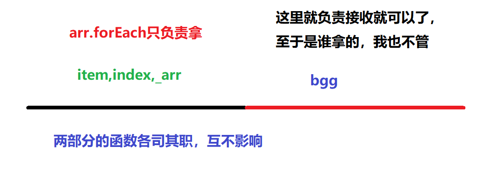
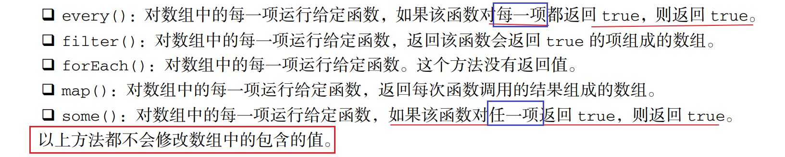
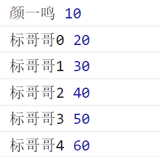
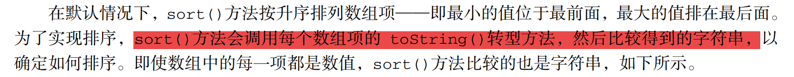
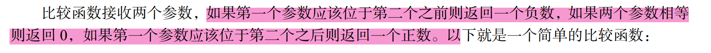
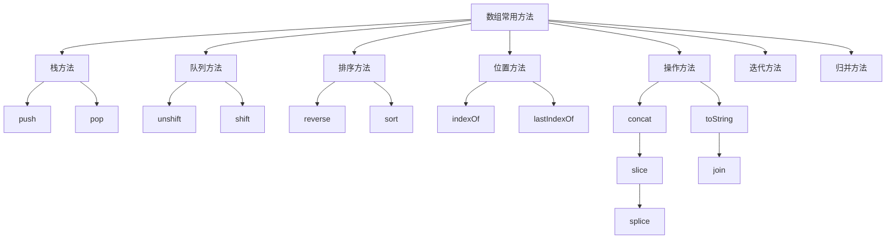

## 数组的高级方法

在之前学习数组的时候，我们已经学习了数组的12个方法

1. `push()`向数组的后面追加新元素
2. `pop()`从数组的后面移除一个元素
3. `unshift()`从数组的前面追加新元素
4. `shift()`从数组的前面移除元素
5. `concat()`将多个数拼接，形成新数组
6. `slice()`提取数组中的元素形成新数组
7. `toString()`将元素用逗号隔开变成字符串
8. `join()`使用指定的字符隔开变成字符串
9. `splice()`替换元素
10. `indexOf()`查找元素的 索引
11. `lastIndexOf()`查找元素最后一次出现的索引
12. `reverse()`将数组里面的元素返回

-----

### 迭代方法

迭代方法也叫遍历方法，迭代是把集合里面的元素依次的一个一个的拿出来

ECMAScript 5 为数组定义了 5 个迭代方法。每个方法都接收两个参数：**要在每一项上运行的函数<span style="text-decoration:line-through red double">和 （可选的）运行该函数的作用域对象——影响 this 的值</span>。**传入这些方法中的函数会接收三个参数：数 组项的值、该项在数组中的位置和数组对象本身。

如果要学习迭代的方法，我们就先回顾一下之前我们是怎么遍历数组的

**最原始的方式**

```javascript
var arr = ["a", "b", "c", "d", "e"];
// 我们采用最原始的方式来完成迭代
for (var i = 0; i < arr.length; i++) {
    console.log(i, arr[i]);
}
```

#### forEach方法

数组提供了很多个迭代的方法，其中`forEach`就是最基本的迭代方法，它会将数组里面的元素依次一个一个的拿出来，但是它只负责拿，拿出来以后给谁它不管



```javascript
var arr = ["a", "b", "c", "d", "e"];
// forEach就是其中的一种迭代方法
// 迭代就是把集合里面的值依次的一个一个的拿出来
arr.forEach(bgg);

//函数会接收三个参数：数组项的值、该项在数组中的位置和数组对象本身
function bgg(item,index,_arr){
    console.log(item,index);
}
```

上面的代码就是`forEach`最典型的迭代方法的使用，同样，我们还可以把上面的函数写成匿名回调的形式

```javascript
var arr = ["a", "b", "c", "d", "e"];
// forEach就是其中的一种迭代方法
arr.forEach(function (item, index, _arr) {
    console.log(item, index);
});
```

#### map方法

> 它也是数组里面的一个遍历方法，它与`forEach`很相似，但是这个方法可以接收回调函数的返回值，它会将回调函数的返回值组成一个新的数组

```javascript
var arr = [11, 12, 13, 14, 15];
// 希望将上面的数组中的每一个元素都乘以2,然后放到一个新的数组里面去
var newArr = [];
/*
    for (var i = 0; i < arr.length; i++) {
        // console.log(arr[i]*2);
        newArr.push(arr[i] * 2);
    }
    */
arr.forEach(function(item,index,_arr){
    newArr.push(item*2);
});
console.log(newArr);
```

上面的2种方式都可以实现这种需求，但是我们的`map`会更好一些

```javascript
var arr = [11, 12, 13, 14, 15];
var newArr = arr.map(function (item, index, _arr) {
    var x = item * 2;
    return x;
})
```

**区别**：`map`方法与`forEach`方法是非常相似的，只是`map`可以将回调函数里面的返回值再构成一个新的数组

#### filter方法

> `filter`英文单词有过滤的意思，它会根据指定的条件在原数组当中过滤符合要求的元素（为true就会保留），再将这些符合要求的元素放在一个新数组里面，最后将这个数组返回

```javascript
var arr = [1, 5, 7, 9, 2, 4, 6, 34, 21];
// 请将arr里在的偶数提取出来 ,放在一个新的数组里面
var newArr = [];
arr.forEach(function (item, index, _arr) {
    if (item % 2 == 0) {
        newArr.push(item);
    }
});
```

在上面的代码里面，我们将原数组中的偶数拿出来 ，放在了新的数组`newArr`里面，判断这个数是否是偶数，我们使用了`item%2==0`这个条件
```javascript
var arr = [1, 5, 7, 9, 2, 4, 6, 34, 21]; 
var newArr = arr.filter(function (item, index, _arr) {
    // 我要偶数
    return item % 2 == 0;
    // filter返回的是一个条件,它会根据这个条件自动判断
    // 如果成立就保留这个元素,如果不成立就不保留
});
```

#### some方法

> 这个方法相当于一真即真的操作，对数组中的每一项运行给定函数，如果该函数对任一项返回 true，则返回 true

```javascript
var arr = [1, 3, 5, 9, 7, 4, 11];
// 请问,上面的arr当中有偶数吗?
//假设法,我假设上面没有偶数
// flag为false代表没有偶数,false为true代表有偶数
var flag = false;
for (var i = 0; i < arr.length; i++) {
    if (arr[i] % 2 == 0) {
        flag = true;
        break;
    }
}
console.log(flag?"有偶数":"没偶数");
```

这是我们以前的写法，现在我们要使用`some`的方式去完成

```javascript
var arr = [1, 3, 5, 9, 7, 4, 11];
// 请问,上面的arr当中有偶数吗?
var flag = arr.some(function (item, index, _arr) {
    return item % 2 == 0;
});
// false||false||false||false||false||true||false
console.log(flag);
//上面的代码里面，它是将所有的结果执行或运算，最终的结果就是true
```

#### every方法

> 这个方法与`some`的方法是相对的，它执行的是一假即假的原则，它执行逻辑与的操作

```javascript
var arr = [1, 3, 5, 9, 7, 4, 11];
//在上在面数组里，每个元素都是奇数吗？
var flag = true;
// 先假设都是奇数
for (var i = 0; i < arr.length; i++) {
    if (arr[i] % 2 == 0) {
        flag = false;
        break;
    }
}
console.log(flag);
```

上面的代码我们仍然使用了假设法去完成，现在在数组里面， 我们使用 `every`去完成

```javascript
var arr = [1, 3, 5, 9, 7, 4, 11];
//  问上面的数组中的元素是否全都是奇数
var flag = arr.every(function (item, index, _arr) {
    return item % 2 == 1;
});
//true&&true&&true&&true&&true&&false&&true;
console.log(flag);
//every要对所有的结果做逻辑与判断，一假即假 
```



#### 注意事项

上面的5个迭代方法都有一些注意事项，如下

1. 不能使用`break`与`continue`关键字来中断迭代
2. 所有的迭代方法执行的都是**静态遍历**，也是正向遍历，它在遍历开始的时候就已经定好了要遍历的次数，最终迭代的次数只能小于或等于最初定好的次数
3. 正是因为所有的迭代方法都是静态遍历 ，所以我们建议在使用迭代方法的时候去改变原数组的长度【也不要对数组进行新增，删除，替换的操作】

### 归并方法

#### reduce方法

它的语法格式如下

```javascript
var arr = [10, 20, 30, 40, 50, 60];
var result = arr.reduce(bgg);

function bgg(prev,current,index,_arr){
    console.log(prev,current);
}
```

* `prev`代表前一个回调函数的返回值【这一次回调函数的返回值会做为下一次回调函数的参数`prev`来使用】
* `current` 代表当前遍历的这一项
* `index`代表当前遍历的索引
* `_arr`代表当前遍历的数组
* `result`接收的是整个归并函数的返回值

**理解一下`prev`参数**

```javascript
var arr = [10, 20, 30, 40, 50, 60];
var result = arr.reduce(function(prev,current,index,_arr){
    console.log(prev,current);
    return "标哥哥"+index;
});

/**
        prev            current             index      返回值
        10               20                 1          "标哥哥1"
        "标哥哥1"          30                 2          "标哥哥2"
        "标哥哥2"          40                3           "标哥哥3"
        "标哥哥3"          50                4           "标哥哥4"
        "标哥哥4"          60                5           "标哥哥5"  
*/
//最后一次的回调函数的返回值给了整个归并函数的结果result
```

> 通过上面的代码，我们可以发现几个点
>
> 1. 归并函数默认是从第2项开始的
> 2. 当前回调函数的返回值会做为下一次回调函数的`prev`参数使用
> 3. 最后一次回调函数的返回值给了整个归并函数`result`

**理解一下`current`参数**

在上面的代码里面，我们可以看到，默认情况下的`current`是从第2项开始的，因为第1项给了`prev`参数

:thinking: **思考**：`current`有没有可能从第1项开始？

```javascript
var arr = [10, 20, 30, 40, 50, 60];
var result = arr.reduce(function(prev,current,index,_arr){
    console.log(prev,current);
    return "标哥哥"+index;
    //这个时候 "颜一鸣"就坐做为第一次回调函数的prev参数
},"颜一鸣");
```



> 通过上面的例子我们可以得到，如果在归并的时候我们手动的指定了第一次回调函数的`prev`参数，则current就会从数组的第1项（索引为0的地方）开始

**场景一：利用`reduce`来进行数组求最大值**

```javascript
var arr = [12, 4, 5, 98, 22, 56];
// 求上面数组的最大值
var max = arr.reduce(function (prev, current, index, _arr) {
    console.log(prev, current);
    return prev > current ? prev : current;
});
/**
        prev        current          返回值
        12          4                12
        12          5                12
        12          98               98
        98          22               98
        98          56               98
*/
```

**场景二：利用`reduce`求数组的和**

```javascript
var arr = [12, 4, 5, 98, 22, 56];
// reduce
var sum = arr.reduce(function (prev, current, index, _arr) {
    console.log(prev, current);
    return prev + current;
});
/**
            prev        current         返回值
            12          4               16
            16          5               21
            21          98              119
            119         22              141
            141         56              197
*/
```

#### reduceRight方法

这个方法与`reduce`方法一致，它只是从右边开始遍历

```javascript
var arr = [12, 4, 5, 98, 22, 56];
arr.reduceRight(function (prev, current, index, _arr) {
    console.log(prev, current);
});
```

### 排序方法

在数里面，我们经常会讲到排序，在其它的编程语言里面可能会还有很多个排序的算法，但是JS里面不需要，因为JS自带一从此排序的方法叫`sort()`

`sort()`方法会将当前方法进行排序 ，然后返回一个排序以后的新数组，新数组与旧数组相同

```javascript
var arr = [1, 4, 5, 6, 3, 7, 9, 8, 2];
//现在希望将上面的数组排序
arr.sort();
//[1, 2, 3, 4, 5, 6, 7, 8, 9]
```

上面的方式是数组提供给我们的默认的排序方式 ，**但是这种方式有隐患**



**它的隐患条件就是`sort`会将所有的元素转换成字符串以后再去比较大小**

```javascript
var arr = [1, 4, 5, 6, 3, 10, 7, 9, 8, 2];
//现在希望将上面的数组排序
arr.sort();
// [1, 10, 2, 3, 4, 5, 6, 7, 8, 9]
```

出现上面问题的原因就是因为`"10"<"2"`

数组提供给我们的默认的排序方法是有问题的，所以我们要使用自己的排序方法



```javascript
var arr = [1, 4, 5, 6, 3, 10, 7, 9, 8, 2];
//现在希望将上面的数组排序
arr.sort(function (a, b) {
    //这个回调函数就是我们自已定义的排序规则
    //参数a,b代表数组中的任意2项
    if (a < b) {
        return -1;
    }
    else if (a == b) {
        return 0;
    }
    else {
        return 1;
    }
});
//第1个数要放在第2个数的前面，则返回负数
//第1个数要放在第2个数的后面，则返回正数
//如果位置保持不变，则返回0
//[1, 2, 3, 4, 5, 6, 7, 8, 9, 10]
```

在上面的函数里面，我们手动的向`sort()`里面传递了一个回调函数，回调函数里面的`a,b`代表两个要比较的值，我们只用指定这2个值的规则就可以了

### 数组方法的总结




### 课堂练习 

1. 使用`filter`来过滤符合要求的元素

   ```javascript
   var arr = [1, "a", "2", 123, true, NaN, false, ""];
   //请找出arr里在的number类型,放在一个新的数组里面
   
   var newArr = arr.filter(function (item, index, _arr) {
       return typeof item == "number";
   })
   ```

2. 使用`filter`来过滤符合要要求的元素

   ```javascript
   var arr = [5.1, 2, "3.14", true, "", NaN, null, "1", 9];
   // 请找出arr当中的整数,放在新数组newArr里面
   var newArr = arr.filter(function (item, index, _arr) {
       return item % 1 === 0 && typeof item === "number";
   });
   ```

   第二种解法

   ```javascript
   var newArr = arr.filter(function (item, index, _arr) {
       // return parseInt(item) === item;
       return ~~item === item;
   });
   ```

   

### 课后练习

1. 编写一个方法，输入一个年份，判断这个年份是平年还是润年

   ```javascript
   function isLeapYear(year) {
       //代码体
       if ((year % 4 == 0 && year % 100 != 0) || year % 400 == 0) {
           //润年
           return true;
       }
       else {
           //平年
           return false;
       }
   }
   ```

2. 编写一个方法，输入某年某月某日 ，返回这这一天是这一年的第几天

   ```javascript
   function isLeapYear(year) {
       //代码体
       if ((year % 4 == 0 && year % 100 != 0) || year % 400 == 0) {
           //润年
           return true;
       }
       else {
           //平年
           return false;
       }
   }
   function getDate(year, month, day) {
       var arr = [31, 28, 31, 30, 31, 30, 31, 31, 30, 31, 30, 31];
       //第一步：把当前这个月份之前的所有天数加起来
       for (var i = 0; i < month - 1; i++) {
           day += arr[i];
       }
       // 是润年，同时月分还大于2，则需要加一天
       if (isLeapYear(year) && month > 2) {
           day++;
       }
       return day;
   }
   
   ```

3. 两个乒乓球队进行比赛，各出三人。甲队为a,b,c三人，乙队为x,y,z三人。以抽签决定比赛名单。有 人向队员打听比赛的名单。a说他不和x比，c说他不和x,z比，请编程序找出三队赛手的名单。

   ```javascript
   //我们把x,y,z分别当成1，2，3
   //a,b,c的出场顺序也有可能是1,2,3
   outer:for (var a = 1; a <= 3; a++) {
       for (var b = 1; b <= 3; b++) {
           for (var c = 1; c <= 3; c++) {
               var aSay = a != 1;
               var cSay = c != 1 && c != 3;
               if (aSay && cSay) {
                   if (a + b + c === 6 && a * b * c == 6) {
                       console.log(a, b, c);
                       break outer;
                   }
               }
           }
       }
   }
   //x,y,z
   //b,c,a
   ```

   **数组的解法**

   ```javascript
   var arr1 = ["a", "b", "c"];
   var arr2 = ["x", "y", "z"];
   for (var i = 0; i < arr1.length; i++) {
       for (var j = 0; j < arr2.length; j++) {
           var item1 = arr1[i];            //第一个队出场的人
           var item2 = arr2[j];            //第二个队出场的人
           if (item1 == "a" && item2 == "x") {
               continue;
           }
           else if (item1 == "c" && (item2 == "x" || item2 == "z")) {
               continue;
           }
           else if (item2 == "y" && (item1 == "a" || item1 == "b")) {
               continue;
           }
           else if (item1 == "b" && item2 != "x") {
               continue;
           }
           else {
               console.log(item1 + " vs " + item2);
           }
       }
   }
   ```

   

4. 颜一鸣现在有1头母牛，母牛在长成4岁的时候生一头小母牛（3岁长成4岁的时候立即生一头小母牛），以后每年都生一头小母牛，每头母牛在10岁的时候就会死亡（由9岁长到10岁的时候就生一头小母牛，然后这头老母牛立即死亡）
   请问在20年以后颜一鸣一共有多少头母牛？

   ```javascript
   var arr = [0];
   for (var year = 1; year <= 20; year++) {
       //每一年开始的时候 ,我都重进定义一个数组,用于放新生的牛
       var newArr = [];
       for (var i = 0; i < arr.length; i++) {
           //如果当前这头牛的年龄3~9,就牛一头小母牛
           if (arr[i] >= 3 && arr[i] <= 9) {
               newArr.push(0);
           }
   
           //牛的年龄+1
           arr[i] = arr[i] + 1;
       }
   
       arr = arr.concat(newArr);
   }
   
   //排队年龄大于等于10岁的牛
   var result = arr.filter(function (item, index, _arr) {
       return item < 10;
   });
   ```
   
   
   
   