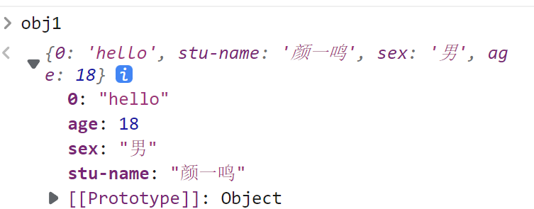
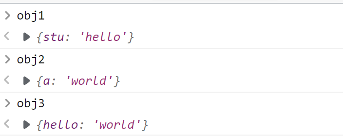
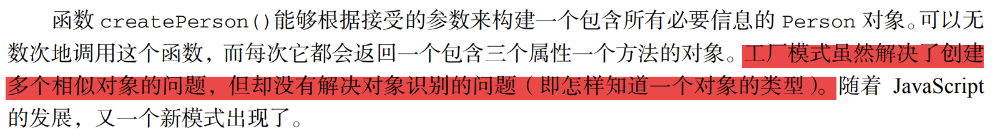
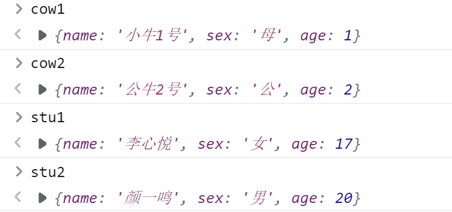
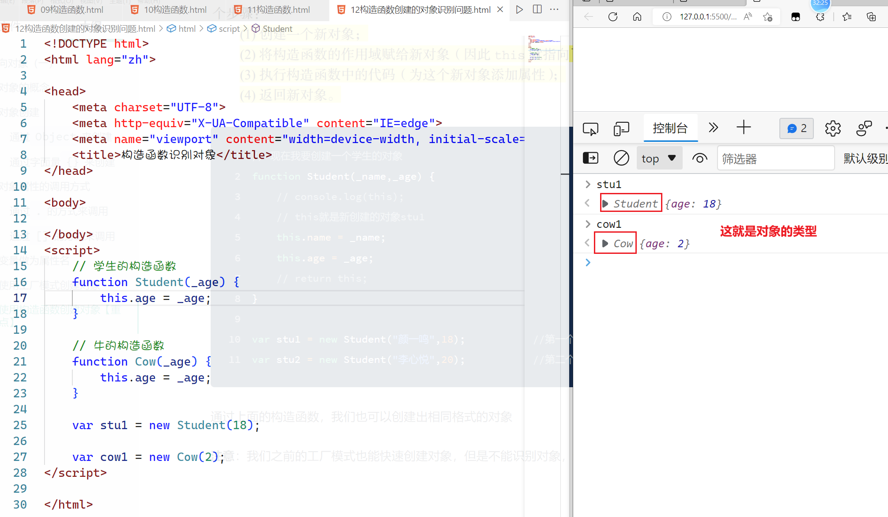

## 面向对象（一）

### 对象的概念

上面是通过语义的角度来理解什么是面向对象 

如果它是一个对象，那么它应该具备 以下几个特点 

1. 对象具备属性 

   属性就是用于描述当前对象的特征的，可以理解为上在面的【数据】 

2. 对象具备方法 

   方法就是一个对象的能力，例如它可以做什么事情。可以理解为上面的【能力】

3. 对象应该是可以继承的 

   父级对象里面的某些方法或属性或以在子级对象里面，继续使用

:thinking:**思考：**为什么需要对象，如果没有对象会怎么办？

现在我想描述我们班同学的信息，应该怎么办呢

```javascript
//颜一鸣同学的相关信息
var stuName = "颜一鸣";
var sex = "男";
var age = 18;
var hobby = "看书，睡觉";

//现在我想描述一下另一位同学 曹慧的信息 怎么办
var stuName2 = "曹慧";
var sex2 = "女";
var age2 = 18;
var hobby2 = "做饭，逛街";
```

在没有面向对象的情况下，如果我们想形容一些对象的数据【属性】我们必须要定义大量的变量，我们现在迫切需要有一种方式来进行集中式的数据管理 

### 对象创建 

对于同学们来说对象同学们已经接触过了，之前的数组就是对象。在JavaScript里面，对象的创建也叫对象的定义，它有很多种方式

#### 通过`Object`来创建

```javascript
 //创建了一个对象
var obj1 = new Object();    
//我现在反这个对象当成颜一鸣 ，去描述颜一鸣的数据
obj1.stuName = "颜一鸣";
obj1.sex = "男";
obj1.age = 18;
obj1.hobby = "看书，睡觉";
```

这一种方式去创建对象是非常简单的，它直接通过`new Object()`就可以得到一个空的对象，然后在这个空的对象上面赋值属性就可以了

#### 通过字面量`{}`来创建

这一种创建方式与之前数组的创建方式很相似，我们在讲数组的时候我们说过`new Array()`就相当于`[]`，所以`new Object()`就相当于`{}`

**语法格式**

```javascript
var 对象名 = {
    属性名1:属性值1,
    属性名2:属性值2
}
```

通过上面的语法，可以得到下面的结果

```javascript
var obj1 = new Object();
obj1.stuName = "颜一鸣";
//等价于
var obj2 = {};
obj2.stuName = "曹慧"; 
```

使用字面量创建的时候还可以使用下面的方式创建

```javascript
var obj1 = new Object();
obj1.stuName = "颜一鸣";
obj1.sex = "男";
obj1.age = 18;
obj1.hobby = "看书，睡觉";

//我们可以直接在花括号里面把所需要的属性写进去
var obj2 = {
    stuName: "曹慧",
    sex: "女",
    age: 18
};
obj2.hobby= "做饭，逛街";
```

### 对象属性的调用方式

通过上面的学习，我们知道对象里面是有数据，这些数据叫属性，一个对象如何去调用性呢。这里有2种方式给大家介绍一下

#### 通过`.`的方式来调用

正常情况一下，通过`对象.属性`就可以进行调用了，如下所示

```javascript
var obj1 = {
    stuName: "颜一鸣",
    sex: "男",
    age: 18,
    hobby: "看书，睡觉"
}


//打印obj1的姓名
console.log(obj1.stuName);
console.log(obj1.sex);
console.log(obj1.age);
console.log(obj1.hobby);
```

> **注意**：这一种方式去调用属性的时候只能调用常规范的属性，对于特殊的属性则不能通过`.`的方式来调用，要使用`[]`来调用

#### 通过`[]`的方式来调用

中括号的调用方式其实同学们之前已经接触过了，就是数组里面的索引，数组里面的索引其实也算是一个属性，所以我们在调用数字的属性的时候我们使用了`[]`

对于特殊的属性，我们是不能够使用`.`的试来调用的，如下所示

```javascript
 var obj1 = {
     "stu-name": "颜一鸣",
     sex: "男",
     age: 18,
     0:"hello"
 }
//所有的属性都可以通过[]来调用
console.log(obj1.sex);
console.log(obj1["sex"]);
// console.log(obj1.0);   //报错
console.log(obj1[0]);
console.log(obj1["stu-name"]);
```



> **说明**：`[]`中括号调用属性的方式其实是可以调用所有的属性的

<span style="color:red;font-size:22px">总结：所有的属性都可以通过`[]`来进行调用，`.`点这种方式只能调用常规属性</span>

### 变量做为属性名

```javascript
var a = "hello";
var obj1 = {
    stu: a          //上面的a就是一个变量a
}

var obj2 = {
    a:"world"       //这里的a就是一个普通的字符串a
}

//有没有一种办法把a用变量的形式放在属性当中
var obj3 = {
    [a]:"world"     //这里的a加了中括号，代表的就是变量a的值
}
```



在上面的学习的2种方式里面，我们都已经知道了怎么样去创建对象，对象可以把某些数据集中管理。但是我们仍然面对一个问题，如果我现在需要创建很多个对象，怎么办？我现在想把我们班65位同学们的信息全部都用对象表示，这又怎么办？如果我们还是使用原来的方式去创建，这样我们就要把所有的学生的属性都一一的输入一遍，这样非常不好，效率太低了

我们现在需要一种技术 ，快速的创建对象

### 使用工厂模式创建对象

> 一说起工厂，脑海之中不自觉的就会想起批量生产，并且生产的东西应该都是相同的。工厂模式其实就是批量生产对象，并且生产相同的对象

```javascript
// 现在我要批量的创建相同类型的对象 
function createStudent(_name,_sex,_age) {
    var obj = {
        name: _name,
        sex: _sex,
        age: _age
    }
    return obj;
}

var stu1 = createStudent("李心悦","女",17);
var stu2 = createStudent("颜一鸣","男",20);
```

在上面的工厂模式里面，我们可以快速的去创建对象，并且对象的格式也是一样的，这样就解决了我们需要创建重复对象的问题



```javascript
 // 现在我要批量的创建相同类型的对象
//专门生产学生的工厂 
function createStudent(_name, _sex, _age) {
    var obj = {
        name: _name,
        sex: _sex,
        age: _age
    }
    return obj;
}

var stu1 = createStudent("李心悦", "女", 17);
var stu2 = createStudent("颜一鸣", "男", 20);

//专门生产牛的工厂
function createCow(_name,_sex,_age) {
    var obj = {
        name: _name,
        sex: _sex,
        age: _age
    }
    return obj;
}

var cow1 = createCow("小牛1号","母",1);
var cow2 = createCow("公牛2号","公",2);
```

在上面的代码里面，我们有2个工厂，一个是专门生产学生的对象的，一个是专门生产牛的对象的，但是这两个对象最终所表现出来的类型竟然是相同的



```javascript
typeof stu1;		//"object"
typeof cow1;		//"object"
//之前也给大家讲过，基本数据类型才使用`typeof`，而复杂数据类型使用`instanceof`
//现在我们使用`instanceOf`来检测
stu1 instanceof Object;     //true
cow1 instanceof Object;     //true
```

通过上面的代码我们可以看到，我们不能够去识别工厂模式创建的对象的类型 ，无论是通过`typeof`或`instanceof`都不能区分

------

### 使用构造函数创建对象【重点】

> 重要的事情说三遍，这个章节是重点，重点，重点

要弄清楚构造函数就首先先弄清楚函数

函数之前我们已经学地了，就是一个通过`function`去定义的东西，同时我们也学习了函数的调用方式，函数是通过函数名+()的形式去调用的

现在我们来讲函数的另一种调用方式 

```javascript
var arr = new Array();
// 这会创建一个数组对象
var obj = new Object();
// 为什么new一个Object也会得到对象？
```

在上面的代码里面，我们就要思考一下，为什么`new`一个东西就会得到对象 ，同时`new`的这个东西又是什么？

现在我们就来看一下`Array`与`Object`到底是个什么东西

```javascript
console.log(typeof Array);					//function
console.log(typeof Object);					//function
```

我们现在可以看到`Array`与`Object`都是一个`function`函数，所以我们知道了一点**new一个函数就会得到一个对象**，`Array`与`Object`就是系统当中内置的构造函数

**所谓的构造其实就是通过`function`关键字定义的普通函数，只是它的调用方式不一样而已。<span style="color:red">如果一个函数使用了`new`关键字去调用，那么这个函数就叫构造函数</span>**

```javascript
function abc(){
    console.log("abc");
    return 123;
}

var x = abc();          //普通函数    返回值x 123
var y = new abc();      //new调用的,构造函数  返回了一个对象
```

通过上面的代码我们可以发现，`new`应该就是调用一个函数，然后再拿到对象

```javascript
var 对象 = new 函数();
```

:question: **问题**： 为什么用`new`去调用的函数就叫构造函数

如果我们现在想通过上面的`new 函数()`的方式来创建对象 ，那么我们必须要知道构造函数是怎么调用的，而构造函数的调用主要点还是在`new`上面，所以我们需知道 `new`到底干了什么事情


```javascript
// 现在我要创建一个学生的对象
function Student(_name,_age) {
    // console.log(this);
    // this就是新创建的对象stu1
    this.name = _name;
    this.age = _age;
    // return this;
}

var stu1 = new Student("颜一鸣",18);			//第一个对象
var stu2 = new Student("李心悦",20);			//第二个对象
```

通过上面的构造函数，我们也可以创建出相同格式的对象

**注意**：我们之前的工厂模式也能快速创建对象，但是不能识别对象，这个时候的构造函数是否可以识别对象呢

```javascript
// 学生的构造函数
function Student(_age) {
    this.age = _age;
}

// 牛的构造函数
function Cow(_age) {
    this.age = _age;
}

var stu1 = new Student(18);
var cow1 = new Cow(2);

console.log(stu1 instanceof Object);     //true
console.log(cow1 instanceof Object);     //true
console.log("--------------------------------");
//现在开始真正的识别
console.log(stu1 instanceof Student);     //true
console.log(cow1 instanceof Cow);         //true
console.log(stu1 instanceof Cow);         //false
console.log(cow1 instanceof Student);     //false
```



这个时候我们再去使用`instanceof`去检测的时候就可以识别对象的类型了，就可以把2个对象区分开了

### 构造函数与普通函数的区别

构造函数与普通函数在定义上面是没有任何区别的，关键是看他的调用形式

1. 一个函数如果以`new`去调用那么它就是构造函数，如果只是通过`函数名+()`这种形式调用它就是普通函数

2. 普通函数的返回值是通过`return`来完成的，而构造函数的返回值是**自动返回**的

   构造函数的返回值如果内部返回的是一个基本数据类型则不生效，它会自动返回构造函数创建的对象

   构造函数的返回值如果内部返回的是一个对象，则放弃构造函数自动创建的对象，以return为主

   ```javascript
   function Student(name){
       this.name = name;
       return 123;				//123是基本数据类型 ，所以构造函数不要
   }
   
   var x = Student("张三");        //普通函数调用，所以x接收的就是return返回的结果
   var y = new Student("李四");    //构造函数调用，默认返回当前创建的对象
   ```

   <span style="color:red;font-size:22px">**注意**： 这里有个天大的坑</span>

   ```javascript
   function Student(name) {
       this.name = name;
       var arr = ["a", "b", "c"];
       //arr是一个数组，数组是对象
       return arr;			//这里返回的是一个对象
   }
   
   var x = Student("张三");        //普通函数调用   接收return的结果 arr
   var y = new Student("李四");    //构造函数调用   它到底接收什么
   ```

   在上面的代码里面，因为`Student`的函数内部返回的是一个对象`arr`数组，所以在构造函数进行new的返回的时候 ，它会放弃自已创建的对象，而返回`arr`给外边

   **构造函数并不会接收return的基本数据类型的返回值，但是如果你返回的是一个对象，它那我就要了（这个时候就不再返回默认的构造函数创建的对象）**

3. 构造函数里面的`this`指向了当前构造函数所创建的对象，而普通函数里面的`this`指向了浏览器的全局对象`window`【这个知识点在后面的DOM里面会讲到】

4. 普通函数在调用的时候是需要通过`函数名+()`来调用，而构造函数如果不需要传递参数，则可以省略括号`()`

   ```javascript
   var arr = new Array;
   var obj = new Object;
   
    function Student(){
        this.name = "张三";
    }
   
   Student();      //普通函数
   var stu1 = new Student;         //构造函数调用
   ```

   在构造函数里面，它的`()`主要是为了传递参数的，如果我们不需要传递参数，则这个小括号`()`可以省略不写

**约定俗成**：构造函数的函数名首字母大写，而普通函数的首字母是小写的，这不是规范，但这是约定。在系统当中如果你要是发现一个函数名大小了，则它肯定是构造函数

### 保证函数以构造的方式执行

```javascript
//我们想把下面的函数定义成构造函数
function Student(name) {
    // 如何保证当前的函数只能被当成构造函数调用
    if (new.target === Student) {
        this.name = name;
    }
    else{
        console.error("当前的函数只能以构造函数执行");
    }
}
//Student("张三");                    //普通限制
var x = new Student("李四");        //构造函数调用
```

------

### 对象中的方法

每个对象上面或多或少的都具备一些能力，这些能力其实说法是对象上面的方法（方法就是函数，在面向过程的编程里面函数，在面向对象里面的叫方法）

**Object的方式**

```javascript
var stu1 = new Object();
stu1.name = "江海丽";
stu1.sayHello = function(){
     console.log("你好啊,我叫：" + this.name);
}
```

**字面量的方式**

```javascript
 var stu2 = {
     name:"曹慧",
     sayHello:function(){
         console.log("hello world！My name is " + this.name);
            // console.log(this === stu2);
     }
 }
```

**构造函数创建对象里面的方法**

```javascript
function Student(name) {
    this.name = name;
    // this指向新创建的对象
    this.sayHello = function(){
        console.log("我是一个曹同学,我的姓名是：" + this.name);
    }
}

var stu3 = new Student("曹方");
```

:tipping_hand_man: **小技巧**：在对象方法的内部，`this`是指向当前这个对象的，如果想在方法里拿到自己的某一个属性，则可以通过`this`来调用

### 基础篇总结

1. 面向对象的概念是什么？

   面向结果的编程方式 ，集中式的数据管理方式 ，高内聚的特征，集中数据的这个过程就是封装对象的过程

2. 对象创建的几方式是什么？最常见的方式有哪些？

   * `new Object()`创建对象【不常用】
   * 通过`{}`花括号创建【很常见】

   上面的两种试都只是适合创建少量的对象，如果批量则不适用了

   * 工厂模式【不常用】
   * 构造函数的创建【很常用】

3. 构造函数与普通函数的区别在哪里？

   * 调用方式的不同，特别是`new`
   * 返回值的情况不同
   * `this`指向会不同
   * 通过`new`调用的构造函数可以省略`()`

4. 对象调用属性或方法的方式

   ```javascript
   //[]是可以调用任何属性
   var stu1 = {
       userName: "江海丽",
       sayHello: function () {
           console.log("大家好,我叫" + this.userName);
       }
   }
   stu1.sayHello();
   
   //stu1.sayHello === stu1["sayHello"];
   stu1["sayHello"]();
   
   
   var arr = ["标哥哥"];
   arr.push("江海丽");
   
   arr["push"]("曹慧");
   //arr["push"] === arr.push
   //arr["push"]("曹慧")===arr.push("曹慧")
   ```

5. `new`到底干了什么事情？【new干的4件事情】

6. 记住`new.target`保证函数以构造函数方式执行