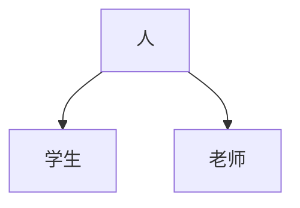
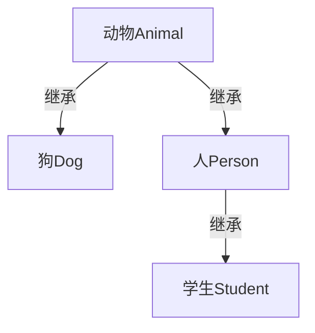
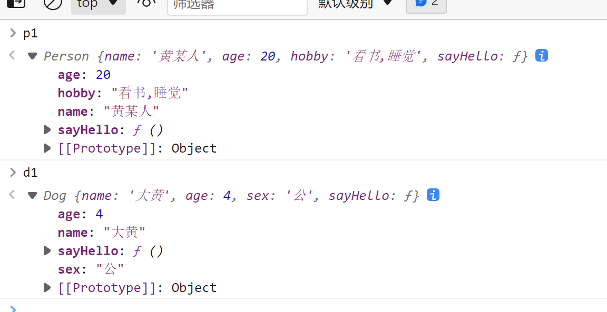
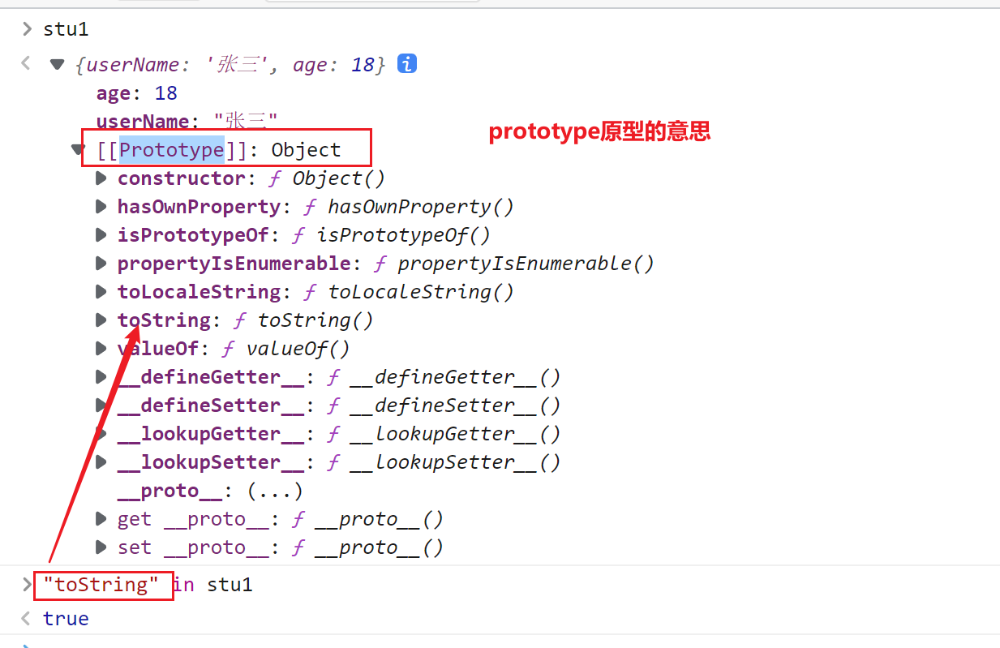
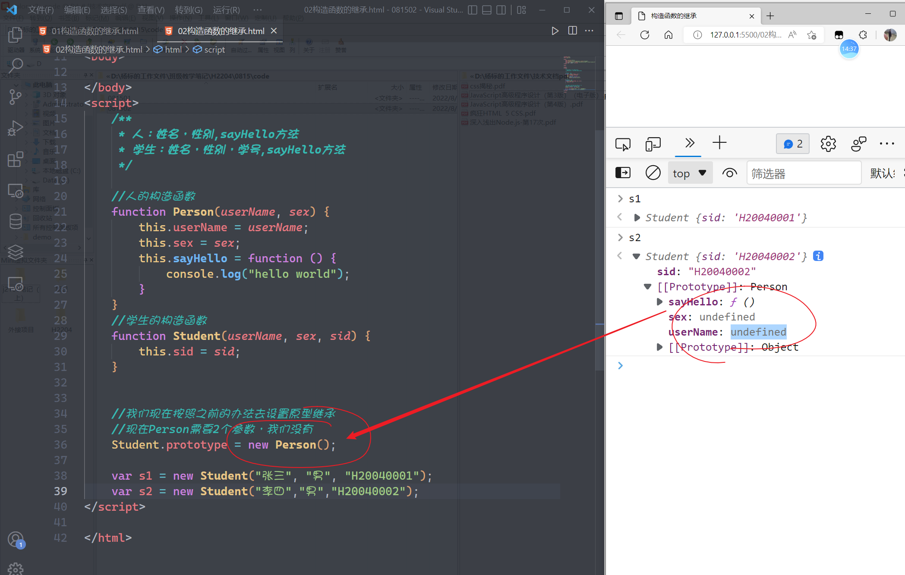
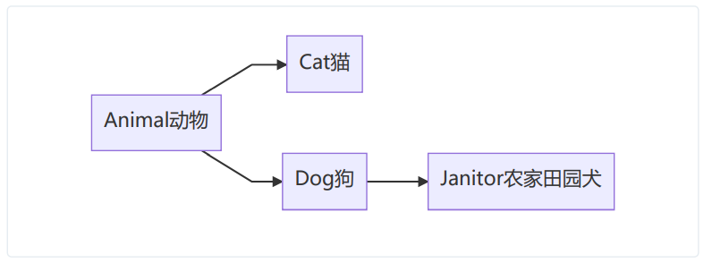

## 面向对象（四）

> 主题：继承
>
> 继承是一种通俗的概念，子级对象是可以默认使用父级对象的东西的

之前我们已经学习过了怎么样封装一个对象 （封装对象也叫创建对象），在封装的过程当中难免会出现一些问题

**场景**一：现在有一个学生对象，他有姓名userName，性别sex，年龄age，学号sid四个属性，而又有一个老师对象，他有姓名userName，性别sex，年龄age，它还有`tid`工号，那么，对于这样的对象，我们怎么处理呢？

**场景二**：现在有一群男生和女生，它们的属性不相同，但是他们都有一个共同的方法叫`sayHello`，对于这种场景，我们又怎么办？

在平常我们接触对象的时候其实我们已经接触过继续的特点了

### 通过`call/apply`来继承

> 这一种方式的继承只是实现了代码上面的继承关系，并没有实现父子的表现关系

```javascript
function Student(userName, sex, age, sid) {
    this.userName = userName;
    this.sex = sex;
    this.age = age;
    this.sid = sid;
}

function Teacher(userName, sex, age, tid) {
    this.userName = userName;
    this.sex = sex;
    this.age = age;
    this.tid = tid;
}


var s1 = new Student("张珊", "女", 18, "H22040001");
var t1 = new Teacher("桃子", "女", 20, "T01");
```

在上面的代码里面，我们已经创建了两个构造，并通过2个构造函数来实现了对象的创建过程，但是问题就在于这个代码它的冗余量非常大。学生`Student`与`Teacher`老师有3个共同的属性，我们能否将这3个共同的属性提取出来



```javascript
//学生与老师公共的东西就是人
function Person(userName, sex, age) {
    this.userName = userName;
    this.sex = sex;
    this.age = age;
}

function Student(userName, sex, age, sid) {
    this.sid = sid;
    //构造函数地this指向当前新创建的对象
    // Person(userName, sex, age);   如果是以这种方式去调用，则this的指向就会指向window,而没有指向当前调用的对象
    Person.call(this, userName, sex, age);
}

function Teacher(userName, sex, age, tid) {
    this.tid = tid;
    Person.call(this, userName, sex, age);
}

var s1 = new Student("张珊", "女", 18, "H22040001");
var t1 = new Teacher("标哥哥", "男", 18, "T01");
```

> 上面的`call`是可以变成`apply`

**现在请通过上面的方式来完成一个小小的练习**

现有一个动画对象`Animal`，它有名称`name`与年龄`age`，所有的动画都有一个`sayHello`的方法，这个方法默认打印输出“hello world”

现有小狗对象`Dog`，它有性别`sex`

现有人的对象`Person`，它有爱好`hobby`,人有自己的`sayHello`方法，这个方法打印输出“你好，世界”

现有学生对象`Student`，它有学号`sid`

请根据继续关系图来完成操作



```javascript
//动物
function Animal(name, age) {
    this.name = name;
    this.age = age;
    this.sayHello=function(){
        console.log("hello world");
    }
}
//狗
function Dog(name, age, sex) {
    Animal.call(this, name, age);
    this.sex = sex;
}

//人
function Person(name, age, hobby) {
    Animal.call(this, name, age);
    this.hobby = hobby;
    this.sayHello=function(){
        console.log("你好，世界");
    }
}
//学生
function Student(name, age, hobby, sid) {
    Person.call(this, name, age, hobby);
    this.sid = sid;
}


var s1 = new Student("小方", "女", "吃饭，睡觉，打豆豆", "H22040001");
var d1 = new Dog("大黄", 4, "公");
var p1 = new Person("黄某人",20,"看书,睡觉");
```

<span style="color:red;font-size:22px;font-weight:bold">存在的问题</span>

虽然说我们通过`call/apply`实现了代码的继承关系，然后我们在控制台也打印对象



通过上面的图我们可以看到一个很明显的一个点，我们根据就无法区分哪属性是子级对象的，哪些属性是父级对象的。通过这一种方式实现的继承它会把所有的属性都放在子级对象上面，并没有严格的构成父子关系 ，`call/apply`只是将代码的属性进行了混合

### 通过原型继承【重点，难点】

要弄清楚这一点，我们就必须先弄清楚什么是“原型”

#### 理解原型

之前我们讲过`in`关键是可以检测一个对象是否具体某一个属性，所以现在我们先测试如下

```javascript
var stu1 = {
    userName: "张三",
    age: 18
}

"userName" in stu1;             //true
"age" in stu1;                  //true
"aaa" in stu1;                  //false
"toString" in stu1;             //true              问题就在这里
```

`stu1`的上面明明是没有`toString`的方法的，为什么通过关键字`in`去检测的结果又是`true`（说明：`stu1`对象本身没有这个属性，但是它的父级有）



什么是原型？原型也叫`prototype`，它是所有对象默认都具备的东西，可以理解为父级对象的意思。在以前`prototype` 有另外一个名子叫`__proto__`。它们两个名子不一样，但都是同样的一个

```javascript
"toString" in stu1;
```

在我们去执行上面的检测的时候，`stu1`这个对象是没有`toString`的这个方法，但是它的父级对象（原型）上面有这个，所以最终检测出来的结果就是`true`

现在我们是不是可以得到一个点，在JS里面如果想成为一个对象的爹，你就必须是它的原型，你想是它的原型你就必须是一个叫做`__proto__`的东西，如果你想是`__proto__`现在叫`prototype`

```javascript
//人
var p1 = {
    sex:"男"
}

//学生
var stu1 = {
    userName: "张三",
    age: 18
}

//想让人变成学生的爹 ，怎么办？
//p1必须是stu1的原型
//__proto__
stu1.__proto__ = p1;            //stu1的原型就是p1，stu1对象的父级就是p1

"userName" in stu1;         //true;
"age" in stu1;              //true
"sex" in stu1;              //true

stu1.sex === stu1.__proto__.sex;
//子级对象没有，默认找父级对象
```

通过上面的代码，我们知道， 如果想让一个对象继承自另一个对象，最简单的方法就是设置它的原型`__proto__`

现在各位同学已经有了原型的概念，那么，我们再继续的看一下下面的代码

```javascript
var arr = ["a","b","c","d"];
arr.push("e");			//向数组的最后面添加1个"e"

arr.push===arr.__proto__.push;			//true
```

**请问**：`push`这个方法是`arr`的还是`arr`的爹（原型）的

`arr`本身是没有`push`的方法的，所以它五个人是它爹的方法，这就说明了一点，<u>子级元素是默认可以使用父级元素的东西</u>

**总结**

1. 原型就是`__proto__`
2. 原型也是`prototype`
3. 原型也可以理解为一个对象的爹
4. 当一个对象调用属性或方法时，当前对象如果不存在，默认就会向原型（爹）上面找
5. 每一个对象默认都会有原型

#### 通过原型继承(简单版)

**场景**：现有一个对象a1,这个对象上面有一个`sayHello`方法， 有一个`sleep`的方法，有一个`eat`的方法，现在所有的动画对象都应该有这个三个方法，怎么办呢

```javascript
var a1 = {
    sayHello: function () {
        console.log("大家好");
    },
    sleep: function () {
        console.log("睡觉");
    },
    eat: function () {
        console.log("吃东西");
    }
}

var s1 = {
    userName: "张三",
    sex: "男"
}
var s2 = {
    userName: "李四",
    sex: "男"
}
var s3 = {
    userName: "桃子",
    sex: "女"
}
// 现在所有的学生对象都应该有这个三个方法，怎么办呢
s1.__proto__ = a1;
s2.__proto__ = a1;
s3.__proto__ = a1;
```

看上面的代码，思考问题：如果现在我们创建65个学生对象，请问，咋办？这个时候我们发现上面的`userName，sex`这两部分的代码就会重复进行，怎么简化呢？

#### 构造函数的原型继承【过渡】

> （不建议使用，知道就行）

```javascript
var a1 = {
    sayHello: function () {
        console.log("大家好");
    },
    sleep: function () {
        console.log("睡觉");
    },
    eat: function () {
        console.log("吃东西");
    }
}
//如果要创建很多个格式相同的对象，最好的办法就是先创建构造函数，再通过构造函数创建对象
function Student(userName, sex) {
    this.userName = userName;
    this.sex = sex;
}

var s1 = new Student("张珊", "女");
s1.__proto__ = a1;
var s2 = new Student("李四","男");
s2.__proto__ = a1;
var s3 = new Student("标哥","男");
s3.__proto__ = a1;
```

在上面的代码里面，我们发现，构造函数虽然帮我们解决了快速创建对象的问题，但是在创建完对象以后，我们仍然要手动的去指定原型`__proto__`，这样也会非常麻烦

<span style="color:red;font-weight:bold;font-size:24px">在JS的对象里面，一个对象的`__proto__`应该等于这个对象的构造函数的`prototype`属性</span>

```javascript
var a1 = {
    sayHello: function () {
            console.log("大家好");
        },
    sleep: function () {
        console.log("睡觉");
    },
    eat: function () {
        console.log("吃东西");
    }
}
//如果要创建很多个格式相同的对象，最好的办法就是先创建构造函数，再通过构造函数创建对象
function Student(userName, sex) {
    this.userName = userName;
    this.sex = sex;
}

//第一步推断：一个对象的__proto__等于这个对象的构造函数的prototype
//第二步推断：一个对象的父级对象（爹）等于这个对象的构造函数的prototype

// s1.__proto__ === Student.prototype;      //true
Student.prototype = a1;
var s1 = new Student("张珊", "女");
var s2 = new Student("李四", "男");
var s3 = new Student("标哥", "男");
```

#### 构造函数的原型继承2【过渡】

```javascript
//人的构造函数
function Person() {
    this.sayHello = function () {
        console.log("大家好");
    }
    this.sleep = function () {
        console.log("睡觉");
    }
    this.eat = function () {
        console.log("吃东西");
    }
}

//学生的构造函数
function Student(userName, sex) {
    this.userName = userName;
    this.sex = sex;
}
```

现在的要求非常简单，我们希望`Student`构造出来的对象要具备`Person`构造出来的对象里面的3个方法

```javascript
var s1 = new Student("张珊","女");
//希望s1具备 sayHello/sleep/eat三个方法，怎么办？
```

-----

```javascript
//人的构造函数
function Person() {
    this.sayHello = function () {
        console.log("大家好");
    }
    this.sleep = function () {
        console.log("睡觉");
    }
    this.eat = function () {
        console.log("吃东西");
    }
}

//学生的构造函数
function Student(userName, sex) {
    this.userName = userName;
    this.sex = sex;
}

// var p1 = new Person();
// Student.prototype = p1;

//Student所构造出来的对象，它的爹是Person构造出来的对象
Student.prototype = new Person();

var s1 = new Student("张珊", "女");
//希望s1具备 sayHello/sleep/eat三个方法，怎么办？
s1 instanceof Student;                  //true
s1 instanceof Person;                   //true
```

----

#### 构造函数的原型继承3【标哥推荐版】

> 这个做法，仍然有一点小小的遗憾，它会破坏原型。但是这种方法是目前主流的方法

```javascript
/**
     * 人：姓名，性别,sayHello方法
     * 学生：姓名，性别，学号,sayHello方法
*/

//人的构造函数
function Person(userName, sex) {
    this.userName = userName;
    this.sex = sex;
    this.sayHello = function () {
        console.log("hello world");
    }
}
//学生的构造函数
function Student(userName, sex, sid) {
    this.userName = userName;
    this.sex = sex;
    this.sayHello = function () {
        console.log("hello world");
    }
    this.sid = sid;
}
```

对于上面的代码，我们怎么样让学生Student继承了Person以后，简化我们的代码



如果仍然通过原来的原型继承来实现的，这个时候我们就发现，如果父级要接收参数就接收不到了

上面问题的根本就在于当我们去继承的时候`Student.prototype = new Person()`我们还不知道学生的信息，这个时候的`Person`在接收参数的时候就会接收不到

```javascript
/**
     * 人：姓名，性别,sayHello方法
     * 学生：姓名，性别，学号,sayHello方法
     */

//人的构造函数
function Person(userName, sex) {
    this.userName = userName;
    this.sex = sex;
    this.sayHello = function () {
        console.log("hello world");
    }
}
//学生的构造函数
function Student(userName, sex, sid) {
    this.sid = sid;
    // Student.prototype = new Person(userName, sex);
    //this.__proto__ == Student.prototype;
    this.__proto__ = new Person(userName,sex);
}


//依据：一个对象的__proto__等于它的构造函数的prototype
//我们现在按照之前的办法去设置原型继承
//现在Person需要2个参数，我们没有
// Student.prototype = new Person();

//s1.__proto__ === Student.prototype

var s1 = new Student("张三", "男", "H20040001");
var s2 = new Student("李四","男","H20040002");
```

### 面向对象的补充点

1. 为什么所有的数据在`instanceof Object`的时候都会是`true`

   在JS里面，除`null,undefined`在外，所以对象最终都会继承自`Object`

2. 那么`Object`对象里面有2个的特殊的方法
   * `toString()`方法
   * `valueOf()`方法

#### 关于`toString()`方法

`toString()`方法是所有对象都具备的方法，而我们之前在讲运算符的时候有一个加法运算符执行的是“字符串优先”原则

```javascript
var obj1 = {
    age: 19,
    money: 1000
}
var obj2 = {
    age: 50,
    money: 10
}
var arr1 = [123];

//加法：执行字符串优先原则 ，如果是对象，则会调用对象的toString方法

//obj1.toString();        //'[object Object]'
//obj2.toString();        //'[object Object]'
var result1 = obj1 + obj2;   //[object Object][object Object]'
```

在上面的代码里面，它就会把两个对象`toString()`以后再相加

```javascript
//arr1.toString()   '123';
var result2 = obj1 + arr1;      //'[object Object]123'
```

再看下面的代码 

```javascript
// 继承一个对象以后就可以使用这个对象上面所有的方法与属性
// 自己有就用自己的,自己没有就找父级
var obj1 = {
    age: 19,
    money: 1000,
    toString: function () {
        return this.age;
    }
}
var obj2 = {
    age: 50,
    money: 10,
    toString: function () {
        return this.age;
    }
}

//obj1.toString();      //19
//obj2.toString();      //50
var result3 = obj1 + obj2;          //69
```

#### 关于`valueOf()`方法‘

> 1. **所有执行以数字优先的相关操作的都调用`valueOf`**
>
> 2. **如果valueOf调用以后得不到结果或得到了没有用的结果就调用`toString()`**

```javascript
// 继承一个对象以后就可以使用这个对象上面所有的方法与属性
// 自己有就用自己的,自己没有就找父级
var obj1 = {
    age: 19,
    money: 1000,
    toString: function () {
        return this.age;
    }
}
var obj2 = {
    age: 50,
    money: 10,
    toString: function () {
        return this.age;
    }
}

//obj1.valueOf();                 //调用失败,转而toString() 19
//obj2.valueOf();                 //调用失败,转而toString() 50

var result2 = obj1 - obj2;        //-31

```

现在我们手动的再指定`valueOf`方法

```javascript
var obj1 = {
    age: 19,
    money: 1000,
    toString: function () {
        return this.age;
    },
    valueOf: function () {
        return this.money;
    }
}
var obj2 = {
    age: 50,
    money: 10,
    toString: function () {
        return this.age;
    },
    valueOf: function () {
        return this.money;
    }
}

//obj1.valueOf();                 //调用成功 1000
//obj2.valueOf();                 //调用成功 10
var result2 = obj1 - obj2;        //990
var result3 = obj1 > obj2;      //true 
```


### 练习 

1. 现在几个动物分别小猫Cat和小狗Dog,Cat构造函数里面有性别（sex），年龄（age），昵称 （nickName）和体重（weight）四个属性，而Dog构造函数里面有性别，年龄，昵称 ，和身高 （height）四个属性，猫与狗有一个共同的方法叫sleep睡觉，但是猫有一个方法 `miao` ,狗有一个方法 叫 `wang `

   * 现在请列举出Cat与Dog的构造函数，并且提取公共部分使用继承 

   * 突然之间又有一个小动物，农家田园犬Pastoral，它也是属于狗的类别，也具备Dog所有的属性，但是它还有一个方法是看门 `janitor` 

   现在请创建 Pastoral 的构造函数，并实现继承关系

   > 既然是使用构造函数，那么肯定是使用原型继承

​	

```javascript
function Animal(sex, age, nickName) {
    this.sex = sex;
    this.age = age;
    this.nickName = nickName;
    this.sleep = function () {
        console.log("我在睡觉");
    }
}

//猫的构造函数
function Cat(sex, age, nickName, weight) {
    this.weight = weight;
    this.miao = function () {
        console.log("喵喵喵...");
    }
    this.__proto__ = Cat.prototype = new Animal(sex, age, nickName);
}

//猫的构造函数
function Dog(sex, age, nickName, height) {
    this.height = height;
    this.wang = function () {
        console.log("㕵㕵㕵...");
    }
    this.__proto__ = Dog.prototype = new Animal(sex, age, nickName);
}

//家家田园犬
function Pastoral(sex, age, nickName, height) {
    this.janitor = function () {
        console.log("我在看门....");
    }
    this.__proto__ = Pastoral.prototype = new Dog(sex, age, nickName, height);
}

var c1 = new Cat("公", 3, "小花", 5);
var d1 = new Dog("母", 1, "阿黄", 10);
var p1 = new Pastoral("公", 2, "科基", 8);
```

上面是我们使用了标哥的方式去完成的

2. 还是上面的题目，请使用组合继承（寄生继承）的方式来写一遍
   * 先只完成`Dog、Cat`继承`Animal`
   * 完成了上面的操作以后，再让`Pastoral`继承`Dog`
   * **修复原型链**

```javascript
function Animal(sex, age, nickName) {
    this.sex = sex;
    this.age = age;
    this.nickName = nickName;
    this.sleep = function () {
        console.log("睡觉吧...");
    }
    this.__proto__ = Animal.prototype;
}

//猫的构造函数
function Cat(sex, age, nickName, weight) {
    this.weight = weight;
    this.miao = function () {
        console.log("喵喵喵...");
    }
    // this.__proto__;
    // Cat.prototype
    // 寄生继承

    // this.__proto__.sex = sex;
    // this.__proto__.age = age;
    // this.__proto__.nickName = nickName;
    Animal.call(Cat.prototype, sex, age, nickName);
    this.__proto__ = Cat.prototype;

}

//狗的构造函数
function Dog(sex, age, nickName, height) {
    this.height = height;
    this.wang = function () {
        console.log("㕵㕵㕵...");
    }
    // 开始组合继承
    Animal.call(Dog.prototype, sex, age, nickName);
    //修复原型
    this.__proto__ = Dog.prototype;
}

//田园犬
function Pastoral(sex, age, nickName, height) {
    this.janitor = function () {
        console.log("我在辛苦的看家");
    }
    // 开始组合继承
    Dog.call(Pastoral.prototype, sex, age, nickName, height);
    //修复原型
    this.__proto__ = Pastoral.prototype;
}

var c1 = new Cat("母", 3, "小花", 2);
var d1 = new Dog("公", 2, "大黄", 1);
var p1 = new Pastoral("公", 4, "小田田", 3);
```

