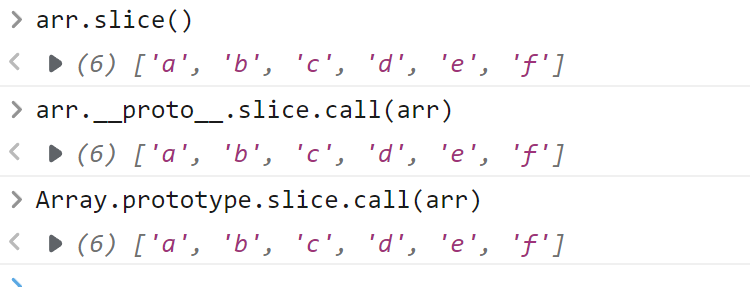

## 跨对象调用方法【重点】

之前我们已经讲过了在对象里面调用方法的方式，还有函数的调用调用

```javascript
function aaa(userName) {
    console.log(this);
    console.log("你好," + userName);
}

var obj1 = {
    age:18
}

window.aaa("张珊");					//aaa被window调用，this指向window
window.aaa.call(obj1,"李四");			//aaa呼叫obj1调用，this指向obj1
window.aaa.apply(obj1,["王五"]);		//aaa申请obj1来调用，this指向obj1
```

这些`call/apply`调用方法的方式我们之前已经接触过了。现在我们来看一下`call/apply`还有什么其它的用法

> `call`有呼叫的意思，`方法.call()`有呼叫来调用这个方法的意思
>
> `apply`有申请的意思，`方法.apply`有申请谁来叫用这个方法的意思
>
> 所以通过`call/apply`去调用的时候，里面的`this`就指向了当前申请或呼叫的这个人，本质上面其实还是方法的`this`指向了当前调用这个方法的对象

现在请同学们看下面的代码

```javascript
var stu1 = {
    userName: "颜一鸣",
    doHomeWork: function () {
        console.log(this.userName);
    }
}

var stu2 = {
    userName: "袁池康"
}

stu1.doHomeWork();

//在上面的代码里面，我们的stu1与stu2都有userName,stu1有一个方法doHomeWork
//现在stu2没有这个方法，请问袁池康有没有办法调用stu1的doHomeWork方法呢？
```

现在的问题就在于能否让`stu2`也去调用`stu1`的`doHomeWork` 方法

换句话来说`stu2`就是要借用`stu1`的`doHomeWork`的方法

**第一种办法**

```javascript
stu2.__proto__ = stu1;

stu2.doHomeWork === stu1.doHomeWork;                //true
stu2.doHomeWork === stu2.__proto__.doHomeWork;      //true

stu2.doHomeWork();              //袁池康
stu2.__proto__.doHomeWork();    //颜一鸣
```

在这一种方法里面，我们只要让一个对象继承了另一个对象不就可以使用这个对象的方法了呢，所以我们让`stu2`继承了`stu1`，这样就可以实现我们的场景需求

`stu2.doHomeWork()`和`stu2.__proto__.doHomeWork()`在调用方法的时候，因为调用者发生了变化，所以方法里面的`this`也发生了变化，这一种要注意

**第二种办法**

```javascript
stu1.doHomeWork.call(stu2);     //袁池康			//stu1.doHomeWork呼叫stu2过来调用
stu1.doHomeWork.apply(stu2);    //袁池康			////stu1.doHomeWork申请stu2过来调用
```

 这一种情况就是跨对象调用方法的应用场景

**案例一**：求数组的最大值

```javascript
var arr = [1,5,7,9,2,3,8];
```

现在有上面的数组，我们要求这个数组的最大值怎么办呢。

解决这个问题我们已经有了很多个思路 ，原始的方法我们可以使用**比武招亲**的思维，数组里面也提供了**归并方法**

```javascript
//第一种思路 ：比武招亲
var max = arr[0];
for (var i = 1; i < arr.length; i++) {
    if (max < arr[i]) {
        max = arr[i];
    }
}
```

```javascript
//第二种：数组归并
var max = arr.reduce(function (prev, current, index, _arr) {
    return prev > current ? prev : current;
})
```

上面的2种方式仍然是我们在这个地方之前所学过的试试，现在我来教一个新的方法给大家

在后面的学习当中我们有一个对象叫`Math`内置对象，这个对象下面有一个`Max`这个方法，它可以求一系列数的最大值。我们现在就要借用一下系统的这个方法去使用

```javascript
var arr = [1, 5, 7, 9, 2, 3, 8];
var max = Math.max(1, 5, 7, 9, 2, 3, 8);
console.log(max);			//9
```

上面的`Math.max`虽然帮我们找到了最大值，但是它需要我们将所有的数组元素1个1个的放进去，这样做非常麻烦，怎么办呢

我们知道方法除了使用`方法名+（）`来调用以外，还可以通过`call/apply`来调用

```javascript
//var max = Math.max.call(Math,1, 5, 7, 9, 2, 3, 8);
// var max = Math.max.apply(Math,[1, 5, 7, 9, 2, 3, 8]);
var max = Math.max.apply(Math,arr);
```

> 说明一下：虽然说跨对象调用，但是这里没有跨对象调用，因为最后还是`Math`在调用

**案例二：将类数组转换为数组**

> 类数组：也叫伪数组，具备数组的特点（通过索引来取值赋值，通过length来获取长度），但是不具备数组的方法

```javascript
var obj = {
    0:"a",
    1:"b",
    2:"c",
    3:"d",
    4:"e",
    5:"f",
    length:6
}
```

上面是一个对象，它是一个类数组，它有数组的特性（有索引，有长度），但是不具备数组的方法，所以如何将上面的这个类数组转换成数组`["a","b","c","d","e","f"]`

推导过程

```javascript
var arr = ["a", "b", "c", "d", "e", "f"];

var arr1 = arr.slice();
//slice的结果一定是一个数组
//能不能让obj也借用一下数组的slice方法呢？
arr.slice === arr.__proto__.slice;  //true


var arr2 = arr.__proto__.slice();   //出错了
//它得到一个空的数组，没有元素
//原因arr.slice中slice里面的this指向提arr
//而arr.__proto__.slice方法中的slice的this指向arr.__proto__
//所以我们要让arr.__proro__.slice中的this指向arr

var arr3  = arr.__proto__.slice.call(arr);
```

经过上面的推理以后，我们发现`arr.slice()`就相当于`arr.__proto__.slice.call(arr)`

现在我们来回顾一个点之前我们讲过一个对象的`__proto__`应该等于它的它的构造函数的`prototype`

arr是一个数组，它的构造函数是`Array`，`var arr = new Array()`

```javascript
arr.__proto__ === Array.prototype;          //true
arr.__proto__.slice === Array.prototype.slice;  //true
var arr4 =  Array.prototype.slice.call(arr);		//又得到了一个数组
```



上面的三种方法本质上面其实都是一样的

现在思考一下，如果其它对象也可以调用`slice`，是不是也可以得到一个新数组

**结论**

```javascript
var obj = {
    0: "a",
    1: "b",
    2: "c",
    3: "d",
    4: "e",
    5: "f",
    length: 6
}

//var arr = obj.slice();   //但是obj没有slice方法，所以会报错
//所以这里就代用Array数组的slice方法
var arr1 = Array.prototype.slice.call(obj);
```

同理，我们也可以使用数组的其它方法来试一下

```javascript
var str = Array.prototype.join.call(obj,"#");			//'a#b#c#d#e#f'
```

