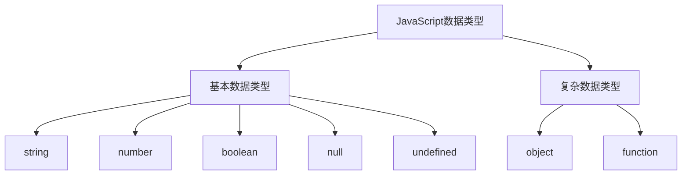
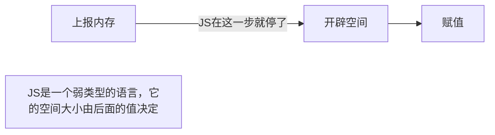
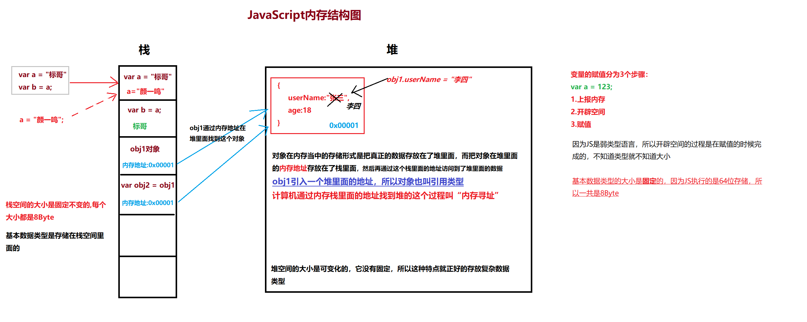
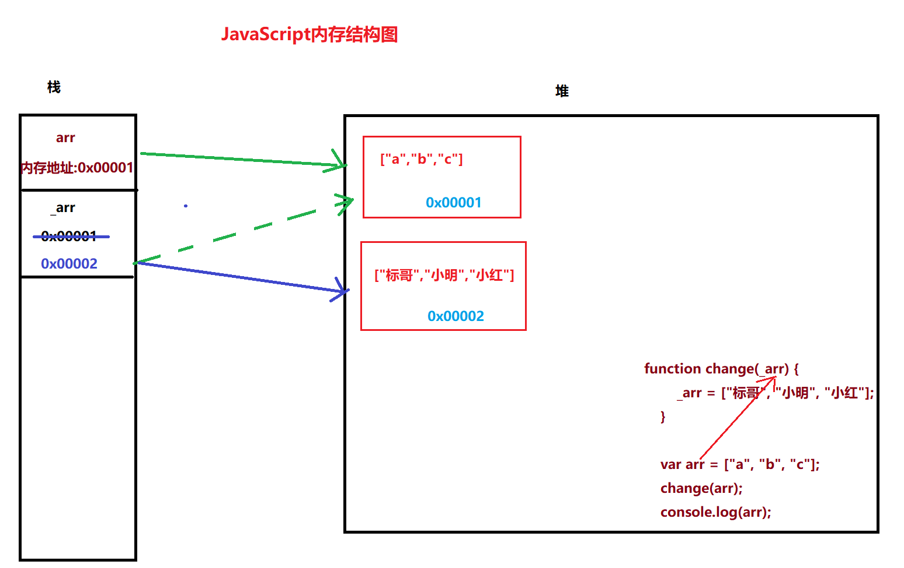
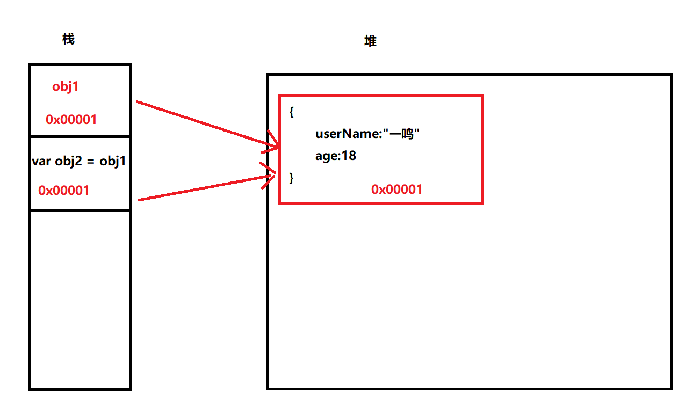
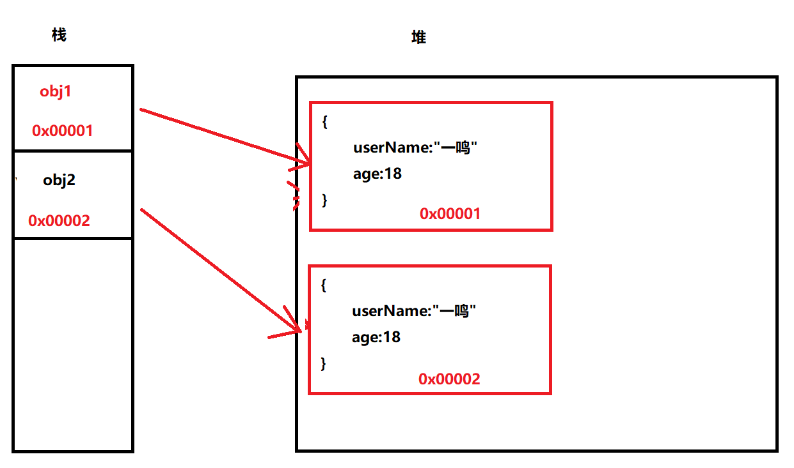

## 对象在内存当中的存储

> 这个章节也叫内存的堆栈原理

在之前面向对象的章节当中我们讲了对象的封装（创建）,继承，讲完这些东西以后，我们对对象应该有了一个初步的认识

1. 对象是一个复杂数据类型

   在JavaScript里面，数据类型分2大类，分别是基本数据类型和复杂数据类型（复杂数据类型指的就是对象）

2. 基本数据类型分为5大类，复杂数据类型就是一个`object`，基本数据类型使用`typeof`的关键字来检测 ，复杂数据类型使用`instanceof`去检测

3. 复杂数据类型也有另一种叫法叫“引用类型”



从上面这个图里面，我们可以很清楚的看到JS把数据类型分为了2大类，这是为什么呢？

JS将数据类型分为2大类的原因还是与计算的内存有关系 ，因为它们在内存当中的存储形式是不一样的，我们先通过一个简单的例子来说明

```javascript
var x = "标哥";
var y = x;
x = "颜一鸣";
console.log(y);
//结论：x,y  2个变量互不影响 
```

在上面的代码里面我们应该可以看到一个点，**2个变量之间应该是互不影响的**,x，y应该是相互独立的（这其实就是基本数据类型的特点）

现在再看第2个例子

```javascript
var obj1 ={
    userName:"张三"
}
var obj2 = obj1;
obj1.userName = "李四";
console.log(obj2.userName);
// 结论：obj1,obj2  2个变量互相影响
```

通过上面的代码欠产可以发现，**2个变量之间又相互影响了**（这就是复杂数据类型的特点）

要弄清楚基本数据类型与复杂数据类型的根本特点，我们一定要深入到内存当中去看

### 数据的内存存储

内存是负责存储数据的，在存储的时候数据结构主要分为4大部分，分别是“堆，栈，链，表”。在目前主要的编程语言里面（如JS，java）只使用到了“堆”和“栈”这两大内存结构，<span style="color:red;font-weight:bold">我们的基本数据类型是保存在内存的栈空间里面，我们的复杂数据类型是保存在内存的堆空间里面</span>

```java
//这是JS代码
var a = 10;
var b;
```

在编译系统里面，所有的变量的初始化都分为3个步骤，无论是何种语言



如果说是`Java`的强类型语言

```javascript
//这是Java代码
int a = 10;
int b;		//即使在没有赋值的情况下，我也知道b变量是int类型 ，占4个Byte
```


从上面的图当中我们可以看到 ，无论是什么编程语言的定义变量的时候都会有一个开辟空间的过程，只要关注这个空间到底在内存的什么地方开辟，在不同的地方开辟所表现出来的特点是不一样的

栈：栈空间的大小是固定不变的，它是8Byte，编程语言只能直接操作栈空间

堆：堆空间的大小是可变化的，编程语言不能直接操作堆空间（可以间接操作），`C/C++`除外



在上图当中我们可以看到基本数据类型的存储方式与复杂数据类型的存储方式是不一样的，基本数据类型因为固定了大小所以是放在了栈里面，而复杂数据类型因为没有固定大小 ，所以在内存的堆当中在存储 ，然后把这个堆的地址又放到了栈里面

复杂数据类型通过这个栈里面的地址去堆里面寻找内存的某一个空间，相当于栈里面引入了堆里面的某一个内存地址，所以也常常将复杂数据类型叫**引用类型**

* `var obj2 = obj1`本质上面是把`obj1`里面存放的内存地址给了`obj2`，这样2两个内存地址指向的是同一个内存空间，像这种传递地址的过程我们叫**地址传递**
* `var b = a`这个过程是把`a`在栈里面存放的数据拷贝了一份给`b`,这样的两个栈的空间是相互隔离的，互不影响，这个传递过程我们叫**值传递**

**总结**：基本数据类型采用值传递，复杂数据类型采用地址传递

**场景一**

```javascript
function abc(x){
    x = 20;
}

var a = 10;
abc(a);
console.log(a);
```

> **代码分析**：
>
> 在上面的场景当中，最终打印的结果仍然是10。原因就在于a是一个基本数据型，在传递的时候使用值传递，形参x在接收的时候接收到的是值10，a与x就是两个互不影响 的，x后面在函数里面变成了20以后对a没有任何影响

**场景二**

```javascript
function def(_arr){
    _arr[0] = "标哥";
}

var arr = ["a","b","c"]
def(arr);
console.log(arr);
```

> **代码分析**
>
> `arr`是一个数组，它是一个对象也就是一个复杂数据类型 ，复数数据类型是存放在内存的堆里面，然后堆里在贩地址又放在了栈里面， 在进行传递的时候，它是把栈里在**地址传递**出去了，最终通过地址所找到的对象是同一个对象，当arr的实参传递给形参_arr的时候，它们的地址是同一个地址，这样通过`_arr`改变一个值以后，外边的`arr`也被改变了

**场景三**

```javascript
function change(_arr) {
    _arr = ["标哥", "小明", "小红"];
}

var arr = ["a", "b", "c"];
change(arr);
console.log(arr);
```

> **代码分析**
>
> 这一种场景虽然前期在`arr`传递给`_arr`的时候仍然传递的是地址，但是后面的`_arr`又重新的赋值了一个新的数组，这个`arr`与`_arr`所表示的地址就不一样的，最终两个人就不是不相同的数组



**场景四**

```javascript
var arr = ["a", "b", "c", { userName: "标哥" }, "e", "f"];
// arr = ["a","b","c",0x00001,"e","f"];

//0x00002
var obj = {
    userName: "标哥"
}

var index1 = arr.indexOf("c");          //2
var index2 = arr.indexOf(obj);        //-1  
```

> **代码分析**
>
> 对象在通过`indexOf`去查找的时候，它找的是地址所以会存在找不到的情况，同时这个问题也可以解释以下的问题
>
> `[]==[]`结果是`fasle`，`{}=={}`结果也是`false`

------

### 对象的拷贝

对象在进行传递的时候执行的是地址传递，它的拷贝现象会有两种情况

1. 对象的浅拷贝
2. 对象的深拷贝

#### 对象的浅拷贝

对象的浅拷贝就是只拷贝栈里面的数据 

> 在对象的浅拷贝里面，它栈里面的地址是相同的

```javascript
var obj1 = {
    userName:"一鸣",
    age:18
}
var obj2 = obj1;			//这一种现象我们称之为浅拷贝
						    //这一种现象只拷贝了栈里面的地址，这个地址指向了同一个对象
```



在上在的图当中我们可以的看到这一种现象就是浅拷贝，浅拷贝最大的问题就是只拷贝了栈里面的地址，这样造成的后果就是两个对象指向了同一个堆的地址，**两个变量之间就会相互影响** 

```javascript
obj1.userName = "张珊";
console.log(obj2.userName);			//张珊
```

针对上现的现象，如果我们希望得到一个互不影响的两个对象，怎么办呢？这个时候就要需要有一种新的技术叫**对象深拷贝**

#### 对象深拷贝

简而言而，对象的深拷贝就是深入到内存的堆里面去拷贝一份出来，这样两个对象指向的堆的地址就不是同一个地址



在上面的图里面，我们可以看到在堆里面我们得到了一模一样的对象，`obj1`与`obj2`两个对象之间互不影响

#### 简单对象的深拷贝【1】

```javascript
var obj1 = {
    userName: "张珊",
    age: 18
}

Object.defineProperty(obj1, "sex", {
    configurable: false,
    enumerable: false,
    writable: false,
    value: "女"
});

//现在想得到obj2的对象 ，然后与obj1完全相同，但又互不影响
//第一步：先创建一个对象
var obj2 = {};      //JS会在内存的堆里面创建一个新对象
//第二步：获取原对象的属性
var arr = Object.getOwnPropertyNames(obj1);   //['userName', 'age', 'sex']
//第三步：将原对象的属性值遍历出来，放在新的对象上面
arr.forEach(function (item) {
    //item代表遍历出来的每一项，也就是属性名
    obj2[item] = obj1[item];
})
```

在上面的代码里面，我们使用了一个最简单的对象深拷贝过程，但是要注意这里不能使用`for...in`也不能使用`Object.keys()`来完成，因为这两个方法获取不到`enumerable:false`的属性，只有`Object.getOwnPropertyNames()`这个方法才可以获取所有的属性

------

#### 简单数组深拷贝【2】

数组也是一个对象，如果想实现数组的深拷贝，也是有办法的

```javascript
var arr = ["a", "b", "c", "d", "e"];
//相得到一份相同的数组，但是又互不影响

//第一种办法,concat
var arr1 = arr.concat();

//第二种办法,slice
var arr2 = arr.slice();

//第三种方法
var arr3 = arr.map(function(item){
    return item;
});
```

-----

#### 通过`Object.assign()`拷贝简单对象【3】

这一个方法是JS专门提供给我们做对象的深 拷贝的方法，它的语法格式如下

```javascript
var 目标对象 = Object.assign(目标对象,源对象...);
```

上面的语法格式说得非常清楚，它会把源对象拷贝到目标对象里面同时再返回这个目标对象 

```javascript
 var obj1 = {
     userName: "张珊",
     age: 18,
     sex: "女"
 }
 //请创建对象obj2，实现obj1的所有属性，但是又互不影响
 //第一步：创建一个新对象
 var obj2 = {};
obj2 = Object.assign(obj2, obj1);
```

`Object.assgin()`除了可以实现对象的拷贝以外还可以实现对象的合并 

```javascript
var obj1 = {
    userName: "张珊",
    age: 18,
    sex: "女"
}
var obj2 = {
    height: 170,
    weight: 50,
    age: 20
}

var obj3 = {};     //新对象
Object.assign(obj3, obj1, obj2);
//obj1先拷贝给obj3, 再把obj2拷贝给obj3
```

**注意事项**：`Object.assign()`在拷贝对象的时候它会拿不到`enumerable:false`的属性

----

#### 复杂对象的深拷贝【终极】

上面的三个方法讲解了对象的深拷贝，其实都是假的**（标哥说它们是假的深拷贝）**,当面对象复杂的对象的时候（也就是对象里面又包含对象的时候就会出问题）

**推翻第1点**

```javascript
var obj1 = {
    userName: "张三",
    age: 18,
    teacherInfo: {
        name: "标哥哥",
        height: 170,
        weight: 65
    }
}
//现在想创建一个obj2,与obj1完全相同，但又互不影响
// 第一步：创建新对象
var obj2 = {};          //JS在内存的堆里又创建一个对象，与之前的obj1不是同一个对象
//第二步：获取所有的属性名
var arr = Object.getOwnPropertyNames(obj1);
//第三步：遍历旧对象的属性，赋值到新对象上面
arr.forEach(function(item){
    //item代表当前的属性
    obj2[item] = obj1[item];
});
```

我们还是采用了之前的方法去进行，但是就发现有问题了

````javascript
obj1.teacherInfo.name = "第一帅哥";
console.log(obj2.teacherInfo.name);			//第一帅哥
````

我们现在就发现这两个对象还没有完全的隔开

**推翻第2点**

```javascript
var arr = [
    {userName:"张三",age:18},
    {userName:"李四",age:19},
    {userName:"王五",age:20},
    {userName:"赵六",age:21},
    {userName:"田七",age:22}
]

//第一种方式
var arr1 = arr.concat();

//第二种方式
var arr2 = arr.slice();

//现在我们去改变arr里面的第0项
arr[0].userName="韩宏扬";       
//这里我们发现arr1与arr2都发生了变化
```

> 之前我们所学习的数组里面的的拷贝也存在了问题，如果数组里面放基本数据类型没有问题，但是如果数组里面放的是对象就不行了

**推翻第3点**

```javascript
var obj1 = {
    userName: "张三",
    age: 18,
    teacherInfo: {
        name: "标哥哥",
        height: 170,
        weight: 65
    }
}

//创建了新对象
var obj2 = {};
Object.assign(obj2,obj1);

obj1.teacherInfo.name = "帅哥哥哥哥";
console.log(obj2.teacherInfo.name);         //帅哥哥哥哥
```

在这里我们也发现`Object.assign（）`也只能实现简单对象的拷贝对象复杂对象的拷贝仍然无能为力

系统到目前为止是没有提供任何有效的方法完全的实现对象的深拷贝的，如果想完全实现对象的深拷贝一定要手写深拷贝

**标哥的手写深拷贝**

```javascript
var obj1 = {
    userName: "张珊",
    sex: "男",
    computer: {
        type: "国产",
        price: 3999,
        name: "RedmiBook16"
    },
    boyFriends: ["男朋友1号", "男朋友2号", "备胎1号", "2号鱼"]
}

//现在想对上面的对象实现完整的拷贝，怎么办呢？

//我给你一个对象，你还我一个互不影响 的相同对象
function deepCopy(oldObj) {
    if (typeof oldObj != "object" || oldObj == null) {
        //说明不是对象，或是null，直接返回
        return oldObj;
    }
    //第一步：创建对象
    var newObj = Array.isArray(oldObj) ? [] : {};
    var arr = Object.getOwnPropertyNames(oldObj);
    arr.forEach(function (item) {
        newObj[item] = deepCopy(oldObj[item]);
    });
    return newObj;
}

var obj2 = deepCopy(obj1);
```

