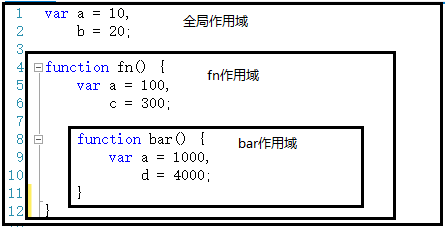
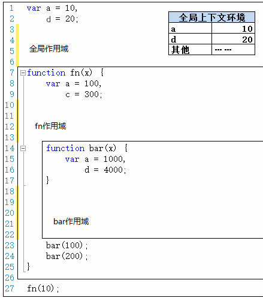
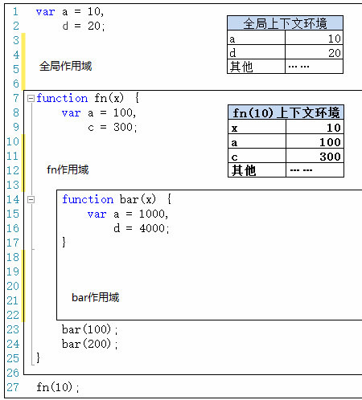
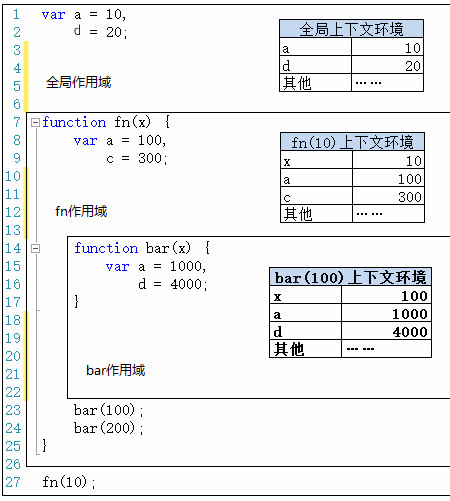
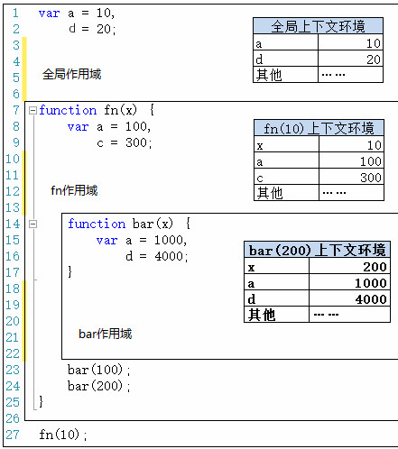
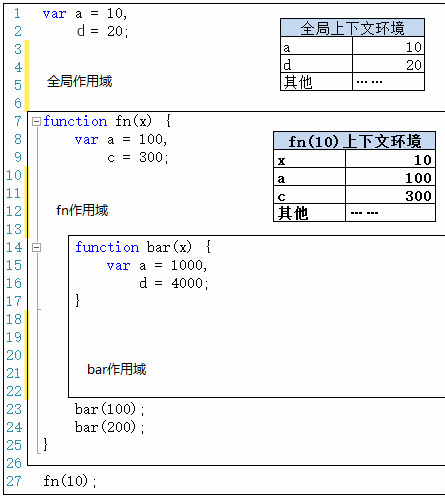
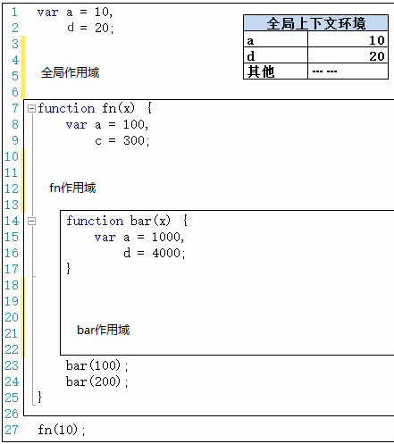

## **执行上下文栈**

### **什么是执行上下文**

**我们可以将执行上下文看作代码当前运行的环境。代码的运行环境分为三种**

1. **全局级别的代码 – 这个是默认的代码运行环境，一旦代码被载入，js引擎最先进入的就是这个环境**

   **全局执行环境可以看成是浏览器里面的`script`标签,一个页面的多个`script`会构成一个全局执行环境**

2. **函数级别的代码 – 当执行一个函数时，运行函数体中的代码（局部环境）**

3. **~~Eval的代码 – 在Eval函数内运行的代码（这个不常使用，也不推荐使用，故不作了解）~~**

**其实，主要就是全局执行上下文和函数执行上下文。下面举一个简单的例子：**

****

> **上图中，一共用4个执行上下文，紫色边框括起来的部分代表全局的上下文；绿色边框括起来的部分代表`person`函数内的上下文；蓝色边框括起来的部分代表`person`函数内的`firstname`函数的上下文；橙色边框括起来的部分代表`person`函数内的`lastname`函数的上下文。**

**注意：不管什么情况下，只存在一个全局的上下文，该上下文能被任何其它的上下文所访问到。函数上下文的个数是没有任何限制的，每到调用执行一个函数时，JavaScript 引擎就会自动新建出一个函数上下文。在外部的上下文中是无法直接访问到其内部上下文里的变量的，但是内部上下文可以访问到外部上下文中的的变量。（外边的不能访问里面的，里面的可以访问外边的）。其实一块就解释了我们的变量里面的全局变量和局部变量的区别**

### **执行上下文堆栈**

**在浏览器中，JavaScript引擎的工作方式是单线程的（单线程就是排队执行,也就是说，某一时刻只有唯一的一个事件是被激活处理的）其它的事件被放入队列中，等待被处理。下面的示例图描述了这样的一个堆栈：**

****

**我们已经知道，当JavaScript代码文件被浏览器载入后，默认最先进入的是一个全局的执行上下文。当在全局上下文中调用执行一个函数时，程序流就进入该被调用函数内，此时引擎就会为该函数创建一个新的执行上下文，并且将其压入到执行上下文堆栈的顶部。浏览器总是执行当前在堆栈顶部的上下文，一旦执行完毕，该上下文就会从堆栈顶部被弹出，然后，进入其下的上下文执行代码。这样，堆栈中的上下文就会被依次执行并且弹出堆栈，直到回到全局的上下文。**

### **执行上下文的建立过程**

**我们现在已经知道，每当调用一个函数时，一个新的执行上下文就会被创建出来。然而，在JavaScript引擎内部，这个上下文的创建过程具体分为两个阶段:**

1. **代码的建立阶段**
   - **建立函数，变量**
   - **建立作用域**
   - **初步确定this的值**
2. **代码的执行阶段**
   - **变量赋值，执行其它代码 ，最终确定this的值**

**实际上，可以把执行上下文看做一个对象，其下包含了以上3个属性**

```javascript
variableObject: { /* 函数中的参数对象并给参数赋值, 内部的变量以及函数声明 */ },
scopeChain: { /* variableObject 以及所有父执行上下文中的variableObject */ },
this: {} 
```

> **上面的variableObject我们一般叫变量对象，有时候简称VO，下在的scopeChain我们叫作用域，有时候也叫活动域，简称AO**

### **执行上下文建立阶段以及代码执行阶段**

**上述第一个阶段即执行上下文建立阶段的具体过程如下：**

**当代码一旦开始进入的时候这个环境就会创建，环境的创建有2个阶段，一个是建立阶段，一个是执行阶段**


1. **第一个阶段-建立阶段:**

   - **建立VariableObject对象（简称VO）**

     - **建立arguments对象（全局环境里面没有），检查当前上下文中的参数，建立该对象下的属性以及属性值**

     - **检查当前上下文中的`function`函数声明。每找到一个函数声明，就在VariableObject下面用函数名建立一个属性，属性值就是指向该函数在内存中的地址的一个引用,如果上述函数名已经存在于VariableObject下，那么则忽略后面的函数声明。**

       ```javascript
        sayHello();         //执行阶段运行的代码 
       
       //在全局环境里面定义了一个方法 
       //执行环境在建立阶段去检查一下你有没有 function定义的函数，如果有，就直接给你建立好
       function sayHello(){
           console.log("大家好才是真的好");
       }
        /*
               建立阶段：
                   建立了一个方法sayHello
       
               执行阶段：
                   调用执行了这个方法sayHello
       */
       ```

     - **检查当前上下文中的变量声明。每找到一个变量声明，就在VariableObject下面用变量名建立一个属性，该属性值为undefined。如果变量属性名和函数属性名重复，则不建立新的变量。**

       ```javascript
       var a = "hello";
       //这段分为两个部分
       //第一部分：声明变量var a ;
       //第二部分：a = "hello";
       ```

       **其实第一部分发生在环境的建立阶段，第二部分发生在环境的执行阶段**

       ```javascript
       sayHello();      
       //这个时候代码在这里会报错，这个时候的sayHello还是一个undefined
       
       //这是另一种定义方法的方式
       var sayHello = function2
           console.log("hello world");
       }
       /*
               建立阶段：
                   定义变量sayHello,默认值是undefined
       
               执行阶段：
                   1.调用执行sayHello()  报错
                   2.对sayHello赋值为一个 function
       */
       ```
       
       ```javascript
       var sayHello = function(){
           console.log("第一个");
       }
       function sayHello (){
           console.log("第二个");
       }
       
       sayHello();
       
       /*
               建立阶段：
                   1.function sayHello()一气呵成
                   2.扫描var关键字，找到变量sayHello,上报内存，结果内存当中已经有了，直接忽略上报
       
               执行阶段：
                   1.将第一个函数function赋值给了sayHello
                   2.执行调用sayHello(),打印结果  “第一个”
       */
       ```
     
   - **初始化作用域**
   
   - **初步确定上下文中this的指向对象**
   
   **代码在建立阶段，你是看不到代码的运行，因为阶段发生在你写代码的时候，你代码写好了，建立阶段也好了**
   
2. **第二个阶段-执行阶段**

   - **执行阶段就是一行一行的执行代码**
   - **最终确定上下文中的this指向对象**

**下面来看个具体的示例**

```javascript
function foo(i) {
    var a = 'hello';
    var b = function() {

    };
    function c() {

    }
}
foo(22);
```

**如果要判断一段代码的执行顺序，就请根据代码的建立阶段与执行阶段去判断**

------

### **作用域**

**首先，提到作用域，要了解一个常识**

> **JavaScript中没有块级作用域，只有函数作用域和全局作用域。**

**什么是块级作用域？块级作用域就是定义在{}之内的范围，比如if(){}或者for(){}里那个{}里的范围就叫做块级作用域。**

**如下代码所示**

```javascript
console.log(userName);    //undefined
if(0 < 2) 
{  
    var userName = "标哥"; 
}
console.log(userName);//标哥
/*
        1.没有块级作用域 ，所以 if{}形成不了作用域 
        2.代码在在建立阶段，创建好了变量userName,并且是在全局创建的，默认值是undefined
        3.执行阶段
          第一次打印userName,因为还没有赋值，所以应该是undefined
          后面执行了userName ="标哥";
          第二次打印userName,因为变量已经赋值了，所以应该是"标哥"
    
    
 */
for(var i=0;i<9;i++)
{
}
alert(i);//9
```

**所以，在声明变量时，我们要做到，全局变量要在代码前端声明，函数中的变量要在函数体一开始的地方就声明好。除了这两个地方，其他地方都不要出现变量声明。 这样就防止了在调用这个变量之前还没有赋值**

**下面来说作用域，简单的说，作用域相当于一个区域，就是为了说明这个区域有多大，而不管这个区域里有什么东西。这个区域里有什么东西恰恰就是这个作用域所对应的执行上下文所要说明的东西。如下图所示**

****

**作用域有上下级的关系，上下级关系的确定就看函数是在哪个作用域下创建的。例如，fn作用域下创建了bar函数，那么“fn作用域”就是“bar作用域”的上级。(也可以说父子关系)**

**我们知道，作用域最大的用处就是隔离变量，不同作用域下同名变量不会有冲突。**

**另外，我们还需牢记于心的是，作用域是在函数创建的时候就已经确定了，而不是函数调用的时候。**

**函数创建和函数调用可是两个不同的概念，函数创建就是定义一个函数，函数调用是在某处调用一个已经定义好的函数。下面举一个例子来说明**

```javascript
function foo() {   //函数创建，定义了foo函数，而foo函数的作用域也在此时确定了
	alert("buddy!");
}
alert（"hey!"）;
foo();//调用函数，这里调用foo函数
```

### **自由变量与作用域链**

**概念：凡是跨了自己的作用域的变量都叫自由变量**

```javascript
var x=10;
function foo(){
    var b=20;
    console.log(x + b); //这里x就是自由变量
}
foo();//30
```

> **说明：在调用foo()函数时，函数体中第3行。取b的值就直接可以在foo作用域中取，因为b就是在这里定义的。而取x的值时，就需要到另一个作用域中取。到哪个作用域中取呢？**

**这时你可能就说，到上一级作用域去取值啊，（到上一级作用域里取值就涉及到了作用域链的概念），但是这种说法是有歧义的，下面的例子就说明了这个歧义（为什么说是歧义呢？）**

```javascript
var age = 22;
function a(){
    console.log(age);
}
function b(fn){
    var age = 11;
    fn();  //这个fn就是a   
    /*
    	建立：
    		1.建立fn参数
    		2.建立变量age
    	执行：
    		1.执行age=11
    		2.执行fn() 
    */
}
b(a); 
```

> **说明：按照一般思路来讲，到上一级作用域取值，结果应该是11，为什么结果是22，而不是11呢？这就是这个歧义，不是说到上一级作用域取值有问题，而是到哪一个上一级作用域取值？**

**注意了，在上一章的作用域的笔记当中，我们提到过很重要的作用域的特点 作用域是在函数创建的时候就已经确定了，而不是函数调用的时候。**

**所以，在上面的例子里函数a()的上一级作用域是全局作用域，而不是函数b()的作用域，故到上一级作用域取到的变量age的值是22，而非11.**

**所以，我们要铭记：要到创建函数a()的那个作用域中取——而不管函数a()是在哪里调用.**

**标识符的查找**

**上面描述的只是上一级作用域就找到了变量，但是如果上一级作用域没有找到了，那就再上一级，如果再没有，就再上一级，直到全局作用域，如果全局作用域没有，那就真的没有了，并且，每上一级作用域取值都是到创建这个函数的作用域去取值。（标识符的查找）**

**所以我们可以看到，作用域链是因为自由变量才存在的，也是因为自由变量，作用域才有意义。**

### **作用域与执行上下文**

**在上图的代码当中，我们看一下代码的执行顺序**

****

**第一步，在加载程序时，已经确定了全局上下文环境，并随着程序的执行而对变量就行赋值，**

> **在这里提一句，函数的执行上下文是在调用函数后建立的，执行上下文的第一阶段（建立阶段）是在调用函数后，执行具体代码前进行，执行上下文的第二阶段（执行阶段）是执行具体代码时进行的。**

**第二步，程序执行到第27行，调用fn(10)，此时会生成此次调用fn函数时的上下文环境，压栈，并将此上下文环境设置为活动状态**

****

**第三步，执行到第23行时，调用bar(100)，生成此次调用的上下文环境，压栈，并设置为活动状态**

****

**第四步，执行完第23行，bar(100)调用完成。则bar(100)上下文环境被销毁。接着执行第24行，调用bar(200)，则又生成bar(200)的上下文环境，压栈，设置为活动状态。**

****

**第五步，执行完第24行，则bar(200)调用结束，其上下文环境被销毁。此时会回到fn(10)上下文环境，变为活动状态**

****

**第六步，执行完第27行代码，fn(10)执行完成之后，fn(10)上下文环境被销毁，全局上下文环境又回到活动状态**

****

**所有过程到此结束。**

**我们可以看出，作用域只是一个“区域”，一个抽象的概念，其中没有变量。要通过作用域对应的执行上下文环境来获取变量的值。同一个作用域下，不同的调用会产生不同的执行上下文环境，继而产生不同的变量的值。**

**所以，如果要查找一个作用域下某个变量的值，就需要找到这个作用域对应的执行上下文环境，再在其中寻找变量的值。**

#### **案例**

**现在下面有一段代码，请分析一下代码的执行结果**

```javascript
function a(){
    var age=21;
    var height=178;
    var weight=70;
    function b(){
        console.log(age);
        console.log(height);
        var age=25;
        height=180;   
        console.log(age);
        console.log(height); 
    }
    b();
}
a(); 
```

**目前阶段有两个点一定要注意**

1. **所有的环境代码应该都有两个阶段，分别是代码的建立阶段，与代码的执行阶段**
2. **建立阶段的运行我们是看不到的，它主要干两件事情**
   - **第一件事情就是把所有的实参都接收到，把所有的方法找到，建立好，然后把所有的变量找出来，定义好，默认为undefined**
   
     **参数先于函数，先于变量**
   
   - **第二件事情就是建立当前环境的作用域**

### **变量会随着执行环境而建立吗**

**是不是所有的变量都是在代码的建立阶段进行的？答案不是的！有一种变量很特殊，它没有经过var去定义**

```javascript
//这一段代码它没有var ,所以没有建立阶段
userName = "张三";    
console.log(userName);
```

------

**关于变量提权**

**变量提权使用的是定义变量的时候，不使用关键var ,这个时候，当代码执行到某一个环境的时候，它这个变量变没有建立阶段，那么在这个个执行环境里，就不会建立这个变量**

**而进入到代码的执行过程以后，这个时候再去建立刚刚的变量，*它会在全局状态下面去建立***

```javascript
function a(){
    userName = "张三";
}
a();
console.log(userName);
```

**思考：下面的代码的运行结果是什么**

```javascript
function b(){
    function c(){
        userName = "张三";
    }
    c();
    console.log(userName);
}
b();
console.log(userName);
```

------

**问：什么是执行上下文？**

答：执行上下文就是代码的执行环境 ，代码会在这个环境当中按照规范进行与运行，所以的环境都经过2个阶段，分别是建立阶段与执行阶段

**问：建立阶段干了什么**

答：建立阶段主要干了3个事情

1. 上报内存
2. 确定作用域
3. 初步确定this的值

**问：上报内存的顺序**

答：它有三个顺序 ，先建立arguments, 再进行function的上报，最后是var的变量上报

**问：作用域是如何确定的**

答：作用域是在函数建立的时候就已经确定了，也就是在你编写这个函数的时候作用域就已经确定了

```javascript
var age = 22;
function a(){
    console.log(age);
}
function b(){
    var age = 11;
    a();
}
b(); 
```

再看下面

```javascript
var age = 22;

function b(){
    var age = 11;
    function a(){
        console.log(age);			
    }
    a();
}
b(); 
```

