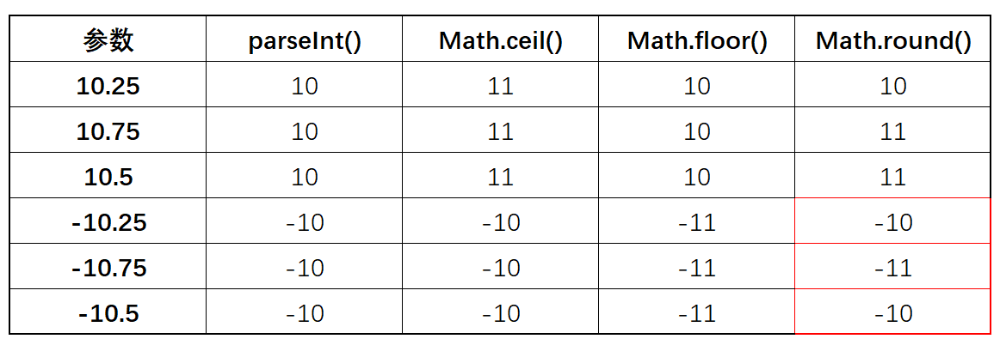
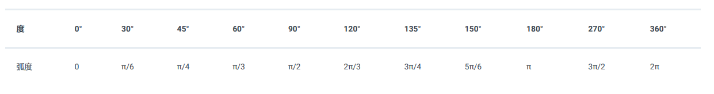
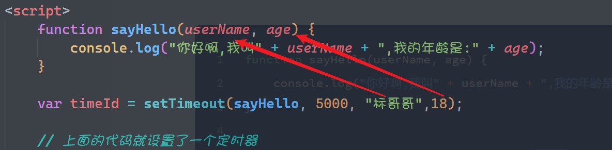
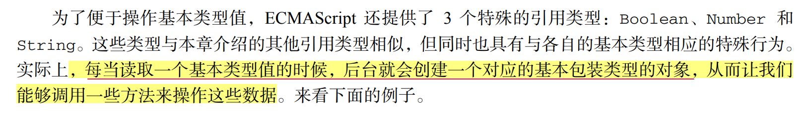

## 常用内置对象

之前在讲面面向对象的时候都是我们自己去创建对象，其实在`JavaScript`的内部有很多内置对象，系统提供的内置 对象是可以直接使用的，这些对象我们叫JS常用对象

### Math对象

它是一个全局的数学对象，是一个系统已经定义好的对象，不需要我们通过`new`的关键来构造就可以直接使用，它主要用于我们的数据运算

这个数学对象里面主要包含了2个东西，一个是属性【常数】，一个是方法

**常数**

常数数学或自然界当中一些固定的数，如`Π`它就是一个常数

* `Math.PI`圆周率，约等于3.14
* `Math.E`自然对数的底数，约等于2.718
* `Math.LN10`10的自然对数值，约等于2.302
* `Math.LN2`2的自然对数值，约等于0.693
* `Math.SQRT1_2`0.5的平方根
* `Math.SQRT2`2的平方根

上面这些东西都不用去记，用的时候拿出来看一下就行了，它是固定的不会变。

**方法**

方法才是数学对象的重点

1. 绝对值`Math.abs()`方法

   ```javascript
   Math.abs(3);			//3
   Math.abs(-3);			//3
   ```

2. 四舍五入`Math.round()`方法

   ```javascript
   Math.round(3.4);			//3
   Math.round(9.8);			//10
   Math.round(-10.2);			//-10
   Math.round(-10.8);			//-11;
   Math.round(-10.5);			//-10
   ```

   **注意**：上面的`Math.round()`可以实现整数位的四舍五入，但是如果想多保留几位小数，怎么办呢？

   ```javascript
   var a = 3.1415926;
   //我希望保存3位小数以后再四舍五入，怎么办？
   var b = Math.round(a * 1000) / 1000;
   console.log(b);
   ```

3. `Math.floor()`向下取整，返回这小于或等于这个数的最大整数

   ```javascript
   Math.floor(88.2);			//88
   Math.floor(24.7);			//24
   Math.floor(23);				//23
   Math.floor(-12.4);			//-13
   ```

4. `Math.ceil()`向上取整 ，返回大于或等于这个数最小整数

   ```javascript
   Math.ceil(11.1);			//12
   Math.ceil(22.7);			//23
   Math.ceil(34);				//34
   Math.ceil(-34.5);			//-34
   ```

   > 到目前为止，我们处理数据的方式就有很多种了，如`parseInt(),Math.round(),Math.floor(),Math.ceil()`。现在我们来将这些方法做一个对比
   >
   > 
   >
   > 在负数执行`Math.round()`操作的时候基本可以理解为“五舍六入”就行了

5. `Math.pow(x,y)`函数。求取x的y次方的结果

   ```javascript
   Math.pow(100,3);			//1000000
   Math.pow(2,8);				//256
   ```

6. `Math.max()`方法用于求一系列数当中的最大值

   ```javascript
   Math.max(111,23,120);				//120;
   ```

   之前在讲跨对象调用的时候我们已经用过了这个方法，通过这个方法来求取了数组当中的最大值

   ```javascript
   var arr = [100,87,65,34,209];
   var max = Math.max.apply(Math,arr);			//209
   ```

7. `Math.min()`方法用于求一系列数当中最小值

   ```javascript
   Math.min(111,23,120);			//23
   
   var arr = [100,87,65,34,209];
   var min = Math.min.apply(Math,arr);			//34
   ```

8. `Math.sqrt(x)`求x的平方根

   ```javascript
   Math.sqrt(9);			//3
   ```

9. `Math.random()`获取0~1之间的随机数

   ```javascript
   Math.random();			//0.5808373583762474
   ```

   **思考**：上面的方法是通过0~1之间的随机数，如果我们想获取0~99之间的随机整数怎么办呢？

   ```javascript
   var x = ~~(Math.random() * 100)
   ```

   **小技巧**：如果想获取某一个范围的随机为整数，我们可以使用下面的公式

   ```javascript
   var x = ~~(Math.random() * 范围值);		//最后生成的随机数不包含这个范围值
   ```

10. `Math.sin()`方法，求一个弧度的正弦值

    > 要注意，这里弧度，不是角度
    >
    > 弧度与角度有一个计算公式，不要弄混了，这个与我们这前所学习的数学里面的角度不一样 1°=π/180°，1rad=180°/π。

    

    如果我现在想求90度的正弦值，应该怎么算

    ```javascript
    //第一步：将90度的角度转换成弧度
    var rad = 90 * Math.PI / 180;
    var x = Math.sin(rad);				//1
    ```

11. `Math.cos()`方法，求一个弧度的余弦值

12. `Math.tan()`方法，求一个弧度的正切值

----

### Date对象 

在JavaScript里面Date对象是用于表述日期的对象，它可以获取系统当前的日期与时间，也可以手动的设置日期与时间

`Date`是一个构造函数，如果要使用我们就要`new`一个对象出来（这一点就与我们上面的`Math`对象 不一样的，，Math已经是一个对象了，我们可以直接使用）。如果我们要使用日期对象就要先创建对象

```javascript
var d = new Date();					//得到了一个当前日期的对象
// Thu Aug 18 2022 09:43:17 GMT+0800 (中国标准时间)
```

当我们使用构造函数去创建对象的时候，默认是以当前日期为主，如果我们需要手动的去得到一个时间的日期对象，可以在构造函数里面传递参数

```javascript
var d1 = new Date("2022-5-1 12:12:33");
//Sun May 01 2022 12:12:33 GMT+0800 (中国标准时间)

var d2 = new Date(2022, 5, 1, 12, 12, 33);
//Wed Jun 01 2022 12:12:33 GMT+0800 (中国标准时间)
```

> 这里有个坑要注意，在使用第2种方法创建Date的时候，它的月份是从0开始的

**方法**

1. `Date.now()`方法，这个方法不需要`new`就可以使用，它返回前的时间戳，它是一串数字，这个数字代表从`1970-1-1`到现在的毫秒数

   ```javascript
   var d1 = Date.now();		//1660787467301
   ```

   上面的这个数字代表的就是当前的时间，我们可以通过这一串数字来知道这个时间到底是什么时候，在后期学习数据库的时候如果我们要在数据库当中存储一个时间，一般都是存这样的一个数组

   现在我们就通过这个数字来得到时间

   ```javascript
   var currentDate = new Date(1660787467301);
   
   //1630033003696
   ```

2. `getFullYear()`获取年份的方法

   ```javascript
   var d = new Date();
   d.getFullYear();			//2022
   ```

3. `getMonth()`获取月份的方法

   > 一年有12个月，但是月份是从0开始的

   ```javascript
   d.getMonth();				//7
   ```

4. `getDate()`获取日期的方法

   ```javascript
   d.getDate();				//18
   ```

5. `getDay()`获取星期几

   > 一个星期的第一天是星期天，但是星期天是0

   ```javascript
   d.getDay();				//4
   ```

6. `getHours()`获取小时数

   ```javascript
   d.getHours();				//10
   ```

7. `getMinutes()`获取分数钟

   ```javascript
   d.getMinutes();				//32
   ```

8. `getSeconds()`获取秒钟

   ```javascript
   d.getSeconds();				//23
   ```

9. `getMillSeconds()`获取毫秒数

   ```javascript
   d.getMillSeconds();		    //747
   ```

   > 上面的几个方法我们全都是通过`get` 来获取的，与之相对应的还有`set`的方法，它们是赋值方法
   >
   > 如果我们想对某一个日期对象重新赋值，可以使用`set`的方式来进行
   >
   > ```javascript
   > var d = new Date();			//当前时间 
   > //现在想重新赋值，改变它的年分份
   > d.setFullYear(1921);
   > //现在去改变它的月份
   > d.setMonth(5);			//现在把月份设置为了6月，因为月份是从0开始的，如果大于11则会向前面进位
   > //同理，日期也是一样的，天数如果大于当前月份的最大天数也就会向前进位
   > ```

10. `toString()`方法

    日期对象也可以调用这个方法将日期对象转换成日期的字符串，但是在转换过程当中，它有以下几种情况

    * `toString()`
    * `toDateString()`
    * `toTimeString()`

    ```javascript
    d.toString();
    //Thu Aug 18 2022 10:41:02 GMT+0800 (中国标准时间)
    
    d.toDateString();			//Thu Aug 18 2022
    
    d.toTimeString();			//10:41:02 GMT+0800 (中国标准时间)
    ```

11. `toLocaleString()`转换成本地时间，也就是你电脑右下角的时间

    * `toLocaleString()`
    * `toLocaleDateString()`
    * `toLocaleTimeString()`

    ```javascript
    d.toLocaleString();				//2022/8/18 10:44:40
    d.toLocaleDateString();			//2022/8/18
    d.toLocaleTimeString();			//10:44:40
    ```

12. `toGMTString()`将当前的时间以GMT字符串显示

    GMT时间叫格林宁治时间，也就是0时区的时间

    ```javascript
    var d = new Date();
    d.toGMTString();			//Thu, 18 Aug 2022 02:49:20 GMT
    ```

上面的12个方法都是我们处理日期对象的时候所使用的方法，有一个方法比较特殊，我要单独的去讲一下

**扩展**：现在假设有2个时间，我们要将2个时间进行比较，或相减，针对这一种业务场景，我们应该怎么处理呢?

* 第一种场景：如果要计算2个时间相隔多久
* 第二种场景：我想知道哪一个时间在前面，哪一个时间在后面（比较大小）

```javascript
var d1 = new Date("2022-4-6 12:00:00");
var d2 = new Date("2022-8-18 12:00:00");
```

现在上面有2个日期对象，我们想知道两个日期对象当中有以下操作，怎么办

* 我想知道谁哪个时间在前面，哪个时间在后面
* 我想知道两个日期间隔了多少天，怎么办呢？

如果我们的日期对象需要去做上面的操作，怎么办呢？这个时间一定要注意，**所以的日期操作应该全部都以时间戳去操作**

如果一个日期对象想要转换成时间戳应该使用`getTime()`这个方法

```javascript
d1.getTime();				//1649217600000
d2.getTime();				//1660795200000
```

有了这个时间戳的具体数值以后，我们就可以比较大小，也可以进行相减相加操作

```javascript
var d1Time = d1.getTime();           //时间戳
var d2Time = d2.getTime();           //时间戳

if (d1Time < d2Time) {
    console.log("d1在d2之前");
}
else {
    console.log("d1在d2之后");
}

//要计算两个时间相隔多久
var x = d2Time - d1Time;              //这样会得到一个时间的差值，单位是毫秒

//两个时间相差多少天

console.log(x/1000/60/60/24);
```

这里还有一个小细节要注意，在`Date`对象下面有`valueOf`的方法，这个 方法也会返回时间戳

```javascript
d1.valueOf() === d1.getTime();
```

----

### 延时调用与循环调用

延时调用相当于一次性定时器，循环调用相当于循环定时器

#### 延时调用

延时调用相当于一次性的定时器，定时器可以把它理解为闹钟 ，我现在定义了一个闹钟，这个闹钟的时间到了以后就会通知我来做一些事情

在我们以前编程的时候，我们写的代码都会立即执行

```javascript
function sayHello(){
    console.log("你好啊")
}
sayHello();         //这个代码会立即执行
```

现在我们希望`sayHello` 这个代码不要立即执行，应该是等一段时间以后再执行，这一种情况我们就叫延时调用

```javascript
var timeId = setTimeout(sayHello, 5000);
// 上面的代码就设置了一个定时器
// 第一个参数:代表时间到了以后要干什么事情 
// 第二个参数:代表设置延时的时间,以毫秒为单位
// 这个方法会返回定时器的编号 ,后期我们可以通过这个编号来取消这个定时器
```

现在我们再来看下面的代码

```javascript
 function sayHello(userName, age) {
     console.log("你好啊,我叫" + userName + ",我的年龄是:" + age);
 }

var timeId = setTimeout(sayHello, 5000, "标哥哥",18);
//当我们的函数里面需要参数的时候，我们就把原来函数的参数写在`setTimeout`的后面就可以了
```



通常情况下，我们在工作当中的时候，我们都会将上面的回调函数`sayHello`写成一个匿名函数

```javascript
var timeId = setTimeout(function (userName, age) {
    console.log("你好啊,我叫" + userName + ",我的年龄是:" + age);
}, 5000, "标哥哥", 18);
```

#### 取消延时调用

当一个延时调用设置好了以后，它会返回这个定时器的编号，如果我们后期想取消这个定时器，就通过这个编号来取消，只需要调用`clearTimeout(编号)`就可以了

```javascript
function sayHello(userName, age) {
    console.log("你好啊,我叫" + userName + ",我的年龄是:" + age);
}
var timeId = setTimeout(sayHello, 5000, "标哥哥", 18);
//clearTimeout(timeId);           //定时器就取消了
```

#### 循环调用

循环调用就是循环定时器，它会每隔一段时间就会自已执行一次（可以理解为手机上面的一个起床闹钟 ，它每天早上7：30起床，隔24小时执行一次）

它的语法与上面的延时调用的语一致

```javascript
var 定时器编号 =  setInterval(时间到了以后要做的事,间隔的时间);
```

```javascript
function sayHello() {
    console.log("你好啊,现在时间是:" + new Date().toLocaleString());
}

var timeId = setInterval(sayHello, 1000);
```

循环定时器在设置以后，它会根据间隔时间去进行相关的自动调用操作

同理`setInterval`也可以接收参数

```javascript
function sayHello(userName) {
    console.log("你好啊,我叫" + userName + ",现在时间是:" + new Date().toLocaleString());
}

var timeId = setInterval(sayHello, 1000, "帅气的标哥哥");
```

#### 取消循环调用

在设置循环定时器的时候我们会得一个编号 ，有了这个编号以后，我们就可以在后期取消这个循环定时器

```javascript
clearInterval(定时器编号);
```

----

### 正则表达式对象

> 等进入DOM再讲

-----

## 包装对象

> 包装对象也是系统的内置对象

我们之前在讲数据类型的时候 我们已经学习了5种基本数据类型

* `string`字符串类型
* `number`数字类型
* `boolean`布尔类型
* `null`类型
* `undefined`类型

所谓的包装对象其实就是为`string/number/boolean`基本数据类型服务的

```javascript
var str = "hello world";
console.log(str.length);
console.log(str.toUpperCase());

var flag = true;
console.log(flag.toString());

var num = 123;
console.log(num.toString(2));
```

> `str`明明只是一个字符串的基本数据类型 ，为什么它可以像对象一样有属性，有方法？
>
> `flag`明明只是一个布尔类的基本数据类型 ，为什么 也可以调用方法？
>
> `num`也只是一个数字的基本数据类型 ，为什么 它也有方法？

<span style="color:red;font-weight:bold">基本数据类型为什么会有属性和方法，而方法与属性不是对象才有的吗？</span>




```javascript
var str = "hello world";
//其实JS的后面是这么操作
//相当于
var str = new String("hello world");

var flag = true;
//相当于
var flag = new Boolean(true);

var num = 123;
//相当于
var num = new Number(123);
```

根据上面的解释 ，再结合我们的面向对象的理解（一个对象的`__proto__`等于它构造函数的`prototype`），我们可以得到一个结论

```javascript
var str = "hello world";					//new String("hello world")
var flag = true;
var num = 123;

str.__proto__ === String.prototype;				//true
flag.__proto__=== Boolean.prototype;			//true
num.__proto__ === Number.prototype;
```

通过上面的分析 ，我们也就知道了所谓的包装对象就是为了让我们更方便的操作`string/number/boolean`的。这样我们只用掌握每个包装对象上面的方法就掌握了三个基本数据类型的操作方法

### String对象

String字符串对象是我们在JavaScript最常见的一种对象，他是用于包装`string`基本数据类型型

> 我们可以的字符串理解为一个特殊的字符数组，数组具备的大部分方法字符串都有

1. `length`属性

   这个属性用于获取字符串的长度，它是一个只读的属性，不能手动的修改

2. 索引取值

   之前在讲数组的时候就用过了，数组是通过索引取值的，所以我们的字符串也可以通过索引取值

   ```javascript
   var str = "abcdefg";
   console.log(str[0]);			//a
   ```

3. `at()`方法，通过索引来取字符串的某个字符

   ```javascript
   var str = "abcdefg";
   str.at(0);						//"a"
   str.at(-1);						//"g"			倒数第1个字符
   ```

4. `concat()`拼接字符串，它可以将多个字符串拼接，形成一个新字符串，旧的字符串不变

   ```javascript
   var str = "abcdefg";
   var str2 = "hijklmn";
   var str3 = str.concat(str2);
   ```

   这个用法与之前数组里面的用法是一样的，但是一般情况我也不用，因为字符串的拼接我们使用`+`会更好一些

5. `slice(start?,end?)`方法，截取原字符串中的字符形成一个新字符串，原字符不变

   这个方法与数组的方法也保持了一致

   ```javascript
   var str = "abcdefg";
   str.slice(1,4);					//"bcd";
   str.slice(2,-1);				//'cdef'
   str.slice(-5,-1);				//'cdef'
   str.slice(1);					//'bcdefg'
   str.slice();					//'abcdefg'
   ```

6. `substring(start,end?)`方法，载取字符串，它的能力比`slice`差一些

   ```javascript
   var str = "abcdefg";
   str.substring(1,5);				//'bcde'
   str.substring(1);				//'bcdefg'
   ```

   **注意**：

   * `substring`的开始位置不能省略，而`slice`是可以省略
   * `substring`不要以负数做为参数，而`slice` 是可以的
   * `substring`与`slice`在截取的时候都不包含`end`这个元素

7. `substr(start,length?)`截取字符串，从`start`的位置开始，截取长度为`length`的字符串

   > 这一个方法与前面的2个方法完全不一样，这个方法的第2个参数是截取字符串的长度

   ```javascript
   var str = "abcdefg";
   str.substr(1,5);					//'bcdef'
   str.substr(3);						//'defg'
   ```

8. `indexOf/lastIndexOf`查询匹配的字符串的位置 ，如果找到了就返回索引，找不到就返回`-1`

   ```javascript
   var str = "暮晓春来迟;先于百花知;岁岁种桃树;开在断肠时";
   str.indexOf("百");						//8
   str.indexOf("钱");					 	//-1
   str.indexOf(";",8);					     //11
   ```

9. `split()`方法，将字符串使用指定的方式隔开，变成数组

   ```javascript
   var str = "hello-world";
   str.split("-");				//["hello","world"];
   str.split("");				//['h', 'e', 'l', 'l', 'o', '-', 'w', 'o', 'r', 'l', 'd']
   ```

   这个方法正好与数组里面的`join()`方法执行相反的操作

   ```javascript
   var arr  =["hello","world"];
   arr.join("-");				//"hello-world";
   
   var arr2 = ['h', 'e', 'l', 'l', 'o', '-', 'w', 'o', 'r', 'l', 'd'];
   arr.join("");				//"hello-world";
   ```

   后期在开发工过程当中这两个方法经常会合起来一起使用

10. `charAt()`这个方法果根据一个索引来获取指定的字符，相当于通过索引取字符

    ```javascript
    var str = "hello-world";
    str[0];				//"h"
    str.at(0);			//"h"
    str.charAt(0);		//"h";
    //charAt不支持负数，而at支持负数
    ```

11. `charCodeAt()`方法，通过索引来取字符串里面的某一个字符的`unicode`编码，如果是英文字符串则返回`ascii`码

    ``` javascript
    var str = "我爱你";
    str.chartCodeAt(0);				//25105
    str.charCodeAt(2);				//20320
    "我" > "你"					   //true 中文在比较的时候比较的是unicode码
    var str2 = "abc";
    str2.charCodeAt(0);				//97		这里得到的是ascii码
    ```

12. `String.fromCharCode()`根据一个编码反向的得到一个字符串

    ```javascript
    String.fromCharCode(25105);			//"我"
    String.fromCharCode(97);			//"a";
    String.fromCharCode(65);			//"A";
    ```

13. `startsWith`判断某个字符串是否以什么开始

    ```javascript
    var str = "标哥哥是一个大帅哥";
    str.startsWidh("标");					//true
    str.startsWith("标哥");					//true
    str.startsWith("桃");					//false
    
    var url1 = "https://www.softeem.xin";
    url1.startsWith("https");				//true
    ```

14. `endsWith()`判断某个字符串是否以什么结束

    ```javascript
    var str = "标哥哥是一个大帅哥";
    str.endsWith("哥");					//true
    str.endsWith("帅哥");					//true;
    str.endsWith("姐");					//false
    
    var url1 = "https://www.softeem.xin";
    url1.endsWith("com");				//false
    ```

15. `includes()`判断某个字符串是否包含某个字符

    ```javascript
    var str = "标哥哥是一个大帅哥";
    str.includes("帅");					//true;
    ```

    这个操作其实在`indexOf/lastIndexOf`也可以实现

    ```javascript
    str.indexOf("帅");					//只要不是-1就说明包含
    ```

16. `trim/trimLeft/trimRight`去除字符串左边的，右边的或两边的空格

    * `trimLeft()`去除左边的空格
    * `trimRight()`去除右边的空格
    * `trim()`去除左右的空格

    ```javascript
    var str = "    标哥是一个大帅小伙   ";
    str.trimLeft();			//"标哥是一个大帅小伙   ";
    str.trimRight();		//"    标哥是一个大帅小伙";
    str.trim();				//"标哥是一个大帅小伙"
    ```

17. `replace()`方法替换，可以将字符串中的字符进行替换， 该方法不会改变原字符串，它会返回新字符串

    ```javascript
    var str = "我爱你";
    //现在我们把“爱”换成“恨”
    var str1 = str.replace("爱","恨");			//"我恨你"
    
    var str2 = "我爱你，你爱我吗？";
    var str3 = str2.replace("爱","恨");			//"我恨你，你爱我吗？"
    ```

    这个时候我们会发现一个问题，`replace()`只替换了第一次查找到的值，后面的没有替换，如果要进行全局的替换，我们需要使用**正则表达式**

    ```javascript
    var str6 = str2.replace(/爱/g, "恨");
    ```

18. `anchor`锚方法，没什么用，知道就行了

    ```javascript
    var str = "http://www.softeem.xin:8090";
    
    var str1 = str.anchor("bbb");
    console.log(str1);			//<a name="bbb">http://www.softeem.xin:8090</a>
    ```

19. `small/big`方法

    ```javascript
    var str = "标哥哥";
    var str3 = str2.big();					//'<big>标哥哥</big>'
    var str4 = str2.small();				//'<small>标哥哥</small>'
    ```

20. `padStart(maxLength,fillString)`方法，该方法将字符串以指定的长度补齐在左边

    ```javascript
    var a = "1";
    var b = "23";
    var c = "456";
    a.padStart(4,0);						//"0001"		总长度为4,不够应 左边补0
    b.padStart(3,0);						//"023"			总长度为3,不够应 左边补0
    c.padStart(3,0);						//"456"			总长度为3,够，不用补
    c.padStart(2,0);						//"456"    		超过了，不用补
    ```

21. `padEnd(maxLength,fillString)`方法，该方法将字符串补齐到指定长度在右边

    ```javascript
    var a = "1";
    var b = "23";
    var c = "456";
    a.padEnd(4,0);							//"1000"
    b.padEnd(3,0);							//"230"
    c.padEnd(3,0);							//"456"
    c.padEnd(2,0);							//"456"
    ```

22. `repeat()`方法，将字符串重复多少次

    ```javascript
    var x = "*"; 
    var a =  x.repeat(4);			//'****'
    ```

23. `toUpperCase()/toLowerCase()`将英文的转换成大小写，原字符串不变，返回新字符串

    ```javascript
    var str = "hello world";
    var str1 = str.toUpperCase();			//'HELLO WORLD'
    ```

### Number对象

Number的包装对象主要是针对`number`数据类型的，它也有一些经常使用的方法

1. `toString(进制)`方法，将数字以转换成目标进制的字符串

   ```javascript
   var a  = 18;
   var b = a.toString(2);				//"10010"
   var c = a.toString();				//"10";
   var x = 255;
   var y = x.toString(16);				//"FF"
   ```

2. `Number.isNaN()`方法，判断一个变量是否是`NaN`

   ```javascript
   console.log(Number.isNaN(NaN));          //true
   console.log(Number.isNaN(1));            //false
   console.log(Number.isNaN("a"));          //false
   console.log(Number.isNaN(1 % 0));         //true
   ```

   **注意**：在`window`对象下面也有一个`isNaN`的方法，它们2个者之间是有区别

   ```javascript
   Number.isNaN(value:any);
   window.isNaN(value:number);
   ```

   现在我们根据上面的2种不同的判断来看下面的结果

   ```javascript
   Number.isNaN("a");			//false
   window.isNaN("a");			//true
   ```

   > `window.isNaN()`这个判断方法它只接收`number`类型 ，如果我们传入的参数不是数值，它会默认调用`Number`方法做一次隐式类型转换，`Number("a")`得到的结果`NaN`，所以最后`window.isNaN("a")`检测的结果就是`true`

3. `Number.isInteger()`判断某一个数是否是整数

   ```javascript
   Number.isInteger(3);			//true
   Number.isInteger(3.14)			//false
   Number.isInteger("3");			//false;
   ```

4. `Number.isFinite()`判断某个数值是否是有限数值（通俗一点说就是不能是无穷大）

   ```javascript
   Number.isFinite(Infinity);				//false;
   ```

5. `toFixed()`该方法保存有效位数，执行四舍六入五成双的算法

   > 待定

### Boolean对象

Boolean是专门为操作`boolean`来实现的包装对象，里面没有方法，只有一个`toString()`与`valueOf()`的方法。这里就省略该对象的讲解

### 练习

1. 现有一产品，它的生产日期是`2022-1-18`，它的过期时间是`2022-6-30`,请计算这个产品的保质期天数是多少？

   ```javascript
   var d1 = new Date(2022, 0, 18);
   var d2 = new Date("2022-6-30");
   //上面两个定义日期的方法都没有问题
   var x = d2 - d1;                //两个时间的差值
   var days = ~~(x / 1000 / 60 / 60 / 24);     //转换成天数
   console.log(days);
   ```

2. 现有一产品，它的生产日期是`2022-8-18`，它的保持期是180天，请计算它的过期的时间是什么时候？

   ```javascript
   var d1 = new Date(2022, 7, 18);
   //算一下180天的时间戳
   var x = 180 * 24 * 60 * 60 * 1000;
   var d2 = d1.getTime() + x;
   
   //将上面的时间戳转换成日期
   var d3 = new Date(d2);
   console.log(d3.toLocaleString());
   ```

3. 现有一字符串`var str = "abcdefg"`，请将这个字符串反转“gfedcba”

   ```javascript
   var str = "abcdefg
   var str2 = str.split("").reverse().join("");
   ```

4. 编写一个就去，实现将一个文件的后缀名去掉

   ```javascript
   //如歌a.jpg变成a   123.gif变成123  如abcdefg.exe就变成abdefg，如abc.exe.conf变成abc.exe
   function getFileName(oldFileName) {
       return oldFileName.split(".").slice(0,-1).join(".");
   }
   
   
   getFileName("a.jpg");           //"a"
   getFileName("123.gif");         //"123"
   getFileName("abcdefg.exe");     //"abcdefg"
   getFileName("abc.exe.conf");    //"abc.exe"
   ```

5. 请随机生成4位数的验证码，验证码包含`a-z,A-Z,0~9`

   ```javascript
   //通过String.fromCharCode()方法来完成
   ```

6. 产生一个20~100(包含100)之间的随机数10个，把它放在一个数组里面，数组里面的随机数不重复

7. 现有一人从外地回小区，根据相关政策规定需要进行《新冠疫情医学隔离》，隔离时间是14天，它回来的日期是 2022年8月18日 ，请计算一下他什么时间可以解除隔离？【输出的日期格式必须是xxxx年xx 月xx日】

8. 在第4题的基础上面做一次扩展，如果结束隔离的时间是**星期六或星期天，则顺延到星期一**

9. 已知有字符串 `get-element-by-id`,写一个 方法将其转化成 驼峰表示法`getElementById`

   ```javascript
   function change(str){
       
       //补齐代码
       return 
   }
   ```

   