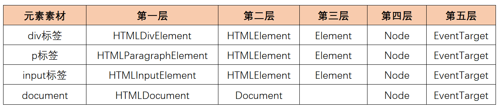

## DOM基础 

在刚开始接触到JS的时候，我们就说过JS分为3个部分


之前我们所学习的ECMAScript指的就是JavaScript的基础语法，DOM指的就是JS与网页的结合，JS最终是运行在浏览器里面的，它要操作网页，实现网页的特效与功能

DOM就是JS与网页的结合 ，在结合的时候主要是结合以下两个方法

1. `JS`与`HTML`的结合
2. `JS`与`CSS`的结合


DOM的全称叫`document object model`文档对象模型，它是**JS与网页的结合技术**，把网页像对象一个用模型的方式去操作

----

### 获取页面元素

在DOM里面如果想操作某一个、某些个页面上面的元素前提条件就是先获取这个（些）元素，在DOM里面我们有很多种方式来获取页面的元素

1. 通过ID获取

   ```javascript
   document.getElementById("id名"):HTMLElement
   //如
   document.getElementById("aaa");
   ```

   这一种方式是通过id在页面上面获取一个元素，但有一些特殊情况要注意

   * 如果找到了多个元素就只返回第一次找到的元素（这种情况主要是ID重复造成的）
   * 如果没有找到元素就返回`null`

2. 通过`class`名去获取

   ```javascript
   document.getElementsByClassName("class名称"):HTMLCollection
   //如
   document.getElementsByClassName("bbb")
   ```

   这一种方式是通过`class`名称去获取一个集合，这个集合里面就是包含了符合要求的集合，它是一个类数组（具备数组的特性，但是不具备数组的方法，我们可以后期通过方法将它转换真正的数组以方便操作）

   如果一个都找不到，则返回一个空的集合

3. 通过标签名去获取

   ```javascript
   document.getElementsByTagName("标签名"):HTMLCollection
   //如
   document.getElementsByTagName("li");
   ```

4. 通过`name`属性去获取

   ```javascript
   document.getElementsByName("name名称"):NodeList
   document.getElementsByName("sex")
   ```

   请注意，这一个方法返回的也是一个集合，它是`NodeList`类型的集合，与我们之前的`HTMLCollection`非常相似，它把符合要求的元素放在这个集合里面，如果找不到就返回一个空集合

   > 关于`HTMLCollection`与`NodeList`的区别，我在这里先不讲（`HTMLCollection`是动态集合，而`NodeList`是静态集合）

上面的4个方法就是我们获取DOM元素最基本的就去，比较简单可以直接使用，但是效率非常低（大多数情况之下我们很少使用上面的4个方法）

```html
<!-- 选择器 ul>li:last-child -->
<ul>
    <li>第1项</li>
    <li>第2项</li>
    <li>第3项</li>
    <li>第4项</li>
</ul>
<!-- 选择器 ol>li -->
<ol>
    <li>第1项</li>
    <li>第2项</li>
    <li>第3项</li>
    <li>第4项</li>
</ol>
```

* 如果我想获取`ol`里面的`li`怎么办？
* 如果我想获取`ul`里面的最后一个`li`怎么办？

针对上面的问题，JS借鉴了之前了`CSS`的选择器，衍生出了2个新方法

5. 通过CSS选择器获取单个元素

   ```javascript
   document.querySelector("CSS选择器"):HTMLElement
   //如
   document.querySelector("#aaa");
   document.querySelector(".bbb");
   document.querySelector("h2");
   ```

   * 如果找到元素就返回1个元素
   * 如果找不到元素就返回`null`
   * 如果找到多个元素就返回第一个

6. 通过CSS选择器获取元素集合

   ```javascript
   document.querySelectorAll("CSS选择器"):NodeList
   //如下
   document.querySelectorAll(".bbb");
   ```

   * 这个方法返回的是一个`NodeList`集合
   * 它把符合要求的元素全部放在这个集合里面
   * 如果没有找到元素就返回一个空集合

有了上面的`querySelector()/querySelectorAll()`以后，前面的4个方法只能做为备选方法使用了

:point_right: **小技巧**：后期我们会大量使用`querySelectorAll()`来获取元素，怎么样简便操作呢？

```javascript
//封装一个方法，快速获取dom元素
function $(selector) {
    return document.querySelectorAll(selector);
}

var list1 = $("ol>li");
var ele = $("ul>li:last-child")[0];
```


### DOM的层次结构

我们已经可以通过上面的方法来获取页面上面的元素，那么这些元素都是什么数据类型 呢

```html
<!DOCTYPE html>
<html lang="zh">
<head>
    <meta charset="UTF-8">
    <meta http-equiv="X-UA-Compatible" content="IE=edge">
    <meta name="viewport" content="width=device-width, initial-scale=1.0">
    <title>DOM的层次结构</title>
</head>
<body>
    <div id="div1">这是一个div元素</div>
    <p id="p1">这是一个段落标签 </p>
    <input id="txt1" type="text" placeholder="请输入内容">
</body>
<script>
    var div1 = document.querySelector("#div1");
    var p1 = document.querySelector("#p1");
    var txt1 = document.querySelector("#txt1");
    
    
    typeof div1;            //"object";
    typeof p1;              //"object";
    typeof txt1;            //"object";
</script>
</html>
```

我们可以看到，我们每次检测的结果都是对象，既然是对象就会有方法与属性。为了更好的弄清楚 DOM到底是什么，也为更好的理解DOM的方法与属性，我们就来看一下DOM的层次结构



经过对比，我们发现，所以的元素应该都有5层，页面上面的所有标签都是元素，而元素又是对象 ，所以我们只要撑握公共的父级对象的方法，那么子级对象就可以使用这个方法，这样就极大的提高了我们的学习效率

在这里说明一个，后期DOM的所有知识点都集中在第三层~第五层

第三层讲的是元素，第四层讲的节点，第五层讲的事件

----

### Element常用属性

> Element常用的属性其实就是网页元素的对象的属性，英文单词叫`property`

1. `children`属性，获取当前元素的所有子级元素，它返回一个`HTMLCollection`集合

2. `parentElement`属性，获取当前元素的父级元素

3. `nextElementSibling`属性，获取当前元素的下一个兄弟元素

4. `previousElementSibling`属性，获取当前元素的前一个兄弟元素

5. `firstElementChild`属性，获取当前元素的第一个子元素，相当于`children[0]`

6. `lastElementChild`属性，获取当前元素的最后一个元素，相当于`children[children.length-1]`

7. `innerHTML`获取或设置当前元素里面的HTML字符串（文本也包含在内）

   ```html
   <body>
       <h1 id="aaa">这是一个标题</h1>
       <div id="div1">
           这是一个盒子
           <a href="#">百度一下</a>
       </div>
   </body>
   <script>
       var aaa = document.querySelector("#aaa");
       var div1 = document.querySelector("#div1");
       
       aaa.innerHTML;		//'这是一个标题'
       div1.innerHTML;		//'\n        这是一个盒子\n        <a href="#">百度一下</a>\n   '
       
       //赋值
       aaa.innerHTML = "标哥哥";
       div1.innerHTML = "<button>我是一个按钮</button>";
   </script>
   ```

8. `innerText`获取或设置当前元素里面的文本字符串（它只能获取文本，获取不到标签）

   ```javascript
   aaa.innerText;		//'这是一个标题'
   div1.innerText;		//'这是一个盒子 百度一下'
   //只能获取文本 ，同样也只能设置文本
   aaa.innerText = "标哥哥";
   div1.innerText = "<button>我是一个按钮</button>";
   //这个时候 上面虽然设置的是标签，但是我们是通过innerText设置进去的，它还是以文本的形式显示
   ```

9. `outerHTML`属性，获取自己的标签及内部的`innerHTML`

10. `tagName`属性，获取当前标签的名称，它是一个大写的字母

11. `value`属性，获取或设置表单元素的值

12. `checked`属性，获取或设置表单元素是否被选中，`true`代表选中，`false`代表没有选中

13. `childElementCount`获取子元素的个数，相当于`children.length`的属性

14. `className`属性，用于获取或设置当前元素的`class`属性名称

    通过设置`className`我们可以动态的改变元素的样式

    ```html
    <!DOCTYPE html>
    <html lang="zh">
    <head>
        <meta charset="UTF-8">
        <meta http-equiv="X-UA-Compatible" content="IE=edge">
        <meta name="viewport" content="width=device-width, initial-scale=1.0">
        <title>className属性</title>
        <style>
            .a{
                width: 100px;
                height: 100px;
                background-color: pink;
            }
            .b{
                font-weight: bold;
                font-style: italic;
                font-size: 32px;
                border: 5px solid black;
            }
            .c{
                border-radius: 50%;
            }
        </style>
    </head>
    <body>
        <div id="div1" class="a b">这是一个div元素</div>
    </body>
    <script>
        var div1 = document.querySelector("#div1");
        div1.className = "a";
        div1.className = "a b c";
    </script>
    </html>
    ```

    通过这种方式来操作我们的`className`以期达到改变元素的样式，看起来很简单，但是还是不怎么方便，后面有方便的办法 

15. `classList`返回当前的`class`名称列表，它是一个`DOMTokenList`的类型 ，它是一个类数组，我们可以通过这个对象提供的几个方法来操作样式列表
    * `add()`添加一个`class`名称
    * `remove()`删除一个`class`名称
    * `contains()`判断包含一个`class`的名称，包含就是`true`，不包含就是`false`
    * `toggle()`切换，如果原来的样式里面有就删除，没有就添加

-----

### Element常用方法

1. `document.createElement(标签名)`根据一个标签名来创建一个DOM元素

   ```javascript
   var div2 = document.createElement("div");
   div2.innerText =  "标哥创建的";
   ```

2. `appendChild()`向某一个元素的内部的最后追加一个子元素，一个元素只能被一个元素appendChild,不能同时被多个元素appencChild

3. `removeChild()`删除某一个子元素

4. `remove()`删除自身

5. `insertAdjacentElement()`在某一个元素的特定位置插入元素，它的语法格式如下

   ```javascript
   元素.insertAdjacentElement("位置",要插入的元素);
   ```

   这里的位置是最重要的，它有四个固定的值

   | 单词        | 位置     |
   | ----------- | -------- |
   | beforeBegin | 开始之前 |
   | afterBegin  | 开始之后 |
   | beforeEnd   | 结束之前 |
   | afterEnd    | 结束之后 |

   

   > `insertAdjacentElement`在插入元素的的时候 ，同一个元素只能插入在一个位置

6. `insertAdjacentHTML()`在某一个元素的特定位置插入HTML标签字符串

   ```javascript
   元素.insertAdjacentHTML("位置","要插入的字符串");
   //如下
   var ul1 = document.querySelector(".ul1");
   ul1.firstElementChild.insertAdjacentHTML("afterend", "<li>标哥哥通过字符串插入</li>");
   ```

   这个方法与上面的`insertAdjacentElement`是一样的操作，只是这里插入的 是一个HTML的字符串，不是元素

7. `cloneNode(deep?:true)`方法，克隆一个相同的节点，在默认情况下只克隆当前的节点，如果还想克隆子节点，则添加参数`true`

   ```javascript
   var div4 = div1.cloneNode(true);        //深度克隆
   ```

8. `getAttribute("属性名")`获取HTML标签上面的属性值【重点】

9. `setAttribute("属性名","属性值")`设置HTML标签上面的属性值

10. `removeAttribute("属性名")`，删除某一个HTML标签里面的属性

    **注意**：在HTML标签里面，有很多类似于`readonly,checked,disabled,requred`等属性的时候，它们都只需要设置属性名就可以了，这些属性，我们把它们叫做<span style="color:red">单属性</span>

    ```html
    <body>
        <!-- <button id="btn1" type="button" disabled="disabled">按钮</button> -->
        <button id="btn1" type="button" disabled>按钮1</button>
        <button id="btn2" type="button">按钮2</button>
        
    </body>
    <script>
        var btn1 = document.querySelector("#btn1");
        var btn2 = document.querySelector("#btn2");
    
        // btn1.getAttribute("disabled");
        // btn1.removeAttribute("disabled");
        // btn2.setAttribute("disabled","disabled");
    
        //最后一点注意一若
        //所有的单属性Attribute在转换成Property的时候也是有的
        //它的属性值会变成true/false
    
        btn1.disabled;          //true
        btn1.disabled = false;  //取消禁用
    
        btn2.disabled=true//禁用
    </script>
    ```

    

### Property与Attribute的区别

在之前学习面向对象的时候，我们已经学习过了属性

```javascript
对象.属性名;				//第一种
对象["属性名"];			//第二种
```

DOM也是一个对象，它是一个非常特殊的对象，它是一个模型对象`model`,它有2种类型的属性


`Property`就是我们之前所学习的属性，如`children/firstElementChil`这些都属于DOM对象的属性，这些是依赖于DOM对象存在的

```html
<input id="userName" type="text" placeholder="请输入内容">
```

上面的`id="userName"`以及`type="text"`和`placeholder="请输入内容"` 这些东西在`input`标签里面也叫属性，这种属性叫`Attribute`

<span style="color:red;font-size:22px">在网页里面，所有HTML标签的Attribute都会默认的转换成DOM对象的Property</span>

```html
<body>
    <input id="userName" type="text" placeholder="请输入内容">
</body>
<script>
    //userName是一个DOM对象
    //对象就会有属性
    var userName = document.querySelector("#userName");
    //如何获取id,type,placeholder的值呢?

    //上面的input标签的attribute就转换成了userName这个dom对象的property
    userName.id;
    userName.type;
    userName.placeholder;

    //现在以另一种方式来完成
    userName.getAttribute("id");
    userName.getAttribute("type");
    userName.getAttribute("placeholder");
</script>
```

<span style="color:blue;font-size:22px;font-weight:bold">但是HTML标签上面的自定义Attribute是不会转换成DOM对象的Property的</span>

```html
<input id="userName" type="text" haha="颜一鸣">
<script>
    //userName是一个DOM对象
    //对象就会有属性
    var userName = document.querySelector("#userName");

    userName.type;
    userName.getAttribute("type");
    // 现在我想知道haha的属性值
    //对于自定义属性，我们只能使用`getAttribute()`
    userName.haha;          //undefined
    userName.getAttribute("haha");		//"颜一鸣"
</script>
```

----

### 练习与作业

1. 