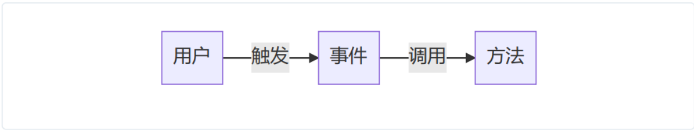
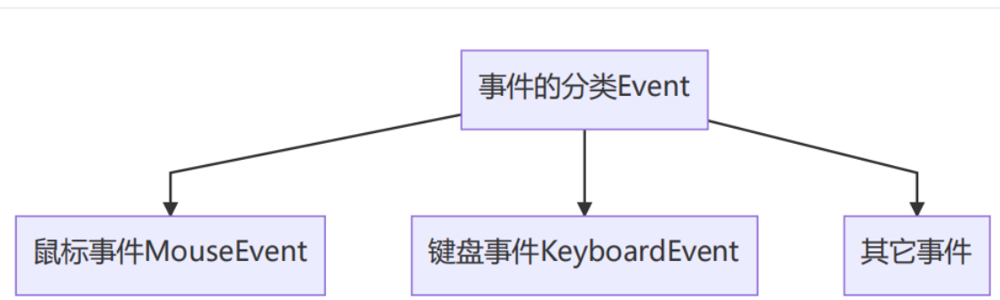
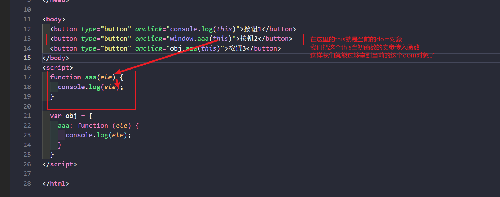

## 0级DOM事件

事件就是用户与网页之间的交互行为，当用户触发事件后，会有得到一些反馈结果

事件在DOM里面本身也是一个属性，它是一个特殊的属性，这种属性以on开头

```html
<body>
  <button type="button" id="btn1" onclick="console.log('我是一个点击事件')">按钮</button>
  <button type="button" onclick="aaa()">点击事件</button>
</body>
<script>
  var btn = document.querySelector("#btn1")
  function aaa() {
    console.log("我也是一个点击事件")
  }
</script>
```

在上面的代码里面我们看到`<button>`标签里面有一个属性`onclick`，它就是一个事件，这事件属性接受的属性值是一个方法

上面的`onclick`后面跟了一个我们定义的方法`aaa()`，这个方法它不会自己调用，只有当**用户**触发这个点击事件后它才回去调用我们传入的方法



当用户在网页上触发了某一个特定条件后，在这个特定的条件下就会调用方法，我们把这个特定的条件就叫做**0级DOM事件**，我们可以把事件大致分为一下三类



### 鼠标事件

1. `onclick`鼠标主键单击事件

2. `ondblclick`鼠标主键双击事件

3. `onmousedown`鼠标按键按下的事件

4. `onmouseup`鼠标按键松开的事件

5. `onmousemove`鼠标移动的事件

6. `onmouseenter`鼠标进入以后的事件

7. `onmouseleave`鼠标离开以后的事件

8. `onmouseover`鼠标进入以后的事件

9. `onmouseout`鼠标离开以后的事件

   鼠标的进入与离开有两组事件

   第一组：`onmouseenter/onmouseleave`【这一组事件不建议使用，原因是它们没有事件冒泡，形成不了事件流】

   第二组：`onmouseover/onmouseout`

10. `onmousewheel`鼠标中键滚动的事件

11. `oncontextmenu`鼠标上下文菜单事件【同属的说法叫右键菜单】

### 键盘事件

1. `onkeydown`键盘按键按下去以后的事件

2. `onkeyup`键盘按键松开以后的使劲按

3. `onkeypress`键盘敲击后的事件

   `onkeydown`所有的按键都能触发，但是`onkeypress`只有字符按键才能触发执行顺序如下

   ```
   keydown--> onkeypress --> onkeyup
   ```

### 其他事件

1. `onfocus`当一个元素获取焦点时候的事件

2. `onblur`当一个元素失去焦点时候的事件

3. `oninput`当输入框在输入的时候的事件

4. `onchange`当表单元素的值发生变化的时候的事件

   这个事件与上面的`oninput`很像，但是它需要失去焦点并且前后的值有差异的时候才会触发

5. `onsubmit`当表单提交的时候会触发

6. `onreset`当表单被重置的事件

7. `onload`当加载完成时候的事件

8. `onerror`当资源加载失败的时候的事件

9. `onscroll`当一个元素发生滚动的时候的事件

10. `onresize`当一个元素大小发生改变的事件

### 0级事件的绑定方式

#### 常规绑定方式

```html
<body>
  <button type="button" onclick="console.log('我是一个点击事件')">按钮1</button>
  <button type="button" onclick="aaa()">按钮2</button>
</body>
<script>
  function aaa() {
    console.log("我也是一个点击事件");
  }
</script>
```

上面的代码里面，我们直接在`onclick`属性里面传入了一个方法或者直接传入我们想要执行的代码，这其实就是将一个属性值赋值给一个属性名

#### 动态绑定的方式

上面的例子里面我们说明了，事件本身也是一个属性，既然它是一个属性，我们就可以通过`对象.属性`来调用

```html
<body>
  <button type="button" onclick="console.log('我也是一个点击事件')">按钮1</button>
  <button type="button" onclick="aaa()">按钮2</button>
  <button type="button">按钮3</button>
</body>
<script>
  var btn = document.querySelector("[type='button']:nth-child(3)")
  btn.onclick = aaa
  function aaa() {
    console.log("我也是一个点击事件");
  }
</script>
```

上面的代码里面就是动态绑定的方式，然后我们学习过匿名函数

```html
<body>
  <button type="button">按钮3</button>
</body>
<script>
  var btn = document.querySelector("[type='button']")
  btn.onclick = function () {
    console.log("我也是一个点击事件");
  }
</script>
```

### 事件方法里面的this

#### 第一种情况

```html
<button type="button" onclick="console.log(this)">按钮</button>
```

在这里我们直接在`onclick`的地方调用`this`，这个时候的`this`指向它当前的DOM对象

#### 第二种情况

```html
<body>
  <button type="button" onclick="aaa()">按钮1</button>
  <!-- 上面的代码可以下面这种写法但是前面我们讲过window调用发放的时候可以省略 -->
  <!-- <button type="button" onclick="window.aaa()">按钮1</button> -->
  <button type="button" onclick="obj.aaa()">按钮2</button>
</body>
<script>
  function aaa() {
    console.log(this);
      // 这里的this就执行window
  }

  var obj = {
    aaa: function () {
      console.log(this);
        // 这里的this就指向当前调用它的这个对象
    }
  }
</script>
```

在上面的代码里面我们发现这种方式来执行函数里面的`this`并没有执行当前的DOM对象吗，而是指向了**调用对象**

这个时候我们有希望去拿到当前操作DOM对象，我们应该怎么办？



通过上面这种把`this`当作参数传入函数的方式我们就能够拿到当前的DOM对象了

#### 第三种情况

动态绑定的this指向

```html
<body>
  <button type="button" class="btn1">按钮1</button>
</body>
<script>
  var btn1 = document.querySelector(".btn1")
  btn1.onclick = function () {
    console.log(this);    // btn1
  }
</script>
```

通过这一种动态绑定的`this`，它是一定会执行当前绑定的这个DOM对象的

通上面的这三种方式我们就能快速的在事件触发的时候找到当前的DOM对象

