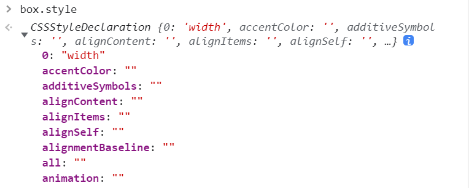
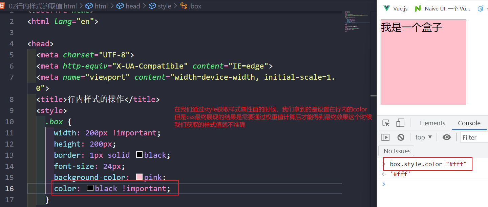
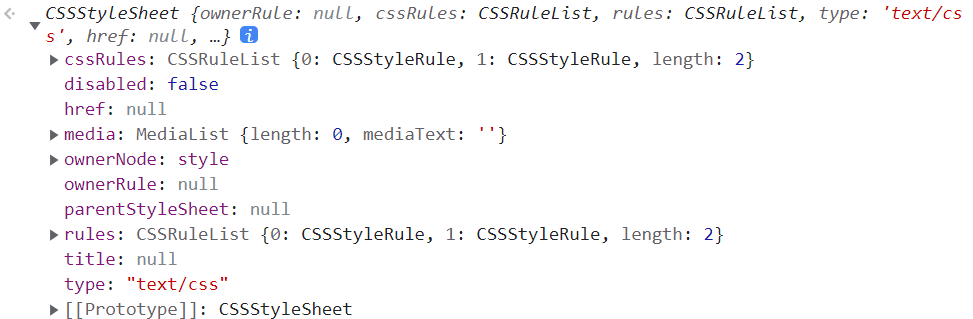
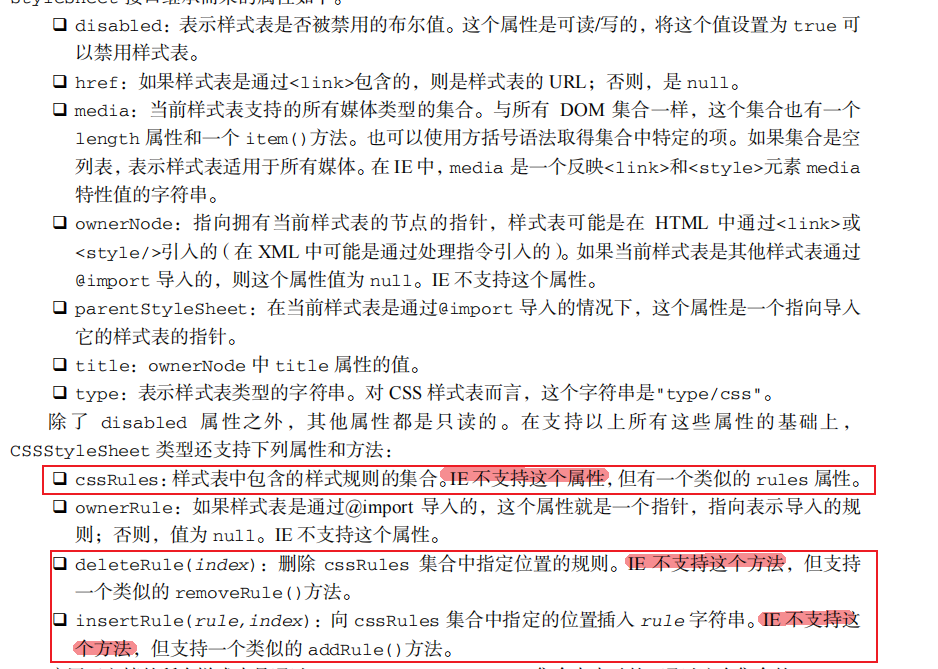
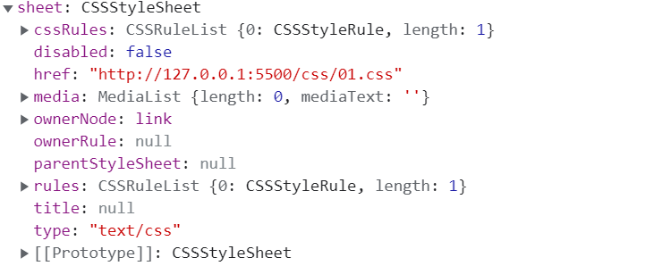
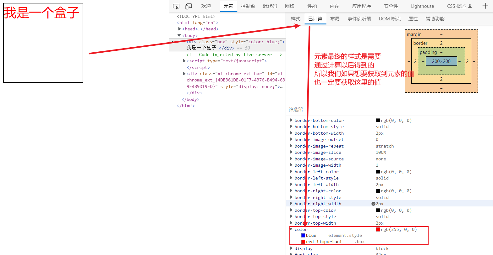
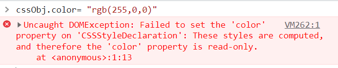
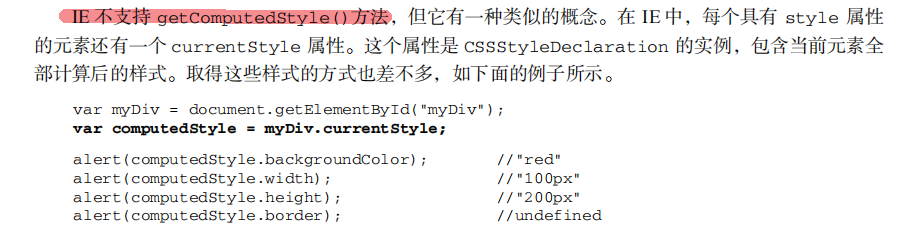

## DOM的样式操作

我们之前学习了如何使用JS来操作页面上面的元素，现在我们来学习一下如何操作页面上面的样式

JS操作样式主要还是使用DOM的属性与方法。在之前我们讲解css的时候，它的存放位置有三个

1. 写在`style`属性里面的行内样式
2. 写在`<style>`标签里面的内部样式快
3. 通过`<link>`导入的外部样式表

### 一、行内样式的操作

每一个元素上面都有一个`style`属性，所以我们在可以通过`style`属性来操作元素的样式



如上图所示，`style`属性里面返回过来的是一个`CSSStyleDeclaration`的对象，这个对象里面包含了我们所有的css样式，所以我们只要对这里面的属性赋值就可以了

```html
<body>
  <div class="box"></div>
</body>
<script>
   var box = document.querySelector(".box")

  // 下面的代码相当与在html表里面写给一个style属性如何给width赋值为300px
  box.style.width = "300px"
  box.style["font-size"] = "36px"

  // 通过属性名是两个单词通过-拼接的就把-去掉如何紧挨着-的那个字母变成大写转化成驼峰命名法
  box.style.borderRadius = "50px"
</script>
```

在上面的代码里面需要注意，如果css属性里面有`-`的，就去掉`-`然后后面的首字母转大写

> style在操作样式的时候，我们只**建议赋值**，**不建议取值**，style在进行取值的时候只能够拿到行内样式里面的属性值。如下所示



### 二、内部样式快的操作

> 本章节只做了解，如无必要，不要使用

```html
<style>
    .box {
      width: 100px;
      height: 100px;
      background-color: lightsalmon;
      margin-top: 10px;
    }
</style>

<body>
  <div class="box">盒子1</div>
  <div class="box">盒子2</div>
  <div class="box">盒子3</div>
</body>
```

为什么需要操作内部样式快，是因为我们在有一个地方需要批量的去改变元素的样式，这个时候我们可以在元素上面给相同的class，在上面的代码中如果我们改变了`.box`样式表里面的内容，那么下面的三个使用了`box`这个样式的元素都会改变，这一种方式就比我们上面操作`style`要快上许多

```javascript
 var s = document.querySelector("style")
```

我们在控制台打印这个s，可以看到一个`sheet`属性





```javascript
s.sheet.cssRules[0].style.width = "200px" // 将第一个规则下面的width设置为200px
s.sheet.cssRules[0].style.borderRadius = "50%"
```

这些都是改变某一个规则里面的某一个样式，除了修改意外，我们还可以新增或者删除某一个规则

```javascript
// 删除某一条规则
s.sheel.deleteRule(1)
s.sheel.removeRule(1) // ie兼容性写法

// 新增一条规则
s.sheet.insertRule(".aaa {font-size: 32px}", 1)
s.sheet.addRule(".aaa {font-size: 32px}", 1)   // ie兼容性写法
```

### 三、外部样式表

它的原理与上面内部样式快的操作一样，如下图所示

```javascript
 var link1 = document.querySelector("link")
```



它的操作原同上

### 四、classList与className的操作

在之前讲DOM的属性的时候，已经接触过这种通过`classList`与`className`操作页面样式了

```html
<style>
    .aaa {
      color: red;
    }

    .bbb {
      color: blue;
    }
</style
<body>
  <h2>
    我是标题
  </h2>
</body>
<script>
  var h2 = document.querySelector("h2")
  h2.classList.add("aaa")
  h2.classList.add("bbb")
  h2.classList.remove("aaa")
</script>
```

在上面的四种方式里面，都是对元素样式的赋值操作，如果我们想要获取元素的样式就不要使用上面的办法了

### 五、获取元素的样式

```html
<style>
    .box {
      width: 200px;
      height: 200px;
      border: 2px solid black;
      font-size: 32px;
      color: red !important; 
    }
</style>

<body>
  <div class="box" style="color: blue;">
    我是一个盒子
  </div>
</body>
```

在上面的例子中，如果我们直接通过`box.style.color`来获取样式得到的是`blue`，但是，真正展示在页面上面的样式是`red`，所以通过`元素.style`来获取元素的样式值是不对的，它有可能娶不到，也有可取到一个错误的值。

元素样式的取值，最终是需要计算以后得到的，图下图所示：



在DOM操作里面，系统提供了一个方法让我们可以获取元素经过计算以后的样式，这个方法如下：

```javascript
css样式对象 = window.getComputedStyle(元素,是否为伪元素？);
```

现在我们就去通过这个方法来获取上面元素的最终样式

```javascript
var box = document.querySelector(".box")
var cssObj = window.getComputedStyle(box)
// 这个时候的cssObj就能拿到了所有计算过后的样式值
console.log(cssObj.color);
console.log(cssObj.width);
```

上面就拿到了页面上展示出来的最终值。

这个方法除了能够获取元素，还可以获取伪元素的样式属性

```html
<style>
    .box {
      width: 200px;
      height: 200px;
      border: 2px solid black;
      font-size: 32px;
      color: red !important;
    }

    .box::after {
      content: "我是一个伪元素";
      color: green;
      font-style: italic;
      font-size: 24px;
    }
</style>
<body>
  <div class="box" style="color: blue;">
    我是一个盒子
  </div>
</body>
<script>
  var box = document.querySelector(".box")
  var cssObj = window.getComputedStyle(box, "::after")
  // 这个时候的cssObj就是伪元素.box::after下面的所有样式值
</script>
```

**注意：**我们在通过`window.getComputedStyle()`所得到的样式对象只能取值，不能赋值。



还要注意在IE里面没有这个方法，所以在写代码的时候也可能会遇到下面的情况



```javascript
var box = document.querySelector(".box")
// W3C标准写法
var cssObj = window.getComputedStyle(box)
console.log(cssObj.width);

// 在IE里面的写法
var cssObj1 = box.currentStyle
console.log(cssObj1.width);
```


### 总结

在获取元素样式的时候我们使用第五点，在给改变样式的值的时候使用前面四种都已，推荐使用第一种与第四种


### 补充：CSS变量操作

在之前学习CSS的时候我们讲到了CSS的变量，如下

```html
<style>
    .box {
      --x: 100px;
      width: var(--x);
      height: var(--x);
      background-color: pink;
    }
</style>
<body>
  <div class="box"></div>
</body>
<script>
  var box = document.querySelector(".box")
  var cssObj = window.getComputedStyle(box)
  // 获取css变量
  var x = cssObj.getPropertyValue("--x")

  // css变量的赋值
  box.style.setProperty("--x", "200px")
</script>
```

在上面的例子里面就恨到的说明了这个CSS变量操作的过程

* 取值我们仍然是找`getComputedStyle()`里面得到的这个对象，然后在调用`getPropertyValue()`方法来获取变量的值
* 赋值我们也是找`style`，然后通过`setProperty()`来实现CSS变量的赋值

#### 案例

```html
<style>
    .out-box {
      --x: 0%;
      width: 200px;
      height: 200px;
      border: 5px solid black;
      border-radius: 50%;
      background-image: conic-gradient(red var(--x), #fff var(--x));
      display: flex;
      justify-content: center;
      align-items: center;
    }

    .box {
      width: 90%;
      height: 90%;
      border-radius: 50%;
      display: flex;
      justify-content: center;
      align-items: center;
      font-size: 48px;
      background-color: #fff;
    }
</style>

<body>
  <div class="out-box">
    <div class="box">
    </div>
  </div>
</body>

<script>
  var outBox = document.querySelector(".out-box")
  var box = document.querySelector(".box")
  var time = 0;
  var aaa = setInterval(function () {
    outBox.style.setProperty("--x", time + "%")
    box.innerText = time + "%"
    time++
    if (time == 100) {
      time = 0
    }
  }, 100)
</script>
```

效果图

