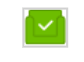
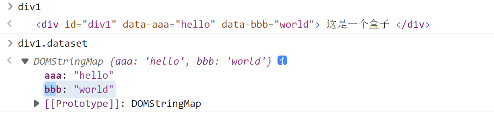
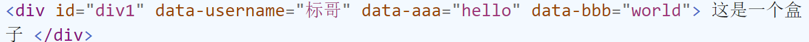
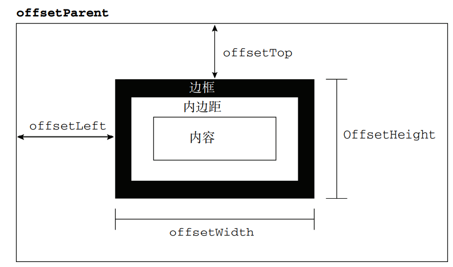
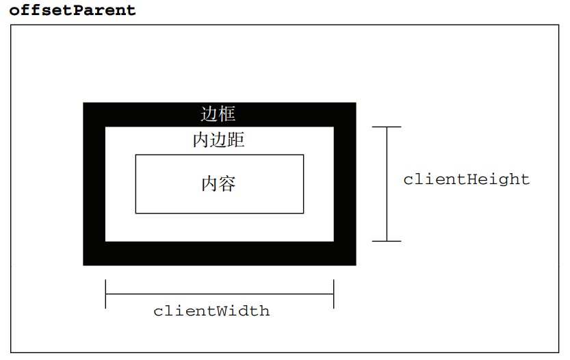
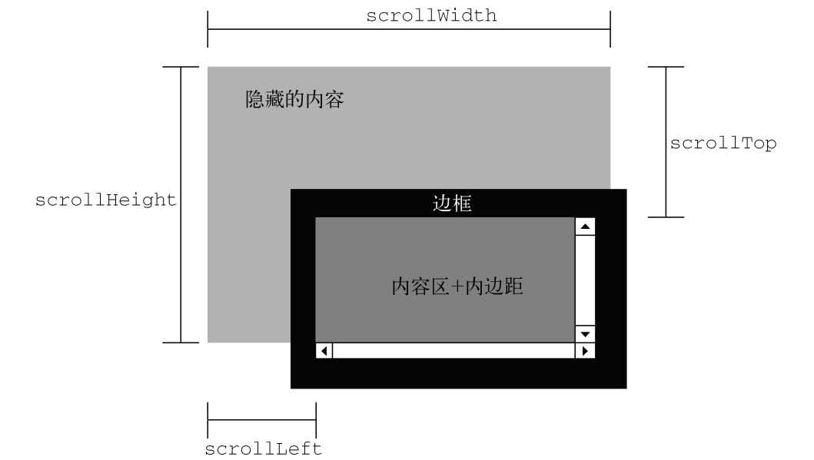
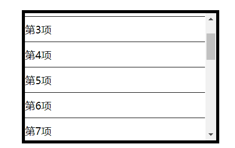
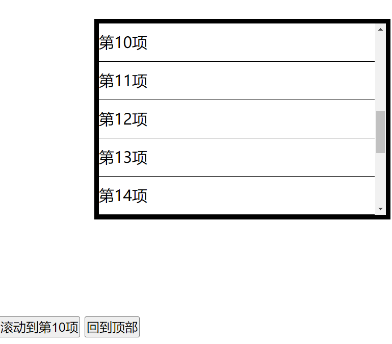

## DOM补充

### 自定义属性DataSet

之前在讲DOM的时候提到过2种类型的属性

1. `Property`它针对的是对象上面的属性
2. `Attribute`它针对的是HTML标签上面的属性

```html
<input type="text" id="aaa" bbb="hello">
```

`type/id/aaa`都是标签的属性，我们可以把它们称之为`attribute`，同时我们也讲过，原生的`attribute`会转换成`Property`

```javascript
var aaa = document.querySelector("#aaa");
aaa.type;		
aaa.bbb;			//不能取值
```

对于自定义属性，DOM并不会帮我们转换成`property`,这个时候我们就不能通过`对象.属性`这一种方式调用，只能通过`setAttribute/getAttibute`来完成

现在我们先通过下面的案例来看情况

```html
<!DOCTYPE html>
<html lang="zh">

<head>
    <meta charset="UTF-8">
    <meta http-equiv="X-UA-Compatible" content="IE=edge">
    <meta name="viewport" content="width=device-width, initial-scale=1.0">
    <title>最原始的情况</title>
    <style>
        .site-box {
            transform: scale(1.5);
            margin: 100px;
            width: 30px;
            height: 26px;
            border: 2px solid lightgray;
            /* background-image: url("img/02.png"); */
            /* background-image: url("img/03.png"); */
        }
        .site-box[bbb="2"]{
            background-image: url("img/02.png");
        }
        .site-box[bbb="3"]{
            background-image: url("img/03.png");
        }
    </style>
</head>

<body>
    <div class="site-box" bbb="2" onclick="chooseSite(this)"></div>
</body>
<script>
    function chooseSite(obj){
        if(obj.getAttribute("bbb")=="2"){
            obj.setAttribute("bbb","3");
        }
        else{
            obj.setAttribute("bbb","2");
        }
    }
</script>

</html>
```

| 点击之前                                                     | 点击之后                                                     |
| ------------------------------------------------------------ | ------------------------------------------------------------ |
|  |  |

通过上面的自定义属性，我们可以实现样式的切换效果

<span style="color:red;">自定义属性在DOM操作的时候不会变成`Property`，所以我们必须要使用`setAttribute/getAttribute`来完成，这样做很麻烦</span>

**思路**：能否将自定义的属性也转变成`property`?

DOM规则 ，如果要使用自定义的属性，最好在自定义的属性前面加上`data-`,这样它会把你的自定义属性也转换成`property`



在DOM里面，所有以`data-自定义属性`最终都会转变成`dataset`下面的一个属性

```
data-aaa	转变成 dataset.aaa
data-bbb    转变成 dataset.bbb
```

**注意事项**：<u>所有以`data-`开头的自定义属性都不要使用驼峰命名，如果非要用，应该要转义使用</u>

```html
<div id="div1" data-userName="标哥" data-aaa="hello" data-bbb="world">
    这是一个盒子
</div>
```



这个时候我们可以看到，原来的大写变成了小写，直接使用驼峰是不可以的

如果非要使用，就要转义

```html
 <div id="div1" data-user-age="18" data-userName="标哥" data-aaa="hello" data-bbb="world">
     这是一个盒子
</div>
```

在上面`data-user-age`就会转换成`dataset.userAge`

```html
<!DOCTYPE html>
<html lang="zh">
<head>
    <meta charset="UTF-8">
    <meta http-equiv="X-UA-Compatible" content="IE=edge">
    <meta name="viewport" content="width=device-width, initial-scale=1.0">
    <title>自定义属性</title>
    <style>
        .site-box {
            transform: scale(1.5);
            margin: 100px;
            width: 30px;
            height: 26px;
            border: 2px solid lightgray;
        }

        .site-box[data-site-type="2"] {
            background-image: url("img/02.png");
        }

        .site-box[data-site-type="3"] {
            background-image: url("img/03.png");
        }
    </style>
</head>
<body>
    <div class="site-box" data-site-type="2" onclick="chooseSite(this)"></div>
</body>
<script>
    function chooseSite(obj) {
        if (obj.dataset.siteType == "2") {
            obj.dataset.siteType = "3";
        }
        else {
            obj.dataset.siteType = "2";
        }
    }
</script>
</html>
```

----

### 元素大小

元素的大小这点其实与我们这前理解的CSS的盒子模型是很像的，在这个地方它是通过JS的形式表现出来了

#### 偏移量

先要介绍的属性涉及偏移量（offset dimension），包括元素在屏幕上占用的所有可见的空间。元素 的可见大小由其高度、宽度决定，包括所有内边距、滚动条和边框大小（注意，不包括外边距）。



1. `offsetWidth`：元素在水平方向上占用的空间大小，以像素计。包括元素的宽度、（可见的）垂直滚动条的宽度、左边框宽度和右边框宽度【只读】
2. `offsetHeight`：元素在垂直方向上占用的空间大小，以像素计。包括元素的高度、（可见的） 水平滚动条的高度、上边框高度和下边框高度【只读】
3. `offsetLeft`：元素距离`offsetParent`的左边的距离
4. `offsetTop`：元素距离`offsetParent`的上边的距离

> **注意事项**
>
> 1. 所有元素的`offsetParent`默认都是`body`
> 2. `offsetLeft/offsetTop`指当前元素距离自己的`offsetParent`的距离
> 3. 如果是"子绝父相"的定位，则子级元素的`offsetParent`指的就是外层元素的`relative`定位的元素
> 4. 如果是固定定位，则该元素的`offsetParent`就是`null`

#### 客户区大小

元素的客户区大小（client dimension），指的是元素内容及其内边距所占据的空间大小



1. `clientWidth`元素的宽度加上左右的内边距
2. `clientHeight`元素的高度加上上下内边距

> 与偏移量相似，客户区大小也是只读的，也是每次访问都要重新计算的。

#### 滚动大小

当一个小盒子里面放在一大的内容的时候 ，默认情况下盒子是会被溢出的，我们可以通过添加`overflow:auto`来实现滚动条，用于处理溢出，这个滚动大小就是元素如果有滚动条的情况下的大小



1. `scrollWidth`：元素在没有滚动条的情况下，它的总宽度【只读】
2. `scrollHeight`：元素在没有滚动条的情况下，它的总高度【只读】
3. `scrollTop`：被隐藏的区域上边的像素（或叫被滚动出去的上边的像素）
4. `scrollLeft`：被隐藏的区域的左边的像素（或叫被滚动出去的左边的像素）

当一个小的盒子里面放一个大盒子，如果要处理溢出的情况就会使用`overflow:auto`，如果使用了这个情况就会出现滚动条，而有了滚动条就会就`scrollTop/scrollLeft`。那么，这个东西到底有什么用呢？

当一个元素有了滚动条，并且在滚动的时候就会触发`onscroll`事件

```html
<!DOCTYPE html>
<html lang="zh">

<head>
    <meta charset="UTF-8">
    <meta http-equiv="X-UA-Compatible" content="IE=edge">
    <meta name="viewport" content="width=device-width, initial-scale=1.0">
    <title>onscroll</title>
    <style>
        * {
            margin: 0;
            padding: 0;
            list-style-type: none;
        }

        .box {
            width: 300px;
            height: 200px;
            border: 5px solid black;
            margin: 100px;
            overflow: auto;
        }

        .ul1>li {
            height: 40px;
            display: flex;
            align-items: center;
            border-bottom: 1px solid black;
            box-sizing: border-box;
        }
    </style>
</head>

<body>
    <div class="box">
        <ul class="ul1">
            <li>第1项</li>
            <li>第2项</li>
            <li>第3项</li>
            <li>第4项</li>
            <li>第5项</li>
            <li>第6项</li>
            <li>第7项</li>
            <li>第8项</li>
            <li>第9项</li>
            <li>第10项</li>
            <li>第11项</li>
            <li>第12项</li>
            <li>第13项</li>
            <li>第14项</li>
            <li>第15项</li>
            <li>第16项</li>
            <li>第17项</li>
            <li>第18项</li>
            <li>第19项</li>
            <li>第20项</li>
        </ul>
    </div>
</body>
<script>
    var box = document.querySelector(".box");
    // 当滚动条滚动的时候就会触发onscroll事件
    box.onscroll = function (event) {
        console.log(event);
    }
</script>
</html>
```

在上面的代码当中，我们可以看到，当我们去拖动滚动条的时候，它的`onscroll`就触发了



#### 综合案例

```html
<!DOCTYPE html>
<html lang="zh">

<head>
    <meta charset="UTF-8">
    <meta http-equiv="X-UA-Compatible" content="IE=edge">
    <meta name="viewport" content="width=device-width, initial-scale=1.0">
    <title>综合案例</title>
    <style>
        * {
            margin: 0;
            padding: 0;
            list-style-type: none;
        }

        .box {
            width: 300px;
            height: 200px;
            border: 5px solid black;
            margin: 100px;
            overflow: auto;
            position: relative;
        }

        .ul1 {
            position: absolute;
            width: 100%;
        }

        .ul1>li {
            height: 40px;
            display: flex;
            align-items: center;
            border-bottom: 1px solid black;
            box-sizing: border-box;
        }
    </style>
</head>

<body>
    <div class="box">
        <ul class="ul1">
            <li>第1项</li>
            <li>第2项</li>
            <li>第3项</li>
            <li>第4项</li>
            <li>第5项</li>
            <li>第6项</li>
            <li>第7项</li>
            <li>第8项</li>
            <li>第9项</li>
            <li>第10项</li>
            <li>第11项</li>
            <li>第12项</li>
            <li>第13项</li>
            <li>第14项</li>
            <li>第15项</li>
            <li>第16项</li>
            <li>第17项</li>
            <li>第18项</li>
            <li>第19项</li>
            <li>第20项</li>
        </ul>
    </div>
    <button type="button" onclick="fn1()">滚动到第10项</button>
    <button type="button" onclick="fn2()">回到顶部</button>
</body>
<script>
    var box = document.querySelector(".box");
    var ul1 = document.querySelector(".ul1");
    ul1.offsetParent;       //box

    var li10 = document.querySelector(".ul1>li:nth-child(10)");
    li10.offsetParent;      //ul1


    function fn1() {
        box.scrollTop = li10.offsetTop;
    }
    function fn2(){
        box.scrollTop = 0;
    }
</script>

</html>
```


