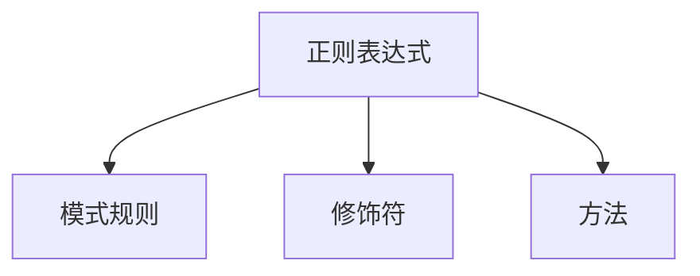

## 正则表达式

正则表达式并不是JavaScript里面独有的技术，所有的编程语言都有

正则表达式有以下几个特点【它的特点也可以认为是它的使用场景】

1. 只则表达式只对字符串进行操作
2. 正则表达式是根据你所设定的**规则**对字符串进行“验证”，“提取”，“搜索”，“替换”等操作
3. JavaScript当中的正则表达式它是一个内置对象，它可以直接使用，它的构造函数是`RegExp`,或直接使用字面量去创建`/正则规则/`

正则表达式一共只有三个部分



### 正则表达式的创建

正则表达式是一个对象，在使用之前要先创建这个对象，它的构造函数是`RegExp`,它的语法格式如下

**第一种创建方式**

```javascript
var reg = new  RegExp(pattern: string | RegExp, flags?: string): RegExp
```

> 前面的`pattern`代表的就是模式规则，后面的`flags`代表的就是修饰符

```javascript
var reg = new RegExp();					//创建了一个空的正则
var reg1 = new RegExp("爱");			   //创建了一个普通的正则
var reg2 = new RegExp("爱","g");		   //创建了正则，后面添加了一个g的修饰符
```

这一种创建方式也是一种很常见的创建方式 ，但是我们还有更简单的方式它就是字面量创建

**第二种创建方式**

这一种创建方式使用的是字面量创建的方法，它使用`/规则/`来完成。语法如下

```javascript
var reg3 = /爱/;
var reg4 = /爱/g;
typeof reg3;			//"object";
```

正则表达式的创建我们已经学会了，如果要使用正则表达式，就一定要先了解一下正则表达式对象的2个基本方法

### 正则表达式对象的基本方法

1. `test()`方法，用于验证某个字符串是否符合正则表达式所定义的规则，验收成功结果就是`true`,验证失败结果就是`false`
2. `exec()`方法，用于提取字符串当中符合正则表达式要求的字符

根据上面折这两个方法，我们才可以开始慢慢接触正则

```javascript
var reg1 = /杨/;
reg1.test("杨标");
reg1.test("标");
reg1.test("标杨");
```

### 正则表达式的规则

如果我们想让正则表达式实更我们自己所需要规则，则必须了解正则表达式的规则定义

#### 一元符

| 元字符 | 对应说明                                 |
| ------ | ---------------------------------------- |
| .      | 匹配除换行符之外的任意字符               |
| \w     | 匹配字母数字下划线，等同于：[a-zA-Z0-9_] |
| \s     | 匹配任意空白符                           |
| \d     | 匹配数字，等同于[0-9]                    |
| \b     | 匹配单词边界                             |
| \|     | 或匹配，如 /x\|y/ 正则可匹配x或y两个字符 |
| ^      | 匹配字符串的开始                         |
| $      | 匹配字符串的结束                         |

#### 原子表与原子组

#### 反义字符

#### 重复匹配

#### 贪婪与惰性

#### 前瞻与后顾

#### 原子组编号

