## 正则表达式

正则表达式并不是JavaScript里面独有的技术，所有的编程语言都有

正则表达式有以下几个特点【它的特点也可以认为是它的使用场景】

1. 只则表达式只对字符串进行操作
2. 正则表达式是根据你所设定的**规则**对字符串进行“验证”，“提取”，“搜索”，“替换”等操作
3. JavaScript当中的正则表达式它是一个内置对象，它可以直接使用，它的构造函数是`RegExp`,或直接使用字面量去创建`/正则规则/`

正则表达式一共只有三个部分

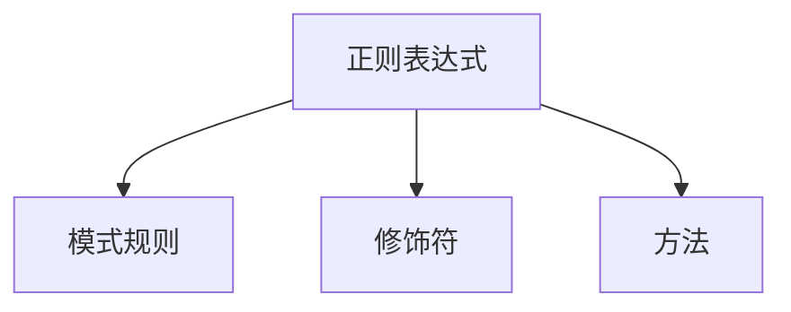

### 正则表达式的创建

正则表达式是一个对象，在使用之前要先创建这个对象，它的构造函数是`RegExp`,它的语法格式如下

**第一种创建方式**

```javascript
var reg = new  RegExp(pattern: string | RegExp, flags?: string): RegExp
```

> 前面的`pattern`代表的就是模式规则，后面的`flags`代表的就是修饰符

```javascript
var reg = new RegExp();					//创建了一个空的正则
var reg1 = new RegExp("爱");			   //创建了一个普通的正则
var reg2 = new RegExp("爱","g");		   //创建了正则，后面添加了一个g的修饰符
```

这一种创建方式也是一种很常见的创建方式 ，但是我们还有更简单的方式它就是字面量创建

**第二种创建方式**

这一种创建方式使用的是字面量创建的方法，它使用`/规则/`来完成。语法如下

```javascript
var reg3 = /爱/;
var reg4 = /爱/g;
typeof reg3;			//"object";
```

正则表达式的创建我们已经学会了，如果要使用正则表达式，就一定要先了解一下正则表达式对象的2个基本方法

### 正则表达式对象的基本方法

1. `test()`方法，用于验证某个字符串是否符合正则表达式所定义的规则，验收成功结果就是`true`,验证失败结果就是`false`
2. `exec()`方法，用于提取字符串当中符合正则表达式要求的字符

根据上面折这两个方法，我们才可以开始慢慢接触正则

同时正则表达式在创建的时候还会有一个修饰符可以添加

1. `g`代表`global`全局的意思
2. `i`代表`ignore`忽略的意思，它会忽略英文的大小写
3. `m`代表`multipleline`多行的意思，它可以换行操作


```javascript
var reg1 = /杨/;
reg1.test("杨标");
reg1.test("标");
reg1.test("标杨");
```

### 正则表达式的规则

如果我们想让正则表达式实更我们自己所需要规则，则必须了解正则表达式的规则定义

#### 一元符

| 元字符 | 对应说明                                 |
| ------ | ---------------------------------------- |
| .      | 匹配除换行符之外的任意字符               |
| \w     | 匹配字母数字下划线，等同于：[a-zA-Z0-9_] |
| \s     | 匹配任意空白符                           |
| \d     | 匹配数字，等同于[0-9]                    |
| \b     | 匹配单词边界                             |
| \|     | 或匹配，如 /x\|y/ 正则可匹配x或y两个字符 |
| ^      | 匹配字符串的开始                         |
| $      | 匹配字符串的结束                         |

#### 反义字符

| 反义字符 | 对应说明                                                |
| -------- | ------------------------------------------------------- |
| [^x]     | 匹配除“x”之外的所有字符，其中“x”可以为任意字符          |
| [^xyz]   | 同上，匹配除“x、y、z”之外的任意字符                     |
| \W       | 匹配除了字母、数字、下划线之外的所有字符，等同于：`[^\w]` |
| \S       | 匹配除空白符之外的任意字符，等同于：`[^\s]`               |
| \B       | 匹配不是单词边界的字符，等同于：`[^\b]`                   |
| \D       | 匹配不是数字的所有字符，等同于：`[^\d]`                   |

#### 原子表与原子组

**原子表**

```javascript
// 我希望有一个正则能够匹配  杨标 ，张标 ， 陈标
var reg1 = /^杨|张|陈标$/;
reg1.test("杨标");
reg1.test("张标");
reg1.test("陈标");

//我希望匹配 开头是大小字母，后面是数字
var reg2 =/^A|B|C|\d$/;

//针对上面的场景，其实我们是无法更好的实现的，怎么办呢
```

原子表是可以解决上面的问题的，原子了表以`[]`中括号的形式存在

```javascript
var reg3 = /^[杨张陈]标$/;
reg3.test("杨标");					//true
reg3.test("张标");					//true
reg3.test("陈标");					//true
reg3.test("王标");					//alse		
```

原子表在做正则操作的时候，它会把原子表里面的任意一个拿出来做匹配

同时原子表还可以设置区间范围

```javascript
var reg1 = /[0-9]/;			//代表数字0-9
var reg2 = /[a-z]/;			//代表小定字母
var reg3 = /[A-Z]/;			//代表大写字母
```

**注意**：原子表里面的范围不能倒着写，写反了就会报错

**原子组**

```javascript
//中括号代表原子表
var reg1 = /^[杨张陈]标$/;
//带小括号的就是原子组
var reg2 = /^(杨|张|陈)标$/;
```

原子组在后期的用法里面更多

::TODO

#### 重复匹配

| 匹配字符 | 对应说明                   |
| -------- | -------------------------- |
| *        | 重复出现零次或多次`{0,}`   |
| +        | 重复出现一次或多次`{1,}`   |
| ？       | 重复出现零次或一次 `{0,1}` |
| {n}      | 重复出现n次                |
| {n,}     | 至少重复出现n次            |
| {m,n}    | 重复重现m到n次，其中，m<n  |

```javascript
// 我希望有一个正则，它是以杨开头，后面跟2位任意数字
var reg1 = /^杨\d\d$/;
reg1.test("杨11");
reg1.test("杨12");

//我希望有一个正则，它是以杨开头，后面跟10位数字
// var reg2 = /^杨\d\d\d\d\d\d\d\d\d\d\d/;
var reg2 = /^杨\d{10}$/;

//我希望有一个正则，它是杨开头，后面至少根4个数字
var reg3 = /^杨\d{4,}$/;
reg3.test("杨1234");                //true
reg3.test("杨12345");               //true
reg3.test("杨123");                 //false

//正则，它是杨开头，后面跟 4~6个数字
var reg4 = /^杨\d{4,6}$/;
reg4.test("杨1234");            //true
reg4.test("杨123456");          //true
reg4.test("杨1234567");         //false
reg4.test("杨123");             //false
```

在重复的次数里面，还有一些特殊的重复次数

```javascript
//重复0次或1次
//匹配杨标，后面有可能有0个或1个数字
var reg6 = /^杨标\d{0,1}$/;
// 上面的0次或1次的写法，一般会直接使用另一个符号 
var reg7 = /^杨标\d?$/;
reg7.test("杨标2");
reg7.test("杨标");

//重复一次或多产欠
//匹配杨标，后面有可能是1个或多个数字
var reg8 = /^杨标\d{1,}$/;
reg8.test("杨标1");
reg8.test("杨标12");
//上面的1次或多次我们可以使用 + 来表示
var reg9 = /^杨标\d+$/;
reg9.test("杨标1");
reg9.test("杨标12");

//匹配任意次数       匹配0次或多次
var reg10 = /^杨标\d*$/;
reg10.test("杨标");
reg10.test("杨标1");
reg10.test("杨标12");
```

#### 贪婪与惰性

| 相关字符 | 对应说明                         |
| -------- | -------------------------------- |
| *?       | 重复任意次，但尽可能少的重复     |
| +?       | 重复一次或多次，但尽可能少的重复 |
| ??       | 重复零次或一次，但尽可能少的重复 |
| {m,n}?   | 重复m到n次，但尽可能少的重复     |
| {n,}?    | 重复n次以上，但尽可能少的重复    |
| {n}?     | 重复n次，但尽可能少的重复        |

```javascript
var str = "cbcertydiouycesdfsertd";
//要求：提取以c开始，以d结束，中是任何长度的小写英文字符的内容
var reg1 = /^c[a-z]*d$/;
```

上面的正则表达式是符合要求的，但是它是一个贪婪模式中间的`[a-z]*`会贪多个，所以最终匹配的结果就如下


如果现在我们将上面的正则表达式改变一下，变成惰性模式

```javascript
var reg2 = /c[a-z]*?d/g
```

这个时候我们可以看到它的结果如下

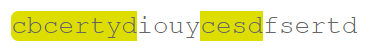

#### 转义字符

| 转义字符 | 对应说明                     |
| -------- | ---------------------------- |
| `\xnn`   | 匹配十六进制数               |
| `\f`     | 匹配换页符，等同于：\x0c     |
| `\n`     | 匹配换行符，等同于：\x0a     |
| `\r`     | 匹配回车符，等同于：\x0d     |
| `\t`     | 匹配水平制表符，等同于：\x09 |
| `\v `    | 匹配垂直制表符，等同于：\x0b |
| `\unnnn` | 匹配Unicode字符，如：\u00A0  |

```javascript
//想匹配一个字符串是"[123]"
var reg1 = /^[123]$/;
reg1.test("[123]");

//上面的正则就是错的，因为中括号在正则里面表示 原子表
var reg2 = /^\[123\]$/;
reg2.test("[123]");
```

正则表达式里面有一些特殊的东西是需要义的，如`[,],/.,{,},*,+,?`,转义字符使用`\`表示

#### 原子组编号

在我们学习原子组之前，我们已经知道了在正则里面使用`()`可以形成原子组，原子组在之前最大用处可能就是为了让某一个东西形成一个整体。其实原子组还可以进行分组编号

```javascript
var str1 = "<div>Hello</div>";
var str2 = "<H2></H2>";
var str3 = "<p></p>";

var reg1 = /<[a-zA-Z0-9]+><\/[a-zA-Z0-9]+>/;
```

从表现上面看，我们的正则已经符合匹配HTML标签的要求了，但是请看下面的情况

```javascript
var str4 = "<div></p>";
reg1.test(str4);
```

在上面的过程当中，我们发现正则表达式就有问题了，我们希望前面的匹配的东西在后面要继续使用。

在匹配的过程当中，我们要求开始标签与结束标签保持一致，我开始匹配的是`[a-zA-Z0-9]+`我最后结束的时候也必须正前面匹配到的保持一致。这个时候我们应该怎么办呢？这个时候我们就要使用原子组的编号

```javascript
var str1 = "<div>Hello</div>";
var str2 = "<H2></H2>";
var str3 = "<p></p>";
var str4 = "<div></p>";
var reg2 = /<([a-zA-Z0-9]+)><\/\1>/;
reg2.test(str1);			//true
reg2.test(str2);			//true
reg2.test(str3);			//true
reg2.test(str4);			//false
```

后面的正则表达式中的`\1`代表的就是匹配出来的第1个原子组的内容

我们还可以通过下面的东西来实现原子组编号的应用

```javascript
var str = "fdaffdaaklfjkkklja";
//现在要求找出字符串中连续重复的字符串
var reg1 = /(\w)\1+/g;
```

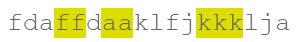

```javascript
 var str = "ababcdefaceced1212rtioio4ybyb";
//在里面找出那些有规律的两个一起重复的字符串
var reg1 = /(\w)(\w)\1\2/g;
```

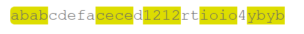

所有的原子组在产生的时候都会有一个编号，这个编号默认是从1开始的，如果要调用某一个编号就使用`\编号`就可以了

**但是也有分组以后不产生编号的**

> ()会分组并产生编号
>
> (?:)分组不产生编号

```javascript
 var str = "今天又跑到香港去玩了，买了好多东西，购物花了我346.77元";
//我们要把钱提取出来，怎么办？
var reg1 = /\d+(\.\d+)?/;				//分组，并产生了编号 
reg1.exec(str);

var reg2  = /\d+(?:\.\d+)?/;			//分组，不产生编号
reg2.exec(str);
```

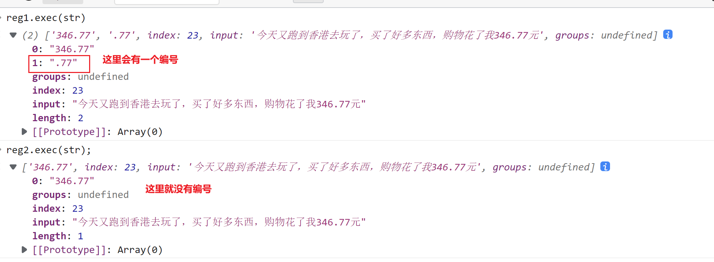

在这里我们就看到了，我们并不需要编号 ，所以我们的正则表达式就是分组不产生编号

-----

#### 前瞻与后顾

在学习这个知识点之前，一定要弄清楚正则表达式的前后关系【正则表达式右边的方向是前，左边的方向是后】

> 在学习这个东西之前，还要弄清楚几个点
>
> 1. 你要匹配的是什么？
> 2. 你要限制的是什么？
>
> 例如：吕亚宇找一个女朋友，但是它的限制条件是有钱，漂亮，身高170CM以上
>
> 1. 匹配条件：女
> 2. 限制条件：有钱，漂亮，身高170CM

##### 前瞻

前瞻（Look ahead positive）:匹配条件是A，限制条件是A的前面是B

```javascript
A(?=B)
```

如果我们想匹配`abc`并且`abc`的前面是`123`

```javascript
var str1 = "abc123";
var str2 = "abc456";
var str3 = "123abc";
```

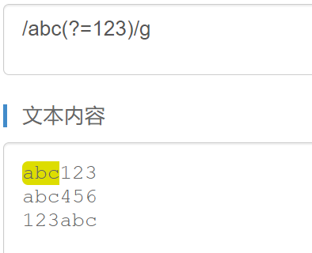

##### 负前瞻

负前瞻(Look ahead negative): 顾名思义，该正则匹配A，限制条件是A前面不是B

```javascript
A(?!B)
```

**想要匹配abc并且abc的前面不是123的表达式，应该这样：**

·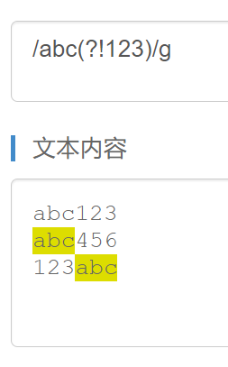

##### 后顾

后顾(Look behind positive ): 匹配表达式A，限制条件A的后面是B

```javascript
(?<=B)A
```

**想要匹配abc并且abc的后面是123的表达式**


##### 负后顾

负后顾(Look behind negative ): 匹配表达式A,限制条件是A的后面不是B

```javascript
(?<!B)A
```

**想要匹配abc并且abc的后面不是123的表达式，应该这样：**

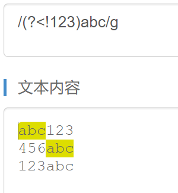

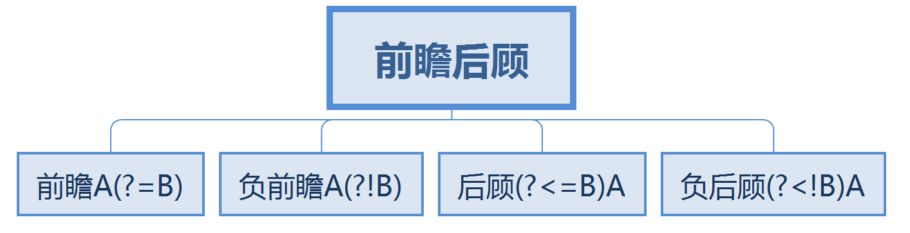


### 正则表达式操作方法

在使用正则表达式的时候，是有很多个方法的，但是主要是集中在两个对象上面，一个就是`RegExp`正则对象，另一个就是`String`对象

| 方法                         | 说明                                                   |
| ---------------------------- | ------------------------------------------------------ |
| `RegExp.prototype.test()`    | 根据正则表达式验证字符串                               |
| `RegExp.prototype.exec()`    | 根据正则表达式提取符合内容的字符串                     |
| `String.prototype.match()`   | 根据正则表达式在字符串中提取符合要求的字符串           |
| `String.prototype.split()`   | 根据正则表达式来分割字符串                             |
| `String.prototype.search()`  | 根据正则表达式来搜索字符串的位置                       |
| `String.prototype.replace()` | 根据正则表达式来替换字符串，原字符串不变，返回新字符串 |

#### test方法

该方法是正则表达式当中使用得最为频繁的一个方法，用于验证某一个字符串是否符合特定的规则 ，如果满足规则就返回true，否则就是false

```javascript
/*
	验证用户名：必须是小写字母后面接任意非空字符，长度是6-10位
	验证年龄：必须是正整数
	验证性别：必须是男女
*/
var reg1 = /^[a-z]\S{5,9}$/;
reg1.test("a1234567d");				//true

var reg2 = /^\d+$/;
reg2.test("12");

var reg3 = /^[男女]$/;
```

#### exec提取方法

```javascript
var str ="今天是9月10日，唉呀！今天又跑到香港去玩了，买了好多东西，购物花了我￥346.77元，结果吃饭只能用美元，花了我$34.78元,坐港铁花了￥10元。";
//在上面的字符串里面，我们要提取所有的金额（美圆和人民币）
```

**第一种操作**

```javascript
var str = "今天是9月10日，唉呀！今天又跑到香港去玩了，买了好多东西，购物花了我￥346.77元，结果吃饭只能用美元，花了我$34.78元,坐港铁花了￥10元。";
//在上面的字符串里面，我们要提取所有的金额（美圆和人民币）

var reg = /(?<=[￥\$])\d+(?:\.\d+)?/g;
var result = "";        //提取的结果放在这个里面

//第一次提取                         //346.77
result = reg.exec(str);            
console.log(result);

//第二次提取                        //34.78
result = reg.exec(str);
console.log(result);

//第三次提取                        //10
result = reg.exec(str);
console.log(result);

//第四次提取                        //null
result = reg.exec(str);
console.log(result);
```

通过上面的操作，我们得到了一个点，`exec`只会每次提取一次，下次再提取的时候是在前一次结束的地方开始，一直到最后，直到提取完，最后就会得到`null`

**第二种方式：简化上面的操作**

```javascript
var str = "今天是9月10日，唉呀！今天又跑到香港去玩了，买了好多东西，购物花了我￥346.77元，结果吃饭只能用美元，花了我$34.78元,坐港铁花了￥10元。";
//在上面的字符串里面，我们要提取所有的金额（美圆和人民币）

var reg = /(?<=[￥\$])\d+(?:\.\d+)?/g;
var result = "";        //提取的结果放在这个里面

while ((result = reg.exec(str)) != null) {
    console.log(result);
}
```

> 这一种正则提取的方式一般不用，用就是在高级场合。对于一般的提取我们有字符串的方法，而如果在提取的时候还要做复杂的操作，我们才会使用`exec()`

#### match()提取

```javascript
var str = "今天是9月10日，唉呀！今天又跑到香港去玩了，买了好多东西，购物花了我￥346.77元，结果吃饭只能用美元，花了我$34.78元,坐港铁花了￥10元。";
//在上面的字符串里面，我们要提取所有的金额（美圆和人民币）
var reg = /(?<=[￥\$])\d+(?:\.\d+)?/g;

// 提取一般用这个比较简单的方法
// String.prototype.match
var result = str.match(reg);        //['346.77', '34.78', '10']
//这里要注意，操作的主体发生了变化，这里是字符串操作正则
```

`match`方法会快事的提取符合要求的字符串，最终形成一个数组返回。它与我们的`exec`很相似，但是`exec`是可以实现更高级别的提取操作的

```javascript
var str = "我的身份证号是425789199011150105,张三的身份证号是12355420050405233x";
//写一个正则，提取身份证号，提出信息以后，快速的形成以下的数据结构
/*
    [{
        IDCard:"425789199011150105",
        birthday:"1990-11-15",
        sex:"女"
    },{
        IDCard:"12355420050405233x",
        birthday:"2005-05-05",
        sex:"男"
    }]
*/

var reg1 = /\d{17}[\dx]/gi;
var result1 = str.match(reg1);      //['425789199011150105', '12355420050405233x']

//上面的提取只是帮我们提取了身份证号,并不好形成生日,性别

var reg2 = /\d{6}(\d{4})(\d{2})(\d{2})\d{2}(\d)[\dx]/gi;
var result2 = "";
var arr = [];
while ((result2 = reg2.exec(str)) != null) {
    console.log(result2);
    var obj = {
        IDCard: result2[0],
        birthday: result2.slice(1, 4).join("-"),
        sex: result2[4] % 2 == 0 ? "女" : "男"
    }
    arr.push(obj);
}
console.log(arr);
```

> **注意**：无论是使用`exec()`还是`match()`的提取，我们在当前阶段都要添加`g`的修饰符

#### split分割

之前的字符串对象里面，我们已经学习过了这个东西，那个时候我们使用的是字符串的方式去分割，现在我们要以正则表达式的方式去分割

```javascript
var str = "get-element-by-id";
str.split("-");             //['get', 'element', 'by', 'id']

//除了使用字符串分割以外,我们还可以使用正则表达式来完成

var str2 = "我们H2204班的男生都很帅,身高都在180CM以上,年龄都在19岁以下,钱都有100W以上";
//请将上面的字符串以数字的形式分割

var reg = /\d+/;
str2.split(reg);
//结果['我们H', '班的男生都很帅,身高都在', 'CM以上,年龄都在', '岁以下,钱都有', 'W以上']
```

#### search搜索

```javascript
var str1 = "大家好,我是人见人爱的张三，我的身高是170CM!";
var str2 = "大家好，我是高富帅李四，我的身高是186CM!";
var str3 = "大家好，我是美女西施，我的身高是169CM!";
var str4 = "大家好，我是古典成熟高质量男性小乐乐，我的身高是178CM!";
//要求：找到数字的位置
str1.indexOf("170");
str2.indexOf("186");
str3.indexOf("169");
str4.indexOf("178");
//这样做很麻烦 ,因为如果中间有100句话,那么,我们的数字要写100次
var reg = /\d+/g;
str1.search(reg);
str2.search(reg);
str3.search(reg);
str4.search(reg);
//这个时候的参数就固定成了一个正则表达式
```

#### replace方法

在之前的字符串里面，我们已经学习过了`replace`,它可以替换我们字符串中间内容 **原字符串不变，返回新的字符串**

```javascript
var str1 = "我爱你,你爱我吗";
var result1 = str1.replace(/爱/g,"恨");		//'我恨你,你恨我吗'
```

上面的东西我们之前就已经接触过了，没有什么新颖的地方，重点在于`replace()`第二个参数。它的第二个参数可以写成一个回调函数

```javascript
str1.replace(/爱/g,function(p){
    //第一个参数p代表的是正则表达式匹配的内容
    console.log(p);
    console.log("我是回调函数"+Math.random());
});

var str2 = "我现在很穷,我只有19块钱,但是我的同桌是富二代,有100块钱";
str2.replace(/\d+/g,function(p){
    console.log(p);
    console.log("我是回调函数"+Math.random());
});
```

**当正则表达式的替换里面有原子组的时候**

```javascript
var str = "大家好，今天是2022-08-31 14:48:30,今天天气不好，有点冷";
var reg = /(\d{4}-\d{2}-\d{2})\s+(\d{2}:\d{2}:\d{2})/g;

str.replace(reg,function(p,g1,g2){
    //第一步参数:p代表当前正则匹配的总体内容
    //后面的参数就代表的是原子组编号:g1就是group1  g2就是group2
    console.log(p)
    console.log(g1);
    console.log(g2);
})
```

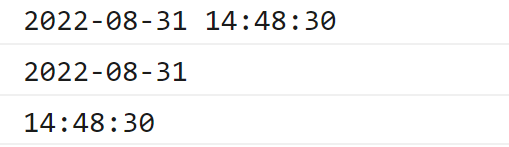

在这个回调函数里面，`return`返回的东西就是要替换的内容

```javascript
var str2 = "我现在很穷,我只有19块钱,但是我的同桌是富二代,有100块钱";
// 想将上面的数字换成xxx
var result = str2.replace(/\d+/g, function (p) {
    // console.log(p);
    return "x".repeat(p.length);
})
```

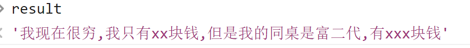

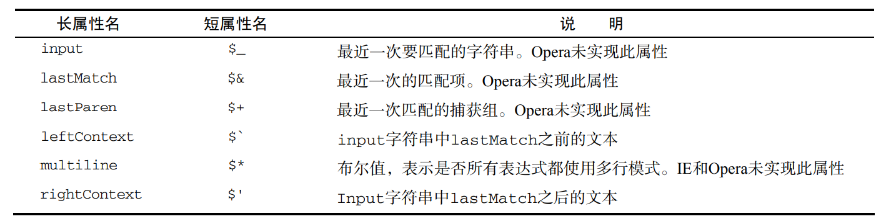

### 练习与作业

1. 提取歌词,将歌词内容提取为一个数组，歌词时间提取为一个数组

   ```javascript
   var musicLrc = `[00:00.000]少年 - 梦然 (Miya)
   [00:02.020]词：梦然
   [00:04.040]曲：梦然
   [00:06.060]编曲：张亮
   [00:08.090]制作人：张亮/徐阁
   [00:10.110]和声编写：海青/梦然
   [00:12.130]和声演唱：海青/梦然
   [00:14.160]Rap：梦然
   [00:16.180]混音工程师：赵靖
   [00:18.200]母带工程师：赵靖
   [00:20.230]监制：梦然
   `;
   ```

2. 删除与某个字符相邻且相同的字符，比如 `fdaffdaakllllfjkkklja` 字符串处理之后成为 `fdafdaklfjklja`

   ```javascript
    var str = "fdaffdaakllllfjkkklja";
   //fdafdaklfjklja
   var reg = /([a-z])\1+/g;
   var result = str.replace(reg,function(p,g1){
       // console.log(p,g1);
       return g1;
   });
   var result2 = str.replace(reg,"$1");
   ```

3. 现有数字，请将数据转换成格式（推荐使用正则表达式+replace的方式完成），如12345678转换成 12,345,678

4. 写一个正则表达式，匹配1~15之间的任意数

5. 写一个方法，提取出一段话中的人民币金额与美元金额。如下所示

   ```javascript
   var str ="今天是9月10日，唉呀！今天又跑到香港去玩了，买了好多东西，购物花了我￥346.77元，结果吃饭只能用美元，花了我$34.78元,坐港铁花了￥10元。";
   ```

6.  给一个连字符串例如：get-element-by-id转化成驼峰形（推荐使用正则表达式+replace的方式完成）

   ```javascript
   var str = "get-element-by-id";
   //getElementById
   //-e     E
   //-b     B
   //-i     I
   
   var reg = /-([a-z])/g;
   
   var result = str.replace(reg,function(p,g1){
       //第一个参数p代表的就是正则表达式匹配的内容
       // console.log(p,g1);
       return g1.toUpperCase();
   }); 
   
   
   var result2 = str.replace(reg,"$1");
   ```

7. dgfhfgh254.45bhku289fgdhdy675gfh获取一个字符串中的数字字符，并按数组形式输出。输出 [254,289,675]

8. 写一个正则表达式，匹配班级的学号从 H22040001~H22049999
