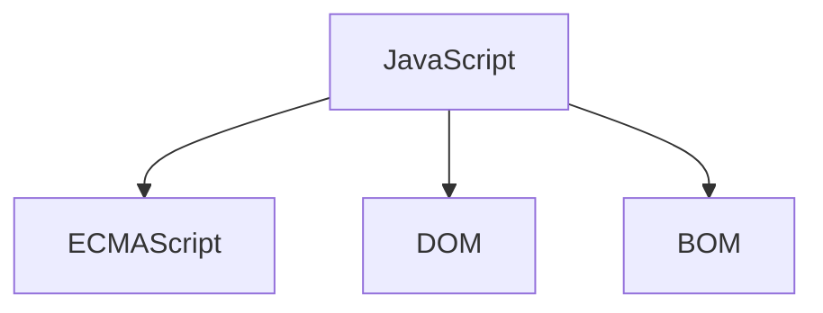

## BOM基础

BOM的全称叫`Browser Object Model`浏览器对象模型，它是我们JS里面的一个组成部分



### location对象

location是浏览器的内置对像，全称是`window.location`，它指的是浏览器的地址栏

1. `href`用于设置或获取浏览器地址栏里面的地址，如果是设置，则浏览器会跳转到新的网址

2. `hostname`用于返回当前地址栏里面的主机名

   ```
   https://www.softeem.xin:9090/html_project			www.softeem.xin
   http://127.0.0.1:5500/01.html 				127.0.0.1
   http://aaa.bbb.ccc/02.html 					aaa.bbb.ccc
   ```

3. `port`返回当前地址栏里面的端口号

   ```
   http://localhost:9998/02location.html			端口号9998
   http://www.softeem.xin:8090/ 					端口号8090
   https://www.baidu.com/							端口号443
   http://www.softeem.com/web3/index.html			端口号80
   ```

   `https`开头的网址端口号默认是443,`http`开头的端口号默认是`80`

4. `host`用于返回当前地址柆里面的`hostname`+`port`

   ```
   http://localhost:9998/02location.html	
   主机地址  localhost:9998

5. `protocol`返回当前地址栏里面的协议号，它是`http:`或`https:`

6. `origin`返回当前地址栏的域的信息，它是location三大属性之一，`origin=protocol+//+hostname+:port`

   ```
   http://localhost:9998/02location.html			域http://localhost:9998
   http://www.softeem.xin:8090/ 					域http://www.softeem.xin:8090/
   https://www.baidu.com/							域https://www.baidu.com/
   http://www.softeem.com/web3/index.html			域http://www.softeem.com
   ```

   这个域后期对我们的BOM编程限制非常大，因为会有一个现象叫跨域【后面会讲，也会遇到】

7. `hash`返回或设置当前地址栏里面的哈希值，它是location三大属性之一，hash值代表的就是地址栏`#`后面的东西（后期的SPA开发里面用到）

   ```
   http://localhost:9998/02location.html#div1
   //哈希  #div1
   ```

8. `search`返回当前地址栏里面的`?`后面的东西，它是location三大属性之一,它常常用于跨页面传值

   ```
   http://localhost:9998/03location.html?aaa=123
   //searh就是?aaa=123
   ```

   在讲到`search`属性的时候 就不得不提起BOM当中比较重要的一个对象叫`URLSearchParams`

   ```html
   <body>
       <input type="text" id="userName" placeholder="请输入账号">
       <input type="text" id="age" placeholder="年龄">
       <button type="button" onclick="toPage2()">提交</button>
   </body>
   <script>
       function toPage2() {
           var userName = document.querySelector("#userName").value;
           var age = document.querySelector("#age").value;
           // location.href = "05b.html";    这个代码只会让我们把页面跳转到05b，但是数据没有过去
   
           location.href = "05b.html?userName=" + userName + "&age=" + age;
       }
   </script>
   ```

   

   

    现在我们回到`05b.html`这个页面

    

    

    这个时候我们就可以看到地址栏的上面多了`search`部分，我们只需要拿到里面的值就可以了。如果要拿到里面的值就必须使用内置对象`URLSearchParams`

    ```javascript
    // http://localhost:9998/05b.html?userName=yangbiao&age=18
    var p = new URLSearchParams(location.search);
    p.get("userName");          //yangbiao
    p.get("age")                //18
    ```

9. `pathname`代表当前浏览器地址栏里面的路径

   ```
   http://localhost:9998/05b.html?userName=yangbiao&age=18
   它的pathname就是/05b.html
   ```

10. `reload()`重新加载当前地址，相当于刷新当前页面

11. `assign()`载入一个新的网址，它的作用与`href`是一样的

    ```javascript
    location.assign("http://www.baidu.com");
    location.href = "http://www.baidu.com";
    ```

    上面的2个代码效果是一样的，没有区别

12. `replace()`方法，替换当前地址栏里面的地址，也会跳到一个新的网页

    `replace()`这个方法是替换了地址栏里面东西，它退不回之前的页面

    **什么场景下面会使用replace**

    ```html
    <body>
        <div>
            <input type="text" placeholder="请输入账号">
        </div>
        <div>
            <input type="password" placeholder="请输入密码">
        </div>
        <div>
            <button type="button" onclick="checkLogin()">登录</button>
        </div>
    </body>
    <script>
        function checkLogin(){
            alert("登录成功");
            // location.href = "http://www.baidu.com";          
            //如果通过href或assigin去跳转页在，这样还是可以回到之前的页面
            location.replace("http://www.baidu.com");
        }
    </script>
    ```

    > 在上面的代码当中，如果是登录的场景里面，登录成功以后不应该再回到之前的页面，这个时候就阿使用`replace`来完成跳转

    同时在支付的场景下面，如果支付成功或支付失败，都只能用`replace`来跳转

    ```html
    <body>
        <button type="button" onclick="payOrder()">确定支付</button>
    </body>
    <script>
        function payOrder(){
            if(confirm("确定要支付吗?")){
                // location.href = "07-1replace.html";
                // 支付成功以后，也不能退回到之前的页面
                location.replace("07-1replace.html");
            }
        }
    </script>
    ```

**关于href/assign与replace的原理是什么**

为什么`href/assign`去跳转页面以后可以回到之前的页面，而`replace`不可以


现在我们再来看`replace`的情况


----

### history对象

 history对象就是浏览器访问以后的历史记录对象

1. `length`属性
2. `back()`方法，相当于浏览器的后退功能
3. `forward()`方法，相当于浏览器的前进功能
4. `go(step)`方法，直接前进几步或后退几步，如果是负数就代表后退，如果是正数就代表前进

### navigator对象

这个对象代表当前的浏览器，它记录了当前浏览器的相关信息

1. `appVersion`记录了当前浏览器的怎么本信息，后期我们可以通过这个版本信息来判断当前浏览器到底是版本，如IE，或Chrome或火狐等

2. `maxTouchPoints`当前浏览器是否支持多点触摸

3. `bluetooth`获取当前设置的蓝牙信息

4. `connection`返回当前设备的网络连接信息

5. `geolocation`获取当前设备的位置，相当于地理定位

   ```html
   <body>
       navigator
       <button type="button" onclick="start()">开始定位</button>
   </body>
   <script>
       // 地理定位
       function start() {
           navigator.geolocation.getCurrentPosition(function (pos) {
               // 定位成功以后的回调
               console.log("定位成功");
               console.log(pos)
           }, function (error) {
               //定位失败以后的回调
               console.log("定位失败");
               console.log(error)
           }, {
               //是否启用高精度定位信息
               enableHighAccuracy: true
           })
       }
   </script>
   ```

6. `getUserMedia()`获取当前设备的多媒体信息，我们前面学过的打开电脑的摄像头与话筒用的就是这个

### window对象

整个浏览器最高的对象就是window对象，这个对象是所有BOM的根对象，它里面有一些常用的方法根大家说一下

1. `alert()`弹出一个对话框，只有确定按钮

2. `confirm()`弹出一个询问框，包含确定与取消按钮，如果点击确定则返回`true`，如果点击取消就返回`false`

3. `prompt()`弹出一个输入框 ，用户可以输入,这个方法的返回值就是用户输入的内容，如果用户点击取消就返回`null`

   ```javascript
   var x = prompt("请输入你心中最帅的那个人?");
   ```

   

   


4. `open(url:string,target:string,features?:string)`打开一个新的页面

   `url`代表要打开的网址，`target`代表打开的方式 ，这个与`a`标签的`target`保持一致，最后的`features`代表新打开的网页的样式

   ```javascript
   window.open("http://www.softeem.xin:8090", "_blank", "width=375px,height=667px,left=200px,top=300px")
   ```

   这个时候会在新的浏览器里面打开网页，打开的以后`_target` 的方式打开 ，并且宽度和高度以及左边和上边的位置都设置

   

5. `close()`关闭一个网页

#### 跨页面作用技术 【重难点】

> 通过`window.open()`打开的页面叫父子页面

父子页面是通过`open()`打开以后的页面，父子页面可以相互的操作

**01.html**

```html
<body>
    <h1 style="color: blue;">我是父页面</h1>
    <button type="button" onclick="a1()">打开子页面</button>
</body>
<script>
    var childWindow = null;
    function a1() {
        // 01的页面打开了02的页面
        // 那么01就是02的爹(父页面)
        childWindow = window.open("02.html");
        childWindow.document.querySelector("h2").innerText="我是你儿子啊，父亲在操作儿子";
        //这里的childWindow指代的就是就是我们的子页在的02的window对象
    }
</script>
```

> 代码分析：
>
> 当我们通过`window.open()`打开一个页面以后，我们就可以返回一个`window` 对象，这个对象就是新打开的页面的`window`全局对象

**02.html**

```html
<!DOCTYPE html>
<html lang="zh">
<head>
    <meta charset="UTF-8">
    <meta http-equiv="X-UA-Compatible" content="IE=edge">
    <meta name="viewport" content="width=device-width, initial-scale=1.0">
    <title>子页面</title>
</head>
<body>
    <h2 style="color: red;">我是子页面</h2>
</body>
 <script>
    //如果在子页面里面要打爹
    console.log(window.opener);
</script>
</html>
```

当我们去点击父页面上面的按钮以后就会后期02这个页面，那么02的页面就是01的页面的子页面，父子之间是可以相互操作

```javascript
window.opener;				//通过这个可以找到父页面
```

### localStorage本地存储

它的中文名称叫本地存储，它指的是浏览器的存储行为，我们可以在网页上面调用这个方法来实现对一个东西进行存储。它指的是浏览器的本地存储

1. `setItem(key,value)`将一个值放在缓存当中

   ```javascript
   localStorage.setItem("userName","yangbiao");
   localStorage.setItem("age","18");
   ```

2. `getItem(key)`根据一个key从缓存当中取出值

   ```javascript
   localStorage.getItem("userName");			//"yangbiao"
   localStorage.getItem("age");				//"18"
   ```

3. `removeItem(key)`根据一个key从缓存当中删除某一项

   ```javascript
   localStorage.removeItem("userName");
   ```

4. `clear()`清除`lcoalStorage`的缓存

   ```javascript
   localStorage.clear();
   ```

`localStorage` 本身还是一个对象，它的每一个缓存就是一个属性名，所以缓存的操作也可以以对象的方式来完成

```javascript
localStorage.setItem("nickName","小小花");		//放一个缓存
localStorage.nickName = "小小花";				//以对象的形式来操作

localStorage.getItem("nickName");			 //"小花花"
localStorage.nickName;						 //"小花花";

localStorage.removeItem("nickName");		 //删除缓存"小花花"
delete localStorage.nickName;
```

#### localStroage的注意事项及特点

1. localStorage可以跨页面共享值

2. localStorage在关闭浏览器以后还会保存

3. localStorage如果不手动清除会一直存在

4. <span style="color:red">localStorage不能跨域访问</span>

   

上面的域是`http://localhost:9998`，下面的域是`http://127.0.0.1:8080`，两个域不相同，所以它们不能共享数据，也不能互相访问

### sessionStorage会话存储 


sessionStorage是一个会话存储 ，我们可以理解为它的缓存是在这一根蓝色的线上面的，它不在浏览器的本地，它所具备的方法与操作方式与localStorage保持一致

1. `setItem(key,value)`赋缓存
2. `getItem(key)`取缓存
3. `removeItem(key)`删除一个缓存
4. `clear()`清除sessionStorage的缓存

同时对象的操作方式也与localStorage一致

```javascript
sessionStorage.setItem("age","19");
sessionStorage.age = "19";
```

#### sessionStorage的注意事项及特点

虽然说sessionStorage与上面的学习过的localStorage操作方式保持一致，但是它们的特点完全不一样

1. sessionStorage不能跨页面共享数据，除非是父子页面
2. sessionStorage关闭浏览器以后数据会自动清除
3. <span style="color:red">sessionStorage不能跨域访问</span>

### cookie

> cookie也是一个缓存，但是与上面的storage的缓存是完全不一样的， storage的缓存是在`window`对象下面， 所以我们是使用`window.localStorage` 和`window.sessionStorage`
>
> 但是`cookie`是在`document`对象下面，它的访问就是`window.document.cookie`

cookie也是一种缓存方案，但是它与前面缓存有一点区别，它可以上设置到期时间，到期以后自动清除，同时也要注意它的到期时间指的是GMT时间（GMT时间：格林宁治时间，也就是0时区的时间）

**cookie的设置**

```javascript
document.cookie = "缓存名=缓存值";
document.cookie = "userName=biaogege";
```


我们可以看到，`userName`的cookie已经设置成功了，但是它的`Expires/Max-Age`指的是它的过期时间，仍然是会话，这是因为如果`cookie`在设置的时候不设置过期时间就默认以session为过期

**设置带过期时间的cookie**

```javascript
document.cookie = "缓存名=缓存值;Expires=过期时间";
document.cookie = "userName=biaogege;Expires="+new Date("2022-09-07 12:00:00").toGMTString();
```


**cookie的取值**


现在cookie里面有2个值 ，怎么取出`cookie`里面的值呢？

```javascript
document.cookie;				//'userName=biaogege; age=18'
//如果在结果里面取得userName和age的值
function getCookieValue(cookieName) {
    var str = document.cookie + ";";
    var reg = new RegExp("(?<=" + cookieName + "=).*?(?=;)", "g");
    var result = str.match(reg);
    // 取到了就是一个数组，取不到就是null
    return result ? result[0] : null;
}
```

在上面的代码里面，`cookie`的取值操作我们使用了正则表达式去完成

真正的开发里面， 没有谁会自己手动的写正则取`cookie`，因为有插件叫`js-cookie`

```html
<script src="js/js.cookie.js"></script>
<script>
    Cookies.get("userName");
    Cookies.get("sex");
    Cookies.get("age");

    Cookies.set("hobby","123123123");

    Cookies.set("stuName","张三峰",{
        Expires:new Date("2022-09-06 12:00:00").toGMTString()
    });
    	
    //删除某一个cookie
    Cookies.remove("stuName");
</script>
```

